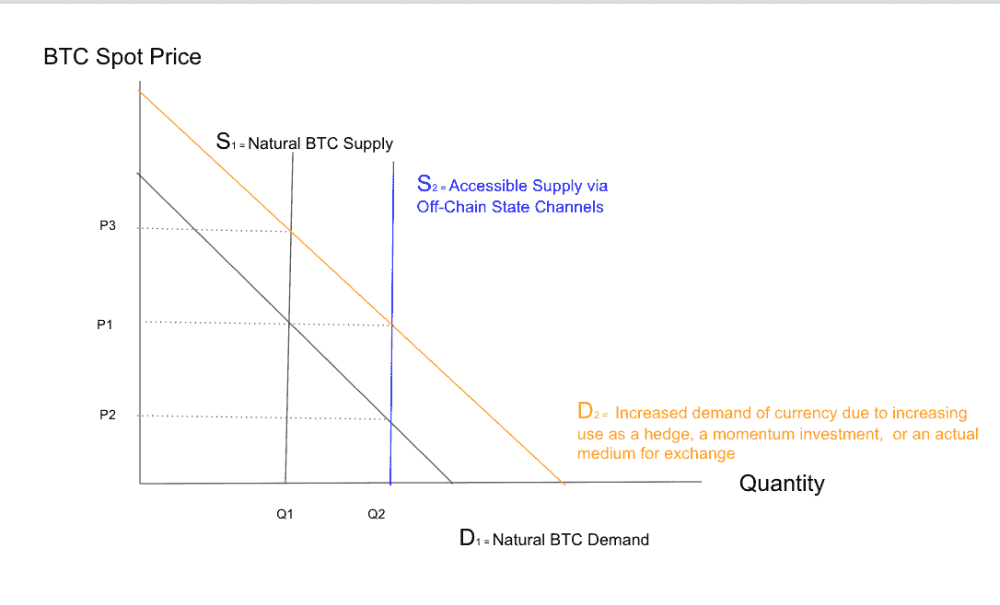

# 回到学校:密码技术 101

> 原文：<https://medium.com/hackernoon/back-to-school-crypto-tech-101-fab973708146>

在过去几年投资区块链公司的过程中，我意识到我所知甚少，对于风险投资者来说，这是一个多么新的领域。由于担心成为傻瓜，我上周和一位密码学朋友一起回到了“学校”，他教了我一些关于 BTC、拜占庭容错和分布式共识协议(如 Paxos 和 Raft)的基础知识。我们用通俗易懂的语言讨论了一切，我将在 Medium 上发布我们的加密技术会议的关键要点。我们现在雄心勃勃地希望一个月一次。我将尝试在这里总结一下我们的第一堂课。

我们探索了在密码学和分布式计算中使用分布式共识的许多方法。Raft 很棒，但是可能还有其他的选择(例如:有一个完全 BFT 版本的 Raft，叫做 [Tangaora](http://www.scs.stanford.edu/14au-cs244b/labs/projects/copeland_zhong.pdf) ，它解决了 Raft 在一些拜占庭问题上的缺点)。

BTC 最终会崩溃。工作证明应该解决的“数学问题”变得越来越难，以应对矿工/交易的供应和需求。如果事情变得缓慢，并且自从最后一个块被处理以来出现了 [2 个时间标准差](https://en.bitcoin.it/wiki/Difficulty#What_network_hash_rate_results_in_a_given_difficulty.3F)，那么数学问题变得更容易获得“奖励”(即铸造新的比特币，以支付矿工通过进行 PoW 数学处理交易)。但是如果数学停留在最高难度，我们就永远得不到奖励。矿工不能采矿。结果，交易停止。当然，创造/解锁的新货币也会停止，但这里更大的问题是没有人开采，因此不会发生交易。然而，如果对事务吞吐量的需求是一致的，那么数学会变得越来越难计算——直到我们达到所有可能的挖掘的总供应量(由于散列问题难以解决)。现有的计算能力很难解决这个问题。这就是为什么 BTC 的电力消耗是荒谬的:我们需要越来越多的计算来跟上采矿的难度。

[闪电网络](https://lightning.network/)和国家频道的问题在于，它人为地将比特币挖矿的总供给向右推。换句话说，它让市场**相信**供给曲线处于与实际不同的点。这导致了一些严重的经济问题。当闪电通道必须在一系列支付/交易结束时“结算账单”,并且由于吞吐量受阻而无法在 BTC 区块链上处理“净”交易结果时，会发生什么情况？

最终，比特币崩溃了。这就是我昨天从我们的聊天中学到的。

**国家频道和闪电与 BTC 供应问题的经济分析**

Quick diagram to explain the messed up faux-equilibrium created by Lightning

在其他条件不变的情况下，BTC 的市场就像其他货币市场一样。(P1 Q1)存在一种自然均衡，即 BTC 当前的供给满足其当前的货币需求。

Lightning 和 State 通道可以让您比其他方式更快地提交交易，因为它们可以有效地在链外借记和贷记，并在稍后结算交易([当支付通道关闭或 lightning](/@argongroup/bitcoin-lightning-network-7-things-you-should-know-604ef687af5a) 出现争议时)。

这将 *S1* 移至 *S2* ，因为它有效地增加了可用于交易的货币数量。这基本上就像 M1 货币增加，而 M0 货币保持不变。

供应量的增加使得获取和使用 BTC 变得更加容易——基本上就是闪电点。它然后移动平衡点到(Q2，P2)。

较低的现货价格，但较高的交易量，向市场传递了 BTC 被低估的信息(交易很多，但不是超级昂贵)，其结构性问题已经通过闪电/国家渠道得到解决，或者两者兼而有之。

但实际上，BTC 的实际货币供应并没有像 S2 远离 S1 那样加速增长。事实上，由于采矿问题，BTC 的自然增长率正在放缓。

因此，总有一天闪电或其他货币无法经济地进行交易。将会发生以下情况:

*短期*:

*   随着需求转移出去，但自然供给保持不变，均衡将向(Q1、P3)移动。这相当于 BTC 的即期价格大幅上涨，而交易量则因采矿困难而下降。

*中长期*:

*   采矿在经济上不再可行/可能。这相当于你无法进行交易，意味着需求停止。损耗等于右上角为(P3 Q1)的矩形的积分。又名这糟透了。
*   请注意，如果上述情况由于某种原因立即发生(你撞到了“砖墙”，而不是时速 100 英里的沙袋)，那么你谈论的要么是(最好情况下)(P1 Q2)或(最坏情况下)(P3 Q2)相同积分的损失。这很大程度上取决于该货币消亡时的受欢迎程度。**又名:这真的真的很烂或抵押贷款支持的安全危机，2018+版。**

**木筏的**

我们谈到了网络中每个节点上的集中规则，这些规则才是重要的，而不是节点在 BTC 进行的功率数学问题的自主计算。达到法定人数/共识的规则使得零知识证明能够验证所有节点都符合所述规则。这里有一个[很好的非技术性概述](http://thesecretlivesofdata.com/raft/)，我发现它有助于理解 RAFT 的工作方式。

例如，我们有一系列工人，他们有一套关于提起、携带和放下箱子的规则(箱子代表事务，工人代表节点)。员工手册中有关于提升、搬运和放下以及所搬运板条箱重量的明确规定。在不知道每个板条箱的内容的情况下，你知道重量应该是 X。如果重量与 X 不同，我作为一个工人节点，可以对组中的任何“领导者工人节点”说废话，并说“你违反了规则-我挑战你”。如果另一个工人验证了我在最后一个领导者节点上的呼叫 BS 是有效的——即，通过拿起板条箱并意识到重量减少，那么我成为新的领导者节点，并且我是新的规则执行者(尽管其他人可以在任何时候挑战我)。基本上，这里重要的是规则集，而不是任何单个节点。在《星际迷航》中,[博格蜂巢思维](https://www.youtube.com/watch?v=rtEaR1JU-ps)很重要——不是每一个单独的无人机。

Resistance is futile — nodes do not matter, only the central set of rules; We are the Borg.

*非常感谢*[*Andy manos ke*](https://medium.com/u/bdca33e694ff?source=post_page-----fab973708146--------------------------------)*对本文的帮助以及他作为老师的耐心！*