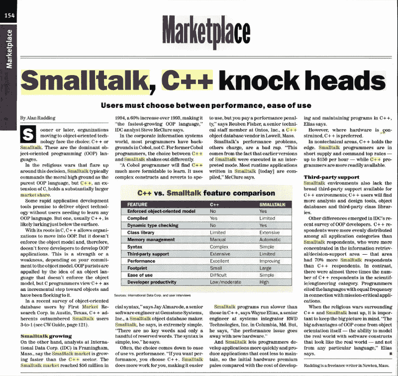
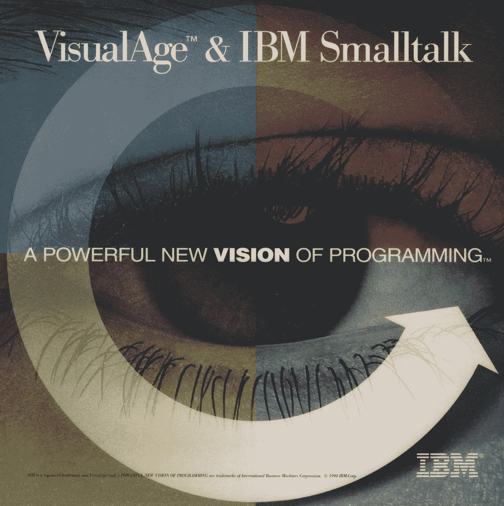
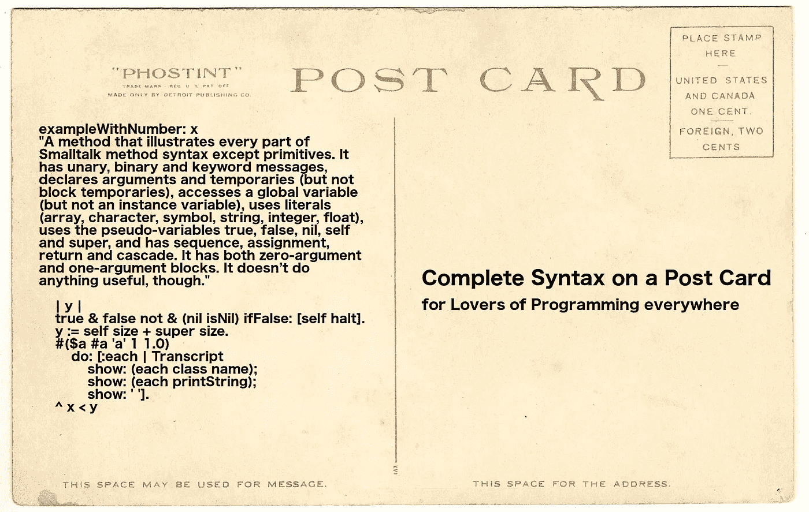
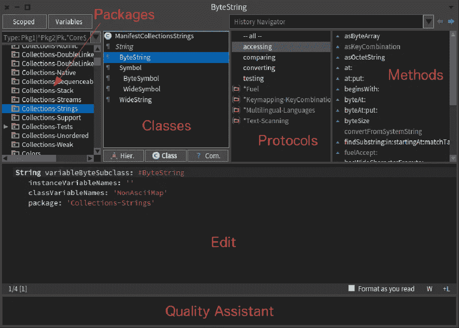

# 用 Smalltalk 回到未来

> 原文：<https://medium.com/hackernoon/back-to-the-future-with-smalltalk-57c68fab583a>

几十年来，软件开发一直受困于古老的技术。我们今天创建软件的方式与 20 世纪 60 年代和 70 年代没有太大的不同。当时，我们使用文本编程语言，如 FORTRAN、LISP、COBOL、BASIC、Pascal 和 C，它们的程序是用文本编辑器编写的，如 TECO、QED、vi 和 Emacs。我们将程序源代码存储在文件和文件夹中。我们从命令行编译这些程序。

为了确保程序正确运行，我们必须测试它，如果它失败了，我们必须诊断问题，编辑源代码以包含可能的修复，编译程序，然后再次运行它。如果再次失败，我们必须从头再来。这种编辑-编译-测试-调试的循环既耗时又低效。

快进到 2018 年。你猜怎么着？我们*仍然*用同样的方式创造软件！除了现在，我们使用 Java、Python、JavaScript、Ruby、Swift 和 Golang。我们使用文本编辑器编写代码，比如 Vim、Emacs、Sublime Text、Atom 和 Visual Studio 代码。我们将程序代码存储在文件和文件夹中。我们仍然从命令行编译，即使是在 IDE 中隐式地编译。

我们仍然是编辑-编译-测试-调试循环的奴隶！半个多世纪过去了，我们没有取得任何真正的进展。在我们生活的这个“现代”时代，我们使用石刀和熊皮有效地编程。

[Star Trek: “The City on the Edge of Forever”](https://youtu.be/EGnMW-VJmws)

这损害了我们的生产力。随着软件变得越来越大、越来越复杂，编写软件需要花费更长的时间和更多的精力。我们需要更好的工具。我们需要逃离我们的过去。

具有讽刺意味的是，40 多年来，软件开发的未来一直摆在我们面前。这叫闲聊。

## 创世纪:艾伦·凯的视野

Smalltalk 始于 20 世纪 70 年代施乐 PARC 公司的艾伦·凯、丹·英格尔斯和阿黛尔·戈德堡。他们是学习研究小组的成员，Smalltalk 是为调查儿童编程教学而创建的。

Smalltalk 是一种面向对象编程(OOP)语言。一路上都是物体。Smalltalk 在这方面的纯净和清晰使其成为几乎所有其他 OOP 语言的原型。

要理解 Smalltalk 哲学的精髓，请观看这段艾伦·凯向泰德·纳尔逊致敬的视频剪辑(从 2:18 开始):

[Alan Kay’s tribute to Ted Nelson](https://youtu.be/AnrlSqtpOkw)

艾伦·凯的《[small talk](http://worrydream.com/EarlyHistoryOfSmalltalk/)的早期历史》(1993 ACM)提供了更多的见解:

> Smalltalk 是对计算机本身概念的递归。每个 Smalltalk 对象都是对计算机的全部可能性的递归，而不是将“计算机的东西”分成比整体更弱的东西，如数据结构、过程和函数，这些都是编程语言的常用工具。因此，它的语义有点像成千上万的计算机通过一个非常快速的网络连接在一起。

和

> Smalltalk 的贡献是一种新的设计范式——我称之为*面向对象*——用于解决专业程序员的大问题，并使新手用户的小问题成为可能。面向对象的设计是一次成功的尝试，它从质的方面提高了硅爆炸所带来的越来越复杂的动态系统和用户关系的建模效率。

Smalltalk 是一种有着传奇历史的杰出语言。以下是它的一些最伟大的成就:

*   Smalltalk 向世界介绍了*语言虚拟机*，Java 和 Ruby 也基于此。
*   Smalltalk 开创了 JIT(实时)编译。
*   Smalltalk 诞生了第一个现代 IDE(集成开发环境)，它包括一个文本编辑器、一个类浏览器、一个对象检查器和一个调试器。
*   Smalltalk 是第一个支持实时编程和高级调试技术的图形语言工具，例如以非常用户友好的格式在执行过程中进行动态检查和代码更改*。*
*   从 Smalltalk-80(1980 年)开始，它就有了一流的函数和闭包，奇怪的是，这使得 small talk 非常适合函数式编程。
*   Smalltalk 引入了软件架构模式 MVC(模型-视图-控制器)。
*   在很大程度上，Smalltalk 为我们提供了测试驱动开发(TDD)和极限编程(XP)，这两者在当今的标准敏捷实践中都非常有影响力。
*   Smalltalk 让“鸭子打字”这个词家喻户晓。
*   Smalltalk 率先开发了对象数据库，GemStone/S 就是一个很好的例子。
*   Smalltalk 给了我们第一个重构浏览器。
*   Smalltalk 在开发图形用户界面(GUI)和“所见即所得”(WYSIWYG)用户界面方面发挥了重要作用。
*   史蒂夫·乔布斯受到施乐 PARC 公司的 GUI 和 WIMP(窗口、图标、菜单、指针)的启发，彻底调整了苹果的战略；GUI 是 Smalltalk 工作的直接产物。

## 涌现:1981 年 8 月字节和苹果

Smalltalk 曾经是一种非常流行的语言。它于 1981 年 8 月首次登上《字节》杂志的封面:

从那以后，Smalltalk 直接启发了许多其他 OOP 语言，包括 Objective-C、Python、Ruby、PHP、Perl、Erlang、CLOS、Dart、Java、Groovy 和 Scala。苹果公司甚至为麦金塔电脑创造了一个 Smalltalk。

尤其是 Objective-C 在 IT 行业产生了巨大的影响。它的语法本质上是 C 和 Smalltalk 的结合。

Objective-C 被用来为史蒂夫·乔布斯的下一个计算机公司编写 NeXTStep 操作系统。NeXTStep 最终演变成了 macOS，Objective-C 自此被用于编写大量的 iOS 应用程序。

## Zenith:企业挑战

Smalltalk 的流行在 20 世纪 90 年代达到顶峰，当时它是继 C++之后最流行的 OOP 语言。根据 1995 年的 IDC 报告，OOP 语言的市场份额是:

1.  C++ — 71.3%
2.  **Smalltalk — 15.1%**
3.  目标-C — 5.7%
4.  帕斯卡对象— 4.2%
5.  接近 2.5%
6.  埃菲尔铁塔——1.1%
7.  所有其他— 0.2%

然而，C++很大，很复杂，使用起来很麻烦。

这是《计算机世界》1995 年 11 月 6 日的一页，展示了 Smalltalk 和 C++之间的争斗:

Smalltalk 非常适合商业应用，以至于在 20 世纪 90 年代，IBM 选择 Smalltalk 作为其 VisualAge 企业计划的核心，以取代 COBOL:

Java 于 1995 年问世，而且是免费的；Smalltalk 许可非常昂贵。

Java 已经可以上网了；Smalltalk 不是。Java 超越了 Smalltalk。

二十世纪九十年代的两种*免费* Smalltalk 方言流传至今:GNU Smalltalk (1991)和 Squeak (1996)。但这还不够。

在 21 世纪初，美国联合军方使用 Smalltalk 编写了一个名为 JWARS 的百万行战斗模拟程序。它实际上胜过了美国空军用 C++编写的类似模拟程序 STORM。这本身就是语言能力的惊人证明。

## 救赎:海边的故事

Smalltalk 通过在如何编写 web 应用程序方面开辟了新天地的 Seaside web 框架在 web 领域挽回了自己的声誉。

从 [Seaside 的网站](http://seaside.st/about)，以下是该框架的主要卖点:

*   **程序化的 HTML 生成。许多标记都是样板文件:相同的列表、链接、表单和表格模式一页接一页地出现。Seaside 有一个丰富的 API 来生成 HTML，让您将这些模式抽象成方便的方法，而不是每次都将相同的标签序列粘贴到模板中。**
*   **基于回调的请求处理。为什么您必须为页面上的每个链接和表单输入提供一个唯一的名称，然后才从 URL 和请求字段中提取它们？Seaside 通过让您将块(而不是名称)与输入和链接相关联来自动化这个过程，因此您可以考虑对象和方法，而不是 id 和字符串。**
*   **嵌入式组件。**停止一次思考一整页；Seaside 允许您将 UI 构建为一个由单个有状态组件对象组成的树，每个组件对象封装了页面的一小部分。通常，这些可以在应用程序内部和应用程序之间反复使用——例如，几乎每个应用程序都需要一种方式来呈现搜索结果的批量列表，或者具有可排序列的表格，而 Seaside 包括了这些现成的组件。
*   **模态会话管理。如果你能用一种方法表达一个复杂的、多页的工作流程，会怎么样？与 servlet 模型不同，servlet 模型要求每个页面或请求都有单独的处理程序，Seaside 将整个用户会话建模为一段连续的代码，具有自然的线性控制流。在 Seaside 中，组件可以像子程序一样相互调用和返回；将这些调用串在一个方法中，就像使用控制台 I/O 或打开模式对话框一样，这样就有了一个工作流。是的，返回按钮仍然有效。**

茶壶是基于 Python 的 Flask 和 Ruby 的 Sinatra 精神的一个新的微 web 框架。

前端 web 开发可以用 Amber Smalltalk 和 PharoJS 来完成。

## 再生:现代闲聊

2008 年，Pharo 被释放。这是一个为 21 世纪而现代化的开源 Smalltalk。

Pharo 加入了一些语言候选人的行列，例如，Clojure、Crystal、Dart、Elixir、Elm、F#、Haskell、Haxe、Julia、Nim、rack 和 Rust。Pharo 有上升的潜力。

Pharo 联盟帮助这种语言为企业做好准备。一些著名的联盟成员:

1.  摩根大通，美国主要的银行和金融服务公司
2.  泰雷兹是一家法国大型工程公司，专门从事航空航天、国防和安全领域
3.  GemTalk Systems，面向对象数据库管理系统的领先供应商
4.  法国计算机科学和自动化研究所
5.  欧洲 Smalltalk 用户组

## TechBeacon:通过社交媒体进行宣传

Smalltalk 的数字营销始于 2015 年一个名为“Smalltalk Renaissance”的 WordPress 博客和一个名为“Smalltalk Talk”的媒体博客。通过社交媒体发表和推广了数十篇文章。

2016 年 7 月 18 日，TechBeacon 发表了一篇题为“[学习 Smalltalk 如何让你成为更好的开发者](https://techbeacon.com/how-learning-smalltalk-can-make-you-better-developer)”的文章，发起了第二次重大营销活动。

这篇文章已经被全球超过 70，000 人阅读，包括再版。

在 Medium、Tech In Asia、LinkedIn 以及一个名为хабрахабр(Habrahabr)的俄罗斯博客上都有转载。

它产生了几十篇 Smalltalk 文章，包括几个教程，通过 Medium、Hacker News、Reddit、Twitter、脸书、Google+、LinkedIn、Flipboard 和 Quora 推广。

《新书库》和《Slashdot》等媒体报道了这场运动。

在 Quora，成千上万的人询问他们应该使用什么编程语言来学习编程，得到的回答都是老一套:他们应该从 Smalltalk 开始！

Smalltalk 是最好的教学语言，因为:

1.  这是最简单、最易学的语言之一。它有全部六个保留字！完整的语法可以放在明信片上。
2.  它是纯面向对象的，在这方面的清晰性和一致性使得学习面向对象编程极其容易。

面向对象编程是 IT 行业中使用最广泛的编程范式。熟知 OOP 是至关重要的。

这是明信片:

事实证明，Smalltalk 可以使程序员的工作效率比任何其他编程语言高 2-3 倍！

根据 [Namcook Analytics 的一项研究](http://www.ifpug.org/wp-content/uploads/2017/04/IYSM.-Thirty-years-of-IFPUG.-Software-Economics-and-Function-Point-Metrics-Capers-Jones.pdf)(表 16)，根据交付 1000 个功能点的工作小时数的“经济生产率”，Smalltalk 需要 6879 个小时，而 Python 需要 12697 个小时，JavaScript 需要 15929 个小时。c 需要 26273 个小时！

关键是*使用 Smalltalk 非凡的内置 IDE 进行现场编码*。它类似于 Visual Studio 和 Eclipse，但是更小，使用起来更简单。以下是 Pharo IDE:

Pharo’s System Browser

## 结论

艾伦·凯有句名言:“预测未来的最好方法就是创造未来。”事实上，他在 40 多年前通过创建 Smalltalk 和他的面向对象编程愿景的体现做到了这一点。

> 今天，Pharo 像一盏明灯一样照耀着软件开发的未来。早就应该重新审视 Smalltalk 了。

