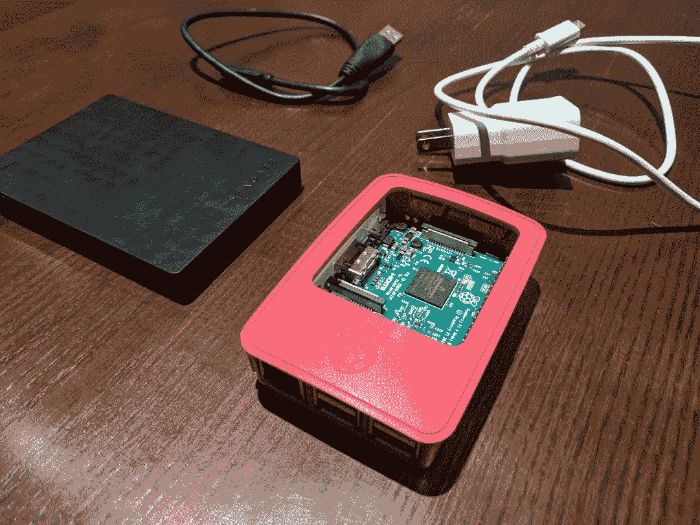
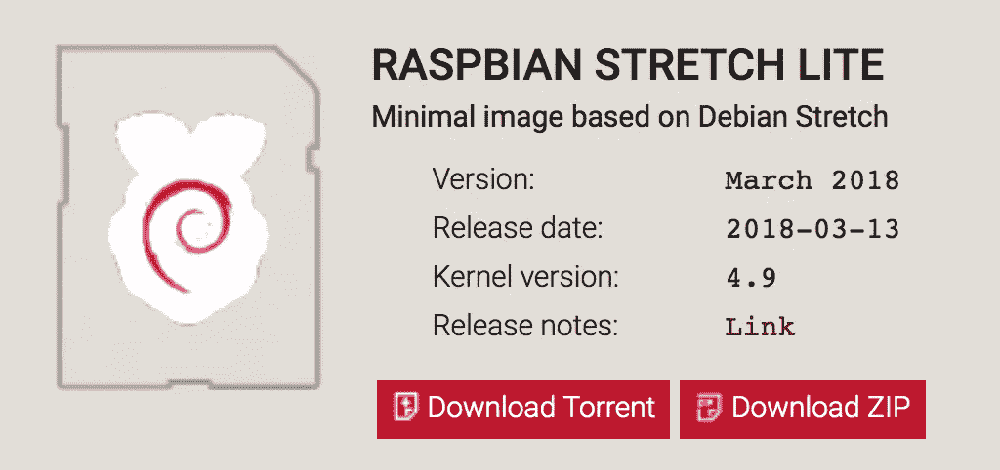
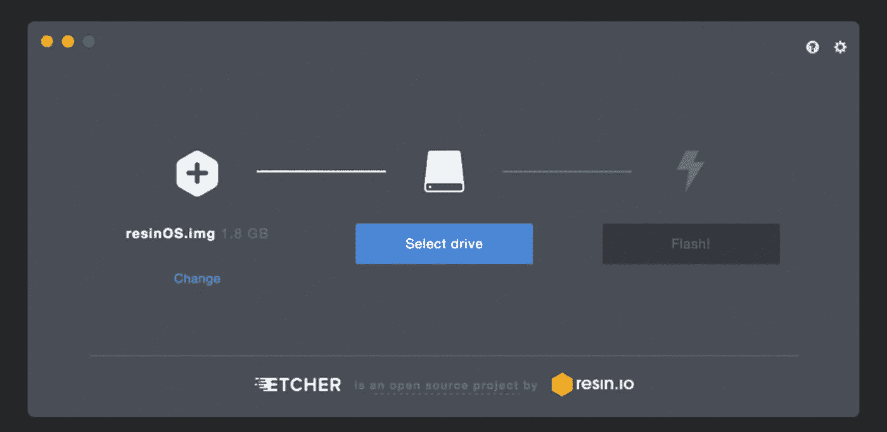
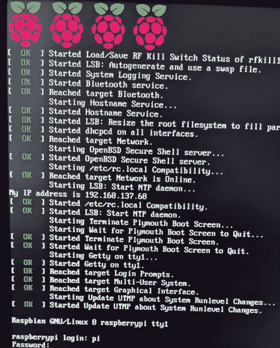
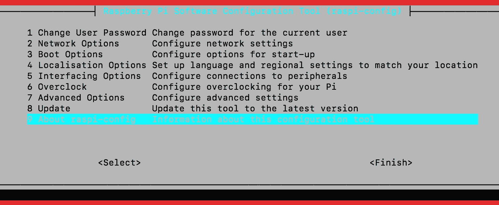
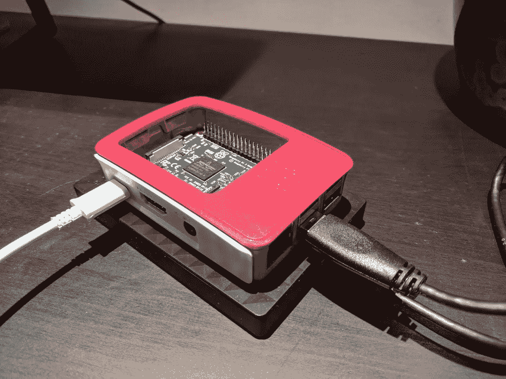
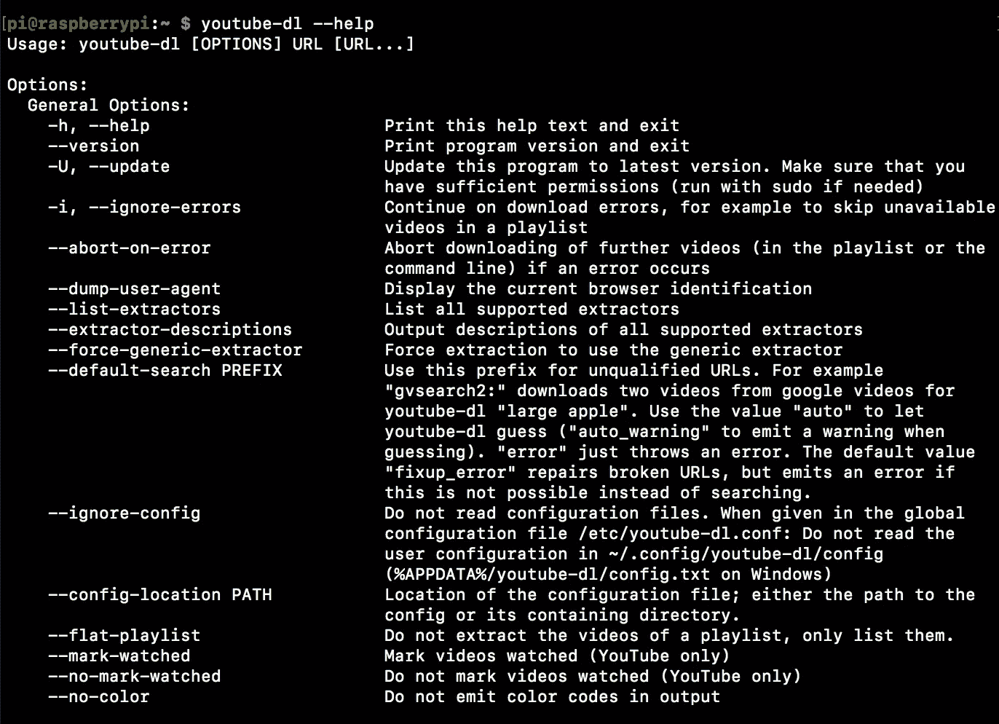

# 使用 Raspberry Pi +硬盘备份您的 YouTube 播放列表

> 原文：<https://medium.com/hackernoon/backup-up-your-youtube-playlists-with-a-raspberry-pi-hdd-7aa332b2c5a6>

本指南展示了如何为你的 [YouTube](https://hackernoon.com/tagged/youtube) 收藏夹或任何其他播放列表设置本地[备份](https://hackernoon.com/tagged/backup)。它包括一种使用 cron 作业自动更新备份数据库的方法。



Nothing like a fresh hard drive & Raspberry Pi

这个指南有两个部分。首先，我们从头开始设置 Pi。然后，我们将看到如何安装这个库，并设置 cron 作业来自动下载播放列表中的新视频。我用的是外置硬盘，所以也有设置说明。

> 注意:以下内容已经在 Raspberry Pi 3 上进行了测试

# 从头开始设置 Pi

## 1.格式化迷你 SD 卡并安装 Raspbian 映像

这可以用蚀刻机来完成:

[](https://etcher.io/) [## 树脂蚀刻机

### 安全轻松地将图像刻录到 SD 卡和 USB 驱动器。

etcher.io](https://etcher.io/) 

下载完那个软件后，[获取一个 Raspbian](https://www.raspberrypi.org/downloads/raspbian/) 版本。这是“基金会官方支持的操作系统”。我用的是 Raspbian Stretch Lite:



[https://www.raspberrypi.org/downloads/raspbian/](https://www.raspberrypi.org/downloads/raspbian/)

使用蚀刻机将图像刻录到 SD 卡上。这也将格式化磁盘，因此磁盘上的所有内容都将在这一步被销毁。*注:如果您的 SD 卡损坏或无法正常工作，在此过程之前使用不同的工具格式化 SD 卡可能会有所帮助。*



[https://etcher.io/](https://etcher.io/)

## 2.将 SD 卡放入 Raspberry Pi，将其连接到带有 HDMI 的显示器，然后插入电源



It’s alive!

## **3。登录，配置并启用 SSH**

使用默认登录凭据:

```
username = pi
password = raspberry
```

进入终端后，通过键入以下命令打开配置对话框

```
sudo raspi-config
```



在这里，您应该执行以下操作:

*   **更改密码**
*   **配置 WiFi 网络**
*   **启用 SSH(在“接口选项”中)**
*   **更改键盘布局(在“本地化选项”中)**

如果键盘布局给你带来问题，那么尝试通过添加 `XKBLAYOUT="us"`到`/etc/default/keyboard`来改变它

WiFi 网络给你带来了问题，试着在`/etc/wpa_supplicant/wpa_supplicant.conf`的末尾添加以下几行:

```
network={     
    ssid="WiFi network name"
    psk="WiFi network password" 
}
```

然后运行`wpa_cli -i wlan0 reconfigure`。

## 4.做一些基本的升级

更新操作系统并下载 vim。

```
sudo apt-get update
sudo apt-get upgrade
sudo apt-get install vim
```

> 注意:对于我的设置，我使用这个发行版:[https://github.com/jjhelmus/berryconda](https://github.com/jjhelmus/berryconda)安装了 Python 3.6。Anaconda 是一个很棒的 python 发行版，它使得安装像 pandas 和 matplotlib 这样的数据科学库变得很容易。

# 将 YouTube 播放列表备份到硬盘

现在，我们将安装工具并设置一个自动化作业来备份一些 YouTube 播放列表。你只需要播放列表的网址。



视频被下载到设备上。因为我有很多收藏，所以我选择将这些文件保存到外置硬盘上。这种增加的复杂性让我有些难过，所以我在这个过程中加入了使用硬盘的详细步骤。

## 1.安装 youtube-dl

这个[开源工具](https://github.com/rg3/youtube-dl)可以安装:

```
sudo curl -L [https://yt-dl.org/downloads/latest/youtube-dl](https://yt-dl.org/downloads/latest/youtube-dl) -o /usr/local/bin/youtube-dl
sudo chmod a+rx /usr/local/bin/youtube-dl
```

键入`youtube-dl --help`查看选项列表:



There are a lot more… try for yourself to see

## 2.连接并安装硬盘

此步骤仅适用于使用外置硬盘存储视频的情况。如果你只是使用 SD 卡，现在跳到下一节。

对我来说，我必须安装一个包来允许我的 NTFS 驱动器的写访问。我是这样做的:

```
sudo apt-get install ntfs-3g
```

然后插入驱动器并找到它的路径。您应该可以通过以下命令看到这一点:

```
sudo blkid
```

我的是在`/dev/sda1`，所以无论你在下面的文本中看到什么，请用你的值替换它。

然后，我为该驱动器创建了一个挂载点，如下所示:

```
sudo mkdir /mnt/hdd-1
```

并在磁盘上安装了:

```
sudo mount /dev/sda1 /mnt/hdd-1
```

> 此时，您应该能够从驱动器读取数据，例如`sudo ls /mnt/hdd-1`，也可以向驱动器写入数据，例如`sudo echo "hello world!" > /mnt/hdd-1/test-note.txt`

## 3.制作一个脚本来下载视频

现在让我们构建一个可以下载视频的简单 shell 脚本。我将把文件保存在`/home/pi/alex-videos`(或硬盘上的`/mnt/hdd-1/alex-videos`)中。

转到主文件夹并创建新目录:

```
sudo mkdir alex-videos
```

现在制作脚本:

```
>>> cat > youtube-playlist-backup.sh
cd /home/pi/alex-videos
/usr/local/bin/youtube-dl -w -i --max-downloads 2 --write-info-json {{your playlist url}}
```

确保用 URL 替换`{{your playlist url}}`。

通常情况下，您可以只使用`youtube-dl`作为命令，但是当使用 cron 作业时，这可能会导致问题，所以这里我们使用可执行文件的实际路径。

使用以下内容为脚本提供标准权限:

```
chmod +x youtube-playlist-backup.sh
```

然后运行它进行测试。它应该只下载最近添加到播放列表中的两个内容:

```
./youtube-playlist-backup.sh
```

如果这有效，那么你就差不多完成了。你只需要备份其余的视频，然后设置自动更新。

请记住，备份整个播放列表需要一段时间，并且会占用大量带宽。为此，打开 shell 脚本并增加 max-downloads 选项。例如:

```
/usr/local/bin/youtube-dl -w -i --max-downloads 2000 --write-info-json {{your playlist url}}
```

然后重新运行 shell 脚本来执行备份。

## 4.使用 cron 设置自动更新

关于这个设置，我最喜欢的部分是我的 Pi 将每天自动执行备份。要设置这一点，您可以使用 cron 作业来运行您已经设置好的 shell 脚本。注意，因为我们在 youtube-dl 调用中使用了`-w`选项，所以脚本会知道跳过已经下载的视频。

首先，确保 **max-downloads 参数设置为一个合理的低**值。这是为了避免花费大量的时间来重复检查已经下载的视频。确保设置得足够高，这样你就不会错过任何新视频，例如，如果你在一个设置中添加了一堆视频。您的价值将取决于您更新备份的频率以及在给定设置下您倾向于添加多少视频。因为我每天都会备份我的收藏夹播放列表，所以我选择将最大下载次数设置为 20。

然后设置 cron 作业。用以下方式打开 cron:

```
crontab -e
```

使用你最喜欢的编辑器，只要是 vim)

添加以下一行:

```
0 11 * * * /home/pi/youtube-playlist-backup.sh > /home/pi/cron.youtube-playlist-backup.log 2>&1
```

这将在每天 11 点运行更新。

确保在这个命令之后至少留下一个空行(这是一个奇怪的 cron 规则/陷阱),然后保存并退出文件。

如果你使用的是硬盘设置，我会建议你做一些更复杂的事情，让你在一天中的大部分时间里不安装硬盘，而脚本也不运行。我在我的 shell 脚本中使用了以下代码:

```
sudo mount /dev/sda1 /mnt/hdd-1
cd /mnt/hdd-1/alex-videos/
/usr/local/bin/youtube-dl -w -i --max-downloads 20 --write-info-json [https://www.youtube.com/playlist?list=FLHfRYuzfDERvdP5eVz2jupQ](https://www.youtube.com/playlist?list=FLHfRYuzfDERvdP5eVz2jupQ)
cd /
sudo umount /mnt/hdd-1
```

最后，等待 cron 作业运行，并确保日志输出(`cron.youtube-playlist-backup.log`)看起来正常。

如果一切顺利，那么**你就完成了**！💥嘣！

感谢阅读👏，恭喜你完成了所有的设置🎉

如果你想聊天，你可以在推特上联系我:

[](https://twitter.com/agalea91) [## 亚历克斯·加利亚(@agalea91) |推特

### 亚历克斯·加利亚的最新推文(@agalea91)。@Ayima 的数据分析师和自称的脚本猴子📊理科硕士…

twitter.com](https://twitter.com/agalea91)