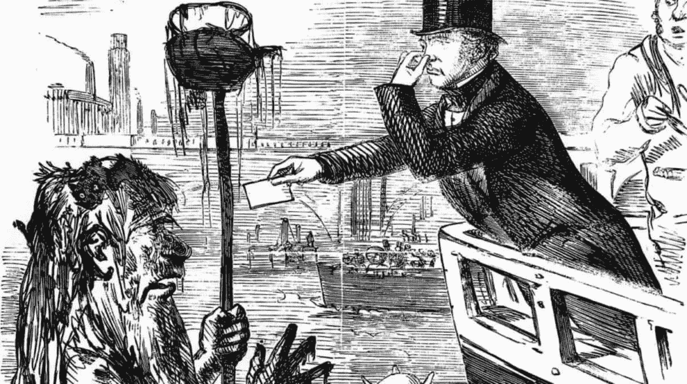

# 糟糕的空气，病毒，误解和 BI

> 原文：<https://medium.com/hackernoon/bad-air-virality-misconstructions-and-bi-18db0bd99575>

**来自 19 世纪的企业商业智能故事**

It’s not you, it’s me.

*(这个故事最早出现在 3AG Systems* [*博客*](https://www.3agsystems.com/blog/bad-air-virality-and-bi) *)*

瘴气理论——认为疾病是由“不良空气”传播的古老信念——有一点真实性。当人们专注于掩盖臭味而不是改善卫生时，这一理论遇到了限制，正如许多人在 1858 年伦敦大恶臭期间所做的那样。值得庆幸的是，通过仔细的观察和思考，像约翰·斯诺这样受数据驱动的人成功地打破了流行的智慧，正确地确定了水传播疾病的根本原因。

一个现代的对等词是“误传”，当疾病因病毒误传而传播时就会发生。想想这里的反 vaxx 迷因。

我们如何描述发生在公司内部的类似现象？“误解”似乎已经够不祥的了。这实际上只是曲解这个词的一个花哨版本，但却格外庄重。

为什么误解会在组织内部传播？我想是因为它们都包含着一丝真理。他们是可信的。当足够多的人重复同样的误解时，很难有相反的意见。悲哀的是，在一个点头的房间里，孤独的反对者。

那么，公司如何预防病毒性误解呢？一种方法是鼓励不同意见。另一个方法是鼓励思想开放。但是，要建立一个强大的系统，公司需要投资于证据生成工具，这些工具可以尽早消除误解。这意味着投资于商业智能战略、数据挖掘工具、数据报告工具、预测分析，或许最重要的是，投资于数据可视化最佳实践，以确保人们能够正确解读呈现给他们的证据。

对公司的最终衡量是基于它们正确识别情况并做出适当反应的能力。拥有适当的工具来确保大众的智慧不仅仅是经常重复的误解似乎是明智的。

特别感谢 Nat Gyenesan 和 Xiao Mina 在《大西洋月刊》上发表的文章[误导如何传播疾病](https://www.theatlantic.com/technology/archive/2018/08/how-misinfodemics-spread-disease/568921/)。

*做出数据驱动的决策。在 3AG Systems，我们通过将数据转化为可操作的见解来帮助企业改进。* [*了解更多*](https://www.3agsystems.com/) *。*