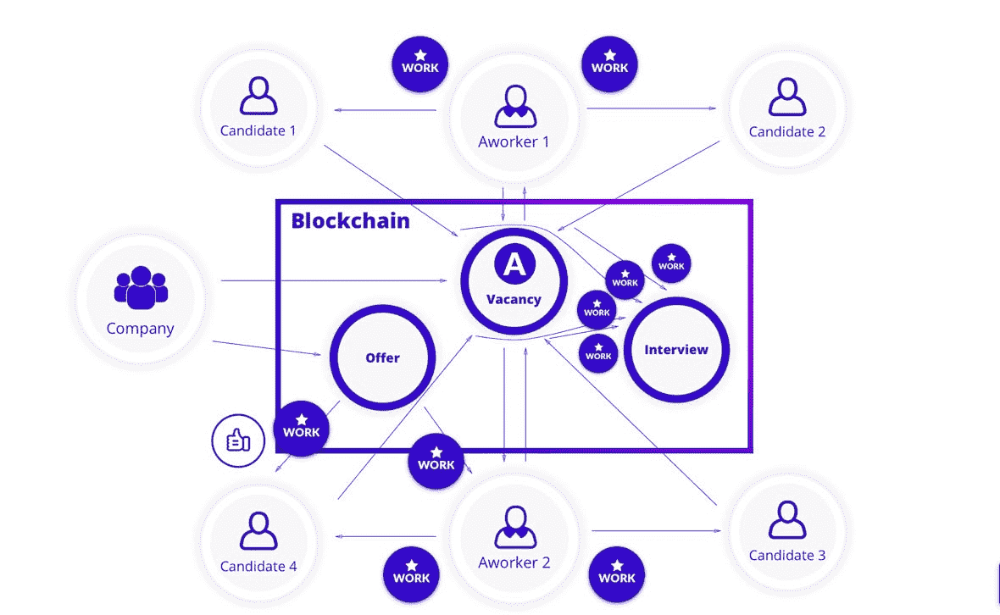

# 今天招聘中的糟糕游戏

> 原文：<https://medium.com/hackernoon/bad-game-in-todays-recruitment-d1ccf6dc1acf>

总部位于佛罗里达州的初创公司 Magic Leap 开发了未来主义的 AR 眼镜，[在 2017 年 10 月筹集了 5.02 亿美元](http://www.businessinsider.com/magic-leap-series-d-official-502-million-2017-10)。这种眼镜通过将先进的计算机图形叠加到佩戴者对现实世界的看法上来产生[幻觉效果。没人想到在如此成功的公司里会有价值 100 万美元的欺诈计划。](http://www.businessinsider.com/incredible-augmented-reality-headset-2016-3)

自 2011 年以来，Magic Leap 总共筹集了 19 亿美元，这使其成为 AR 行业中资金最充足的初创公司。它的增强现实技术吸引了早期用户，包括沙奎尔·奥尼尔和史蒂文·斯皮尔伯格等名人，他们获准进入佛罗里达州的测试实验室尝试原型。下一个资金最充足的 AR 初创公司是 [Pokémon Go 母公司 Niantic](http://www.businessinsider.com/pokemon-go-creator-niantic-raises-200-million-to-build-more-ar-games-2017-11) ，它已经筹集了 2.25 亿美元。

Magic Leap 从 2011 年开始时只有几名员工在一个房间里，发展成为拥有 1400 人的组织，尽管它尚未推出商业产品。快速增长为欺诈者创造了从公司获利的机会。Magic Leap 于 2017 年 10 月向佛罗里达州种植园警察局提交了一份事件报告，称一家外部招聘公司谎称已在该公司填补职位并收取费用。

报告描述了一家名为汉普顿集团(Hampton Group)的招聘机构，Magic Leap 表示，该机构当时与该公司负责人才招聘的高级经理谢丽尔·马丁(Cheryl Martin)合作。

根据 10 月 19 日的警方报告，在马丁的帮助下，汉普顿集团为 Magic Leap 从 2015 年 8 月至 2017 年 7 月的 39 名员工开具了超过 100 万美元的招聘费发票。Magic Leap 的一名审计员告诉警方，经过内部调查，该公司发现汉普顿集团与这些雇佣没有任何关系。

根据[商业内幕](http://www.businessinsider.com/magic-leap-alleges-1-million-dollars-false-recruiting-charges-2018-3)，Magic Leap 想要起诉。一位知情人士说，调查正在进行中。当被 Business Insider 和 Magic Leap 的发言人询问时，汉普顿集团的一名代表拒绝置评。

这导致了对整个项目的信任问题。 [Next Reality](https://magic-leap.reality.news/news/magic-leap-filed-police-report-over-1-million-theft-linked-employee-0183242/) 指出，这只是一长串[员工变动](https://techcrunch.com/2017/02/14/former-magic-leap-vp-brought-in-to-appeal-to-women-is-now-suing-for-sexual-discrimination/)中的又一个，表明 Magic Leap 可能存在总体管理问题:

*如果 Magic Leap 在最基本的方面都有这么多困难，那么在最高管理层，至少有“一些”理由担心它在可能是历史上最雄心勃勃、资金最充足的增强现实初创公司上的整体执行能力。*

# 如何让自己的公司与这样的招聘机构拉开距离？

这种情况是 2017 年[招聘](https://hackernoon.com/tagged/recruitment)行业最大的欺诈案件之一。但这不是唯一的一个。还记得 2011 年 NHS(英国国家医疗服务体系)的案例吗？该机构承诺，如果医生同意成为“临时替代者”而不是普通工人，他们将支付三倍以上的工资。NHS 的预算还没有为此做好准备。

更重要的是，如果该公司使用区块链技术，这可能根本不会发生。区块链的优势之一是数据的透明度，这意味着在与外部招聘公司等战略合作伙伴合作时，每个人都知道公司内外的交易。此外，你可以随时看到新员工的数据存储在哪里。例如，如果 C 级经理知道**Magic Leap 的招聘成本超过每人 25.64103 美元，**他们可能会在这个数字增长到七位数之前提前敲钟。

此外，你可以完全停止使用外部招聘机构的帮助。招聘不再需要中间人，因为借助区块链的力量，任何人都可以成为招聘人员，为空缺职位推荐候选人。例如， [Aworker](https://hackernoon.com/tagged/aworker) 是一个平台，可以根据你的心理类型、专业技能和成就，帮助你找到最合适的公司和职位。权力下放为创建新的职业生态系统提供了最佳机会。在一个工作平台上，为人们的行为付费变得更加容易:借助智能合同的力量，为熟人推荐或自己来参加工作面试付费是自动的。此外，所有信息都被安全存储，所有操作都是透明的，这排除了陷入昂贵但不必要的义务的可能性。

我们相信，现在是招聘行业采用新技术、投资未来的最好时机。

让我知道你对 Magic Leap 案件的看法，以及你认为他们如何首先防止这种情况发生？