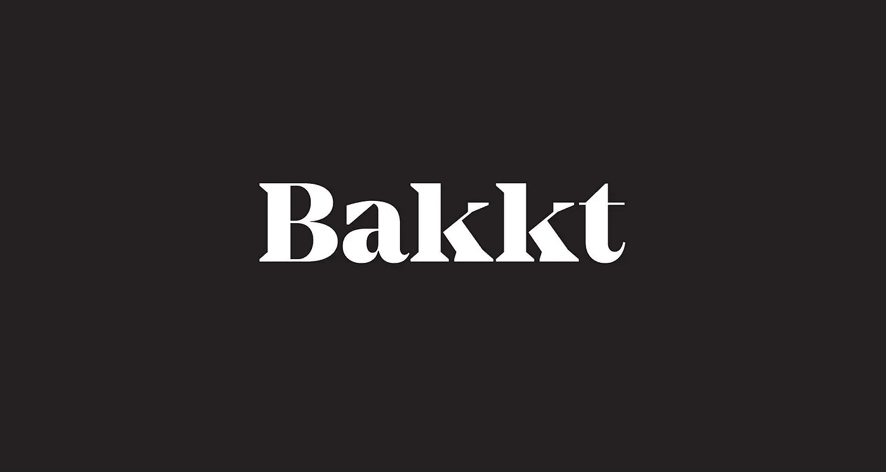
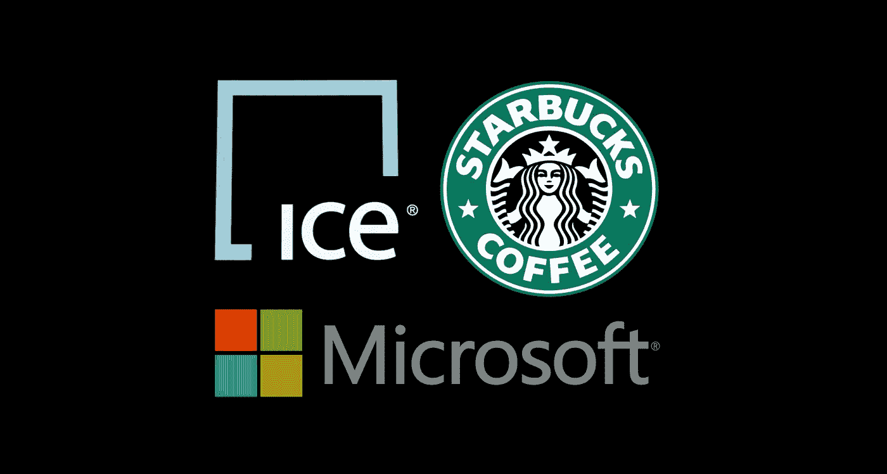
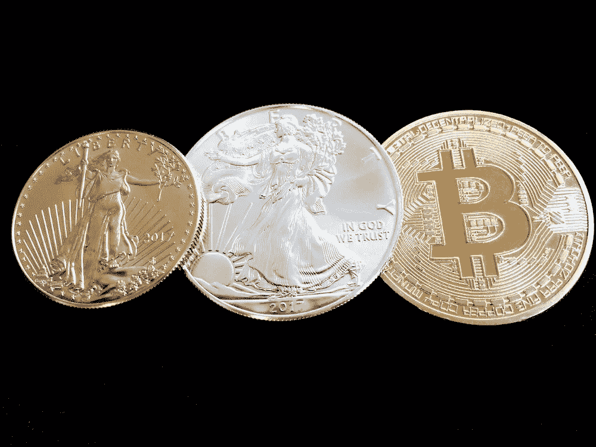
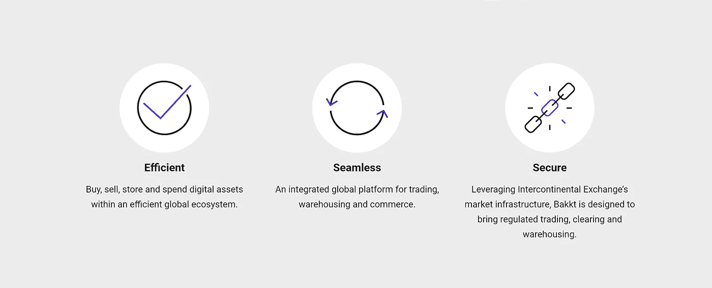

# 巴克特:对比特币意味着什么？

> 原文：<https://medium.com/hackernoon/bakkt-what-does-it-mean-for-bitcoin-aa8e7c5753b9>

区块链行业今年取得了进一步的进展，在监管框架和大型参与者带着促进大规模增长和采用的解决方案进入市场方面都越来越成熟。尽管看跌情绪在今年的大部分时间里一直存在，但世界各地的开发商和企业都在努力推动整个行业的发展。这些业务之一就是 [Bakkt](https://www.bakkt.com/) 。

> “Bakkt 旨在使消费者和机构能够无缝地购买、销售、存储和消费数字资产。成立的目的是为数字资产带来信任、效率和商业，Bakkt 寻求开发开放技术，将现有的市场和商业基础设施连接到区块链。”

# 洲际交易所、星巴克、微软——与 Bakkt 有关的大品牌并不缺乏。

著名的[纽约证券交易所(NYSE)](https://www.nyse.com/) 和许多更传统的交易所的所有者[洲际交易所(ICE)](/bakkt-blog/introducing-bakkt-e1794dd3a45d) 宣布了数字资产的新未来，他已经公开了他们与[星巴克](https://www.starbucks.com/)、[微软](https://www.microsoft.com/)和其他人在他们全新的以密码为中心的平台 [Bakkt](https://www.bakkt.com/) 上的合作。作为街区里的新生事物，并拥有它所拥有的那种支持，巴克特轻而易举地成为了今年区块链最大的新闻；如果你正在读这篇文章，你可能已经注意到了，巴克特病毒正在像野火一样蔓延。

一些人表示，Bakkt 的发布是我们一直在寻找的突破，可以让比特币成为主流，并通过为新投资者进入市场提供便利，对整个加密货币市场产生重大影响。[随着星巴克使用 Bakkt 接受比特币进行店内购买](https://news.starbucks.com/press-releases/intercontinental-exchange-announces-bakkt-a-global-platform)，以及 Bakkt 计划最早于今年 11 月发布，这一新平台对行业来说是一个令人兴奋的消息。

# 主流货币的愿景

简而言之，Bakkt 计划以安全有效的方式解决数字资产的购买、销售、存储和消费问题。 [ICE 希望将比特币转变为一种可广泛使用的可信全球货币](http://fortune.com/longform/nyse-owner-bitcoin-exchange-startup/)，而 Bakkt 就是他们试图引发这一转变的尝试。

ICE 将 Bakkt 定位为将数字资产带入主流，甚至可能为第一个经 SEC 批准的比特币 ETF 开辟可能性。[过去一年，SEC 拒绝了所有 ETF 申请](https://www.coindesk.com/sec-rejects-7-bitcoin-etf-proposals/)，原因是缺乏可信的价格形成机制，这为价格操纵留下了空间。Bakkt 旨在解决这些问题，让未来的 ETF 既可信又高效。

> “价格发现的一个关键因素是实物交割。具体来说，通过我们的解决方案，比特币的买卖是完全抵押或预先融资的。因此，我们新的每日比特币合约不会进行保证金交易，不会使用杠杆，也不会对实物资产提出书面要求。”

Bakkt 表示，其交易所将不允许比特币进行保证金或杠杆交易，他们希望将重点放在寻找一种可信的价格形成方式上。这使得 Bakkt 与过去开放的其他机构比特币市场有着内在的不同；Bakkt 将实际交易比特币，而不仅仅是猜测其价格走势——这非常重要，非常好。

[Bakkt 首席执行官凯利·洛夫勒在最近的博客中表示](/bakkt-blog/https-medium-com-kellyloeffler-price-discovery-f9c77885383)为了实现一个可信的交易、存储和消费数字货币的基础设施，他们需要提供以下内容:

一致的监管结构

透明、高效的价格发现

体制质量的贸易前和贸易后基础设施

这三个方面将 Bakkt 与其他交易所区分开来。这个新平台将提供一个安全、受监管的仓库解决方案，消费者和机构投资者都可以信赖。

# Bakkt 的目标——这个平台对比特币有利吗？

巴克特想要完成三个主要目标。一个目标是将零售支付从信用卡转移到区块链应用程序上，使比特币成为经济中可行、受尊重和被接受的支付手段。第二个目标是为比特币提供与通常在传统市场交易的股票、债券或大宗商品等其他资产相同的保护，最后一个目标是为大量机构资金涌入该空间打开大门。然而，他们面临的最大挑战是让机构、监管者、商家和消费者接受比特币，[这可能比大多数人意识到的更困难。](https://cointelegraph.com/news/when-will-bitcoin-achieve-mass-adoption-and-is-it-even-possible)

[在许多人看来，比特币意味着去中心化，没有中央权威](/@VitalikButerin/the-meaning-of-decentralization-a0c92b76a274)，没有集中的机构垄断，也没有任何监管机构；但尽管一些人可能会认为，为了创造大规模采用，需要强大的中央基础设施，但其他人认为 Bakkt 是机构试图控制和监管比特币使用的另一种方式。

只有时间能证明一切，但在那之前，人们只能希望比特币的未来朝着对消费者比对机构更有利的方向发展。就我个人而言，我相信 Bakkt 是一个受欢迎的、对行业有益的补充，我期待看到他们有更多的发展。