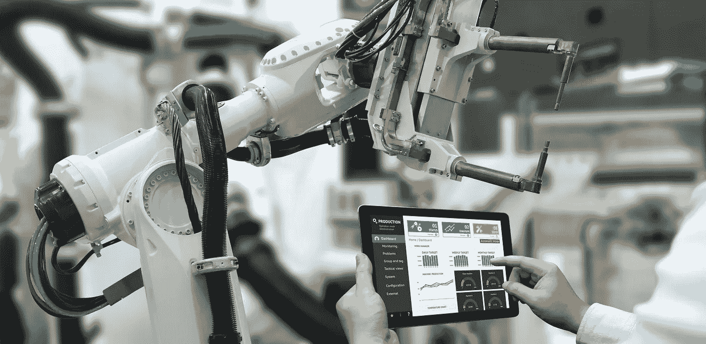

# 平衡自动化和人性化

> 原文：<https://medium.com/hackernoon/balancing-automation-and-the-human-touch-f4a5754207b2>

越来越多的企业受益于使用自动化工具来处理各种各样的任务。业务自动化正处于萌芽阶段，并将继续发展。但是许多人想知道如何平衡自动化和人性化。

本文讨论了企业所有者如何决定自动化哪些类型的任务，以便他们可以将更多的时间花在高价值的活动上。

Automate and humanize your business at the same time.