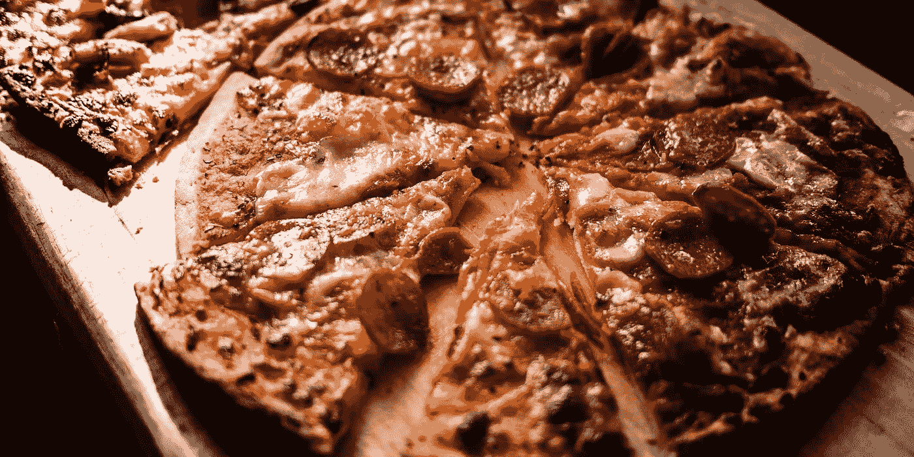

# 平衡公众角色中的曝光度

> 原文：<https://medium.com/hackernoon/balancing-exposure-in-a-public-role-2d0bc977705a>

在过去的 10 年里，我做了很多这样的事情:

“嗨，我叫布莱恩·索尔提斯。”

[…一些有趣的演示…]

*“所以，你有它！我希望你喜欢这次演讲，并随时以各种方式与我联系。”*

[各种社交媒体账户列表]

无论是受众还是话题，形式都相对相同。自我介绍，给他们讲一些牛逼的技术或者概念，然后让他们知道以后怎么联系。

你看，我是一个技术布道者，我喜欢演讲。实际上，这是我最喜欢的工作。嗯，还有每天穿短裤。这是一个非常公开的角色，让我(和我的联系方式)经常出现在很多人面前。为了更好地与他人联系，你必须变得平易近人，而社交媒体是一条必经之路。

但是，如果你不爱社交媒体呢？似乎有悖直觉，对吧？老实说，我不能说我是最大的粉丝。我是一个非常喜欢社交的人，我喜欢与人交谈和互动。然而，我不一定喜欢记录我生活的每一个方面给任何人看。

*我告诉我遇到的人的最令人震惊的两件事是，我当爷爷了，我没有脸书。*

在我深入了解之前，我应该让你知道这些年来我有几个社交媒体账户。很难不成为脸书 20 亿人中的一员，我也不例外。我也有过 Twitter、LinkedIn、MySpace 和其他一些网站。我用了好几年，定期了解凯文晚餐吃什么，马克在 CrossFit 做了多少硬拉。(….这么多 CrossFit 更新…).我发现，随着时间的推移，我对社交媒体和曝光的个人方面越来越不感兴趣。

所以，我的职业就是和每个人联系。我希望人们愿意和我交谈/听我说话，并且理解我是一个怎样的人。我个人的立场是更保守一点。那么，我如何平衡这些相互冲突的意识形态呢？

*划分区域和界限。*

# **划分你的焦点**

Pizza is acceptable on any social media platform

从一开始，我就把我的人脉和内容在专业和个人之间分开。具体来说，我认为 LinkedIn 是我的主要职业渠道，FaceBook 是我的朋友和家人。Twitter 徘徊在两者之间，既有联系人也有帖子，但更倾向于专业。我严密地保护着我的联系人名单，努力尽可能地将不同类型的人分开。在很大程度上，我有几年是成功的。

随着时间的推移，我发现自己改变了一些看法。我的福音传道者生涯需要社交媒体的存在，所以我知道这永远不会消失。我对此很满意，也很喜欢使用这些平台。然而，就个人而言，事情正在发生变化。我发现自己不愿意把自己所有的个人信息免费提供给某个平台，不求回报(除非你把“定向”广告的冲击算在内)。撇开明显的安全风险不谈，我发现纯粹的个人平台引不起我的兴趣，我决定放弃这一块。

从一开始就将两个通道分开的能力使这个过程变得更加容易。直到那一天，我只为最亲近的人保留我的个人社交媒体。我可以在不失去连接的情况下移除它。我建立了一个庞大的专业网络，保持这些客户帮助我保持这些联系。

# **定义边界**

[INSERT TEAM NAME]’s home pitch

我的角色很大程度上取决于我如何有效地接触到一个社区，了解社交媒体的边界是一个关键的组成部分。我想让人们了解我，敞开心扉，而不是传播我的整个生活。我希望他们与我联系，理解我的信息，但我不需要每年都有一大堆生日快乐的帖子。

定义我如何使用社交媒体的限制意味着决定我愿意发布什么信息，以及我为在酒吧凳子上与朋友聊天保留什么信息。我想在我的信息中展示我个人的一面，但仅限于某一点。当你在公共场合时，这是一个很难引起共鸣的话题，但这是可能的，并且仍然对自己的极限感到舒适。

我是如何在职业和个人之间做出决定的？如果我们在会议、活动、交换论坛帖子、一起工作或任何其他以职业为中心的场合相遇，这种接触就是专业的。个人因素几乎是其他所有人:家人、朋友、派对上和我穿同一件衬衫的那个人。这意味着我经常不接受同事的好友邀请，因为我想尽可能保持工作和生活的平衡。

尽早进行区分会有所帮助，因为您会自然地将每个通道用于预期目的。这将帮助您确定自己的极限在哪里，并使平台满足您的需求。

# **哪里贴**

Probably one of the most boring neighborhoods for trick-or-treating

当谈到我的社交媒体时，我有分类:*可以接受*，*骑墙*，和*不感谢*。现在，这些只是我的观点，并帮助我将社交媒体融入我定义的界限。这并不意味着要打击这些平台上的任何人，因为我知道我在这些平台上肯定是少数。

可以接受的
这些是我经常使用的平台，我认为它们对于在职业层面(有时是个人层面)与他人联系至关重要。我的自然侧重于技术，但总体主题是可以从我的专业观众那里得到的。

*   个人博客
*   推特
*   商务化人际关系网
*   开源代码库
*   堆栈溢出
*   公司目录(？)
*   工作相关平台
*   演讲者目录
*   Microsoft MVP 目录

**在栅栏上** 这些平台我不太清楚。在某些方面，我认为他们还可以。它们可能为某些人提供了一个很好的媒介，然而，对另一些人来说却可能暴露太多。这真的取决于它们的用途以及人们想从中获得什么。我使用它们，但是很少使用，并且在需要的时候填补交流中的空白。

*   迪斯克斯
*   游戏平台
*   网络电话
*   松弛的
*   谷歌+
*   ICQ(是的，我还记得我的#！)

**不用谢** 这些平台几乎纯粹是个人的(在我看来)。我认为它们是人们向任何愿意倾听的人表达自己和思想的途径。我当然知道企业确实使用它们来接触人们，然而，我认为公司试图利用已经建立的受众，而不是专门为其建立的平台。我不使用这些，因为它们不符合我想要分享的内容。

*   脸谱网
*   照片墙
*   MySpace(？)
*   任何记录/暴露你超越界限的个人生活的东西

# 最后

我现在找到了与社交媒体的平衡点。虽然我不想让它占据我生活的方方面面，但我很乐意(也很享受)用它来联系专业人士和传播我的信息。这种平衡有助于我与世界分享足够多的关于自己的信息，同时让个人的东西更贴近我的胸口。

这意味着如果你在社交媒体账户上找到我，请随时联系我！我来这里是有原因的，我很乐意与你们联系。

当你担任公众角色时，你将永远面临这种挑战。你必须决定你想让世界知道多少你自己，以及你保留多少。这实际上可以归结为一个人希望别人如何看待他，以及他们传播这些信息的渠道。最终，这个决定对每个人来说都是独一无二的。

找到你的平衡点，这样你就可以实现你的目标，同时最大限度地利用每个方面。