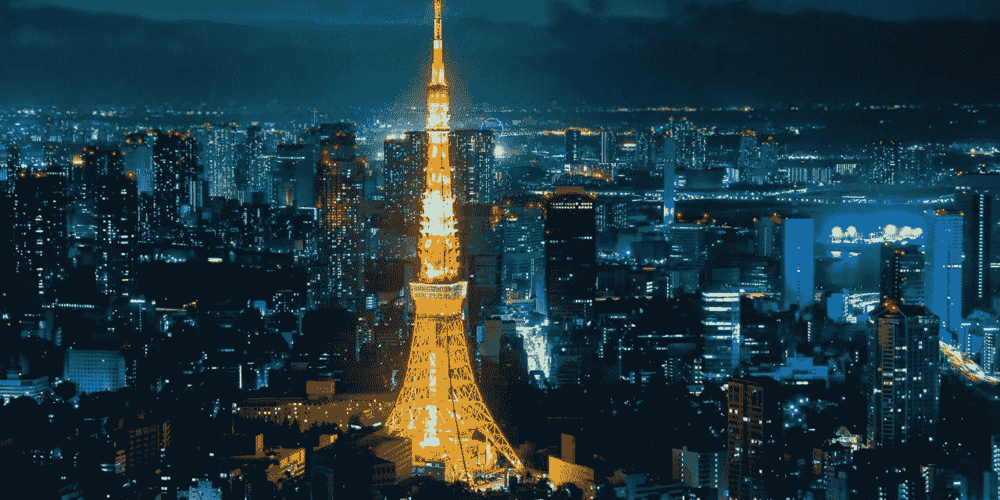
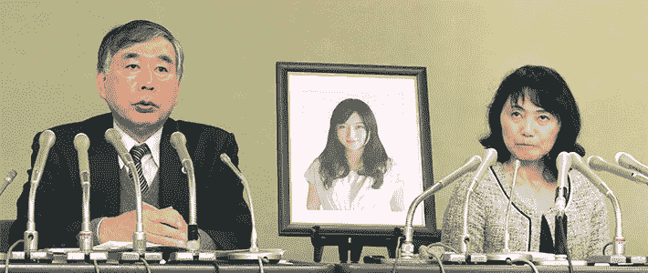
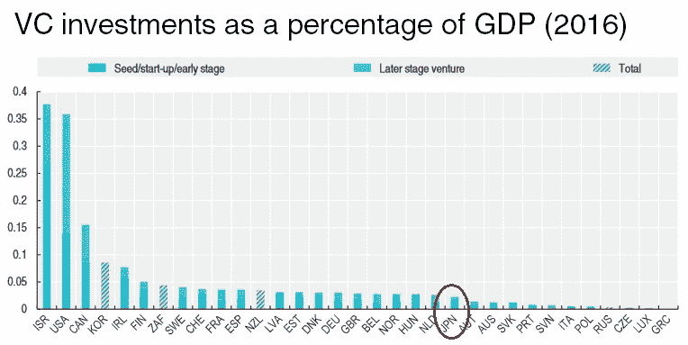

# 旭日东升之地的创新障碍

> 原文：<https://medium.com/hackernoon/barriers-to-innovation-in-the-land-of-the-rising-sun-58628269cd16>

## 为什么日本曾经是全球科技的领导者，却没能赶上硅谷。以及如何赶上。

最近，宣布硅谷的死亡成了一种时尚。

有影响力的人越来越多地推动这样一种观点，即美国，特别是湾区已经失去了作为突破性创新的全球中心 T2 的主导地位。不管这是不是真的——去年创纪录的 10 亿美元成功退出和[巨额风险投资交易规模](https://pitchbook.com/news/reports/4q-2017-pitchbook-nvca-venture-monitor)表明了相反的情况——许多国际城市都自称为“下一个硅谷”，从都柏林的硅码头到特拉维夫的硅谷。

这些复制该地区创新精神的尝试值得庆祝，正是这种精神催生了许多全球最有价值的公司。毕竟，创新的新产品和服务可能来自任何地方，而全球竞争只会让消费者受益。然而，这些新的技术中心取得了喜忧参半的成功，只有少数几家生产独角兽，生产真正新颖的产品和服务的就更少了。

即使是日本，这个曾经的世界科技强国，仍然拥有像旧金山湾区一样强大的 STEM 专业人才基础，现在也已经落后很多年了。尽管日本在培育本国新的创业生态系统方面取得了长足进步，尤其是在东京，但这一努力进展缓慢。通过更深入地研究在日本(仍是世界上最大的经济体之一)发展一个强大的风险生态系统所面临的挑战，我们或许可以找到更好地鼓励东京及其他地区创新的方法。

# 挑战 1:文化

尽管有缺点，美国文化在许多方面非常适合激进的创新。与世界其他地方相比，这里对企业倒闭、失业甚至破产没有什么耻辱感，这些通常被视为通往成功路上的暂时失误，而不是职业生涯的决定性失败。毫不奇怪，精益创业，“快速失败，经常失败”的从一个人的错误中迭代的心态在这里扎根。情况并不总是这样，曾经有过压力和糟糕的心理健康导致创始人自杀的悲惨例子，但幸运的是，这是一个罕见的例外。

另一方面，日本的工作文化曾经确保了它在科技领域的主导地位，但现在却阻碍了它的追赶能力。虽然长时间的工作、工程专业知识和对完美主义的惊人追求曾经非常适合开发更多更好的技术产品，但现在它们只会损害生产力，减缓创新的步伐。更糟糕的是，紧张的工作时间和巨大的表演压力已经导致了“过劳死”的流行，此外还有“T2”的高自杀率，尽管自杀率有所提高。

Takahashi Matsuri, whose suicide in 2016, labeled *as karōshi, ignited public outcry*

差异不仅仅是工作文化。在像日本这样的集体主义文化中，任何可能“捣乱”的行为都是不被鼓励的，而社会和谐和集体利益是被鼓励的。好处显而易见:[东京继续高居最安全城市指数的榜首](https://dkf1ato8y5dsg.cloudfront.net/uploads/5/82/safe-cities-index-2017-eng-web.pdf)。就我个人而言，我在那里的所有时间里，从未感到不安全(我的家乡里约热内卢就不是这样了)。不幸的是，这也意味着日本永远不会产生一家像优步这样的革命性公司，一家愿意蔑视现状、与世界各地的监管机构针锋相对的公司。

教育的差异可能会起到更大的作用。虽然美国不那么严格的小学和中学教育可能会培养出技术能力较差的学生，但这个体系对学生的要求要低得多——至少，我从未听说过美国学校命令学生把头发染成黑色，同时鼓励实验和创造性的课外追求。即使是那些在学术生涯中后来开花结果的学生，或者忽视成绩但表现出对创业的偏好的学生，也得到了他们最需要的东西:一个机会。

# 挑战 2:退出市场

去年 9 月，东京证券交易所(Tokyo Stock Exchange)遭遇了近年来最受期待的 IPO 之一，这是日本最受欢迎的初创企业类别之一。这家初创公司 Wantedly 是一家成立 7 年的招聘公司，它让专业人士能够根据激情和价值匹配找到新工作。经过多年的积累，Wantedly 没有筹集到 10 亿美元，或 5 亿美元，甚至没有筹集到 9400 万美元，这是 2015 年美国 IPO 规模的中位数(过去十年中的最低水平)。它筹集了 1.144 亿英镑，约合 107 万美元。就是这样。

一个糟糕的退出市场，糟糕的估值，无助于鼓励有创新、有潜在利润的想法的聪明人离开稳定的公司工作，冒险进行新的冒险。毕竟，日本大公司的工作保障是非常特殊的，大多数工薪阶层会终身保有他们的工作。具有讽刺意味的是，对于那些愿意放弃这些稳定的职位，自己创业的人来说，一个人在大中型公司工作所积累的行业专业知识和人脉会格外有用。

Even in its weaker years, the U.S. IPO market incentivizes strong valuations

一个强大的退出市场会推动外国投资者参与进来，鼓励更多本地风投的形成，并激励富有的个人以天使投资者和导师的身份参与进来。当然，大规模退出也意味着创始人和员工的巨额支出，这意味着一批新的天使，将他们的意外利润——以及他们作为导师的时间——再投资到下一代创业公司。这是一个我们以前在山谷中见过的循环，没有理由它不能在这里扎根。

即使企业家和他们的员工**没有转身将他们的收入再投资到新的创业公司，他们通常会做得更好:一起创办新公司。今天，一些最有影响力的企业是由前运营商创办的，他们成功了，并决定在这个世界上做更多的事情:埃隆马斯克的 SpaceX 和特斯拉，马克平卡斯的 Zynga 和杰克·多西的 Square，仅举几例。像这样的连续创业者比比皆是，我见过的都是我所知道的最有激情、最有奉献精神的人。**

# 挑战 3:融资生态系统

维持一个蓬勃发展的创新中心需要大量的资本流入，虽然日本可能没有必要像美国一样手头有那么多的风险投资资金，但对这两者进行比较是值得的。2017 年，日本创业公司筹集了相当于 25 亿美元的资金，这是该国创纪录的金额(作为参考，美国同年筹集了 840 亿美元，但这没有下一个数字重要)。更重要的是，日本每 GDP 的风险投资在世界上排名第 22 位，风险投资占 GDP 的 0.027%，而美国为 0.35%

本地和外国风险投资公司都有兴趣加大投资，那么瓶颈在哪里呢？日本的风投资金是不是太难获得了？是也不是。

可以听到日本投资者抱怨缺乏有前途的创业公司，这是由创业社区的不成熟和不鼓励创新的文化造成的。因此，你可能会认为有限的风险投资基金利率是投资者坚持寻求更好前景的结果。日本风投**在 2016 年的确**筹集了[近 7 亿美元的未动资本，相当于总融资额的 35%左右。也就是说，虽然这个数字可能看起来很高，但它几乎等同于美国风险投资市场出现的 37%的过剩。关键是，日本投资者并没有完全失去选择。](https://asia.nikkei.com/Business/Deals/Japan-venture-capital-market-to-stay-hot-in-age-of-AI?page=1)

这里确实存在一个问题是监管环境，这使得寻求 IPO 成为一个漫长的过程，可能会持续风险投资基金的整个生命周期，并迫使公司被收购。风投通常不愿意投资种子期的初创公司，因为他们担心——也许是理所应当的——这种投资的时间跨度。当考虑到干粉比率和低风险投资/GDP 比率时，很明显日本风险投资正在对更少的后期公司进行更大的投资。

Early-stage startups remain dominant in Japan, but later-stage companies are more favorable

相反，日本的种子期初创企业正转向企业风险投资寻求资金。日本企业越来越多地在自己的围墙之外寻求创新，索尼最近 1 亿美元的机器人基金和丰田类似规模的人工智能基金甚至瞄准了处于早期阶段的公司。这些努力仅仅是支持种子期创业公司的开始。虽然成功的后期创业公司可能有大量风投资金可供选择，但新创始人仍面临一场艰苦的战斗。

# 未来看起来怎么样？

需要说明的是，这些因素仅仅触及了表面。硅谷的爆炸性增长还有很多其他原因，包括不可执行的竞业禁止协议，以及与日本相比，美国相对宽松的监管环境。然而，这些差异可以被一个强大的日本创业生态系统所克服。

就目前而言，人们的共识是市场仍在成熟，对于一个处于这一阶段的市场来说，它正变得越来越强大。当地和外国的风险投资公司、天使投资人和企业投资者正在不遗余力地推动日本成为创新中心，同时推动以保险和法律等日本传统商业领域为目标的创业公司，这些领域尚未被科技转变。融资数字表明，他们的努力正在取得回报，尽管软银将其规模惊人的愿景基金的大部分投资于海外。甚至硅谷也花了很多年才从果园变成高科技办公室，文化、退出市场和融资市场向好的方向转变可能只是时间问题。

不过，这与美国不同，美国有更多的企业投资者，风险投资公司现在才开始从喷雾祈祷式的投资策略转向更专注、更实际的方法。与此同时，随着日本合法化并接受加密货币，甚至[指定比特币为国家货币](https://www.cnbc.com/2017/09/29/bitcoin-exchanges-officially-recognized-by-japan.html)，我们很可能会看到 ico 在日本成为比世界其他任何地方都更受欢迎和可行的融资选择。在许多方面，尽管日本试图效仿硅谷，但它也不怕找到自己的路。

也许这就是每个创新中心应该做的:找到自己独特的平衡。毕竟，硅谷没有效仿任何人，而且到目前为止效果还不错。

*Marcello Miranda 是一个技术迷，经常写关于创业公司的文章。关注他的* [*中*](/@marcelloecm) *和* [*推特*](https://twitter.com/marcelloecm) *，如果你喜欢这个内容，* **按住鼓掌键** *帮助传播！*