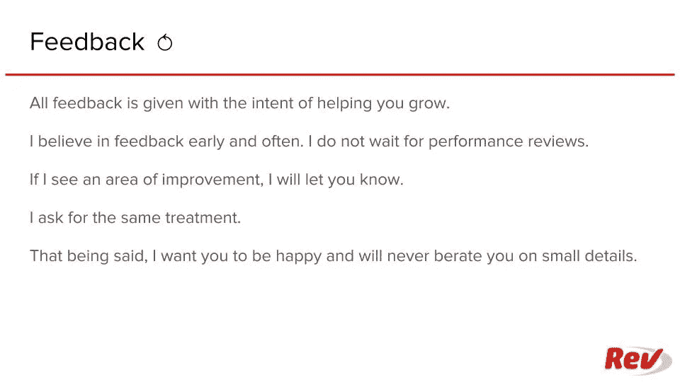
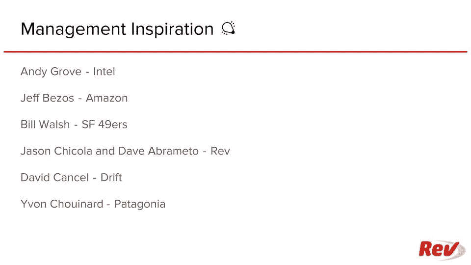

# Barron:经理汇总

> 原文：<https://medium.com/hackernoon/barron-manager-summary-361d8c2e0342>

## 管理世界级的成长团队

我喜欢好的文档。

1.  强迫清晰的思考
2.  提炼想法
3.  容易消化
4.  为将来的讨论提供参考

Especially when done by hand

在看了一篇关于[经理自述文件](https://hackernoon.com/12-manager-readmes-from-silicon-valleys-top-tech-companies-26588a660afe)的好处的 HackerNoon 帖子后，我不得不创建一个。

以下是我与团队所有成员分享的文档:

 [## Barron:经理汇总

### 在我们的世界级成长团队中工作时，项目经理应该知道什么](https://docs.google.com/presentation/d/1ebAg6vpHfwGAm7dQtjNOPvFX3eazePVY6HJRKDhHpBQ/edit#slide=id.g3d6cf258bc_0_0) 

我最近让一位新的项目经理加入了增长团队，她对经理总结的评价非常积极。然后，她开始创建自己的文档，记录作为员工与她一起工作的情况，这已经通过清理通常通过反复试验才能学到的东西而获得了回报。

# **最喜欢的管理灵感:**

*   安迪·格罗夫— [英特尔](/@iantien/top-takeaways-from-andy-grove-s-high-output-management-2e0ecfb1ea63)
*   杰夫·贝索斯— [亚马逊](https://www.amazon.jobs/principles)
*   比尔·沃尔什— [SF 49ers](https://www.amazon.com/Score-Takes-Care-Itself-Philosophy/dp/1591843472)
*   [杰森·奇科拉](https://www.linkedin.com/in/jasonchicola)和[戴夫·阿布拉梅托](https://www.linkedin.com/in/davidabrameto/) — [Rev](https://www.rev.com?bc)
*   大卫取消— [漂移](https://blog.drift.com/blog-drift-com-leadership-principles-and-practices/)
*   芮伟航·舒伊纳德— [巴塔哥尼亚](https://www.amazon.com/Let-People-Surfing-Education-Businessman/dp/0143037838)

如果你有建议或反馈，请不要犹豫，联系 Barron.Caster@gmail.com