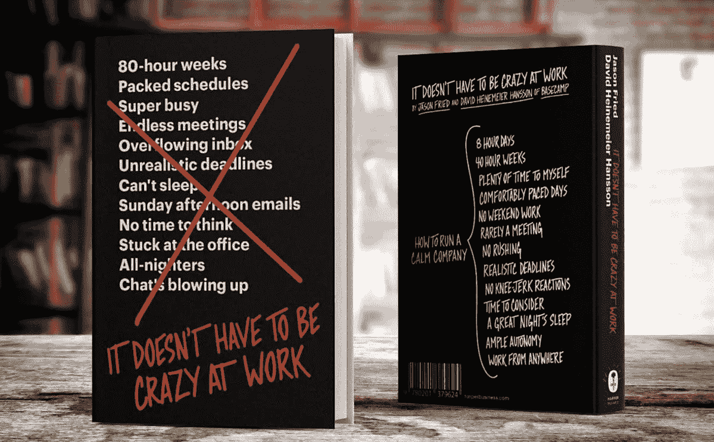

# 为什么 Basecamp 仍然运行三个完全不同版本的软件

> 原文：<https://medium.com/hackernoon/basecamp-b074377b30dd>

杰森·弗里德和 T2·DHH 是企业家世界中真正的反向投资者。

他们在推特上分享的想法，在[他们的博客帖子](https://m.signalvnoise.com/)和他们的书让人思考。其他创始人认为“我希望我能经营一家那样的公司”，他们的员工认为“我想为 Basecamp 工作”。

多年来，我一直是他们作品的追随者，最新的一本书《工作中不一定要疯狂》。几乎这本书的每一章都违背了最佳实践和经营企业的一般方式。

# 更有道德，更有责任感，对人更友好

这些不仅仅是为了与众不同而产生的逆势思维。他们实际上是经过深思熟虑和测试的商业实践，他们已经在自己的公司实施。

更有道德、更负责任和对人友好的活动。关注为品牌工作的员工和 Basecamp 服务的客户的行动。

如果你读过他们之前的工作，有些建议你可能已经很熟悉了，比如“返工”或“远程:不需要办公室”。但是很多都是新鲜的，有见地的，有影响力的。

这些教训值得重复，因为商界和管理层一直太慢，没有考虑到新的视角。

# 工作中不一定要疯狂:改变控制

我想在这篇文章中讨论的一个章节的标题是“变更控制”。本章的见解与我最近的[创业](https://hackernoon.com/tagged/startup)经历特别相关。这一课是关于强调和关心现有客户的。

考虑一下我最近在一个[以产品为导向的市场角色](https://howtomakemyblog.com/startup-marketing/)中的经历。我的创业故事和大多数其他企业的经历一样普遍。

我们有一个小而忠诚的客户群，但风险投资创业公司的标准是快速成长或死亡(Basecamp 创始人在他们的书中有很多关于风险投资的话)。我们必须采取行动。

我们首先从内容[营销](https://hackernoon.com/tagged/marketing)方法开始。在获得社交媒体提及和行业权威来源的链接方面，这是一个坚实的成功。

我们发布的内容[增加了我们的流量](https://howtomakemyblog.com/promote-your-blog/)，增加了试用注册的数量，我们也看到了巨大的收入增长。

这还不够。绝大多数来访者不想报名参加试验。最重要的是，大多数试用者没有兴趣转化为付费用户。

尽管有机营销有所改善，但在网站流量和产生的试用次数等指标上，我们仍落后于业内领先企业。

如果你不能成为你所在领域的顶尖(或者前两三名)玩家，你甚至可能不存在，或者对你的投资者来说不重要。

# 要么快速成长，要么慢慢死去

那么在这种情况下你会怎么做呢？你更努力地看待每一件事，并不断创新。信息、营销活动和产品本身。

该产品通常会进行改造或完全升级。新的定位、改进的用户界面和体验，以及营销预算的增加。

这种情况下的正常目标是:

*   让更多的人对你的网站和产品感兴趣
*   吸引更多的访问者注册试用
*   让更多试用者转化为付费用户

在这种情况下，大多数公司最不关注的是现有的忠诚客户。顾客就在那里，为产品付费，并对当前的服务感到满意。

尽管付费用户的数量很低，但该公司需要快速发展并获得更多客户。或者它会慢慢死去。

因此，在追求更大数量的过程中，你最终会把现有客户视为理所当然，并迫使他们也加入新的平台。也许你应该提前通知他们。你甚至可以让他们先睹为快新版本。

但在大多数情况下，他们确实需要在你决定大规模发布的那一天转换到新平台。

# 向新顾客推销新产品，让老顾客保留他们已经拥有的东西

这是杰森·弗里德和大卫·海涅迈尔·汉森还原传统剧本的地方。他们不会强迫现有客户进行任何创新或大的改变。

对于你现有的客户来说，新的、改进的、更好的应用程序版本并不重要。"舒适度、一致性和熟悉度在他们的价值链上处于更高的位置."

人们使用你的产品来完成某件事，这对他们来说是最重要的。他们有最后期限和工作要做。他们也不想学习和熟悉你强迫他们通过你的重新设计的新工作流程。

> 这并不意味着你的新工作很糟糕，只是人们通常正在做一些对他们来说比改变你的产品更重要的事情。他们已经投资于他们必须做的事情，并且他们已经熟悉如何去做。然后你给他们一个改变，这立刻让他们的生活变得更复杂了。现在，他们在做旧事情的同时，又有了新的东西要学。”

Basecamp 的创始人总结了销售的一个核心真理:

> *“把新事物卖给新顾客，让老顾客保留他们已有的一切。这是保持和平和平静的方法。”*

# 三个完全不同版本的 Basecamp 软件

这就是为什么我们发现 Basecamp 仍然运行着三个完全不同的软件版本。每次他们发布一个大的重新设计或升级，他们从来没有强迫他们现有的客户去附和。

现有客户会收到试用新版本的邀请。尽管这不是一个要求。他们可以永远使用他们熟悉和舒适的版本。“相当多的人”选择这样做。

其他人至少可以选择一个更合适的时间来学习，并过渡到你的最新创新。

> *“技术和设计已经改变。我们进化了。但是，我们的发展是按照我们的步伐进行的，今天的新客户期望与十年前的新客户有所不同。但这并不意味着我们应该强迫我们最早的客户跟随我们的步伐。”*

这与大玩家的做法完全相反。

*   谷歌可能会在周一早上强迫你使用新版 Gmail，因为你有一长串需要回复的邮件。
*   Instagram 可能会突然开始通过算法改变你在新闻订阅中看到的内容，让你错过你最关心的人的更新。

在数百万人被迫进行重新设计、重新定位和创新的今天，看到一家公司关注客户并竭尽全力(并降低利润潜力)让客户体验满意，真是令人耳目一新。去大本营！

*原载于 2018 年 10 月 10 日*[*markosaric.com*](https://markosaric.com/change/)*。*