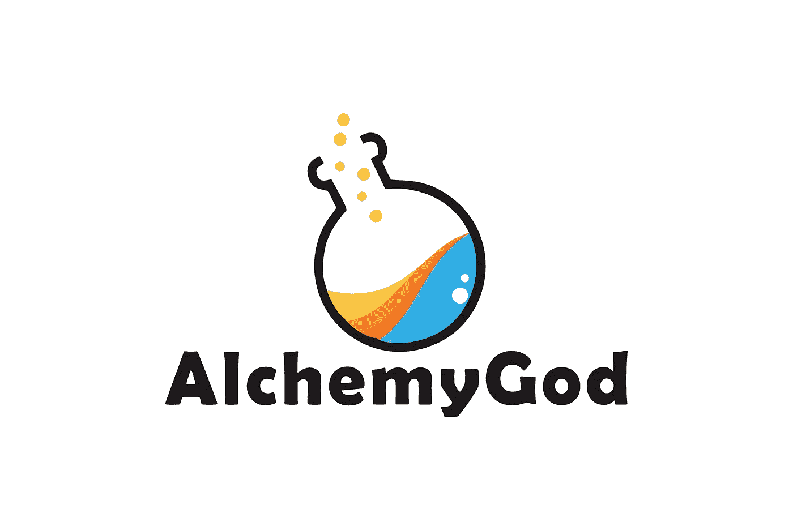

# 酒精饮料的基本规则介绍

> 原文：<https://medium.com/hackernoon/basic-rules-introduction-for-alchemygod-82bc91c773b9>

在 AlchemyGod 中，我们提供了三个主要系统:神皮系统、炼金术系统和迷你游戏活动系统。现在，只有炼金术系统是开放的，炼金术将在 5 月 11 日被关闭。

这里我们简单介绍一下我们的皮肤系统。

1.  *如何购买*

玩家可以从抽奖中抽取一张皮肤卡
玩家可以在市场上购买其他玩家出售的皮肤卡。
玩家可以将红利或 AGT(活动奖励)兑换成皮肤卡。

*2。不同的套装有什么区别*

皮肤以套装的形式出现，套装分为普通、稀有、优秀、传奇、史诗、神话、混乱和空白 8 层。

每张皮肤包含头饰、面部、上衣、裤子、左手、右手、脚、首饰 8 个部分。当一个皮肤的 8 个属性属于同一层时，我们称这个层已经被“收集”。这种皮肤卡会有特殊的外观效果，不能再融合。

*3。如何融合皮肤卡*

玩家通过皮肤融合“组装”包裹。

在融合操作中，玩家可以选择两张皮肤卡进行组合。产生的新卡将从两个父卡特征中继承，并且新特征将不可避免地来自父卡而没有变化。
当空白特征与其他非空白特征融合时，空白特征将不被保留。换句话说，空白是遗传学中的隐性特征。

4.特殊玩法——特色洗

为了给游戏更多的操作感，保证融合的成功率，我们提供了一个特殊的道具，叫做“漂白剂”。

“漂白剂”表现为一张皮肤卡。当与其他皮肤卡融合时，玩家可以将另一张皮肤卡的一个特征改为空白。改变的特征的位置由该卡决定。换句话说，我们在这个游戏中有 8 种类型的橡皮擦卡。当皮肤卡有三个或三个以上的特征作为空白时，不允许使用漂白剂来制作更多的空白特征。

玩家只能通过回收卡获得“漂白”卡。

5.皮肤对炼金过程的影响
对于炼金融合系统，皮肤卡会对速度、成功率、炼金配方等产生影响。相同层次的功能将产生更大的影响。

皮肤对红利 AGT(alchemygodctickets)有很大的影响，在 beta 版本的后续活动游戏中发挥着重要作用。

皮肤也将决定未来迷你游戏中用户的权重。