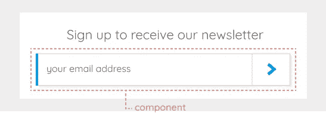
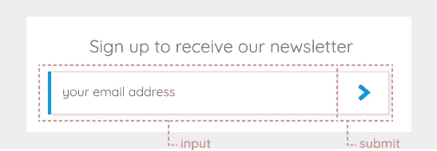
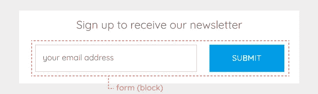
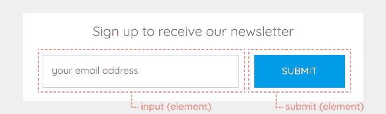

# RSCSS 和 BEM 系统的基本规则

> 原文：<https://medium.com/hackernoon/basic-rules-of-rscss-and-bem-systems-a7a5fda0348d>

在 Kolosek 从事多个项目的过程中，经常会对如何正确使用 CSS 感到困惑。这份文件帮助我们，并提供了澄清，所以我想与你分享。

[**SASS 3**](http://sass-lang.com/) 预处理器引入了一种新的语法，称为 [**SCSS**](http://sass-lang.com/documentation/file.SCSS_FOR_SASS_USERS.html) ，这种语法在我们的项目中使用。

要学习的最重要的事情之一是在 Sass 中嵌套。

两个最常用的导向系统是[rscs](http://rscss.io/index.html)和 [BEM](http://getbem.com/introduction/) 。我将介绍这两个系统的基础知识，以确保它们能够在当前和未来的项目中得到正确使用。

# 通则

首先，让我们来看看应该遵循的一些通用 CSS 规则。

1.  写 CSS 的时候，应该使用**类**，避免**id**。
2.  使用 **SCSS** 语法，**从不使用**语法。
3.  使用**两个空格**缩进。
4.  当在规则声明中使用多个选择器时，**给每个选择器一行**。
5.  当需要使用一个**边距或填充辅助类**时，首先看看它是否可以被合并到元素 CSS 规则中，以**避免在一个元素中添加太多的类**。
6.  请勿嵌套选择器超过 [**2 层**](https://kolosek.com/nesting-in-less-and-sass/) 。

# [rscs](http://rscss.io/index.html)

## 成分

使用 RSCSS 时，您应该考虑**组件**。每一个 UI 都应该被认为是一个独立的组件。

组件的类别应该用两个单词命名，中间用一个破折号。

一些命名示例包括:

*   搜索表单，
*   照片容器，
*   主要按钮。

## 元素

每个组件包含**元素**。类应该只有一个**字**。

如果一个元素包含多个单词，它们应该连接在一起组成一个单词。

例如:

*   用户信息，
*   小文本，
*   navlink。

写 CSS 的时候应该避免使用**标签名**和**id**。

## 变体

变体可用于**组件和元素名称**。
变体的类名是以破折号为前缀的**。**

例如:

*   class="button-primary -large "，
*   class="avatar -round "，
*   class= "输入-表单范围"。

在下面的例子中，我将组件分解成元素，并展示了 RSCSS 的实际应用。


该图像显示了一个带有按钮和占位符文本的简单输入字段。
首先，让我们**识别组件并将其分解为元素**。



该组件包括输入字段和提交按钮。



现在，是时候写 CSS 类了。让我们将**组件、元素和变量命名为**。

```
.signup-form {
   .inputfield {
     ...
    }
   .submitbtn {
     ... &.-inverted {
       ..
     }
    }
}
```

对于命名元素，您应该将两个单词连接起来(不要使用破折号或下划线)。如您所见，使用了一个变量来定义按钮的样式。因此，类的 submitbtn 和-inverted 都应该用在 button 元素上。

# [边界元法](http://getbem.com/introduction/)

边界元法是一种基于块体-单元-修正系统的方法。只使用类名选择器，避免使用 id。

## 阻碍

**块**可以嵌套，也可以相互交互。它们**类似于 rscs**中的组件，并且语义相同。

Bloks 通常有一个单词的类名，或者由破折号分隔的两个单词。块名可以由拉丁字母、数字和破折号组成。

## 元素

元素是块的一部分。

元素名称可以由拉丁字母、数字、破折号和下划线组成。类名由块名**加上两个下划线和元素名**组成。例如:“**for input**”。

## 修饰语

修饰词用在元素上以显示外观、行为或状态的变化。通过添加或移除修改器来改变元素设计。

修饰符名称可以由拉丁字母、数字、破折号和下划线组成。修饰符类名由元素类名加上两个破折号和修饰符名组成。当元素有修饰符时，它必须同时有元素类和修饰符类。

例如:“ **blockinput blockinput —虚线**”。

在下一个例子中，我将展示边界元方法的一个实际例子。



上图显示了一个类别为“**表单**的块。它由一个输入字段和一个提交按钮组成。



接下来，您已经确定了块中的元素。这些元素是“**输入**”和“**提交**”。“ **submit** ”元素有一个外观修饰符，使按钮更宽。

根据所有这些信息，您的样式表将被写成:

```
.form { }
.form__input { }
.form__submit { }
.form__submit--wide { }
```

HTML 文件将如下所示:

```
<form class="form">
  <input class="form__input" placeholder="your email address" /
  <input type="submit" class="form__submit form__submit--wide" /> </form>
```

我希望这篇文章能帮助您理解 RSCSS 和 BEM 的基础知识，以及类命名约定。

查看其他与 CSS 属性相关的详细文章，比如这篇: [CSS 位置](https://kolosek.com/css-position-relative-vs-position-absolute/)、[萨斯和少嵌套](https://kolosek.com/nesting-in-less-and-sass/)、 [CSS 列](https://kolosek.com/css-columns/)。

*原载于 2018 年 5 月 24 日*[*kolosek.com*](https://kolosek.com/css-formatting/?utm_source=me)*。*