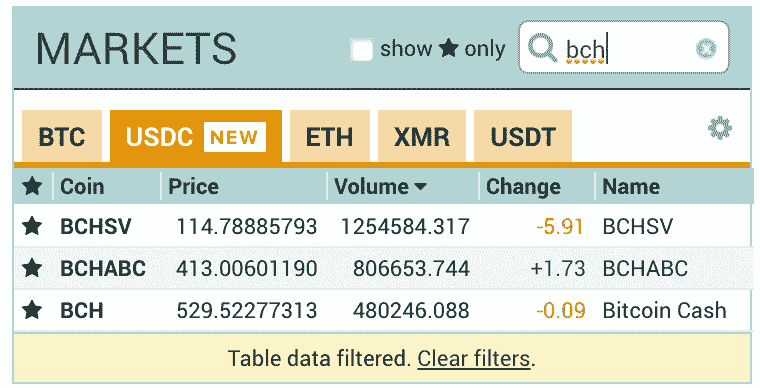

# BCH 前叉套利交易理念

> 原文：<https://medium.com/hackernoon/bch-pre-fork-arbitrage-trading-idea-fcac026255d5>

正如你们许多人所知，11 月 15 日 BCH 将迎来一场艰难的比赛，最近出现了一些有趣的机会。其中之一是波洛涅克斯公司推出的 BCH ABC 和 BCH SV 交易。这引入了一个有趣的套利机会，我在本文中对此进行了阐述。

***注:我分享这个例子是为了说明加密货币市场是如何拥有独特的套利机会的，只要你理解其背后的机制。它旨在用于教育目的，绝不是建议或投资建议。***

# **套利想法**

## 前提

1.  Poloniex 试图通过允许可交易的新代币 BCHABC 和 BCHSV 来支持 fork。
2.  Poloniex 对美元交易不收取交易费用: [Circle 的公告。](https://blog.circle.com/2018/11/08/poloniex-removes-trading-fees-for-usd-coin-usdc/)

这意味着存在潜在套利机会，因为本质上要记住:

***BCH 价格= BCHABC 价格+ BCHSV 价格***

因此，当这种关系不成立时，我们可以从中获利。

## 例子

在 Poloniex 上捕捉 BCH/USDC 的价格:

Taken on 13 Nov 2018

如果我们把上面的数字作为一个贸易例子，我们可以看到:

> BCH = 529.52
> BC habc+BC HSV = 413.01+114.79 = 527.8
> 
> **所以 BCHABC + BCHSV < BCH**

因为我们想高卖低买，所以我们想:

> 1.卖 1 BCH 换 USDC @ 529.52
> 2。用 USDC 分别买 1 BCHABC 和 1 BCHSV @ 413.01 和 114.79。
> 3。你最终得到 1 BCH 加 1.72 USDC 的利润。
> 
> **这给了我们大约 0.32%的投资回报率= 1.72 / 529.52**

*编辑:投资回报率从 0.16%到 0.32%，因为之前有计算错误。*

## **潜在问题**

然而，这个交易示例存在一些潜在的问题，因为:

*   我上面的例子没有考虑买卖差价，因为每笔交易的投资回报率相对较低，买卖差价会让你的利润消失。
*   我们的执行速度可能太慢，无法抓住机会，而且随着市场价格在第 1 步和第 2 步之间不断变化，这可能意味着利润会受到侵蚀，甚至导致亏损。

## **可能的改进:**

*   看看其他支持 BCHABC 和 BCHSV 转换的交易所比如 HitBTC。
*   使用算法/自动交易来提高执行速度和定价。

# **总结**

鉴于投资回报率相当低，而且费用/滑点等问题很容易侵蚀你的利润，这种交易很可能无法手工完成。但希望这能让你对加密货币领域可能存在的套利机会有所了解，随着市场的不断创新，还会有更多的机会出现。

以上帖子仅供参考和娱乐。通过此类帖子获得的任何和所有信息，无论是通过音频、视频、口头还是书面方式，都应被视为作者的个人观点、策略和示例，并反映他或她在发布之日的判断，可能会更改，并不构成投资或交易建议。作者对任何信息内容的准确性、适用性、适用性或完整性不做任何陈述或保证。这些帖子的作者不对任何一方因使用内容而直接或间接产生的任何直接、间接、暗示、惩罚性、特殊、附带或其他后果性损害负责，这些内容按原样提供，没有任何形式的明示或暗示的担保。任何指向第三方提供商的链接或参考仅供参考，不保证内容、准确性或任何其他明示或暗示的目的。

*投资和交易策略受市场风险和潜在损失的影响，所有交易策略同样有可能盈利或亏损。过去的表现不能保证未来的结果。不能保证任何交易策略将匹配或优于任何特定的基准。任何内容都不应被解释为购买或出售的要约，或任何购买或出售任何提及的证券的要约的恳求。在任何情况下，读者都不应该从表面价值上接受从本博客获得的任何信息，而应该对任何材料进行尽职调查，以形成自己的观点和最佳判断。在采取任何行动之前，应咨询专业顾问以获得个性化的投资建议。如果读者希望应用任何帖子中包含的概念或想法，这样的读者对他或她的行为承担全部责任。*

*2018 湛豪。保留所有权利。此处提到或提及的产品名称、徽标、品牌和其他商标是其各自商标持有者的财产。*