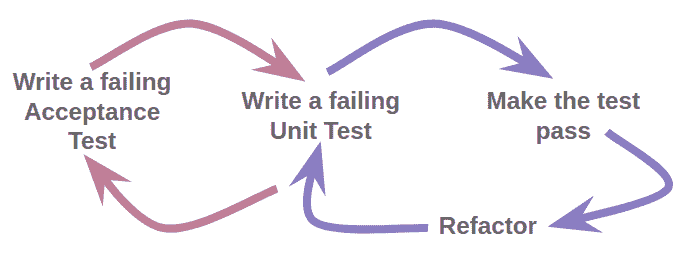

# BDD 比我想象的要大

> 原文：<https://medium.com/hackernoon/bdd-is-bigger-than-i-thought-db8d73f1ea41>

# …那么现在我在想什么？

# 简介——让我快乐的测试

六年前加入数字产品咨询公司[白色十月](https://www.whiteoctober.co.uk/)时，我最喜欢的事情之一就是发现行为驱动开发(BDD)。作为一名开发人员，看到应用程序以绿色滚动过去时用户实际行为的描述的满足感是无与伦比的…

```
...
Then I should see a thanks message
And my account should be credited with 500 points
And Sam should feel like an awesome developer because his code Officially Works
```

你明白了。

渐渐地，我决定我想了解更多关于 BDD 的事情。我最初的大部分学习都围绕着工具，但是最近我做了两件真正让我大开眼界的事情:

*   我读了约翰·费格森·斯马特写的《BDD 在行动中的 T2》
*   我看了 JBehave 的创始人之一利兹·基奥的《T4 十年行为驱动开发全错了》

我的发现让我意识到**我实际上对 BDD 并不十分了解……**

# BDD 比我想象的要早开始

这里有个问题:BDD 的“主要”是什么？

如果你说“模拟真实用户行为的自动化测试”，你就像我一样，直到最近。

但这是它的创造者丹·诺斯的“推特中的 BDD ”:

这里有一句经常被引用的利兹·基奥的台词:

> …进行对话比捕获对话更重要，比自动化对话更重要。

在我提到的莉兹·基奥的会议谈话中，她甚至报告了与丹的一次对话，大意是“我们让从例子中创建自动化测试变得如此容易，这是一种耻辱，因为现在每个人都认为这就是 BDD 的意义所在”。

罪名成立！我意识到 BDD 的一些更广泛的含义，但并没有认真参与其中。从用户的角度来看，编写可执行的规范和创建自动化测试是非常有价值的，我肯定会继续做这些事情，但是 BDD 远不止这些。

因此，如果 BDD 实际上是整个软件开发生命周期的过程，那么它还包括什么？以下是一些更大的难题:

# 关注业务目标

BDD 带来了一套项目原则，并包括确保您遵循这些原则的技术。这些技术和原则从软件项目的开始就开始发挥作用，[在](https://lizkeogh.com/2012/06/01/bdd-in-the-large/)你开始谈论例子或场景之前 BDD 过程比我想象的要早开始！

BDD 的一个关键原则是**关注业务目标**，并且只致力于有助于实现那些业务目标的特性。BDD 先驱 Chris Matts 发明了一个叫做**特性注入**的过程来帮助你做到这一点:

本质上，你从制定你的业务目标开始，然后从这些目标中“注入特性”，主动寻找能够实现这些业务目标的特性。这从根本上不同于设计一大堆积压的故事，然后试图根据目标对它们进行优先排序。它也不同于用户故事映射，后者安排你的故事来引导你完成系统的第一个版本。有了特性注入，一切都源于目标，而不是目标仅仅是一个指导原则，当你在思考一个系统的时候，你就可以使用它。

特性注入的第三阶段是“发现例子”，使用高层次的例子来充实被识别的特性的缺失范围。

(虽然这表明系统的描述只有 3 个“层次”——目标、特性和例子——BDD 实际上定义了一组更完整的层次，一直到代码，并包括中间的其他步骤。阅读 *BDD in Action* 了解更多信息。)

BDD 实践者用来保持这种与业务目标的明确联系的另一个过程是 Gojko Adzic 发明的**影响映射**。你可以在 https://www.impactmapping.org/index.html[了解更多信息](https://www.impactmapping.org/index.html)

# 拥抱不确定性和变化

两个更重要的 BDD 原则是**实物期权**和**有意发现**。这些允许你拥抱项目中的不确定性和变化。

简而言之，实物期权的理念是，你不应该在“最后负责任的时刻”之前承诺一个解决方案，而是等到你最大限度地确定它是正确的。但这并不意味着永远搁置决策——决策应该在最后负责任的时刻做出，而不仅仅是最后一刻！

深思熟虑的发现是这个硬币的另一面，认真对待你自己对哪种解决问题的方法是最好的无知。简而言之，深思熟虑的发现意味着你应该通过主动调查对可能的解决方案一无所知的领域来识别和减少不确定性。

你可以在这里阅读更多关于特征注入、实物期权和有意发现的内容:[https://lizkeogh.com/2012/06/01/bdd-in-the-large/](https://lizkeogh.com/2012/06/01/bdd-in-the-large/)

# 场景中表达的例子有助于对话，有助于理解。

最后，更广泛的一点是，这也可以追溯到我开始 BDD 之旅时的场景:

创建场景(用户行为的结构化自然语言描述)的主要原因并不是为了让您可以根据它们创建自动化测试。在 BDD 中，关键原因是当开发人员与业务分析师和测试人员一起创建那些场景*时发生的**对话**(一个“三个朋友”会议)。更重要的是，通过这些对话，我们对系统实际需要做什么有了更多的理解。*

*当然，您仍然可以继续自动化场景，但这是次要的好处。*

# *BDD 比我想象的更深入*

*正如我刚才解释的，我很晚才意识到行为驱动开发是一个框架和一套思考整个软件生命周期的原则，包括在项目的所有阶段，而不仅仅是在编写测试代码时，让你专注于这些原则的技术。*

*但事实证明，在实际编码时，我也没有完全拥抱 BDD！为了看出我的问题，我们来看看著名的 BDD“双环”图。这是它的一个版本:*

**

*The behaviour-driven development “double loop”*

*现在，您首先编写的验收测试是基于您已经得到的例子，这些例子来自于我前面谈到的过程(关键是来自于对话和共同的理解)，所以您应该能够从这里追溯到业务目标。我在做循环的左边部分。*

# *BDD 和低级测试*

*然而，尽管 BDD 实践者确实谈论“单元测试”，为了将 BDD“一路向下”，我需要开始少考虑单元测试，多考虑**低级可执行规范**(验收测试是高级可执行规范)。这可能听起来像是一个简单的措辞上的区别，但事实远不止如此:*

*在 BDD 单元测试中，你关注于指定(从而测试)类的**行为，而不是一个方法一个方法地测试它。这种“由外向内”的方法与您在更高层次上所做的自动化验收测试是平行的。***

*(有趣的是，这种由外向内的单元测试思想与 TDD 的所谓“[伦敦学派](https://github.com/testdouble/contributing-tests/wiki/London-school-TDD)”有相似之处，但是我将把那些的比较留到另一个时间！)*

*作为从单元测试向低级可执行规范转变的一部分，您将希望用更接近于应用程序级 BDD 场景中使用的**结构化自然语言**的语言来编写。有很多工具可以让你在这个较低的层次上完成这项工作。这里有一个来自 [PHPSpec](http://www.phpspec.net) 手册的例子:*

```
*<?php
namespace spec;
use PhpSpec\ObjectBehavior;class MarkdownSpec extends ObjectBehavior
{
    function it_converts_plain_text_to_html_paragraphs()
    {
        $this->toHtml("Hi, there")->shouldReturn("<p>Hi, there</p>");
    }
}*
```

*PHPSpec 和其他类似的“xSpec”工具可以生成类似于本文开头所示的漂亮的自然语言输出**。***

***但是你也可以用“传统的”单元测试工具在底层进行 BDD。这里有一些来自 *BDD 的原则可以帮助你做到这一点:****

*   ***写出描述行为的测试方法名称(这里使用“应该”会有所帮助)***
*   ***使用提供上下文的测试类名(这里使用“when”有帮助)***

***PHPUnit 中有一个例子—注意“何时”和“应该”:***

```
***<?phpuse PHPUnit\Framework\TestCase;class WhenChangingUserStatus extends TestCase
{
    /**
    * @test
    */
    public function should_be_able_to_revert_status_changes()
    {
        // ...
    }
}***
```

***注意 [@test 注释](https://phpunit.readthedocs.io/en/7.3/annotations.html#test)，因为方法名本身并不是以 test 开头的。***

***因此，为了一路向下进行 BDD，我需要从由外向内测试和低级可执行规范的角度来考虑，而不是一个方法接一个方法的单元测试。***

***还有一个领域我意识到我可以更彻底地应用 BDD 活文档。***

# ***活文档可以做的比我想象的更多***

***活文档的想法，总是最新的，是 BDD 吸引我的原因之一。然而，我意识到我还没有看到这个想法的全部潜力。***

***我对活文档和 BDD 的想法只是鼓励人们与整个项目团队共享特性文件。我没有考虑过与项目管理过程或工具更紧密结合的可能性，例如…***

*   ***使用 BDD 报告工具(例如 [Serenity](http://www.thucydides.info) )使特性更容易理解(提供摘要/聚合和更好的导航)***
*   ***使用实时文档来演示功能准备情况(显示可以部署的内容)。***
*   ***使用动态文档来展示特性覆盖范围(展示进展和已经构建/尚未构建的内容)***

***第一个是不言自明的，但是第二个和第三个与我最初做的事情有更大的不同，所以让我们更深入地探讨一下。***

# ***功能就绪***

***看一些基本的东西，比如一个目录。特征文件(或。JBehave 中的 story 文件)可能有点让人不知所措，尤其是对于一个非开发人员来说——您从哪里开始，以及如何只见树木不见森林？***

***然而，通过更多地使用 BDD 报告工具，我们可以**在特性级别**聚集场景结果，显示一个完整的应用程序特性何时准备好部署(即所有测试都通过)。***

# ***特征覆盖***

***“特性覆盖”是一个更有趣的想法——通过查看**每个需求已经定义和自动化了多少验收标准来显示整个项目的进展**，包括那些还没有 AC 的报告。为了充分利用这一点，我们需要将 BDD 报告工具与我们的项目管理工具结合起来，以便可以检索未开始的故事的细节。***

***然而，这将是一个相当大的过程和技术任务。事实上，到目前为止，我所描述的几乎所有内容都对我们业务的大部分过程产生了影响，远远超出了开发。那么，作为一名技术领导者，我该如何应对这一切呢？这就是我将在最后一节探讨的内容。***

# ***那么现在我在想什么？***

***正如你现在看到的，我的研究已经强调了很多我们没有使用完整的 BDD 方法的领域。***

***然而，我并不打算建议我们彻底检查所有的过程来“按照 BDD 书”运行项目。在我全力以赴之前，我还有一些问题想要探索。我将与你分享其中的一些问题，然后以我实际上要做的事情来结束，以保持这些想法继续前进。***

# ***向我提出的问题***

***如果做得好，BDD 可以帮助你专注于业务目标，并通过对话达成共识。然而，BDD 不是关注业务目标的唯一方法，共享的例子也不是创建共享理解的唯一方法。***

***在白色十月，我们一直以与客户“异常密切”地合作而自豪——我们在开发人员和客户之间没有业务分析师——客户从一开始就是完整的团队成员，直接与开发人员和设计师(以及其他人)合作。我们真的需要新的过程来帮助我们坚持 BDD 支持的原则吗？或者**我们现有的过程已经在做了吗**？***

***如前所述，我们没有业务分析师。作为一个小公司，我们也没有 QA 人员；QA 角色在不同的时间由不同的团队成员分担。这意味着一个由业务分析师、测试人员和开发人员组成的“三个朋友”的范例写作会议最终可能只有一个人参加！当然，我们会引入客户本身，而不是 BA，设计师将是测试者角色的自然替代者——他们有不同的视角，这将非常有帮助。但是**客户真的愿意将**投入到撰写范例所需的参与程度吗？这与仅由内部员工主持会议截然不同。***

***这里的部分答案是，通过对话揭示例子不同于(并且比)写正式的场景，但是这使得单方面写场景合法吗？***

***我们为自己在敏捷方面做得很好而自豪，这让我们更加强调拥抱不确定性和变化。**我们需要采用像实物期权这样的新技术来做得更好吗？*****

***作为一名开发人员，我喜欢通过编程将不同的工具捆绑在一起的想法，将我们的项目跟踪软件与我们的自动化行为测试的输出联系起来(如上面的 living documentation 部分所讨论的)。然而，**作为一家小公司，我们是否需要繁重的流程来帮助我们更好地跟踪进展**，或者我们是否可以像目前一样仅仅依靠手动流程和对话？***

# ***我在做什么***

***虽然我确实对我们应该从 BDD 中得到什么有疑问，以及“挑选和混合”的方法实际上是否对我们是最好的，但我热切地希望我们继续前进，进一步探索 BDD。所以我正在做的是:***

*   ***我将更多地考虑我如何使用语言——我们做得足够多，可以说“我们做 BDD”吗，或者我应该把自己限制在“行为测试”和“可执行规范”这样的术语上，这些术语与我们实际做的事情更接近？***
*   ***我将把这本 *BDD in Action* 的书借给业务中的其他人，尤其是那些非开发人员。***
*   ***我还在会议上翻阅那本书，讨论我们如何制定产品策略，向我们的产品策略师展示关键部分。我也和公司的其他人分享了其他相关的文章。***
*   ***我已经推荐我的项目经理和开发人员同事参加伦敦 Cukenfest，这是一个 BDD 和敏捷会议。***
*   ***我自己将继续学习和阅读，并建议一些小的改变，使我们更接近 BDD 所支持的方法，即使它们比完整的技术更简单。***

***尽管上一节中的问题可能让我听起来像一个怀疑论者，但它们更准确地反映了一个事实，即我渴望**认真参与 BDD 以及它对我们的意义**。我对 BDD 的原则充满热情，并且很高兴现在能更好地理解它们。***

# ***结论***

***我的研究表明，有很多人和我一样，将行为驱动开发视为自动化行为测试的同义词。自动化行为测试[很棒](http://blog.gdinwiddie.com/2009/06/17/if-you-dont-automate-acceptance-tests/)，但是希望这篇文章向您展示了 BDD 的更多内容，因为它实际上涵盖了整个软件开发过程。***

***或者如果你已经知道了所有这些，那么我很想听听你对这些问题的看法。我期待着看到我们如何推进 BDD，甚至可能在未来的博客文章中分享我们旅程的下一步。***