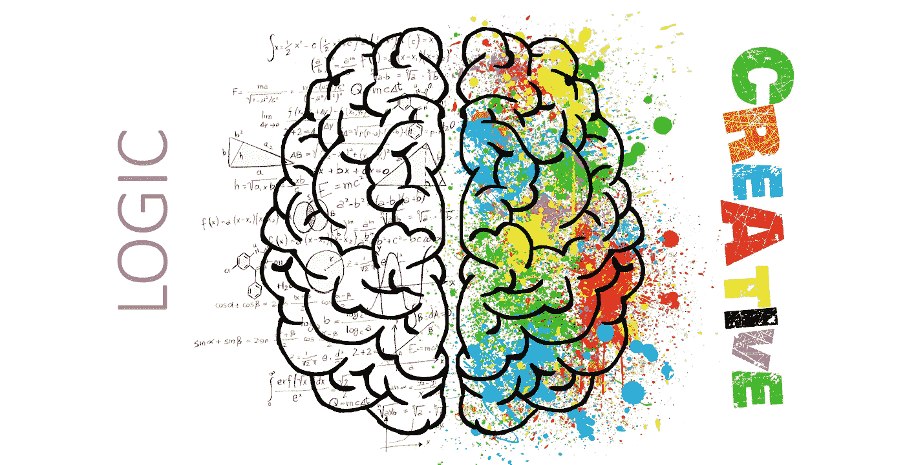

# 用这 45 门数学课程成为更好的程序员

> 原文：<https://medium.com/hackernoon/be-a-better-programmer-with-these-40-mathematics-courses-d8ca48a2f8a2>

## 成为数学和编程专家的终极课程和书单

Photo by [ElisaRiva](https://pixabay.com/en/users/ElisaRiva-1348268/) on [Pixabay](https://pixabay.com/)

我们如此害怕数学。**为什么？**

因为，

> **我们害怕我们不了解的东西。**

但是为什么我们如此害怕数学呢？简单地说，这是因为我们的高中教学系统，以及在我们年幼时可供学习的资源非常少。我看到许多朋友在高中时不理解并害怕数学，但当他们进入大学时，他们开始喜欢上了数学。

数学是我们生活中必不可少的一部分。我们每天都需要它，在我们的日常活动中。但是当你是一名程序员或问题解决者时，你最需要的是数学。因为数学只是让一个人更有逻辑，更有创造力，更聪明。

要成为一名更好的程序员，你必须至少了解一点离散数学、线性代数、微积分、概率、密码学、几何学和统计学。

这就是为什么我为你创建了这个列表。这样你就可以开始用数学的方式思考。所以不要浪费你的时间，从下面的列表开始学习数学吧

> **更新:我已经按照从初级到中级再到高级的顺序排列了这个列表，并确定了从哪一个开始学习(在所有部分中排在第一是最重要的学习)**

**Youtube**

1.  [高等数学入门](https://www.youtube.com/watch?v=CMWFmjlB8v0&list=PLZzHxk_TPOStgPtqRZ6KzmkUQBQ8TSWVX&index=1)(高中学过高等数学就过了)
2.  [线性代数的本质](https://www.youtube.com/playlist?list=PLZHQObOWTQDPD3MizzM2xVFitgF8hE_ab)
3.  [无穷和，分数](https://www.youtube.com/watch?v=YuIIjLr6vUA&list=PLmNp3NTX4KXJFp1ZriGTVeVvX0k5N88Qq)由[数学家](https://www.youtube.com/channel/UC1_uAIS3r8Vu6JjXWvastJg/playlists)
4.  [图论](https://www.youtube.com/watch?v=59aljcwo7aw&list=PLa6IE8XPP_gnJkQ9xeimi1sFHg7Y6UBA6)由 [PBS 无限级数](https://www.youtube.com/channel/UCs4aHmggTfFrpkPcWSaBN9g/playlists)
5.  [密码学](https://www.youtube.com/watch?v=NOs34_-eREk&list=PLa6IE8XPP_gmVt-Q4ldHi56mYsBuOg2Qw)由 [PBS 无限系列](https://www.youtube.com/channel/UCs4aHmggTfFrpkPcWSaBN9g/playlists)
6.  [数字](https://www.youtube.com/watch?v=_GkxCIW46to&list=PLmNp3NTX4KXIxmyNoDh2j6lsrzIQwp72S)由[数学家](https://www.youtube.com/channel/UC1_uAIS3r8Vu6JjXWvastJg/playlists)
7.  [量子计算机](https://www.youtube.com/watch?v=IrbJYsep45E&list=PLa6IE8XPP_gnot4uwqn7BeRJoZcaEsG1D)由 [PBS 无限系列](https://www.youtube.com/channel/UCs4aHmggTfFrpkPcWSaBN9g/playlists)
8.  [概率](https://www.youtube.com/watch?v=63HHmjlh794&list=PLa6IE8XPP_gn38VzeGHeQg18HOWczFqme)由 [PBS 无限级数](https://www.youtube.com/channel/UCs4aHmggTfFrpkPcWSaBN9g/playlists)
9.  [魔方](https://www.youtube.com/watch?v=yhPH1369OWc&list=PLmNp3NTX4KXKfyWehUDI1aEkmBTyybtNm)由[数学家](https://www.youtube.com/channel/UC1_uAIS3r8Vu6JjXWvastJg/playlists)

**在线课程**

1.  [代尔夫特大学预科微积分](https://www.edx.org/course/pre-university-calculus)(如果你在高中学过微积分就通过了)——6 周(每周 6-8 小时)
2.  加州大学圣地亚哥分校离散数学入门(初学者)——24 周(每周 2-5 小时)
3.  [麻省理工学院微积分 1A:微分](https://www.edx.org/course/calculus-1a-differentiation-mitx-18-01-1x-0)(初学者)——13 周(每周 6-10 小时)
4.  [麻省理工学院微积分 1B:集成](https://www.edx.org/course/calculus-1b-integration-mitx-18-01-2x-00)(中级)——13 周(每周 5-10 小时)
5.  [德克萨斯大学奥斯汀分校的线性代数—前沿基础](https://www.edx.org/course/linear-algebra-foundations-to-frontiers#!)(中级)— 15 周(每周 6-10 小时)
6.  斯坦福大学的密码学 1 (初学者)——6 周(每周 2-3 小时)
7.  [麻省理工学院(初学者)的《概率介绍——不确定性科学](https://www.edx.org/course/introduction-probability-science-mitx-6-041x-2)——18 周(12 小时/周)**或**
8.  [哈佛概率入门](https://www.edx.org/course/introduction-to-probability-0)(中级)— 7 周(5-10 小时/周)
9.  [杜克大学的数据科学和数学技能](https://www.coursera.org/learn/datasciencemathskills)(初学者)——4 周(每周 3-5 小时)
10.  [斯坦福大学和不列颠哥伦比亚大学的博弈论](https://www.coursera.org/learn/game-theory-1)(初学者)——8 周(每周 2-3 小时)
11.  [斯坦福数学思维入门](https://www.coursera.org/learn/mathematical-thinking)(中级)——9 周(10 小时/周)
12.  [程序员数学](https://www.pluralsight.com/courses/math-for-programmers)通过 Pluralsight(付费)(中级)— 5 小时 16 分钟
13.  [伦敦帝国理工学院的机器学习专业化数学](https://www.coursera.org/specializations/mathematics-machine-learning?newQueryParams=%5Bobject+Object%5D#faq-list)(初学者)——15 周(每周 3-4 小时)
14.  [微积分 1C:坐标系和无穷级数](https://www.edx.org/course/calculus-1c-coordinate-systems-infinite-mitx-18-01-3x-0)麻省理工学院(中级)(如果你想了解更多微积分知识)
15.  [麻省理工学院多变量微积分](https://ocw.mit.edu/courses/mathematics/18-02sc-multivariable-calculus-fall-2010/index.htm)(中级)(如果你想了解更多微积分知识)

**博客**

1.  [教程点](https://www.tutorialspoint.com/discrete_mathematics/)
2.  麻省理工学院开放课程软件的数学
3.  [计算机编程的艺术](https://en.wikipedia.org/wiki/The_Art_of_Computer_Programming)
4.  [数理统计](https://en.wikipedia.org/wiki/Mathematical_statistics)
5.  [数理统计导论](https://www.onlinemathlearning.com/statistics.html)
6.  [坐标几何](https://www.tutorialspoint.com/coordinate_geometry/index.asp)
7.  [欧几里得几何](https://en.wikipedia.org/wiki/Euclidean_geometry)
8.  [笛卡尔坐标](https://www.mathsisfun.com/data/cartesian-coordinates.html)
9.  [保罗的在线数学笔记](http://tutorial.math.lamar.edu/)

**书籍**

1.  [数学 Wikibooks】](https://en.wikibooks.org/wiki/Subject:Mathematics)
2.  [离散数学及其应用](https://www.amazon.com/dp/0072899050/?tag=stackoverflow17-20)
3.  [具体数学:计算机科学的基础](https://www.amazon.com/dp/0201558025/?tag=stackoverflow17-20)
4.  [计算科学的范畴理论](http://www.math.mcgill.ca/triples/Barr-Wells-ctcs.pdf)
5.  [图形和游戏开发的 3D 数学入门](https://www.amazon.com/Math-Primer-Graphics-Game-Development/dp/1568817231/ref=sr_1_1?ie=UTF8&qid=1440610325&sr=8-1&keywords=3d+math+primer)
6.  [坐标几何简介](http://www.amsi.org.au/teacher_modules/pdfs/Introduction_to_coordinate_geometry.pdf)
7.  [欧几里得几何](http://www.mathcentre.ac.uk/resources/uploaded/euclidean-geometry-october-final.pdf)

**在线练习**

1.  [黑客排名](https://www.hackerrank.com/domains/mathematics)
2.  [可汗学院](https://www.khanacademy.org/)
3.  [项目欧拉](https://projecteuler.net/)
4.  [统计与概率](https://www.khanacademy.org/math/statistics-probability)可汗学院
5.  [欧几里德几何教程](http://www.gbt.org/geo.html)

就像你刚刚读到的😀👌？这对你有用吗👍？请保持鼓掌(👏)按钮给我 50 个掌声👏对于这篇文章。❤

**我的个人博客**

孟加拉语版—[https://with.dibakar.me/](https://with.dibakar.me/)

英文版—[https://with.dibakar.me/](https://with.dibakar.me/)en/

你可以在上关注我😁—

https://www.facebook.com/dipu.dibakar 脸书

Twitter — [https://twitter.com/iamdibakardipu](https://twitter.com/iamdibakardipu)

Instagram — [https://www.instagram.com/dibakardipu/](https://www.instagram.com/dibakardipu/)

Github — [https://github.com/dibakarsutradhar](https://github.com/dibakarsutradhar)

Linkedin — [https://linkedin.com/in/dibakardipu/](https://linkedin.com/in/dibakardipu/)

谢谢❤

Dibakar Sutra Dhar。