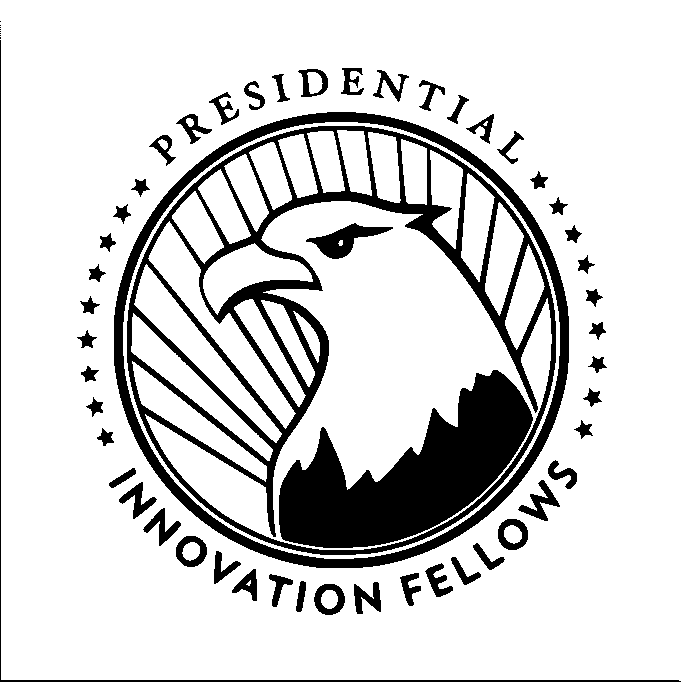

# 成为总统创新研究员

> 原文：<https://medium.com/hackernoon/be-a-presidential-innovation-fellow-864c3ea3adea>

Logo of the Presidential Innovation Fellows

总统创新研究员(pif)很棒，他们正在招聘。

这些研究员是政府内部创新的先锋，专门负责为美国联邦政府内部的巨大问题创造创新的解决方案。你在华盛顿特区待了一年，作为一个由 15 到 25 人组成的团队的一员，每个人都试图在技术上，有时在政策上，尤其是技术政策上，引领国家这艘航船。

申请是有竞争力的，薪酬也是如此。你不需要有很好的资历，但你必须是一个影响力迷。你必须做好准备，愿意并有能力在抵制变革的庞大官僚机构中推动变革。我相信太平洋岛屿论坛领导层致力于在 2018 年招募一个多元化和性别平衡的班级。

总统创新研究员的主要工具是开放性和灵活性。这意味着开源软件，与用户一起公开设计，如果发现有意义，愿意迅速改变路线，使用敏捷和精益的软件开发方法，对政策保持敏捷，最重要的是，通过原型化解决方案以身作则，如果没有你的鼓动，官僚机构可能会错过。

你们很多人可能会问:为特朗普政府工作道德吗？我说它是，如果你作为一个人这样做。研究员没有极端的审查或忠诚度测试。虽然标题中有“总统”一词，而且这个词很重要，但在我的奖学金期间，我从未与奥巴马总统共处一室，尽管我经常去白宫，而且我很珍惜那封由他的自动笔签名的感谢信，我把它镶在了我的床边。你可能不会参与任何高层政治，万一你被要求做什么令人讨厌的事情，你可以辞职。

无论你如何看待当前的政策，政府必须继续发挥作用，因为它为美国人民做了我们个人做不到的事情。我们不能让一艘船浮起，建造一个太空探测器，帮助我们的退伍军人，保护权利法案，或者作为个人管理我们的国家公园。政府的存在是为了确保所有人自由的祝福，它涉及日复一日的苦干和计算机编程，也涉及崇高的语言和立法。没有技术创新者的脚踏实地，联邦政府将会远远落后于技术曲线，并逐渐下降，也许会停止。

以下是研究员将在 2018 年解决的问题(复制自[申请页面](https://www.presidentialinnovation.org/events/2018/5/7/deadline-to-apply-for-the-2018-pif-cohort)):

*   我们如何帮助退伍军人事务部提供更多以退伍军人为中心的服务和护理？
*   我们如何利用创新来帮助在国内自然灾害中更好地提供人道主义援助？
*   国防部如何更好地与创业公司合作，以获得创新和新兴技术，并解决关键的国家挑战？
*   我们如何帮助国家癌症研究所更好地将癌症患者与拯救生命的临床试验相匹配？
*   我们如何通过美国国立卫生研究院的“我们所有人”研究项目创建世界上最大的研究群体，从而显著改善健康结果？
*   我们如何帮助美国农业部为农民提供更好的端到端服务？
*   我们如何帮助国务院更好地分析和解释复杂的全球数字和社交媒体环境，并帮助他们的同事更好地与世界各地的人们联系？

如果你是一个火球；如果你想有所作为；如果你能改变心灵和思想；如果你喜欢建造原型；如果你喜欢在编码或写作中以身作则；如果你想报效国家而不参军；如果你想加入一个有所作为的团队，[在 6 月 24 日之前申请](https://apply.pif.gov/)成为总统创新研究员(注:原定的 6 月 3 日截止日期已延至 24 日)。