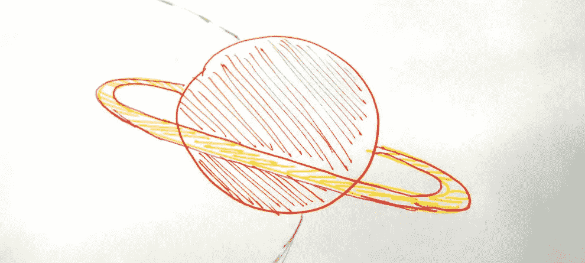
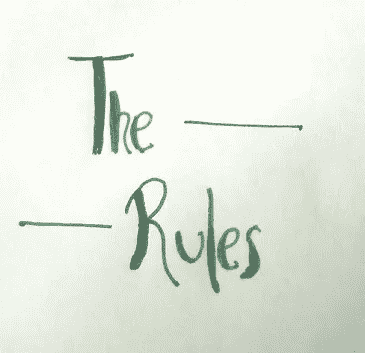
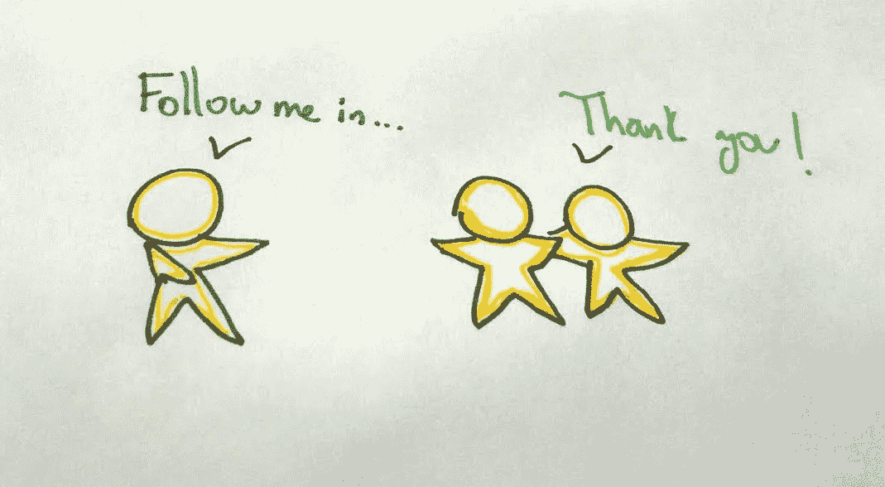
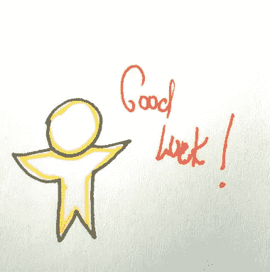

# 做一个科技老师，发现新的星球！

> 原文：<https://medium.com/hackernoon/be-a-tech-teacher-discover-new-planets-9e05af5a9fb7>

It’s a planet

*Lizbeth 是一名软件开发人员，她每天都在工作、家庭和英语课(Lizbeth 的星球)中度过，但是有一天，她在脸书上看到一份关于该市一项重要技术活动的出版物，该活动的组织者希望找到参展商来教授一些* [*技术*](https://hackernoon.com/tagged/technology) *主题。她想参与，她认为与像她一样的其他开发人员分享很棒，但她有一个问题，她害怕在公共场合讲话，即使她不能回答他们在她讲话结束时给她的问题，这可能是她第一次也是最后一次教别人。*

首先，教是最好的学习方式。我记得我第一天作为参展商参加利马的技术活动，我很紧张，也有点尴尬，但渐渐地我变得自信了。现在，我想分享并给你一些想法，让你从 fireworks 开始，这是你第一次作为参展商参加技术活动，你可以分享你热衷的东西。

**一个不可思议的开始:**

你的听众带着期望来到礼堂/教室，每个人都期望今天能学到一些东西。在技术活动中，有讲座和研讨会，在这两种情况下，我建议你开始提问来打破僵局，有来自远离城市的吗？这是你第一次参加活动吗？有多少不是技术职业？，是一些例子。当然，你会有不同于听众的关注点，但这将有助于你在接下来的几分钟里对你要去见的人更有信心。

我曾经告诉过你，对我来说到达活动的地点是多么困难，但是一切都是计划好的，以了解每个人，我可以分享超级大新闻和/或一些令人惊讶的公告。

**说规则:**

如果你愿意，在幻灯片中，提到问题将在[演示结束时提出](https://hackernoon.com/tagged/presentation)可以帮助你在解释主题时不打断你的灵感。当他们向你解释某件事的时候，如果你有很大的好奇心，你会举手，如果说话人允许的话，这很好。在某些情况下，你将有很短的时间来解释一个话题，所以在你的演讲后，你的问题和你的参与者的好奇心将会得到更好的解决和理解。

**一张图纸胜过千言万语:**

我们想解释代码行，但可能屏幕或投影仪对您的观众来说不太清楚，特别是对那些不是技术职业但想听的人，因为您启发了他们。用图表描述环境，你将帮助哪些人和哪些事应用那些技术、编程语言、工具等等。你将赋予展览主题一个特殊的目的，此外，你将留下好奇心，对这个主题进行更多的研究。

**与你的观众保持联系:**

你第一次演讲的 30 或 45 分钟，或者接下来的时间，是令人难忘的。保留已经共享的幻灯片和链接，以便稍后查看。此外，你最活跃的社交网络是你的第一批学生，在那几分钟里，你和他们都学到了很多东西，并且很可能想了解你的内容和课程。

最后，在每次演讲后，听到“谢谢你”是一种巨大的喜悦，因为在学校或大学当老师可能需要时间写论文或文件，但有机会在一次活动中免费教一群人，和你一样渴望知识，这简直太棒了，这让你一天都很开心。

准备好迎接新的行星了吗？我邀请您加入您所在城市的技术社区，享受并向他人学习:)

