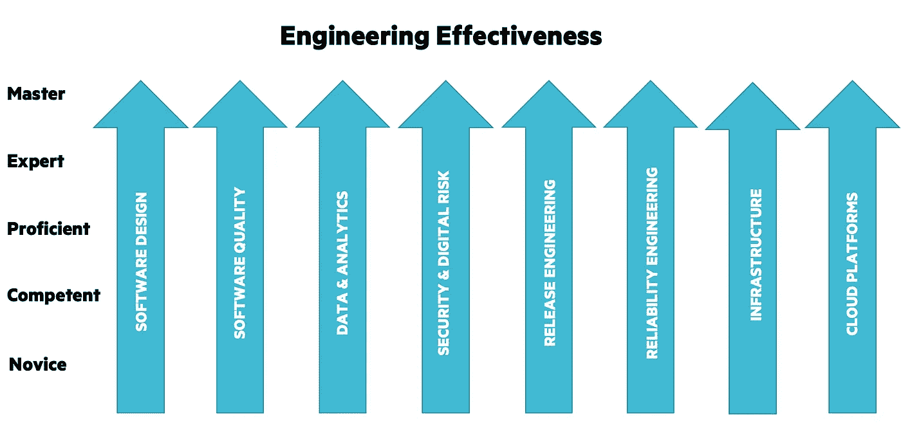

# 成为最快的，而不是第一个

> 原文：<https://medium.com/hackernoon/be-the-fastest-not-the-first-9fc53242d8b7>

你知道第一个突破 100 米十秒大关的人吗？不太可能。你知道世界上跑得最快的人吗？很有可能——是乌塞恩·博尔特。你可能会说，这是一个最近和频率的事情，导致了对伟大的牙买加人的名字的回忆，但这也是因为他 ***是***——而不是第一个。

The fastest man in the world. Source: REUTERS / Kai Pfaffenbach

最近的历史充满了这种伟大的例子；

*   史蒂夫·乔布斯/苹果公司在 PARC 施乐公司看到了第一个图形用户界面，并对其进行了改进
*   微软超越了 Lotus 和其他生产力工具
*   谷歌作为搜索引擎胜过 Altavista，AOL 和 Yahoo！
*   脸书超过了 Friendster 和 MySpace 等。

这样的例子不胜枚举。从 20 世纪中期到现在，由于技术发展的速度，先发优势几乎是无关紧要的。现在，响应/灵活/适应的能力也远远超过率先上市的能力。几乎在任何垂直领域，它都导致了在位者被以极快的速度篡夺，整个行业被颠覆，公司雇佣枪械/忍者/摇滚明星/ [成长](https://hackernoon.com/tagged/growth)任何事情来更快地行动，更好地适应或简单地抄袭市场上的其他产品。

然而，保持这一优势的关键在于[工程](https://hackernoon.com/tagged/engineering)。

工程以其他部门的雇员所不具备的方式进行扩展和授权。这就像复利，当你发现时已经太晚了。这就像是一连串的龙舌兰酒，在预定的时间后击中了你的家，抹去了你脸上的笑容。工程是一个很难衡量其效率的元角色。问十个拥有十种不同技能的人什么是好的工程，你可能会得到十个不同的答案。对我来说，这是一个能够衡量它，改进它，然后展示它的功效的旅程，它可以归结为专注于八个不同的主题

Engineering effectiveness — get expert+ in these 8 and you’re onto a good thing

随着时间的推移，如果你能在这八个主题上不断进步，这意味着你可以带着速度 ***和*** 信心前进。马克·扎克伯格以“快速行动，打破常规”的口号而闻名(除了其他事情……)，但这并不适用于每个人——打破关键的东西是制造噪音和客户流失的最佳方式。

下次你参加招聘讨论/战略会议/组织结构图讨论时，看看投资的去向，试着理解回报。客户服务/法律/人力运营/财务部门的人可能会消除瓶颈。销售人员可能会达成更多交易。但是，工程领域的某些人可以自动完成平凡的工作，并创造出从中长期来看能提供指数回报的解决方案。简而言之，要成为最快的，你需要你能得到的最好的工程组织。

没有它，你可能只是历史上的另一个名字。

更多见解请查看 [Carsguide/Autotrader 工程博客](http://engineering.carsguide.com.au)。