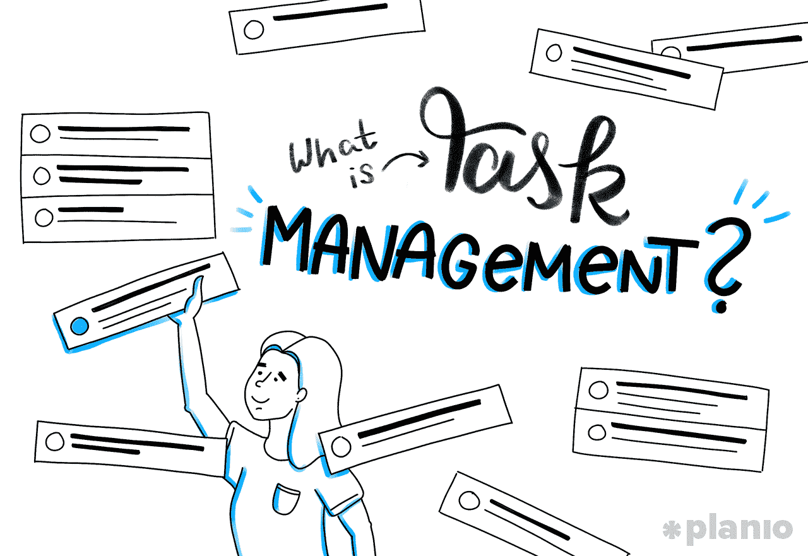
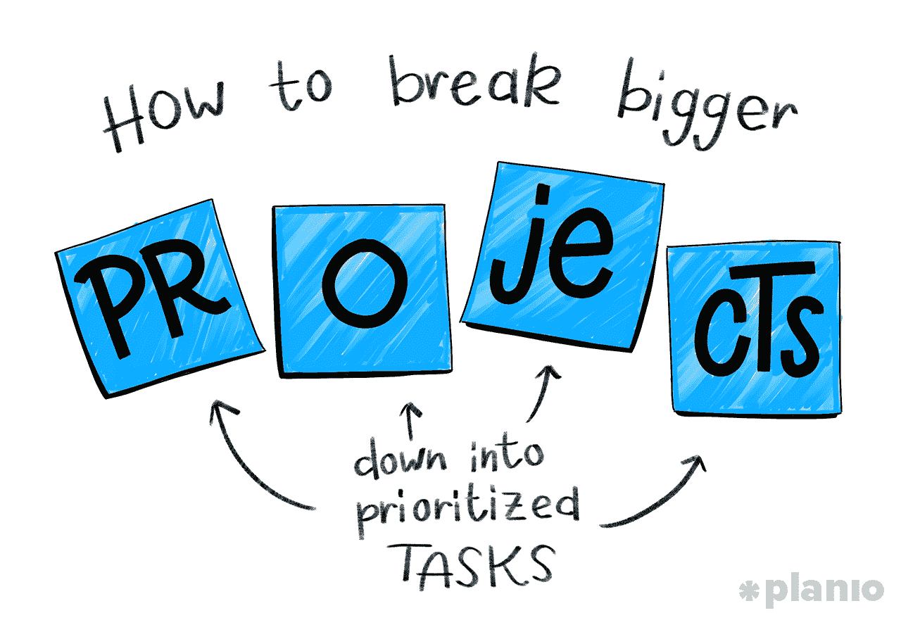
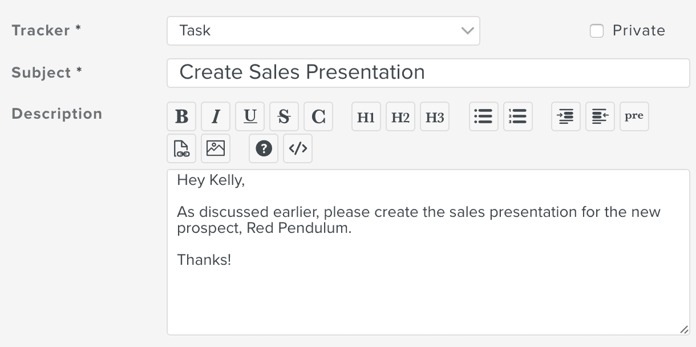
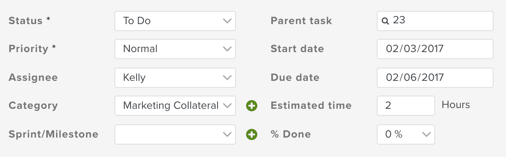
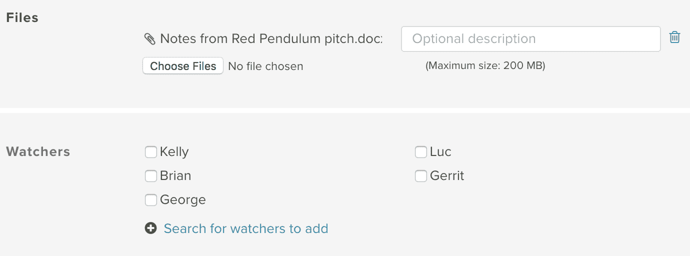
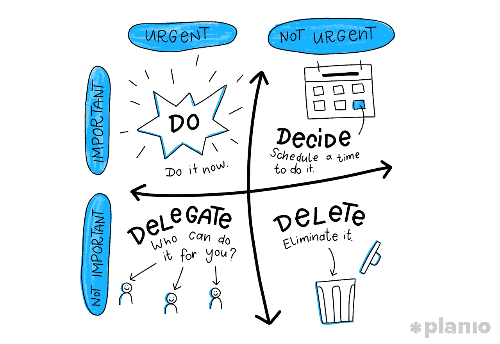
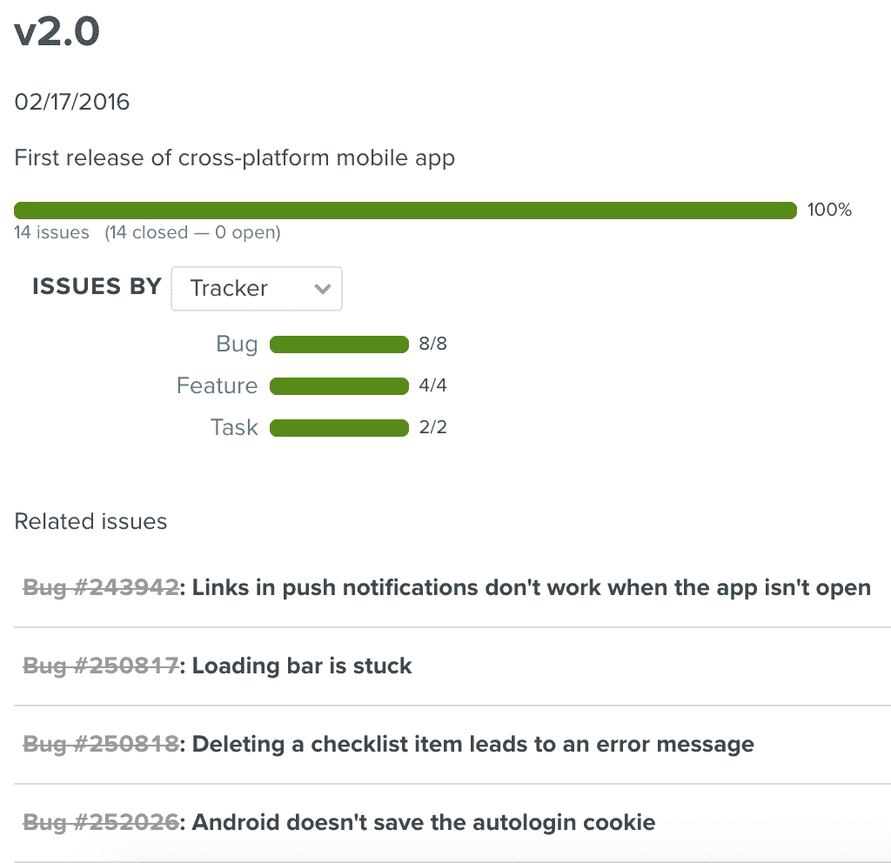
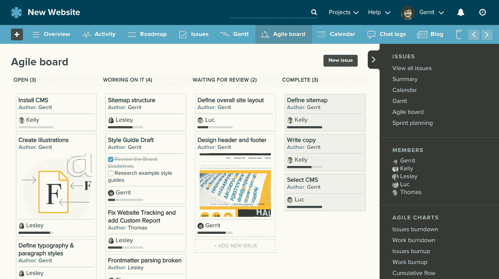
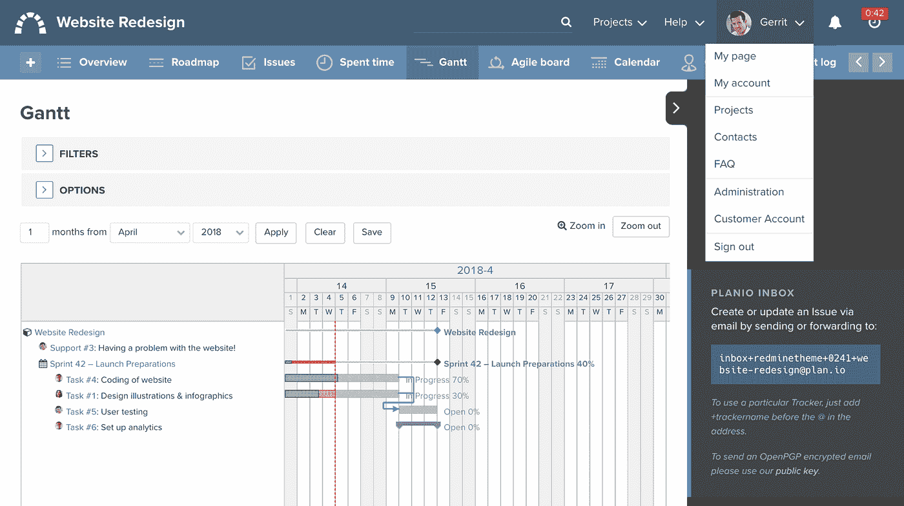

# 打破“混乱的中间状态”:如何将任何项目分解成(可操作的)任务

> 原文：<https://medium.com/hackernoon/beating-the-messy-middle-how-to-break-any-project-down-into-actionable-tasks-f9e155f4812f>

## 任务就其定义而言是微小的。但是他们给你和你的团队带来的回报是巨大的。

管理任何项目最困难的事情之一就是处理混乱的中间环节。当你完成的时候，你可能会想象出*应该是什么样子，并且知道你现在在哪里。但是到达那里呢？可以肯定地说，即使是最好的团队也会迷失方向。*

幸运的是，有一个简单的工具可以引导你的团队穿过混乱的中间环节:**任务管理**。

任务是清晰的、描述性的、一步一步的指令，而不是庞大的、模糊的、不清楚的项目目标。通过将项目的每一部分分解成一个详细的任务，你可以更好地了解如何实现它。否则，就像在不知道拼图是什么样子的情况下试图去做一样。

在这篇文章中，我们将带你了解你需要知道的关于任务管理的一切，从它到底是什么，到最适合你的团队的方法，你需要什么工具，以及如何组织、优先化、委派和跟踪任务。

# 首先，什么是任务管理？

任务管理[是一个非常简单的想法](https://plan.io/task-management/)。但是简单并不总是意味着容易。

从最基本的形式来看，**任务管理是在任务的整个生命周期中管理任务的过程——从计划、测试、跟踪到结果报告。**

任务管理包括管理任务的所有方面，从它的状态和优先级，到它需要的时间、人力和财政资源。

当你和一个团队一起工作时，适当的任务管理是高效工作的基础。任务管理工具和技术为您提供了一个项目所有活动部分的详细和最新的视图。它有助于团队中的每个人保持同步、高效和按计划工作。

作为一个额外的奖励，将项目和里程碑分解成具体的任务会是一个巨大的动力。

当研究人员特蕾莎·阿马比尔和史蒂文·j·克莱默研究了让伟大团队成功的所有因素后，他们发现

> “在工作日所有能提升情绪、动力和感知的事情中，最重要的是在有意义的工作中取得进展。”

任务管理让您和您的团队看到进展。就像牛顿第一运动定律告诉我们的那样，一旦你的团队开始行动，就更容易让他们继续前进。

# 你应该使用什么任务管理软件？

在组织、分配、跟踪和报告任务时，一个强大的任务管理工具或软件是你最好的朋友。

它不仅可以将您的所有信息保存在一个对整个团队可见的地方，而且还可以让您看到您的任务和项目进度，以及您可能在哪些地方超量使用资源。

有很多选项供您选择，但我们专门构建了 [Planio](https://plan.io/) 作为一个灵活、可定制、易于使用的任务管理工具(内置于更广泛的[项目管理工具](https://plan.io/blog/best-project-management-tools-used-by-top-technical-teams/))。

Planio 让您遵循项目和任务管理的最佳实践。因此，尽管我们在本指南中将它作为一个例子，但我们所说的方法可以应用于任何适合您的系统和工具。

如果你想为你的团队试用 Planio，你可以在这里注册 14 天的免费试用。

# 任务管理最佳实践

那么，现在我们明白了为什么任务管理对项目的运行如此重要，那么实际上最好的方法是什么呢？

任务管理的基础是获取、组织和分配完成项目所需的一切。你能提前获得的细节越多，就有越多的人知道需要做什么。

当涉及到[项目管理](https://plan.io/blog/how-to-manage-a-project/)时，唯一重要的方法是对你的团队有效的方法。因此，虽然这个指南会给你开始正确管理任务所需要知道的一切，但一定要尝试一下，看看你的团队喜欢什么或不喜欢什么。

# 组织任务:如何将较大的项目分解成优先任务

任何项目，无论大小，都只是一系列的小步骤。

在任务管理中，你需要做的第一件事就是把所有这些步骤收集在一起。此时，不要担心将它们组织成任何顺序(我们将在下一步讨论)。现在，我们关心的是把所有东西都拿出来。

我们指的是*一切*。

成功的任务管理的关键是清晰地规划每一步。否则你可能会错过一个步骤，最终走上错误的道路。更好的是，通过将你所有的任务集中在一个位置(就像你的[项目管理软件](https://plan.io/))，你大大减少了大脑的认知负荷，并且能够更加专注于需要做的事情*现在*。

# 如何在一个地方捕获所有任务

该是我们解决这个问题的时候了。混乱的中间状态在项目中如此困难的原因是因为大多数时候你实际上并不知道所有需要完成的任务是什么！

但是没关系。有一些技巧可以帮助你梳理出构成你的项目的许多任务:

1.  **从结尾开始，做一次头脑风暴:**有时候从结尾开始比从头开始更容易。想象一下你完成的项目。现在，需要采取什么步骤才能实现这一目标？从高层次开始，向后发展。在思维导图上形象化你此时的任务可能会更容易。这就是你在一张纸上或白板上写下每一步，然后把它们分解成实现目标所需的更小的步骤。
2.  让你的团队参与进来，看看你错过了什么:不要试图凭空想出所有的任务。你的团队将完成这些任务，所以如果你错过了什么，他们可能会有一个很好的主意。一旦你完成了高层次的方法，让他们来帮助填补漏洞并提出问题。
3.  **将多步任务分解成单步任务:**此时，你还需要确保没有太多大任务(或“小项目”)。这里的目标是创建可操作的任务。如果一项任务感觉太大，就把它分解。它的所有组成部分是什么？每个人都应该有自己的任务。
4.  **将任务分成里程碑:**有些任务放在一起很有意义。创建一个里程碑是一个很好的方法，可以让你更详细地了解每一步，并衡量你的进展。我们将在后面详细介绍如何创建里程碑，但是从一开始就将任务分成有意义的类别是一个好主意。在 Planio 中，您可以通过**设置→里程碑**将任务分配给具体的里程碑。这样，您可以在**路线图**选项卡中快速查看您的进度。
5.  **问专家:**如果你正在进行一个全新的项目，你和你的团队可能会自然地错过一些必须发生的关键事情。如果可以的话，请一位以前经历过这个过程的专家来让你知道你的任务列表是否看起来不错——或者至少，在你的下一次团队会议上一起[讨论，并就可能的最佳分解达成小组共识。](https://plan.io/blog/planning-and-running-fast-efficient-meetings/)

# 每个任务应该包括哪些信息？

每个单独的任务都应该足够详细，任何人看了都知道需要做什么，有多重要，什么时候到期，谁在做。你的任务管理软件应该给你所有这些选项(甚至更多)。

在 Planio 中，你只需按下左上角的 **+按钮**就可以创建一个新任务。填写任务时，从基本信息开始，如**任务主题**和**详细描述**:

接下来，详细介绍任务**状态**、**优先级、任务负责人**(即负责人)**类别、里程碑、开始和完成日期、预计时间、**和**进度:**

最后，你应该附上任何**支持文档和文件**，以及选择其他**队友，他们应该被告知任务的变化**或进展:

如果你不能马上完成所有这些，不要担心。但是目标是让每一项任务都非常清楚地知道正在做什么，谁在做，以及什么时候完成，这样你的整个团队都可以看到项目的需求。

# 如何正确区分任务的优先顺序

你不能只看着你的大清单，就认为你知道下一步该做什么。相反，每项任务都需要正确地划分优先级，以知道需要发生什么来保持项目顺利进行。但是这并不容易。

有些任务的优先级自然会高于其他任务。但是也会有一些模糊的问题让你感到困惑。你需要从定义你要优先考虑的范围开始。类似于:

按时按预算完成项目。 [**同**](https://plan.io/) **。**

或者，你可以选择一个编号系统(如果你有更多的优先级)。那可能是:

*   第一亲代
*   P2
*   P3
*   P4
*   依此类推……(P1 是最高优先级)

当谈到实际分配任务的优先级时，最好的方法之一是使用类似艾森豪威尔盒子的系统，它根据重要性和紧迫性对任务优先级进行分类。

在这种情况下，您可以将最高优先级的任务分配给紧急和重要的任务。你的第二高评价是重要，但不紧急。第三高到紧急，但不重要。最低优先级为不紧急不重要。

如果仍然感觉你的任务没有完全优先化，或者你有太多紧急和重要的任务，你可以进一步分解它们。

一种方法是在每个类别的中对*进行优先级排序。假设你给每个类别分配了一个字母，A 是最高优先级，D 是最低优先级。在每个字母类别中，您可以分配一个编号的优先级。所以 A1 将是你最优先的任务，而 A24 仍然比 B1 优先。*

这听起来可能有点复杂，但是[你想在这里设定的目标](https://plan.io/blog/goal-setting-exercises/)，是让你的任务(和你的优先事项)超级清晰，这样每个人都知道应该先做什么。

# 协作:分配任务、估计时间和安排项目

随着你庞大的优先任务列表准备就绪，是时候开始分配它们了，看看你是否有资源让项目按时完成。

在这一步，你将开始更好地了解你所有的任务是如何组合在一起的，以及你可能在哪些方面过量投入了时间或资源。

# 如何估计每项任务需要的时间

我们已经完成了艰难的工作，决定需要做什么，并将每项任务分解成最小的部分。所以我们*应该*能够准确地估计出每一部分需要多长时间。

但是，如果您正在处理全新或不熟悉的任务，您可以使用一些技巧:

1.  **估计时间并使用时间表:**有些任务——尤其是创造性的任务，比如写作、设计和编码——你给他们多少时间就花多少时间(心理学家称之为帕金森定律)。在这些情况下，限制任务的时间是很重要的。在 Planio 中，你可以包含每项任务的“估计时间”,然后将其与实际花费的时间进行比较。你可能会离开，但你会更好地理解某些类型的任务需要多长时间。
2.  为不熟悉的任务建立缓冲区:如果你是第一次做一项任务，你需要从猜测它需要多长时间开始。然而，过于低估时间会给整个项目带来额外的压力。这就是为什么在你的任务管理中建立时间缓冲很重要。通常情况下，您会希望添加 x1.5，即您以前没有做过但对如何完成这些任务有很好的想法的任务的估计时间。x2 是看似可行但需要研究如何实际完成的任务的估计时间。
3.  **询问专家:**就像你可以请专家来帮助你创建任务一样，他们也是帮助你估计时间的一个很好的来源。问问做过类似工作的人，他们用了多长时间。每支球队都是不同的，你必须考虑到你的队友和技术水平。但是这应该给你一个估计任务时间的好起点。

# 使用你的时间估计来准备你的时间表和分配资源

重要的是要记住，时间估计只是猜测。

你可能会在前进的道路上遇到一些障碍，你的估计可能会完全不正常。但是估算任务时间的目的不仅仅是向你的老板展示一个项目需要多长时间。这也是为了看你对单个团队成员投入了多少。

一旦你完成了第一遍，看看你分配给某人的任务和时间估计。(您可以在 Planio 中按任务负责人筛选任务！)

这合理吗？

您是否有需要移动或重新分配资源来帮助他们的地方？

任务管理不仅仅是有一个庞大的任务列表要做，而是以最有意义的方式平均分配它们，并确保项目能够真正完成。

# 跟踪:将任务分组为里程碑，并从头到尾管理任务状态

一旦你真的在做你的项目，任务管理变得更加重要。

你需要知道团队成员应该做什么，每项任务的状态，以及将来会发生什么，需要你的关注。这意味着将任务分组以查看项目的里程碑，然后使用任务管理方法来跟踪进度。

# 如何将任务分解成里程碑

里程碑仅仅是任务的集合，代表你的项目正在完成的一部分。它可以是完成一个功能的编码或者重新设计一个登陆页面——任何标志着一项成就或者一大块工作结束的事情。

里程碑很重要，因为它让你从任务层面缩小视图，看到你正在取得的实际进展。如果任务是需要完成的最小可能步骤，里程碑就像巨大的飞跃。

要在 Planio 中创建新的里程碑，只需进入**设置** → **里程碑**。每个里程碑都应该有一个名字，简短的描述，并且如果你想让每个人都能看到的话，应该是公开的。然后，您可以将特定的任务、特性请求，甚至 bug 分配给这个里程碑。

所以，假设我们的里程碑是发布一个移动应用程序。在下面的例子中，我们已经创建了我们的里程碑，我们可以看到有 14 个问题和任务分配给它。它们都已经完成了！

里程碑是跟踪任务状态的好工具。但是它们也非常有利于保持注意力和提高动力。为了充分利用你的里程碑，你应该确保它们:

1.  **具体:**每一个里程碑都应该有适当的范围和描述。
2.  **可实现且及时:**应该有一个你认为可以实现的开始和结束日期。
3.  **渐进式:**里程碑应该建立在彼此的基础上。一旦一个完成，它应该是 100%完成，下一个应该是 100%可行的。
4.  重要:不要把里程碑做得太小，否则你的项目看起来会比实际大。确保每一个里程碑的结束都让人感觉你已经完成了项目的相当一部分。

# 选择跟踪里程碑、任务进度和任务状态的方法

有很多方法可以管理你的任务和里程碑，这样你就可以腾出更多的时间去追求其他有意义的公司目标，比如建立合作关系或者为你的企业创造更多的商机。最终，什么最适合你，将取决于你的团队规模、项目的复杂程度以及你的最佳工作方式。

一些任务管理系统更加灵活和可视化(比如看板)，而另一些则更简单(比如你的基本任务清单)。

我们假设你正在和一个团队一起工作，这个项目需要比简单的待办事项清单更多的可见性。这意味着您应该考虑一些任务管理方法:

## 看板法

看板是一种可视化的任务管理方法，任务被定义在“卡片”上，然后在板上从左到右移动通过每个阶段。这可以是简单的“去做”、“正在做”、“完成”或者分解成你需要的任何阶段。

下面是 Planio 中的[看板板](https://plan.io/blog/kanban-boards-the-psychology-of-cards/)的样子:

看板的伟大之处在于，它让你对你需要完成的所有任务以及它们的状态有了一个快速的总体概述。你会看到所有的任务、截止日期、进度和任务状态。唯一的缺点是，因为任务细节包含在卡片中，所以细节有时会丢失。

## 甘特图

大型项目通常适合于阶段或里程碑，其中一些任务需要在其他任务之前完成。在这种情况下，使用甘特图是组织任务的好方法。

[甘特图](https://plan.io/blog/using-the-gantt-chart/)已经有 100 多年的历史了，它是一种很好的方式来可视化你的所有任务，当它们到期时，谁在做它们，看看你需要多少资源，并监控进度。

同样，Planio 允许您为任务快速创建甘特图，如下所示:

甘特图非常有用，因为它可以让你快速地看到里程碑和相关的任务，看看进展如何，谁有太多的事情要做。它们也是一种查看项目依赖性的强大方法(例如，“在 Jon 做 Y 之前，我不能做 X”)。

然而，如果你有一个包含大量任务的非常复杂的项目，它们会变得有点混乱和难以理解。

# 调整:如何调整任务(当你的情况改变时)

没有一个项目会完全按照计划进行。但这正是任务管理如此神奇的原因。

当你对需要完成的所有事情都有了深刻的理解，并能在一个中心位置将它们可视化时，你就有更好的机会看到问题何时可能出现并做出相应的调整。

情况变了。一个队友可能会辞职或者需要休息一段时间。或者一些新的用户研究可能会改变你的项目范围。见鬼，你的公司甚至可能会转向！在所有这些情况下，你可以使用你的任务管理系统来评估情况，调整，并回到正轨。

当事情发生变化时，下面是让你的任务管理发挥最大作用的一些最终建议:

*   **始终拥有项目的完整视图:**无论是通过看板、甘特图还是其他方法，总是能够缩小视图并获得项目的完整视图是值得的。当您正忙于一个项目时，任务视图非常有用。但是花太多时间在小细节上(尤其是作为项目经理)会让你只见树木不见森林。定期后退一步，重新评估你的任务优先级、里程碑和项目的整体流程，并评估即将到来的变化会如何影响它。
*   **积极主动地看待并适应优先级的变化:**任务优先级的重要性怎么强调都不为过。当你说某件事很重要，或者 A1，或者你正在使用的任何任务优先级系统，你是在为你的团队设定路径。但这并不总是意味着这条路是正确的。积极主动地寻找潜在的优先权转移。与其他经理或团队领导交谈。Planio 还可以让你根据优先级和其他标准过滤任务。你越能分清轻重缓急，你的团队就越有效率。
*   始终能够将任务与项目和公司目标联系起来:就像最后一点一样，将任务与项目和公司目标联系起来是一种罗盘检查，以确保你仍然走在正确的道路上。我们过去曾经写过 OKRs 的力量，这次也没有什么不同。确保任务尽可能符合公司目标。
*   **将那些没有被积极处理的任务从直接关注中移除:**任务管理是关于那些不存在的和存在的。如果一项任务由于优先级的改变而不再相关，那就把它处理掉。在一块板上(或图表上)有太多的任务会给你的团队增加不必要的认知负担。你想让他们看到进步，感到有动力。不要被没完没了的任务所困扰。

任务就其定义而言是微小的。但是他们给你和你的团队带来的回报是巨大的。

花时间将任务分解成最小的部分，无情地对它们进行优先排序，并找到一个给你可见性、灵活性和意识的任务管理软件(如 Planio ),你就能把那个巨大、可怕、大胆的项目变成一个可行的、一步一步的计划。

# 嘿，我是乔里！

*我帮助公司和有趣的人通过聪明和专注的写作讲述他们的故事。想一起工作吗？在 hello@jorymackay.com 给我发邮件*

*这篇文章的一个版本最初发表在* [*Planio 博客*](https://plan.io/blog/what-is-task-management/) *上。查看更多关于项目管理、建立远程团队和创业成功的文章和实用技巧。*