# 通过 Alexa 成为 AWS 认证开发人员

> 原文：<https://medium.com/hackernoon/become-aws-certified-developer-with-alexa-44a565012765>

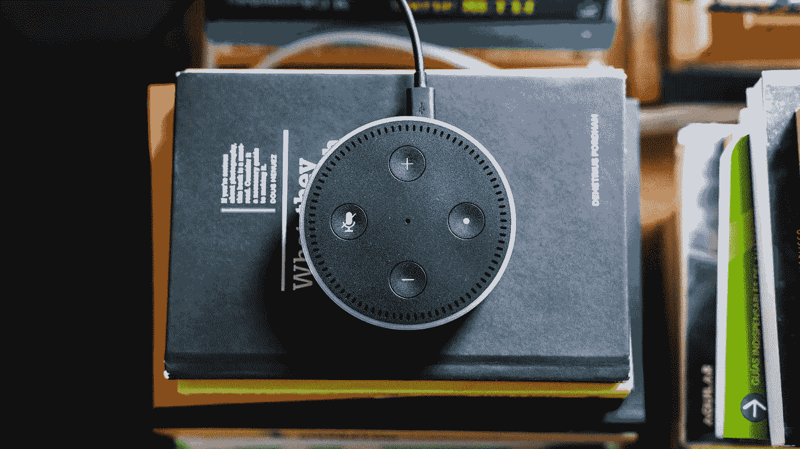

获得 AWS 认证可以促进你的职业发展(增加你的薪水，找到更好的工作或获得晋升),并使你的专业知识和技能具有相关性。因此，准备 AWS 认证开发人员助理考试最好的方法就是亲自动手，用 **Alexa Skill** 和 **AWS Lambda** 制作一个无服务器的问答游戏。

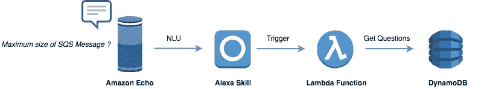

How it works ?

注:所有代码都在我的 [GitHub](https://github.com/mlabouardy/alexa-aws-cda) 中。

**1 - DynamoDB**

首先，使用 **AWS CLI** 创建一个 **DynamoDB 表**:

我提前准备了以下 **AWS 服务**的问题列表:

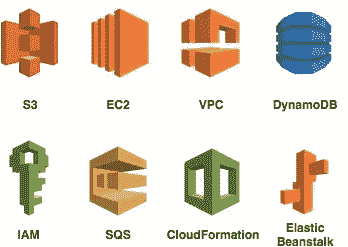

接下来，将 **JSON** 文件导入 DynamoDB 表:

*insertToDynamoDB* 函数使用 **AWS DynamoDB SDK** 和 *PutItemRequest* 方法将一个项目插入到表格中:

执行以下命令导入问题:

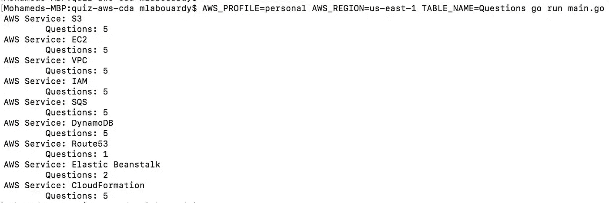

如果您导航到 **DynamoDB 仪表板**，您应该会看到问题列表已经成功插入:

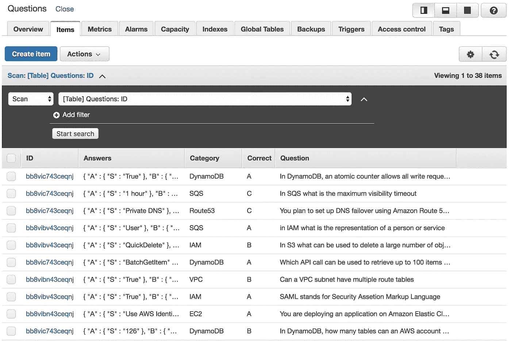

**2 — Alexa 技能**

通过将用户说的与测验互动的短语与**意图**联系起来，这就是将所有这些联系在一起的原因。

对于不熟悉 **NLP** 的人来说。Alexa 基于 NLP 引擎，这是一个分析短语(用户信息)并返回意图的系统。意图描述了用户想要什么或者想要做什么。这是他的信息背后的意图。Alexa 可以通过将消息的例子归因于一个意图来学习新的意图。在幕后，引擎将能够预测意图，即使他以前从未见过它。

所以，注册[亚马逊开发者控制台](https://developer.amazon.com/)，创建一个新的自定义 Alexa 技能。按如下方式设置调用名:

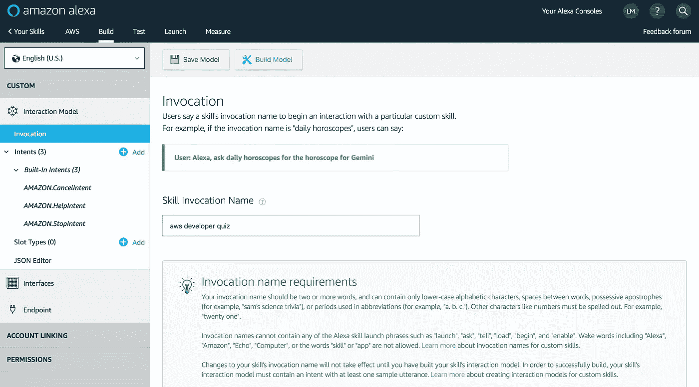

为开始测验创建一个新的**意图**:

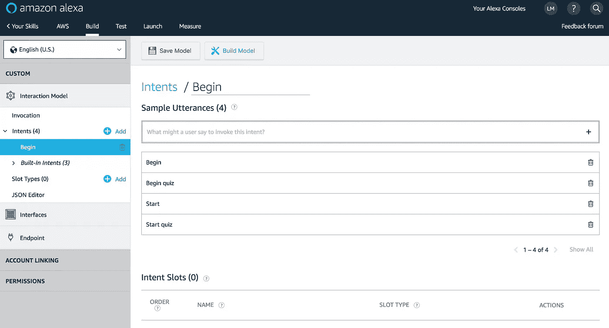

添加一个新的类型“**插槽**”来存储用户选择:

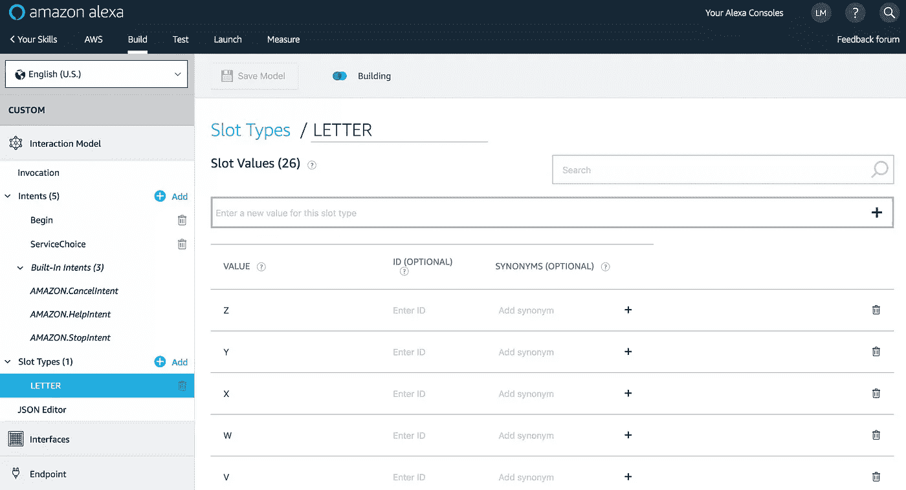

然后，为 AWS 服务选择创建另一个意图:

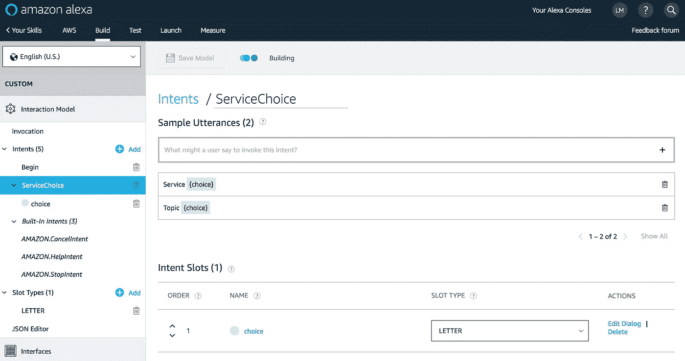

对于用户的答案选择:

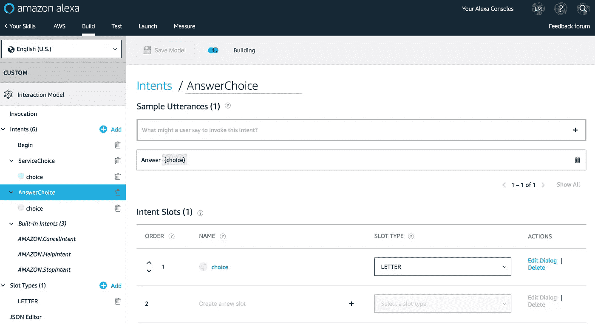

保存您的交互模型。然后，你准备好配置你的 **Alexa 技能**。

**3—λ函数**

Lambda 处理函数是自解释的，它将每个**意图**映射到一个代码片段。来记录用户的分数。我们使用 Alexa *sessionAttributes* 属性的 JSON 响应。然后，会话属性将通过*会话的*对象中的下一个请求 JSON 传递给您。使用 **AWS SDK** 和 **SSML** (语音合成标记语言)从 **DynamoDB** 中检索问题列表，用于使 **Alexa** 说出以问号结尾的句子作为问题或在语音中添加暂停:

注意:完整代码在我的 [GitHub](https://github.com/mlabouardy/alexa-aws-cda) 中。

登录 [AWS 管理控制台](https://console.aws.amazon.com/console/home)，在 **Go** 中从头开始创建一个新的 Lambda 函数:

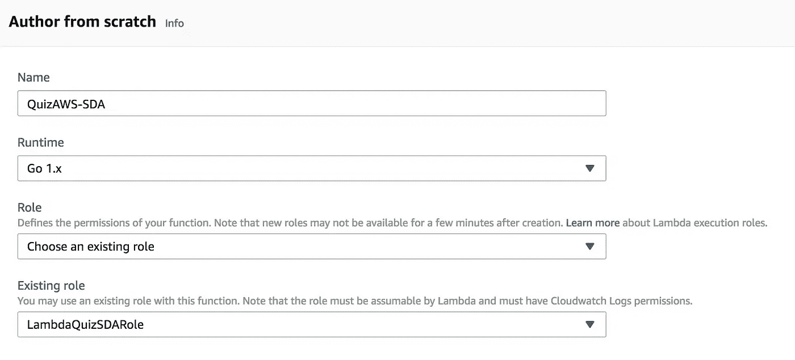

为该职能分配以下 **IAM** 角色:

生成部署包，上传到 Lambda 控制台，将 **TABLE_NAME** 环境变量设置为表名:

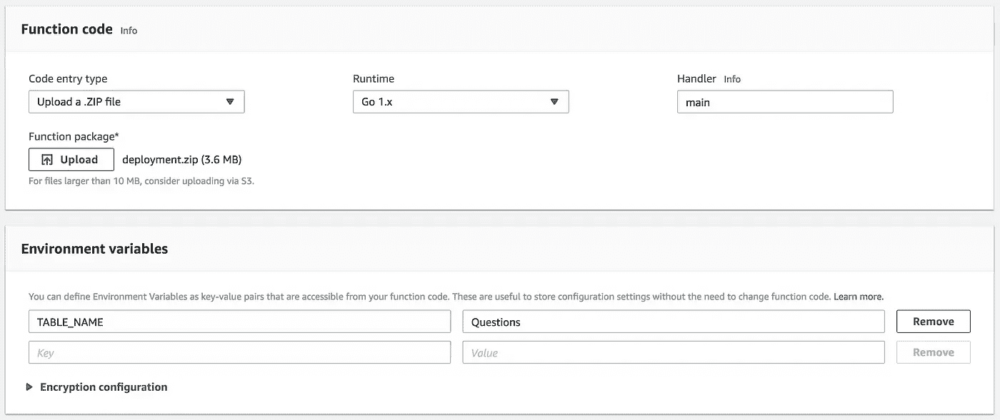

**4 —测试**

既然您已经创建了函数并把它的代码放到了适当的位置，那么是时候指定如何调用它了。我们将通过将 **LambdaARN** 链接到 **Alexa 技能**来实现这一点:

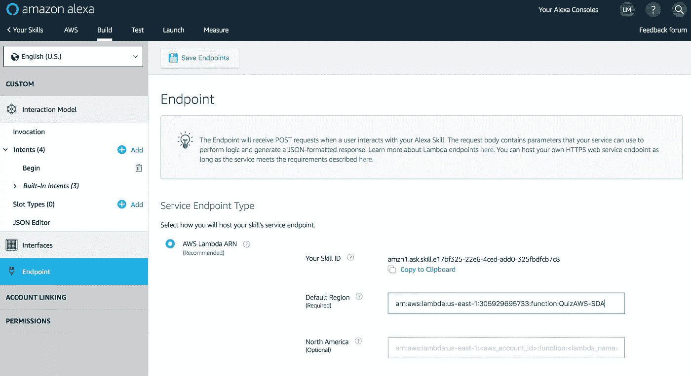

信息准备就绪后，点击**保存端点**。你已经准备好开始测试你的 Alexa 新技能了！

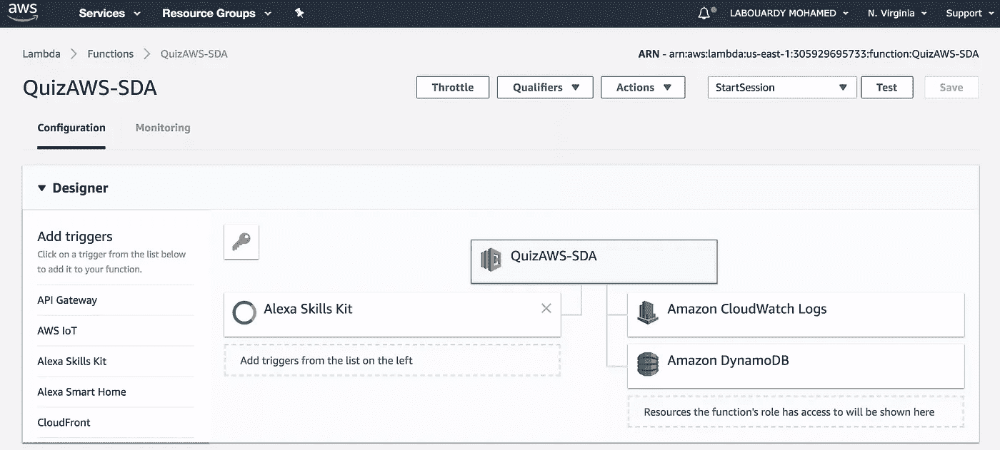

要测试，你需要登录 **Alexa 开发者控制台**，从“**测试**”标签中开启你技能的“**测试**”开关:

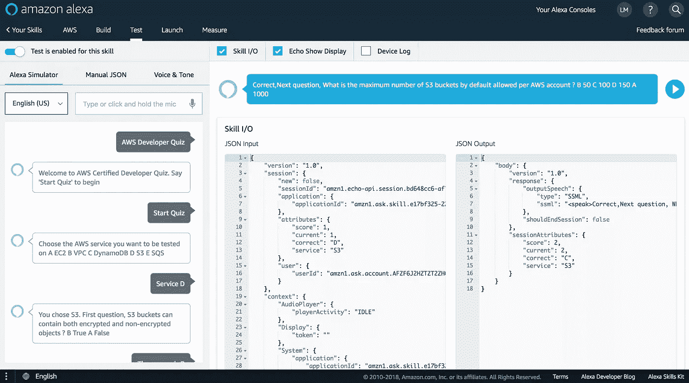

或者使用支持 Alexa 的设备，如**亚马逊 Echo** ，说“ *Alexa，打开 AWS 开发者测验*”: