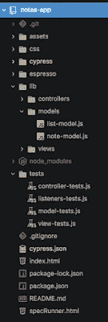

# 成为快捷键大师——Chrome 和 Atom(第 2 部分)

> 原文：<https://medium.com/hackernoon/become-the-shortcut-master-chrome-and-atom-part-2-c866150caa7>

这是这篇[文章](https://hackernoon.com/become-the-shortcut-master-the-mac-and-terminal-part-1-80793d8df033)的延续，这篇文章包含了一些使用 mac 和终端的非常棒的快捷方式。在第二部分中，我们将看看如何使用 [Chrome](https://hackernoon.com/tagged/chrome) 浏览器和 Atom。

# **铬合金**

还有很多其他优秀的网络浏览器，但 Chrome 似乎是最受欢迎的，因为它的用户友好性和它允许开发人员使用的开发工具。

**多标签、少标签、多标签！2010 年以上用户最常见的行为之一是我们喜欢打开成千上万的标签页。我曾经也打开过大量的标签，主要是为了“保存它们”以便以后阅读，但最终发现这只是一厢情愿的想法，而且几乎永远不会发生。**

Saving our 100 tabs for “later”

不管怎样，用 **Apple + T** 打开一个新标签，用 **Apple + W** 关闭一个标签。不是故意关那个的？用**苹果+ Shift + T** 挽回你的错误！或者，你可以 **Apple + Y** 转到一个新标签页，上面有你的历史记录，并找到你以前去过的页面。

**来回**——我喜欢使用键盘快捷键的一个原因是，你可以得到按键被按下的实际物理响应作为确认。当鼠标点击 GUI 按钮时，你得不到确认，比如有时我会尝试点击后退或前进，但什么都不会发生，我会问我是否正确点击了位置，尤其是是否有滞后或延迟响应。按下**苹果+【**或**苹果+左箭头**返回上一页，反之按下**苹果+】**或**苹果+右箭头**前进。

Quick navigation with opening and closing and switching tabs

使用**苹果+【数字】**快速滑动到标签页。这将使您转到该标签，只要它在 1 和 9 标签之间。我不知道如何快捷更多的标签。你可以用**控制键+ Tab 键**在标签之间向前移动，用**控制键+ Shift+ Tab 键**向后移动，但对于 MAC，我认为这很少使用，因为三个按钮都在左侧，很难同时按下。

**对于开发者来说！——**你知道吗，每个 Chrome 浏览器都有一个 Javascript“终端”？只需点击 **Apple + Alt + J** 即可调出。你可以尽情享受。我经常使用这个控制台，特别是当我查找一些东西的时候，我可以马上尝试。

Open the Javascript console for a quick and easy sandbox right there in your web browser!

使用 **Apple + Alt + I** 调出元素控制台。这是每个前端开发者的梦想！在这里，它允许您在页面上摆弄 HTML，以及 css 样式。在这种模式下，你可以点击 **Apple + Shift + C** 进入检查模式，允许你指向页面上的任何元素进行检查。

使用 **Apple + R** 重新加载，使用 **Apple + Shift + R** 硬重新加载，查看您的工作。

# **原子**

Atom 是迄今为止最受开发人员欢迎的 IDE 文本编辑器。Atom 有很多有用的快捷方式来提高您的项目效率。关于 Atom 最酷的事情之一是你可以下载软件包到它上面，这些软件包会有不同的特性来帮助你。我将从一些我发现对我来说编程时必不可少的包开始；

**安装包**

要安装软件包，请转到 Atom/preferences(或 **Apple +，**)并点击 install 选项卡。然后在搜索框中记下软件包的名称，然后单击安装按钮。

原子漂亮器(Atom-prettle)，这是为了帮助你纠正林挺错误。林挺是关于你的代码格式是如何编写的，确保你所有的空格是正确的，括号是匹配的。

**括号突出显示**'(atom-Bracket-highlight ')—这个包帮助突出显示代码中匹配的括号，更容易看出哪些与哪些匹配。您可以按下 **Control + M** 将光标切换到匹配的支架。

Puts boxes around matching brackets, use Control + M to toggle the curser between them

这也是一个好主意，显示缩进线，这将有助于您看到匹配的括号。转到 Atom/preferences 或 **Apple +，**编辑器标签，然后向下滚动并点击“显示缩进指南”选项将其打开。

Indent guides help you see which brackets are matching

**高亮选择**(‘高亮选择’)—在你高亮显示的单词周围放一个漂亮的方块，同时高亮显示所有其他相同的单词。

Highlights a word, and all other matching ones automatically

**文件图标**(‘文件-图标’)—在目录树中为你的文件类型添加漂亮的图标。

Awesome automatic recognition of icons for easy reading!

**在浏览器中打开**(‘在浏览器中打开’)—添加一个选项，当右键单击树目录中的文件时，可以在浏览器中打开您的 HTML 文件。出于某种原因，这个特性在 Atom 中没有出现，原因很奇怪，因为它似乎真的很有用。然而，这就是 Atom 的开源方式，人们可以为这些东西创建包，所以它变成了一个东西！

Why is this feature not part of Atom by default?

# **原子快捷方式**

我发现的一些快捷方式非常有用，以至于我对我不知道它们感到非常恼火，因为我确信它们会节省大量的时间，尤其是在重复复制和粘贴的时候！

**多光标编辑【Apple+D】**—双击一个单词将其高亮显示，然后按 **Apple + D** 以高亮显示该单词下面的下一个实例，重复该操作以高亮显示下面的更多单词。然后删除它或根据需要进行编辑。这将在这些位置创建多个光标实例，以便您可以同时编辑多个位置。点击**苹果+点击**可以让你在你点击的地方添加光标。

Apple + D creates new cursors at the matching word highlighted

**全部复制！【苹果+Shift+D】**—突出显示您想要复制的内容，点击**苹果+ Shift + D** ，它将复制并粘贴到它的下方！它还会复制光标所在的行/段，根本不需要任何高亮显示。

Apple + Shift + D copies and pastes a line underneath it

**动起来！【苹果+控制+箭头方向】** —你知道你可以上下左右移动东西而不需要剪切和复制吗？这在移动代码时非常有用，并且有助于调试以了解发生了什么。

Apple + Control + Arrow Direction moves the highlighted text in that direction

**全部找到！【Apple+Shift+F】**—大部分人都知道 **Apple + F** 可以帮你在页面上找东西，但是有时候你可能想跨多个页面找东西。这就是**【苹果+Shift+F】**的伟大之处。这使得重命名所有的变量/函数或者简单地在多个文件中找到它们变得更加容易。

**隐藏/查看文件树【Apple+】**—您可以使用此快捷键隐藏侧面的文件树，以获得更多的[编码](https://hackernoon.com/tagged/coding)空间。

# 自定义快捷方式

我想创建两个快捷方式，一个用于上面的“在浏览器中打开”包，另一个用于切换 markdown 预览以查看我的。md 文件应该是这样的。

为此，请访问 Atom/Preferences 或 **Apple +。**，然后是按键标签。我输入在浏览器中打开，按照建议把图标复制到键盘映射文件中。当你把它粘贴进去时，它看起来像这样。重启 Atom 应该就可以了。

我将我的设置为 **Apple + Shift + O** 以便在浏览器中打开，因为这样容易记忆。你的光标必须在 HTML 文件中才能工作。

类似地，我将降价预览切换设置为**苹果+ Shift + M** 。

My own custom created shortcut that toggles the Markdown preview

好吧，我想我被抄近路了！我可能忘记了更多。如果你们有什么好的，请写在下面的评论里！希望这能让你成为一个更高效的开发者！