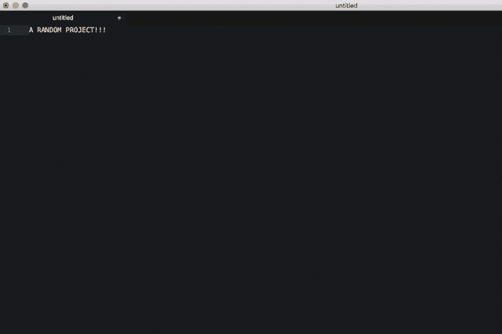

# 成为快捷键大师 Mac 和终端(第 1 部分)

> 原文：<https://medium.com/hackernoon/become-the-shortcut-master-the-mac-and-terminal-part-1-80793d8df033>

我想写这篇文章已经有一段时间了，主要是因为我预计我可信赖的 2011 Macbook Air 现在随时都会没电。我确实更换了旧电池，旧电池充电 30%就没电了，现在更换者说我需要再换一次…

# **优化上瘾者**

我是个瘾君子。我就是控制不住自己，总是试图改进事情。它总是在我的脑海里。当它成功的时候，这可能是很棒的，但是大多数时候这是一个很烦人的干扰。就像昨天一样，没有任何真正的原因，我决定花几个小时更换我房间的家具，而我已经列出了当天要做的其他事情。

How much time could you save using keyboard shortcuts? Also, you would look cool and get extra swag points! :P

当涉及到[编码](https://hackernoon.com/tagged/coding)或者仅仅是在电脑上工作时，这些[优化](https://hackernoon.com/tagged/optimisations)是值得的，尤其是如果你要经常使用这些动作的话。像学习触摸打字这样的事情真的可以节省你很多时间，看到老一辈人用他们的两个食指 p-r-e-s-s [ *看着屏幕检查拼写错误*e-a-c-h[*再看一遍* ] l-e-t-e-r [ *看着错误，删除整个单词并重新开始*，我感到很痛苦。

说到 MAC，我花了一些时间来决定是否应该使用桌面滑动。最后我决定它不适合我，我发现我会打开 3 或 4 个不同的 Chrome 浏览器，每个都有 20 个标签，有点疯狂地试图跟踪什么去了哪里…

所以现在，我用的是 Apple + Tab，尽量保持最少的桌面。但是我们将会看到它是如何发展的，因为在工作中，我可以肯定地看到有很多时候多屏幕是必要的。

这也有助于我的左手几乎总是在苹果键上，大多数快捷键都可以用左手完成，触摸板靠近我的拇指。这实际上比使用鼠标手势和/或设置屏幕的角来切换 [expose](https://support.apple.com/en-gb/HT201741) 中的标签更快。

Using custom keyboard shortcuts whilst playing my poker games! Really me back in the day!

我记得在网上玩扑克的时候一次玩 18 张桌子，或者也喜欢玩有超高 APM 的星际争霸 2，但是真的一点也不擅长这个游戏，因为它大部分是垃圾邮件和没有用的命令！我想我的偏见可能来自于这样一个事实，当你不断使用快捷键切换窗口时，看起来很酷，看起来很酷，想象你是一些酷的控制论未来黑客总是胜过一切！(开玩笑的:P)。

# **养成习惯！**

使用捷径可能会很困难，但它会在以后带来回报，所以重要的是你要让自己这样做。在 msn messenger 时代，我强迫自己在不看键盘的情况下打字(谁还记得呢？好吧，冷静下来美国在线用户耶耶你们甚至更老的地方…)。即使我的打字不是完美的“五指”正式风格，(我用食指敲空格键)，我仍然学会了自己的方法，让自己触摸打字，这是非常有用的。

Starcraft 2 players were notorious for having high APM (Actions Per Minute) to control a huge number of things during their gameplay.

话虽如此，但在向自己介绍新的优化时，记得一点一点地添加东西，否则会太令人不知所措。做事敏捷的风格！

# **MAC 密钥命名错误**

关于**苹果键**的一个小提示。我认为苹果官方希望人们称这个为**命令键**，但是出于某种原因，他们保留了苹果方形圆形角的符号。如果是这样的话，我不知道他们为什么还留着它，要么有一个，要么有另一个。

我更喜欢说苹果键，因为 Command 不仅和 Control 这个词相似，而且 Command 和 Control 实际上是相邻的，只有一个键。

The Apple Key symbolized by the Apple logo, or that curly square, AKA The Option Key… not confusing at all lol

那把钥匙被称为 **Alt 键**但更愚蠢的是也被称为 **Option 键**，这不是印在钥匙上的，只是一些怪异的二到一车道的道路符号而已。

当谈到试图让非技术用户尽可能少地困惑时，他们真的搞砸了，出于某种原因，他们坚持这样做。

为了方便起见，我将使用**苹果键**和 **Alt 键**。

# **苹果电脑**

**撤销[Apple + Z]，重做[Apple+Y]**——大部分苹果程序都会默认这个。这很好，因为它应该帮助你不要太害怕尝试，知道你总是可以回滚和/或重新回滚。这是最好的学习方法！老式的 skool 计算机(即我父亲的老式 8 英寸软盘计算机)的时代已经一去不复返了，一个错误的命令就可能导致大范围的崩溃。

**切换窗口【Apple+Tab】/【Apple+Backtick】**—注意，这不是一个单引号，这是一个 back tick，它是一个键，在 left shift 和 z 之间，你从来没有见过或使用过。如果你有多个浏览器窗口或 Atom 编码窗口，并且不想将它们合并在一起，但仍然能够在它们之间快速切换，这非常有用。不幸的是，在这里使用反勾号会干扰媒体编辑，所以我不能在这里显示它。

Alt Tabbing combined with Alt Backticking! Honestly, how is Yahoo surviving I literally don’t know anyone who uses it!

**其中 TF 是 Delete [fn +退格或 Control + D]和#键[Alt + 3]？**——我听到的关于使用 MAC 电脑的最常见的抱怨之一是它们确实错过了一些按键。删除在 Windows 中很常见，这就像是删除单词的反向退格方式。这可以通过使用最左下角的功能键和退格键或 control + D 来完成。

出于某种原因，苹果讨厌 twitter，所以即使在 windows 上这是在主键盘上，在 mac 上这甚至没有 shift 键切口！同样，苹果键、功能键和 alt 键这些不同的控制键让新用户更加困惑。

**用【Apple+back space】**Bin——有时候文件需要尽快删除。用鼠标框住你的一堆物品，点击快捷键，用令人满意的声音最大限度地节省时间。

**用【苹果+空格键】**搜索——苹果的搜索栏可以很快，特别是当你的手已经在键盘上的时候。只需点击苹果+空格键，输入你的文件夹/文件/应用程序，你就可以立即打开它。

# **端子**

我建议使用 iTerm2 作为你的终端，然后按照这篇博文*来修改它。*

*这也将允许很酷的功能，比如当你开始输入一个名字时，它会尝试并猜测它，这意味着不再需要输入“cd”。*

*这个 [***页面***](https://github.com/0nn0/terminal-mac-cheatsheet) 是牛逼的给终端找快捷方式。*

***转到句子**的开始[Control + A / Function +左箭头]或结束[Control + E / Function 右箭头]——在 Makers 的课程中，我看到我们在终端中做的最常见的事情之一是写下一个长句子(通常是一条提交消息)，然后意识到有一个打字错误，然后不得不用光标将其移回到开头。你不能用鼠标跳到那里，这真的很烦人。该死，只需要几秒钟的谷歌搜索…*

*ZSH shell 允许你使用 [***快捷键进行 git***](https://github.com/robbyrussell/oh-my-zsh/wiki/Cheatsheet) 。这可以为你节省很多时间，因为作为高质量的程序员，我们总是得到我们的代码，对不对？？；)*

**

*Blue colours show where you currently are, yellow/green show you git status and what branches your working on!*

*我常用的有:*

*   *Git Add All — **gaa***
*   *Git 提交消息—**GCM[消息]***
*   *Git 推送— **gp***
*   *将上面的 3 个链接起来，如果一个失败，那么其他的将会停止— **gaa & & gcm【消息】& & gp***
*   *可爱颜色的 Git 状态— **gss***
*   *Git 创建分行— **gcb【分行名称】***
*   *Git 查看所有分支— **gba***
*   *Git Pull — **gl***
*   *从分支提取 git—**ggl[分支名称]***

*我对终端的摆放位置做了很多改动，起初我把它放在另一个屏幕上滑动，然后我一直在尝试把位置设置在右边，然后永久放在底部。然而，我的同事向我展示了这篇非常棒的 [***博文***](https://marcjenkins.co.uk/drop-down-terminal-with-iterm2/) ，讲述了如何使用热键(我使用了 Control +空格键)让它弹出(或者按你的喜好关闭)。*

**

*The terminal pops up and then slides downwards when and only when you need it!*

*我知道在 Atom 中有一个选项可以找到一个把你的终端放在底部的包，但我喜欢我的自定义 ZSH iTerm2 窗口，不仅仅是因为 ZSH 快捷方式，还因为它可以清晰明亮地显示你的 git 状态，这是我真正想要的。*

***下周** **— Chrome 和 Atom 快捷键。**祝你们这周过得愉快，现在享受一些奇怪代码带来的困惑吧！——[https://www.destroyallsoftware.com/talks/wat](https://www.destroyallsoftware.com/talks/wat)*