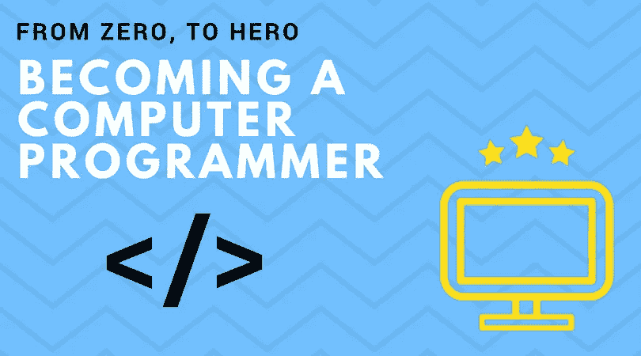

# 成为计算机程序员——未来的工作

> 原文：<https://medium.com/hackernoon/becoming-a-computer-programing-the-job-of-the-future-6f6182ad244f>

电脑。它们现在似乎无处不在。环顾四周，你可以看到许多被认为是计算机的东西。韦氏词典将计算机定义为*“一种可编程的通常是电子的设备，可以存储、检索和处理数据”*。例如，你现在正在电脑上阅读这篇文章，也许你看了一些电视，甚至你吃的食物很可能来自一个工厂，机器由，你猜怎么着，一台电脑控制。现在，所有这些与“T2 未来 T3 的工作”有什么关系呢？好吧，请允许我说一下。

# 电脑正在取代我们

我们经常看到这种情况，但我们可能并不知道。当我们去杂货店时，大多数杂货店都有自助结账台，你可以自己做收银员的工作。过去都是手工完成的。你现在也可以在任何地方看到信息亭，它做着人类曾经做过的工作。虽然我们可能看不到这一点，但工厂正在转向机器人，以更快、更便宜的方式完成工作，结果，许多人被甩在身后，失去了工作。

我提到的只是冰山一角，还有更多的工作被电脑取代，但展望未来，让我们想想几年内可能不存在的工作。比如公共交通。不是所有人都坐火车或公交车去上班/上学，但除此之外，你需要有人来驾驶公交车。我们目前看到像 Waymo 这样的公司，这是谷歌的自动驾驶汽车项目，目标是让所有人都能负担得起和使用自动驾驶汽车。有了这个，在不久的将来，公共汽车司机、火车司机、出租车司机或其他受欢迎的公共交通工具的操作员将被淘汰。

# 未来的工作

所以我刚才提到了所有这些信息，但是这意味着什么呢？正如你所注意到的，它们都有一个共同点，那就是它们都是由电脑控制的。和其他电脑一样，没有软件是没用的。创造伟大的软件是计算机程序员、软件工程师或任何你想称之为他们的人的工作。然而，他们都有一个共同的目标。

# 成为开发人员

计算机[编程](https://hackernoon.com/tagged/programming)非常容易理解，写起来也一样简单。例如，看看这一行 JavaScript:

> console . log(" Hello World ")；

这段代码到底是做什么的？它会记录到控制台，“你好，世界”。现在，一个人如何从一个叫“你好，世界”的应用程序变成一个像脸书或推特这样的应用程序呢？描述计算机编程最简单的方式就是一堆逻辑。如果这是真的，那就这样做，否则，就那样做。这是在“if-else”语句中完成的。

> if (2 + 2 === 4) {console.log("是真的")；} else {console.log("是假的")；}

虽然这些 if-else 语句并不难做到，但是如果您想要一些实践呢？我认为学习基础知识的一个好方法是一个叫做 Scratch 的工具。虽然 Scratch 可能看起来只是儿童使用的一个小游戏，但它是学习计算机编程基础和学习其背后逻辑的一个很好的方式。虽然 Scratch 不能给你做太高级的东西，但我还是强烈推荐它。点击查看[。](https://scratch.mit.edu/)

# 从零开始，到英雄

你刚刚学了基础知识，现在理解了计算机编程背后的逻辑，那么接下来是什么呢？现在是采取行动的时候了，开始用你选择的语言构建你的第一个应用程序。一个相当受欢迎的是 Python，然而，你可以做其他语言，如 iOS 的 Swift，Android 和其他设备的 Java，或者如果你喜欢 web 开发 JavaScript。我个人是从 PHP 开始的。要学习，有多种方法可以学习，你可以参加课程，观看 YouTube 视频，甚至自己解决问题，如果你能应对挑战的话。

## 乌德米

大多数人倾向于选择课程，而找到课程的最好的地方之一是一个叫 Udemy 的网站。我以前用过几次 Udemy，你可以在上面找到很多课程。我真的没有任何建议，但搜索*“学习【你想要的编程语言】”*，精彩的课程就会出现。点击这里查看 Udemy。

## 多元视觉

在线课程的另一个选择是 Pluralsight，许多朋友都向我推荐了它。他们提供 10 天的免费试用，但是如果你注册了 Microsoft Imagine，你可以获得 90 天的免费试用。点击这里查看 Pluralsight [，点击这里](https://www.pluralsight.com/)查看微软想象[。](https://imagine.microsoft.com/)

## 您附近的球场

如果网络课程不是你的菜呢？如果是这样的话，那就四处看看，一些社区大学提供你可以选修的课程，有时是免费的，来学习计算机编程。

虽然这些是大多数人做的一些方法，但这不是我学习如何编码的方法。我计划很快在这里发表另一篇关于我如何学习计算机编程的文章，敬请关注。

# 那现在怎么办？

恭喜你！你现在是电脑程序员了！现在让我们用这种技能来赚钱。

## 自由职业者和 Upwork

使用像自由职业者或 T2 这样的网站，你可以四处看看人们在寻找什么样的服务，这些网站上有数百个寻找计算机程序员来开发应用程序、网站和各种各样的东西的列表，只要四处看看，用不了多久你就会找到你感兴趣的工作。

## 五元

如果你更喜欢提供服务而不是让别人提供工作，那么去看看一个叫 Fiverr 的网站，在那里你可以发布一个关于你的软件开发服务技能的帖子。点击查看[。](https://www.fiverr.com/)

# 沿着这条路

一年来，你一直在研究和学习你的编程语言。通过练习创建自己的应用程序，你能够申请一份计算机程序员的工作，并开始过一种软件开发人员的生活。也许你甚至可以开自己的公司？无论发生什么，都是值得的。在你付出所有的努力之后，你可以用你创造的软件来改变世界。

# 结论

我感谢每个人抽出时间来阅读我的小文章，抱歉它有点长。对于所有打算从事计算机程序员职业的人，我祝你们好运。请与你的朋友分享这篇文章，并点击关注按钮告诉我你想要更多。

通过查看[DvlprStash.com](https://medium.com/u/3f3c003736d?source=post_page-----6f6182ad244f--------------------------------)(在这里查看)展示一些爱，他们为开发人员菜鸟或老手提供吸引力。

祝大家有美好的一天！