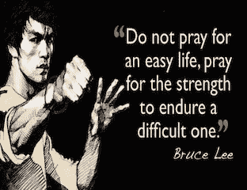

# 成为工程师:非传统的道路

> 原文：<https://medium.com/hackernoon/becoming-an-engineer-the-non-traditional-path-57eff27b9b5e>

我的博客记录了我作为一名技术人员进入硅谷的经历。我是一个有色人种的怪人，性别不合群，移民，曾被收养的年轻人。我来自一个[非传统](https://hackernoon.com/tagged/non-traditional)的编码背景。我在大学里学了几门 CS 课程，最后在成为老师之前主修了人文学科。向青少年教授 web 开发让我对编码产生了兴趣。从编程学校毕业后，我开始在旧金山的初创公司工作。我的博客一半是关于技术主题，另一半是关于平等和技术获取。

## 乐高玩具不是芭比娃娃

上世纪 80 年代，我在菲律宾长大，被自然美景、祖父母的爱和美国流行文化所淹没。在我背乘法表的同时，我在听迈克尔·杰克逊的音乐。我已经在美国的父母会给我送礼物。

我从小就是一个探险家、冒险家、建设者。我五岁生日的时候，我想要乐高玩具。相反，我的父母给了我一个洋娃娃。当时我并没有意识到这一点，但我无意中被劝阻去追求我对[工程](https://hackernoon.com/tagged/engineering)的好奇心。

## 对 STEM 的热情

在高中，我对科学、技术、工程和数学课产生了兴趣。在寄养家庭生活的时候，我打了两份工来买得起一辆车，花钱买衣服，和朋友出去玩，还有正常的高中活动。最重要的是，我在 STEM 并没有“ [**天生的天赋**](https://www.scientificamerican.com/article/is-innate-talent-a-myth/) ”。在如此繁忙的日程安排下，要做到和那些能够依靠父母提供经济支持的学生一样好是很有挑战性的。

谁说制度化的学术教育是一场公平的“竞赛”，谁就站在阶级特权一边。在我学术生涯的大部分时间里，经济困难一直困扰着我。很难接受我在大学表现不好的原因不是因为技能。我基于生存做决定，这并不总是导致学术上的成功。尽管如此，我还是做得很好，以微积分的大学学分从高中毕业，并被我申请的三所大学录取。我被一所小型私立药学院录取了。在读了 6 年之后，我本可以获得相当于药学博士学位的学位。经济上的劣势再次发挥了作用，我获得了百分之六十的奖学金，不足以支付生活费用、书籍和上学所需。这也是一个州外学校，这使得它更难找到财政援助。我把成为药剂师的梦想放在一边，去一所州立大学读药学预科。

在大学里，我继续努力，一边打两份或三份工，一边应付 16-18 个学分。我在大学一年级和二年级的大部分课程都被称为“剔除课程”。通常很少有非东亚或南亚学生的女性或有色人种。课程早在早上 7:30 或 8:00 就被安排好了，有时是在周五，大约有 200-300 名学生挤在灯光昏暗的演讲厅里。不一定是为了支持贫困学生的成功而建立的，这些学生已经怀疑自己的能力，并且还要应付多种工作/学校责任。

像我这样的学生可以获得学术支持项目。[教育机会基金](https://www.nj.gov/highereducation/EOF/EOF_Eligibility.shtml)就是一个很好的例子，除了它需要一个由于经济困难而最难牺牲和管理的东西——时间。然而，这并没有阻止我追求 STEM 的热情。我继续学习药学预科课程。我无法只专注于我的药学预科课程，因为它们已经被设置为淘汰学生，所以我最终表现很差或重新参加了这些课程。到了大三中期，我面临着一个艰难的决定，要么转专业，要么继续为 STEM 的学术成功而战。

## **另辟蹊径**

我发现自己上了英语课。确切地说是文学理论。我发现自己在分析、批判和深入思考虚构文学文本中的观点。我在新的专业上表现出色。我的班级小得多，25 到 30 人。要求不那么严格。我不得不看小说，写论文，并准备在课堂上讨论作业。然而，这些要求让我可以同时做多份工作，养活自己，并且在大学里表现出色。尽管我的生活似乎变得更好了，学业上的成功触手可及。我感到一种无法从事 STEM 职业的巨大失落感。我经常在工作面试中谈论学习 STEM。我的第一份“成人”工作是在一家非营利性医学研究机构担任行政助理。在我年轻的成年生活中，我一直带着这个被推迟的梦想和失落的痛苦，直到我成为一名教师。

## **教学是一门科学**

我厌倦了做行政助理的工作。我每天朝九晚五地上班。它让我得以住在世界上最昂贵的城市之一——旧金山。我不担心失去住所、食物和基本需求。我正在积累债务，但当时我并不认为这是迫在眉睫的危险。但是我每天都在失去我灵魂的一小部分。我觉得自己越来越不像自己了，工作没有目标，也没有投入。我对智力、批判性思维和分析的自尊开始消退。

一场巨大的悲剧让我离开了湾区，并意外地让我辞去了工作。我的父母在同一年去世。为了养家，我决定搬到佛罗里达，并在那里开始学习教育课程。我拿到了教师资格证，并申请去湾区教书。六个月后，我在奥克兰东部的一所公立高中教书，饱受社会经济衰退和帮派暴力的困扰。我知道我需要更多的训练。教学是一门科学。它既需要高水平的情商(EQ)，也需要高水平的学术知识(IQ)。当一个教室里的教与学失败时，涉及到的不仅仅是简单的自责、学生动机和环境体验。我回到学校攻读教育学硕士学位。在我任教的学校，我需要教授的知识深度要求一个优秀的老师，而不是一个新手。

与此同时，我在教室内外所做的所有学习、重复和创新都让我批判性、分析性和移情性的思维再次活跃起来。我在课堂上从不感到无聊，除了在进行标准化考试的时候。我使用了大量的技术，因为青春期的学生喜欢它，就像鱼喜欢水一样，它让我可以个性化我的课程。

在我教学的最后一年，我被要求在课外项目中教授网络开发，作为性别研究的一部分。在我教书的时候，课程激起了我的兴趣，让我兴奋不已。我在教/学技术的时候锻炼了我的分析思维。对我和我的学生来说，这是一段激动人心的时光。我们都是边做边学。那个学年结束时，我在考虑申请在湾区越来越受欢迎的编码学校，并成为一名全职软件工程师。

## 成为一名工程师

这是一个飞跃。我在大学里学过一两门计算机科学课程。我用像 Dreamweaver 这样的 WYSIWIG 工具编程。我从未上过线性代数、计算机语言的深度课程、算法和软件开发的基本概念。在此之前，我的生活也有过飞跃，但这次感觉像是奥林匹克跳远。我对编码学校很感兴趣。他们承诺教我一些技能，让我在三个月内就能在科技行业找到工作。这是真的吗？

一部分的我知道有一种“天上掉馅饼”的心态被编码训练营卖给了我。来自传统的学术背景，我知道学习/超越一门学科需要什么。我在编码学校表现很好。在我们班的 40 名学生中，我名列前 25%。不幸的是，在技术面试中，我发现我只是粉饰了软件工程的表面。从失败的面试中，我知道自己还没有做好进入科技行业的准备。

所以我参加了另一个项目。一个更长的项目 10 个月，在那里我可以拿到学习津贴。这个项目非常新颖。它没有成立，基本上是一个实验。我大半辈子都是一名幸存者/战士/茁壮成长者，我能够从中学到一些东西，并在旧金山一家初创企业的早期阶段获得了一份实习工作。

## **边做边学**

我学得很快。我被要求编写生产就绪代码，每两周发给用户一次。我是前端团队的成员，所以我致力于高影响力的功能。以这种方式学习是有益的，快速的，非常刺激的。这也是失败的一种方式——很多次。在一个如此激烈的行业环境中，我不太习惯这种迭代学习策略，经常被骗子综合症打败。三个月后，CTO 决定不把我的实习转为全职，这是一个难以面对的失败。

## 寻找成功

幸运的是，我的技术访问故事并没有就此结束。由于我的动力、职业道德、坚韧不拔的精神，以及家人、导师、技术支持积极分子和有色人种社区的同性恋、跨性别者的支持，我最近被另一家初创公司聘为全职助理 QA 自动化工程师，我非常自豪能成为其工程团队的一员。那么，尽管有障碍、损失和失败，我是如何做到的呢？在考验和磨难中，我遵循了哪些明智的建议？

## 1.改变你的心态

找到你内心的工程师——相信你自己。让你周围的人都明确相信你正在努力实现的目标。放过任何导致自我怀疑的人。保持乐观。要明白失败、努力、坚韧和毅力是我们从中学到最多的东西，也是让成功如此甜蜜的原因。

## 2.与同一社区的人平起平坐

> “出于极大的需要。我们都是拉着手在爬。”—哈菲兹

与有着相似身份、试图达到相同目标的人建立社区。参加聚会，学习和建立人际关系，而不仅仅是网络。找到导师，成为被辅导者，之后成为导师。鼓励，互相支持，寻找那些已经在技术领域工作的，愿意为你敞开大门的人。这些人是存在的！！！把这个过程想象成一个了不起的系统，它支持那些被低估的人进入科技行业。还给我。

## 3.放下自我

要知道工程是一项团队运动。最好的解决方案是在一起讨论/解决问题时找到的。学习如何优雅而开放地接受反馈。学习如何优雅而开放地给出反馈。放弃消极的、弄巧成拙的习惯，比如说闲话，和同事之间不健康的竞争，是的，甚至放弃工作中的讽刺。

我仍在增长工程技能和知识的旅途中。现在，我知道我已经有了一个好的开始的基础，一个起初看起来不可及的基础。你可以通过评论联系我，让我知道你的故事，如果你对技术访问行动感兴趣的话。祝你好运。不要放弃。