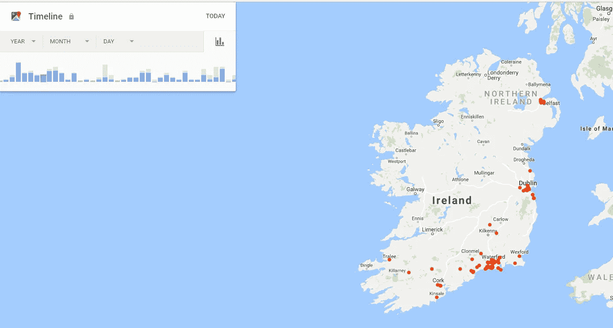

# 在网上匿名，重获自由

> 原文：<https://medium.com/hackernoon/becoming-anonymous-on-the-internet-and-gaining-back-your-freedom-e888ad5a13be>

自从脸书竞选事件以来，似乎成千上万的人越来越意识到在互联网上更加隐私，每天都有更多的文章被写出来。

几天前,@iamdylancurran 写的这条推文火了起来，连爱德华·斯诺登也转发了这条推文。

我决定利用 TweetStorm，将它变成一个网站，为普通非技术用户提供简单可行的技巧，让他们开始重获自由，下面是@iamdylancurran 推文的一个亮点:

> [谷歌](https://hackernoon.com/tagged/google)会在你每次打开手机的时候存储[你的位置](https://www.google.com/maps/timeline?pb)(如果你开着的话)，你可以看到从你开始在手机上使用谷歌的第一天开始的时间线。
> 
> 这是我过去 12 个月在爱尔兰去过的每一个地方，包括我在那个地方的时间以及我从上一个地方到那个地方花了多长时间

> 谷歌将你所有设备上的搜索历史存储在一个单独的数据库中，所以即使你删除了你的搜索历史和电话历史，谷歌仍然会存储所有内容，直到你进入并删除所有内容，你必须在所有设备上这样做
> 
> 谷歌根据你的信息创建一个[广告简介，包括你的位置、性别、年龄、爱好、职业、兴趣、关系状态、可能的体重(需要一天瘦 10 磅？)和收入。](https://adssettings.google.com/authenticated)
> 
> 谷歌[存储你使用的每个应用和扩展的信息](https://myaccount.google.com/permissions)，你使用它们的频率，你在哪里使用它们，你用它们与谁互动(你在脸书与谁交谈，你与哪些国家交谈，你几点睡觉)。
> 
> 谷歌储存了你在 YouTube 上的所有历史记录，所以他们知道你是否很快就要为人父母，你是否是一个保守主义者，你是否是一个进步主义者，你是否是犹太人、基督教徒或穆斯林，你是否感到沮丧或有自杀倾向，你是否有厌食症…
> 
> 谷歌提供了一个选项[下载它存储的关于你的所有数据](https://www.google.com/takeout)。我已经请求下载了，文件有 5.5GB 大，大概是 3 *百万*个 Word 文档！
> 
> 它包括您的书签、电子邮件、联系人、您的 Google Drive 文件、所有上述信息、您的 YouTube 视频、您用手机拍摄的照片、您购买的商家、您通过 Google 购买的产品、您的日历、您的 Google Hangout 会话、您的位置历史、您听的音乐、您购买的 Google 书籍、您所在的 Google 群组、您创建的网站、您拥有的手机、您共享的页面、您一天走了多少步…

## 怎么办？

1.  前往[你的谷歌活动](https://myactivity.google.com/myactivity)
2.  点击*通过*删除活动，并选择*所有时间*和*所有产品*
3.  点击提交，删除他们在所有主要应用程序上存储的所有数据

## 删除“个性化”广告

1.  转到[谷歌广告设置](https://adssettings.google.com/authenticated)
2.  点击按钮禁止广告个性化
3.  确认

## 禁用手机上的报告位置

无论你是在 Android 还是 IOS 系统上，你都可以进入设置并禁用位置报告。这将避免谷歌和其他公司随时知道你在哪里。

# 检查成为匿名网站的完整指南

[变得匿名](https://becominganonymous.com)。它是开源的，完全免费，非常短，我把它分成 5 天，每一天 10 分钟，因为从经验来看，互联网上的人都很懒:)，最终目标是至少让一些人变得更加关注隐私，这样他们就可以继续向他们的朋友和家人传播这个消息。

欢迎在 Twitter[@ surfcode repeat](https://twitter.com/surfcoderepeat)上联系我，或者在 [github](https://github.com/surfer77/becominganonymous.com) 上对代码提出任何建议🙂