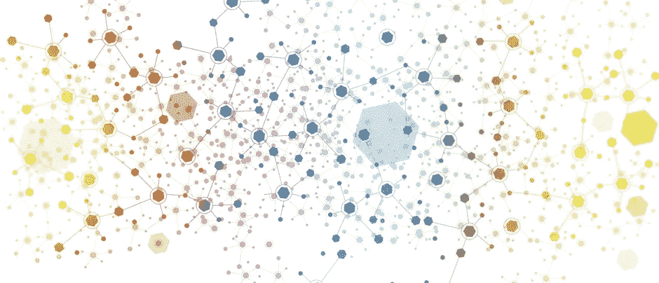
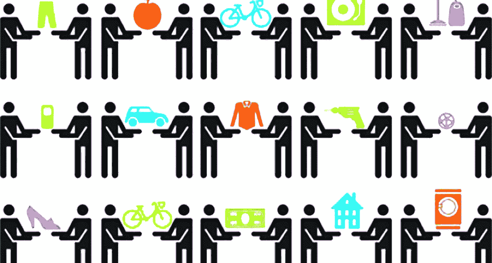
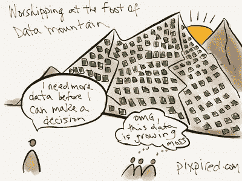

# 成为数据存储的 Airbnb

> 原文：<https://medium.com/hackernoon/becoming-the-airbnb-of-data-storage-69ad0964526>

## 分享很好

曾经被怀疑为社会工程的嬉皮士式尝试，共享经济现在已经成为主流。事实上，像在线租赁公司 Airbnb 这样的公司提供的服务已经变得如此主流，以至于[普华永道认为](https://www.pwc.com/us/en/technology/publications/sharing-economy.html)近五分之一的美国消费者现在已经参与了某种类型的共享经济活动。Airbnb 目前在 65，000 个城市和 191 个国家拥有 3，000，000 个住宿列表。这一趋势还将继续，全球在共享经济上的支出[预计到 2025 年将达到 3350 亿美元，占总支出的 50%。](https://www.pwc.co.uk/issues/megatrends/collisions/sharingeconomy/outlook-for-the-sharing-economy-in-the-uk-2016.html)

作为一个社会，我们非常习惯于在网上分享信息(可以说太多了，当涉及到社交媒体的时候！).然而，数据存储是共享经济基本未触及的一个领域。从许多方面来看，这很奇怪，数字数据正成为我们所有生活的中心，可以说今天比以往任何时候都更重要。

## 大数据山

当今不断增长的大数据量非常巨大。据目前估计，地球上现在有多达 50 亿字节的信息，到 2020 年，这个数字可能会增加十倍。数据量也没有显示出放缓的迹象，特别是随着物联网(IoT)变得比以往任何时候都更加普遍。据估计，到 2020 年，联网设备将超过 200 亿台，数据量将会增加到难以计数的水平。

随着数据量的增加，存储需求也在增加。然而，目前的存储解决方案迄今未能根据业务需求发展。它们继续带来太多的风险，并且难以高效地扩展到我们现在所经历的数据水平。

## 真正的变革

区块链支持的分散存储模式可以提供答案。毕竟，通过在比特币等加密货币中的使用，区块链技术已经证明了它可以处理多种数据源的复杂相互作用。因此，大多数评论家都同意，在整个行业中，这项技术将被证明是真正的变革。我相信，存储也将是 it 最终获胜的战场之一。

然而，让区块链支持的分散存储模式如此令人兴奋的不仅仅是它更安全、更高效、更便宜，而是存储本身不是由单个公司提供的，而是由全球各地的大量个人提供的。一个共享资源的社会。

## **保持敏捷**

随着数字化转型在我们身边发生，那些能够保持敏捷的企业不仅会生存下来，还会蓬勃发展。从根本上说，他们需要灵活的技术架构，能够随着数据库等功能自动扩展，能够支持新的计划，以确保他们保持竞争力。

随着社交媒体、物联网和移动应用成为数字化转型的核心，所有这些都在产生越来越多的数据，传统的数据库管理服务已经无法满足这些现代、敏捷企业的需求。不仅在性能、可靠性和可扩展性方面存在问题，而且由于导致大量数据保存在单一位置，数据泄露的风险也在增加。通过区块链技术的优势，以分散的方式管理大量数据，根除了这些问题，并为敏捷企业提供了能够参与未来竞争的工具包。