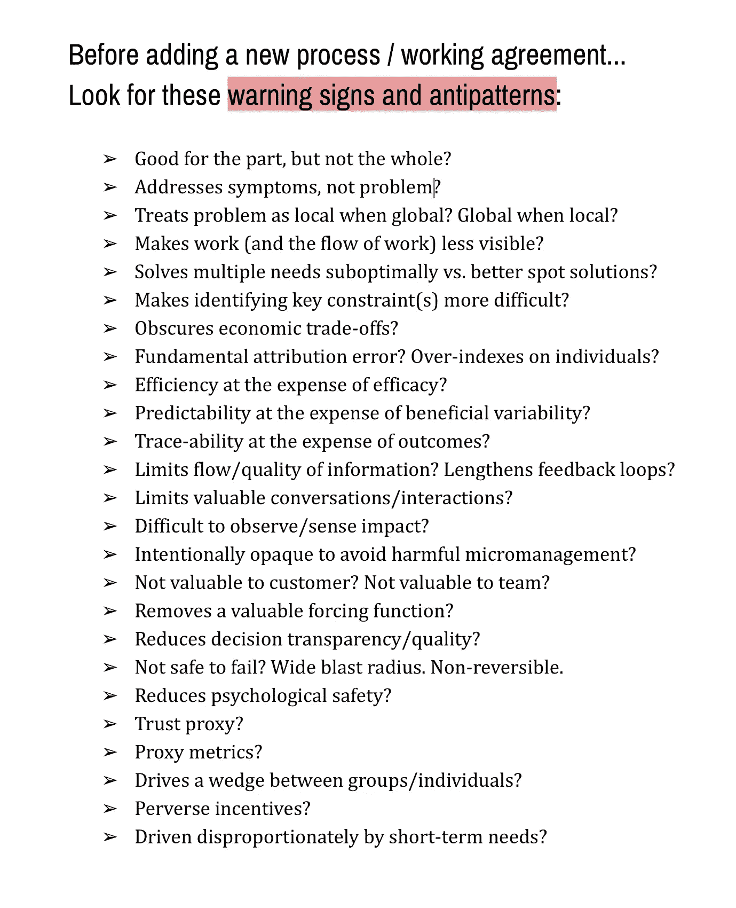

# 添加流程前

> 原文：<https://medium.com/hackernoon/before-adding-process-8e532e436402>

在添加新流程/工作协议之前…

寻找这些警告信号和反模式:

*   对部分好，但不是全部？
*   解决症状，而不是问题？
*   当问题是全球性的时，是否将问题视为局部性的？本地时的全球？
*   让工作(和工作流程)变得不那么明显？
*   次优于更好的现场解决方案解决多种需求？
*   使得识别关键约束更加困难？
*   掩盖了经济权衡？
*   根本归因错误？对个人的过度索引
*   以牺牲功效为代价的效率？
*   以牺牲有益的可变性为代价的可预测性？
*   以结果为代价的追踪能力？
*   限制信息的流动/质量？延长反馈循环？
*   限制了有价值的对话/互动？
*   难以观察/感知影响？
*   故意不透明以避免有害的微观管理？
*   对客户没有价值？对团队没有价值？
*   移除一个有价值的强制函数？
*   降低决策透明度/质量？
*   失败不安全？爆炸半径很大。不可逆。
*   降低心理安全感？
*   信任代理？
*   代理指标？
*   在团体/个人之间制造不和？
*   反常激励？
*   不成比例地被短期需求驱动？

