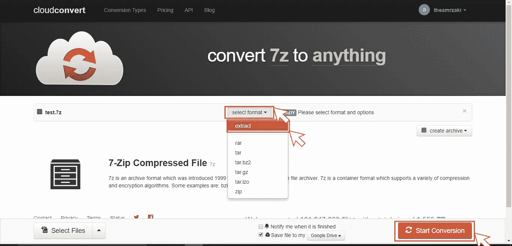

# 免费开始您的深度学习项目(免费 GPU 处理、免费存储、免费轻松上传，无需下载然后上传、免费解压缩)

> 原文：<https://medium.com/hackernoon/begin-your-deep-learning-project-for-free-free-gpu-processing-free-storage-free-easy-upload-b4dba18abebc>

在这个故事中，我将讲述如何开始深度学习工作，而不需要拥有一台配备最好 gpu 的强大计算机，也不需要租用虚拟机，我将讲述如何在 GPU 上进行免费处理，并将其连接到免费存储，如何直接将文件添加到您的在线存储，而不需要下载然后上传，以及如何在线免费解压缩文件。


我正在经历我如何使用 google colab 开始我的深度学习项目，它允许你使用 [Keras](https://keras.io/) 、 [Tensorflow](https://www.tensorflow.org/) 和 [PyTorch](http://pytorch.org/) 直接在一个**免费的 Tesla K80 GPU** 上开始工作，以及我如何将其连接到 google drive 进行数据托管，我还会分享一些我用来自动将数据下载到 google drive 而无需先下载它们的技术， 然后将它们上传到 google drive，然后我会介绍如何在线解压缩文件，而不需要用 python 代码解压缩。

所以总而言之，我会说

1.  Google Colab
2.  正在连接到 Google Drive
3.  **将数据直接下载到 google drive，无需下载然后上传(**从外部链接，另一个 google drive **)**
4.  在线解压缩文件

让我们开始吧

# Google Colab


google colab 是一款免费使用的 Jupyter 笔记本，它允许您使用免费的特斯拉 K80 GPU，它还提供了总共 12 GB 的内存，您可以连续使用 12 个小时。

你可以

1.  开始一个新的谷歌实验室
2.  或者上传一个 github ipyn 笔记本

所以让我们从如何创建一个谷歌实验室开始

> 1- **开始一个新的谷歌实验室**

1-a)转到[https://colab.research.google.com](https://colab.research.google.com)

1-b)选择 google drive 选项卡(将新的 google colab 保存到 Google Drive)

2-c)选择**新 Python 3 笔记本**(也可以选择 python 2 笔记本)


一个空白的笔记本会被创建到你的 google drive 中，看起来像这样


您可以通过选择顶部菜单中的运行时间按钮，将笔记本的运行时间更改为

1.  更改您正在使用的 python 版本
2.  从(GPU，TPU)中选择硬件加速器


> 2- **上传 github Jupyter 笔记本到 google colab**

你可以从 github 自动上传一个已经制作好的 Jupyter 笔记本到 colab，这真的有助于动态测试代码，所以让我们试试吧

2-a)这是一个 [Jupyter 笔记本](https://github.com/theamrzaki/text_summurization_abstractive_methods/blob/master/Model_2_seq2seq_using_lib.ipynb),是我为文本总结而创建的

2-b)我们也去 https://colab.research.google.com 的，但这次我们会选择 github 选项卡

3-c)然后我们只需粘贴 [Jupyter 笔记本](https://github.com/theamrzaki/text_summurization_abstractive_methods/blob/master/Model_2_seq2seq_using_lib.ipynb)链接，并点击上传


你甚至可以在这个[教程](https://colab.research.google.com/github/googlecolab/colabtools/blob/master/notebooks/colab-github-demo.ipynb)中读到更多

如您所见，启动 colab 项目相当容易，但对于任何真实世界的数据项目，它都需要真正庞大的数据集，有许多方法可以做到这一点，但要真正实现拥有真正庞大数据集的目标，您需要 google drive 的强大功能。

因此，让我们将我们的 google drive 连接到我们的 google colab 笔记本电脑。

# **连接到 Google Drive**


在新创建的笔记本中，添加一个新的代码单元


然后把这段代码粘贴进去

```
from google.colab import drive
drive.mount('/content/drive')
```

这将连接到你的驱动器，并创建一个文件夹，你的笔记本可以访问你的谷歌驱动器

它会要求您访问您的驱动器，只需点击链接，并复制访问令牌，它会问这两次

编写完这段代码后，您可以通过单击单元格(shift enter)或单击代码单元格顶部的 play 按钮来运行代码


然后，您可以简单地通过文件的路径以

```
path = "drive/My Drive/test.txt"
```

通过这种方式，你可以加载真正巨大的文件，因为你的 google drive 可以容纳 115GB，而 google colab 提供了 12 GB 的内存，所以这将为真正伟大的数据应用程序开辟道路

但一个新的问题会出现，因为一个人在他的数据项目中使用的大部分数据都是千兆字节，所以要在你的 google colab 中使用它们，你需要下载它们，然后上传它们，这可能真的需要很长时间，因为大多数人的上传速度非常慢，这将使处理数千兆字节的数据集成为一个相当大的问题，所以下一节将发现。

我已经设法使用一些服务，允许你直接远程下载链接到你的谷歌驱动器，而不需要下载它们，然后再上传到你的驱动器。

还有另一项服务，它允许你将一个文件的副本(存放在另一个 google drive 上)直接复制到你的 google drive 上，

所以让我们开始吧

**将数据直接下载到 google drive，无需下载然后上传**

主要有两种情况，您需要的文件是

1.  托管在一个网站上，您可以通过链接下载数据集
2.  所需文件存放在另一个谷歌驱动器上

让我们探索第一个场景

> 1-a)从外部链接下载

在这里，我们将使用 multcloud，multcloud 是一项包含免费计划的服务，允许您管理您的云服务，我们将使用的其中一项服务是它可以将文件直接下载到您的 google drive，

你只需粘贴你的链接，然后等待链接被直接下载到你的 google drive，使用免费计划，你可以每月传输 50GB

报名后


Fist Add Google Drive to multcloud


then authorize your account


after sign in , and after registering your google drive , click on your google drive


then click on upload


then click on upload url


then paste your link


then you can see your download progress by click on the top button , then url tasks


then a menu would appear , where you can track your progress , or even add urls from here

> 1-b)从另一个 google drive 下载


有时候，你的文件实际上在另一个谷歌硬盘上，而你只是想在你的谷歌硬盘上复制一份

在这种情况下，我尝试过使用 multcloud，使用直接的谷歌链接下载文件，但没有成功，所以我遇到了[复制，谷歌驱动器的 URL](https://softgateon.herokuapp.com/urltodrive/)，这使你可以轻松地在不同的谷歌驱动器之间复制文件


paste your link , name it , then save to google drive


after authenticating , you just click save to google drive

但是大多数数据集都是 zip 格式的，它们需要被解压缩以便能够在你的项目中处理它们。

有些人使用 python 代码在 google colab 中解压缩他们的文件，但我发现有更有效的方法，一种不需要编写代码和维护不同 zip 格式的代码的方法，其中之一是使用 cloudconvert

# 免费在线解压文件


cloudconvert 是一个可以和 google drive 一起使用的应用程序，它允许你免费解压你的文件，它可以解压大量的 zip 格式，所以让我们开始吧


Fist lets connect more apps in your google drive


search for cloudconvert , then hit enter , then add the app


then lets open the zip through cloudconvert



then you select the format to be extract , then you hit start converting (the checkbox of save to drive must be checked)

然后你的压缩文件会被保存到你的硬盘上，这比写代码解压要方便得多

通过以上几节，我们了解了如何构建一个数据项目，而不需要强大的设备，不需要租用设备，或者不需要昂贵的在线存储，或者不需要下载然后上传，我们还介绍了一种在线解压缩文件的方法

我真诚地希望这对你有益，我期待着听到你的评论，并请告诉我它是否对你有益。