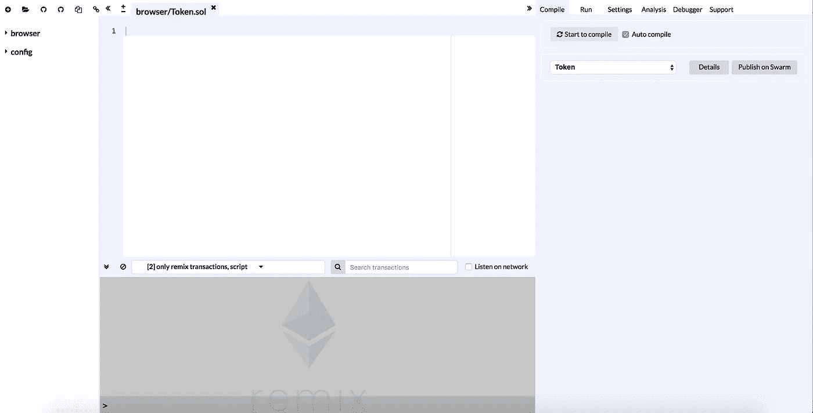
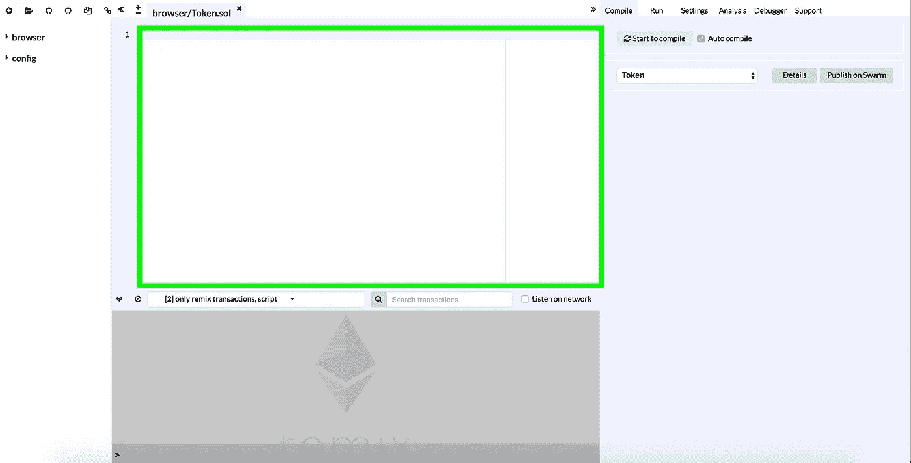

# [初学者指南]在 30 分钟内编写并部署您的首个 ICO smart 合同(第 1 阶段)

> 原文：<https://medium.com/hackernoon/beginner-guide-write-and-deploy-your-first-ico-smart-contract-under-30-minutes-stage-1-88774aa6bdc4>

## 编写可以颁发令牌和转移令牌的智能合约


Image credit to bitcoinmagazine.com

这个超级简单的教程将带您完成编写智能合约的基本步骤，该合约可以像真正的 ICO 一样发布令牌并转移令牌。尽管它与 ERC20 不兼容，这使得到目前为止还不足以做一个合法的 ICO。这仍然是一个可以让你快速入门的指南。

# 你需要的东西

*   谷歌 Chrome 浏览器(点击下载
*   一个注册的 [Metamask](https://metamask.io/) 账号(教程由 [CryptoCompare](https://www.cryptocompare.com/wallets/guides/how-to-use-metamask/) 提供)
*   关于什么是智能合同的基本知识(由 [Blockgeeks](https://blockgeeks.com/guides/smart-contracts/) 提供的教程)

# 去参观你写代码的地方

从你的 Chrome 浏览器访问 [Remix 编译器](http://remix.ethereum.org/)，这是一个很棒的在线编译器，你可以编写智能合约，部署合约，并与合约交互。



Remix compiler ([http://remix.ethereum.org/](http://remix.ethereum.org/))

# 开始撰写您的第一份智能合同！

今天，我们将编写一个简单的智能合同，它只有**4 个特性**:

*   **数据:**记录每个用户的代币余额
*   **方法:**查看特定用户的令牌余额
*   **方法:**发放所有令牌
*   **方法:**将令牌从一个用户转移到另一个用户

现在，在混音的白盒里，删掉一切，让我们从新鲜开始。



White box is right there circled by the green border

## 第一步:

指定实度版本:

```
pragma solidity ^0.4.21;
```

[Solidity](http://solidity.readthedocs.io/en/develop/index.html) 是我们用来编写智能合同的编程语言。我们现在写得很扎实！在这里，我们将 solidity 版本指定为 0.4.21，兼容性高达 0.4.x (x > 21)。如果你现在还不能理解，不要担心。

## 第二步:

创建合同主体:

```
contract Token {
    // Write more codes here
}
```

我们创建了一个名为“Token”的智能契约。

## **第三步:**

现在我们开始第一个特征。**数据:**记录每个用户的代币余额。我们需要一个`mapping`类型的*字典*来记录每个用户的余额。

```
// Write this inside the "contract Token" bodymapping (address => uint256) private balances;
```

这一行声明了一个类型为`mapping`的变量，它可以接受一个用户的`address`，并返回该用户令牌余额的`uint256`值。因此，这就像一个**字典**，你寻找一个地址，以获得其相应的令牌余额。`address`类型存储用户或已部署的智能合同。`uint256`型代表`unsigned integer (256 bits)`，它只是一个整数持有者。

关键字`private`隐藏该变量，防止外部访问。`balances`只是我们正在创建的变量的名称。很多事情要赶上。但是我向你保证会很有趣的！

## 第四步:

我们已经完成了第一部电影。现在我们开始讨论第二个很酷的功能— **方法:**检查特定用户的令牌余额。

请在`mapping`下面添加以下代码，但仍在令牌契约主体内:

我们正在创建一个名为`getBalance`的`function`。该函数需要一个名为`_account`的类型为`address`的输入变量(基本上是**用户**)。并且它`returns`输出具有类型 uint256 的答案(该用户的**令牌余额**)。该功能为`public`和`constant`，对公众开放，只能查看来自[区块链](https://hackernoon.com/tagged/blockchain)的信息，不能更改。

在函数内部，我们通过向`balances`(地址[书](https://hackernoon.com/tagged/book))提供`_account`(用户地址)来`return`答案。它将返回该特定用户的令牌余额`_account`。

## 第五步:

现在，我们想稍微自私一点，在部署智能合约(推出 ICO)后，立即将所有 ICO 令牌存储到我们自己的钱包中。至此，我们现在正在构建第三个特性— **方法:**发布所有令牌。

在第二个功能下添加以下代码:

这是一个**构造函数**，它只会在部署的时候被触发一次。名称为`Token`，必须与创建的智能合约相同。该函数接受类型为`uint256`的`_initialSupply`(代币的发行数量！你想要多少就有多少！).

在函数内部，我们将`msg.sender`的`balances`设置为我刚刚设置的**初始供给**！但是谁是黑客`msg.sender`？将部署合同的用户地址..是你！你现在有所有的代币。:)

## 我们目前掌握的所有密码

Your codes should like this~

# 中场休息总结

现在，我们有了一个智能合同，它可以:

1.  存储所有用户的所有代币余额
2.  检查特定用户的令牌余额
3.  开始时发放特定数量的代币，并全部发送给您！

> 干得好！速度超快啊。

我们将继续完成最后一个特性— **方法:**将令牌从一个用户转移到另一个用户。并向您展示我们将如何通过 Remix 和 Metamask 部署和尝试 ICO 智能合约。

> 第二个导轨准备好了 [**这里**](/@jj1385jeff850527/beginner-guide-write-and-deploy-your-first-ico-smart-contract-under-30-minutes-stage-2-dc270e50acce) ！