# 新手指南比特币基地专业，比特币基地的高级交易所交易 BTC，瑞士联邦理工学院，长期资本，ZRX，英美烟草和 BCH

> 原文：<https://medium.com/hackernoon/beginners-guide-to-coinbase-pro-an-exchange-of-coinbase-to-trade-btc-eth-and-ltc-72f04eee8092>

## 了解比特币基地自己提供的资产交易平台&节省你购买和出售前三大加密货币的费用

## 日益普及

由于比特币和其他加密货币的受欢迎程度不断提高，这要么是由于过去几天比特币的价格飙升，要么是因为许多公众人物发表了赞成意见，但很少有人反对，这使得越来越多的人学习和投资比特币。

对于那些被比特币的巨额价格吓倒的人来说，他们正在寻找下一个比特币或替代货币，这些货币可能会在未来几天、几周或几个月内出现牛市。人们实际上正在探索其他加密货币，如莱特币和以太坊，因为它们已被证明是以更好的方式处理比特币的可扩展性和交易处理问题的活跃项目。

> 关注我的 [Twitter](https://twitter.com/confusedcoin) ，了解关于加密货币&区块链的更新。

## 初学者注意

对于所有的投资需求来说，[比特币基地](https://www.coinbase.com/join/5922da0103b62e7e9e6b9df8)已经成为超过 25 个国家的人们使用存款购买[比特币](https://hackernoon.com/a-beginners-guide-to-buying-bitcoin-8cf715421a9c)、[莱特币](https://hackernoon.com/a-beginners-guide-to-buying-litecoin-236fa79d2f86)或[以太坊](https://hackernoon.com/a-beginners-guide-to-buying-ethereum-e11c73b5e5ed)的便捷媒介。如果你是初学者，[跟随此链接](https://hackernoon.com/a-beginners-guide-to-buying-bitcoin-8cf715421a9c)了解添加资金和进行首次购买的一步一步的过程。我会建议初学者按照说明，在[比特币基地](https://www.coinbase.com/join/5922da0103b62e7e9e6b9df8)上进行首次购买。

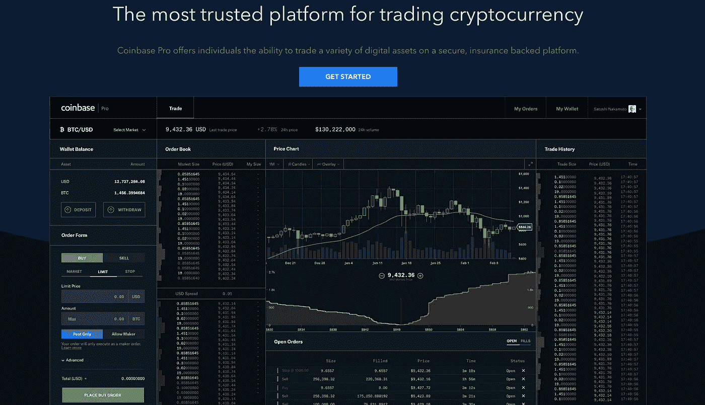

CoinbasePro Trading View

## 我是专业的，放马过来吧！

然而，当你在比特币基地上得到你的资金后，如果你是在交易而不是仅仅持有，它对你的每笔买卖征收的%的费用会引起你的注意。如果你经常在 coinbase 上买卖，这笔费用实际上是一个问题，因为它开始蚕食你的利润甚至亏损。

> 如果我说有办法避免这种情况。是的，这是通过使用比特币基地自己的交易所称为**比特币基地专业(以前的 GDAX——全球数字资产交易所)**，它允许你交易不同的对，如下所述

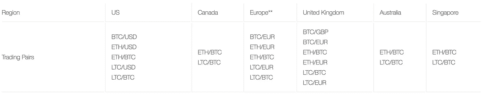

available trading pairs on Coinbase Pro by country

## 你现在需要知道的事情

*   如何注册并创建比特币基地专业帐户？
*   *如何将我的资金从比特币基地存入比特币基地 Pro？*
*   *如何存取数字货币？*
*   *如何存取美元？*
*   *如何买卖* [*比特币*](https://hackernoon.com/a-beginners-guide-to-buying-bitcoin-8cf715421a9c)*[*莱特币*](https://hackernoon.com/a-beginners-guide-to-buying-litecoin-236fa79d2f86) *或* [*以太坊*](https://hackernoon.com/a-beginners-guide-to-buying-ethereum-e11c73b5e5ed) *无需任何费用**

*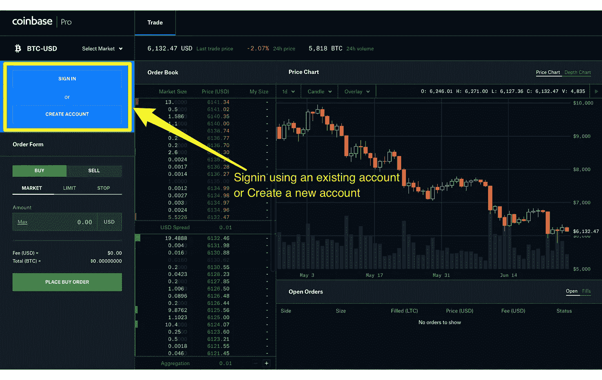*

## *在比特币基地专业版上注册和创建帐户*

*要注册并创建您的比特币基地专业版帐户，请按照下列步骤操作:*

1.  *去 pro.coinbase.com*
2.  *选择**“创建账户”**。*
3.  *填写注册表格，然后点击**“创建账户”**。*
4.  *单击发送到您电子邮件地址的验证链接。*
5.  *验证您的电子邮件地址后，会要求您提供电话号码。*
6.  *指定您是想创建一个**‘个人’**账户还是**‘机构’**账户。根据所选的账户类型，您需要提供关于您自己或您所在机构的信息。*
7.  *您可以选择关联您的银行账户，以便用美元、英镑或欧元为您的交易账户提供资金。或者，你可以跳过这一步，在 BTC 或瑞士联邦理工学院开设账户。​*

*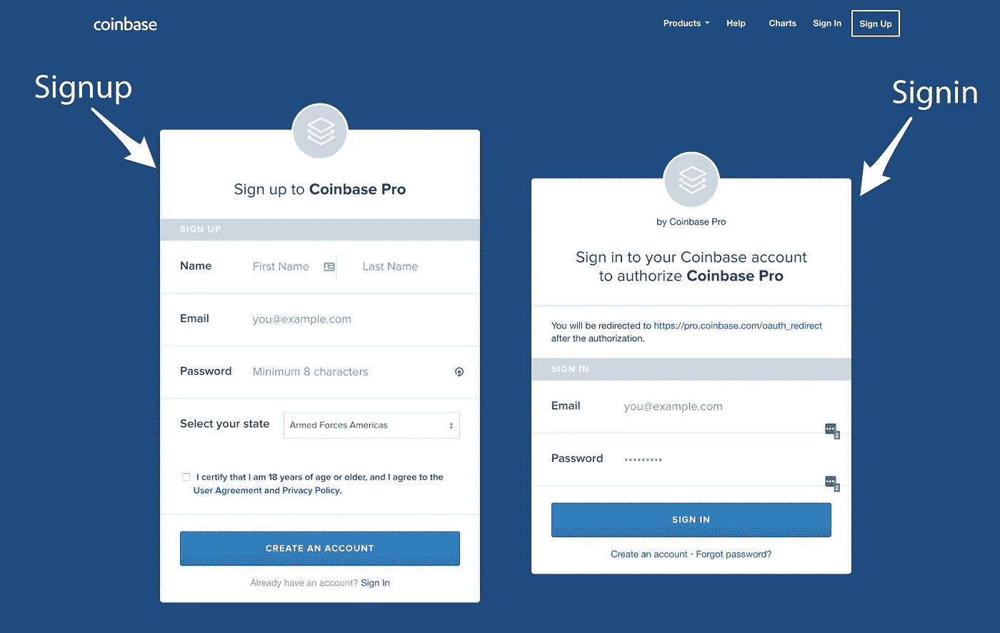*

## *作为比特币基地的现有客户创建账户*

*比特币基地专业版利用比特币基地成熟的基础设施安全地存储资金和私人信息。这也简化了比特币基地专业注册过程，因为你不需要向我们提供你已经给比特币基地的信息。*

*但是，由于比特币基地专业版有更高的[身份验证要求](https://support.gdax.com/customer/portal/articles/2437862-id-verification-issues-)，在创建帐户时，您仍可能被要求提供进一步的信息。*

****创建比特币基地 Pro 账号的步骤****

1.  *参观 pro.coinbase.com*
2.  *点击“注册”按钮。*
3.  *您将被带到 Coinbase.com 托管的页面。*
4.  *使用您的 Coinbase.com 电子邮件地址和密码登录。*
5.  *a)如果您已经通过比特币基地验证了一个电话号码，系统会提示您输入比特币基地两步验证码。如果您尚未验证电话号码，系统会要求您输入一个。*
6.  *您可能会被要求验证您的身份，这取决于您之前在您的比特币基地帐户中完成了哪些验证。*
7.  *如果比特币基地专业版支持使用您所在地区的当地货币(目前为美元、英镑或欧元)进行交易，那么您将可以选择链接您的银行并为您的交易账户提供资金。或者，你可以跳过这一步，在 BTC 或瑞士联邦理工学院开设账户。*

# *了解比特币基地专业版的各个部分*

*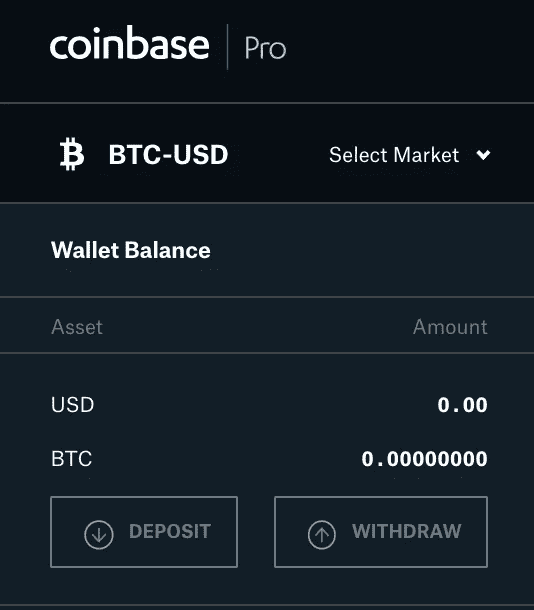*

## *存款和取款*

*比特币基地专业交易所左侧的这些按钮将帮助您在比特币基地和比特币基地专业交易所之间转移美元资金或数字货币。*

*点击存款按钮将出现以下屏幕。将资金存入比特币基地专业银行，*

*   *你可以使用你存入比特币基地的资金。*
*   *您可以通过与您的比特币基地关联的银行账户存款。*
*   *你可以从你的银行电汇。如下所示，在弹出窗口中*

*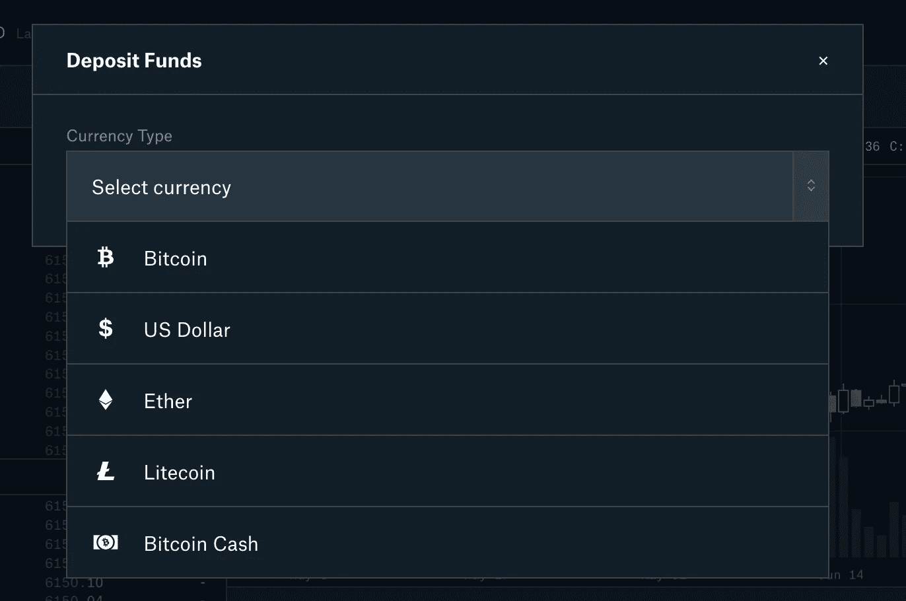**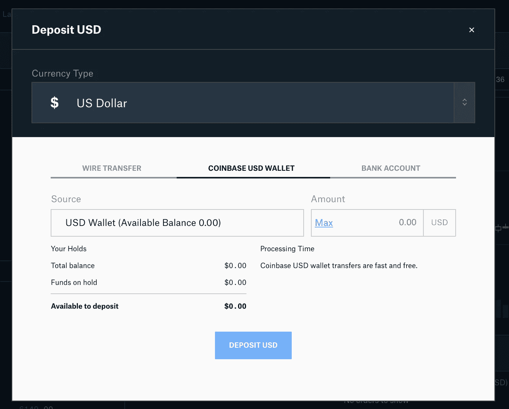*

*一旦您将美元存入帐户，它将显示在左侧面板“存款”和“取款”按钮上方的美元余额旁边。*

*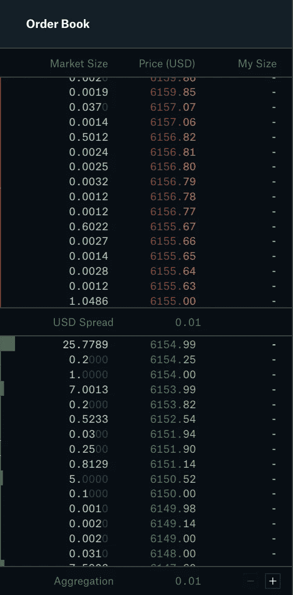*

## *定货簿*

*你看到的下一部分是订单簿。这一部分显示每个价格点有多少订单。*

*红色的显示不同价位的卖单。*

*绿色的显示不同价格的购买订单。*

*中间的美元差价显示了最低卖单和最高买单之间的差额。这通常显示了特定交易所对特定数字货币的需求和交易量。如果交易量很大，有更多的人在买卖，这种差价将会非常小。因此，这是投资者决定一个交易所是否好的一个指标，因为没有多少人会在交易量/需求较少的交易所交易，因为他们的订单不会像预期的那样得到满足。*

## *图表*

*下一部分也是最宽的部分是图表部分。这里有两种图表*

*   *价格图表*
*   *水深图*

****价格图表*** 通过选择 1 米、5 米、15 米、1 小时、6 小时和 1 天等时间间隔，帮助您了解所选交易对在一段时间内的模式。稍后将详细介绍。*

*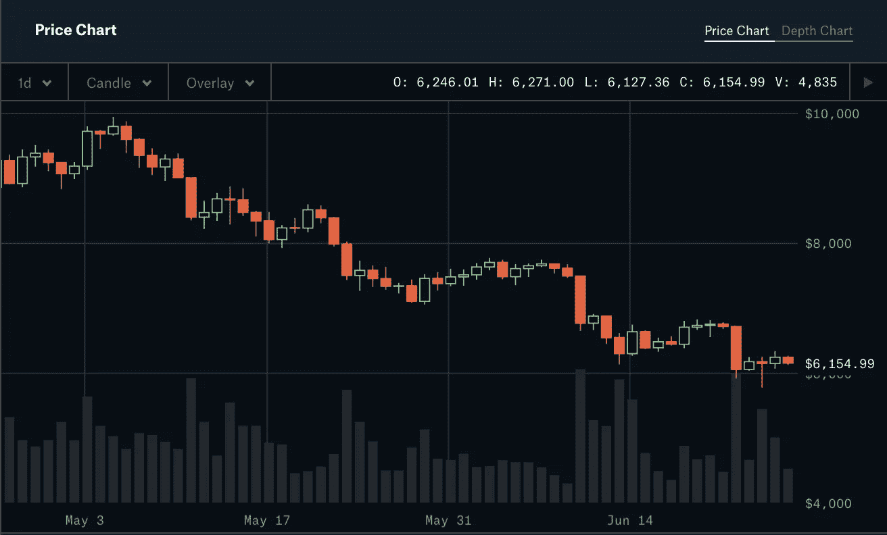*

****深度图*** 是另一个有趣的图表，它向你展示了选中的交易数字货币对交易货币的供求关系。[在此了解更多关于理解深度图的信息](https://hackernoon.com/depth-chart-and-its-significance-in-trading-bdbfbbd23d33)*

*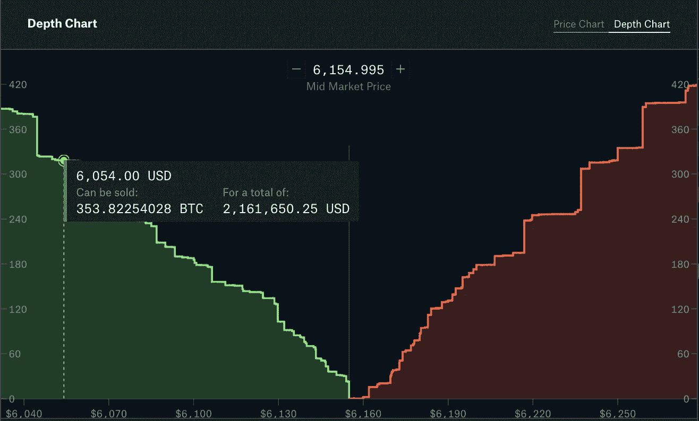*

*在图表下方，有一个空白区域，有两个标签 ***订单和填充。*** 当您下订单时，它会显示在这里，并显示自您下订单以来经过的时间。一旦价格达到您所下的价格，它就会被执行，这意味着您将根据所下的订单获得相应数量的数字货币。这称为“订单已完成”，然后它会移动到“已完成”标签。*

*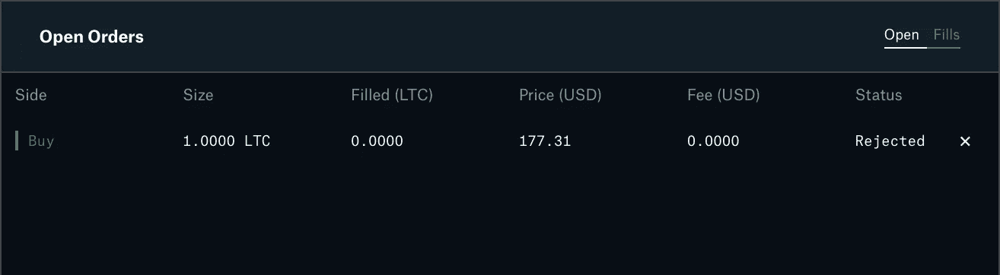**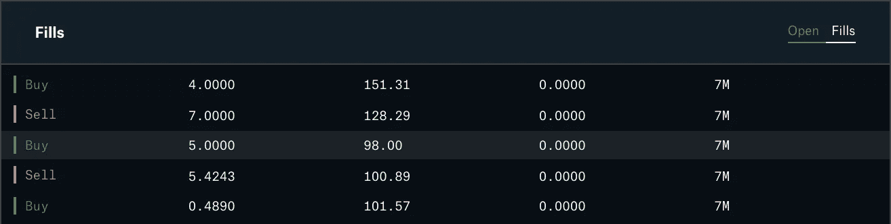**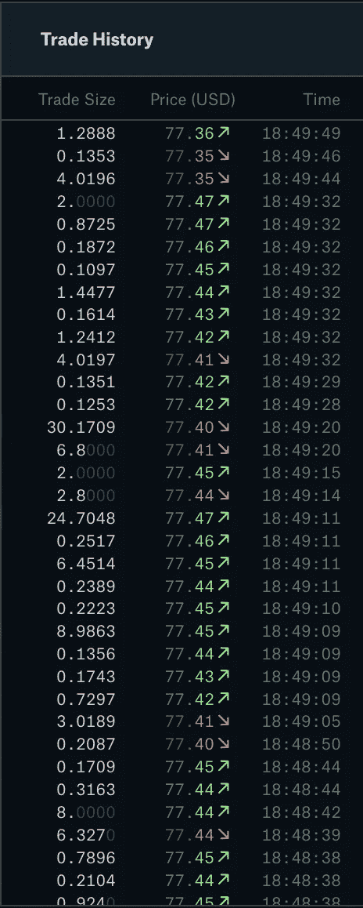*

*下一节是 ***的贸易史。*** 交易历史显示当前执行的订单列表。*

*完成基础部分做得很好。继续阅读下一篇文章，了解更多*

*   *市价单、限价单和止损单的区别。*
*   *如何进行限价买卖？*
*   *理解交易行话中的制造者和接受者。*
*   *如何通过限价下单和做庄家来规避费用？*

* [## 在比特币基地和 CoinbasePro 上零手续费交易

### 理解在比特币基地 Pro 上用美元、欧元和英镑零费用交易 BTC、瑞士联邦理工学院、长期贸易公司的终极指南。

hackernoon.com](https://hackernoon.com/trading-on-coinbase-and-gdax-with-zero-transaction-fees-94e26e5dcdde) 

***如果您想获得我的文章和更新的通知，请关注我的***[***Twitter***](http://twitter.com/confusedcoin)***和***[***Medium***](/@vvkr)***。**** 

*你在学习使用工具进行交易的同时，也需要对加密货币交易负责并纳税。这里有一篇文章，试图减少混乱，并提供关于加密交易收益税的澄清。*

* [## 如何计算和申报加密货币收益税

### 比特币基地、GDAX、Gemini 等地的密码交易员迫切需要计算他们从比特币中获得的收益

hackernoon.com](https://hackernoon.com/how-to-pay-bitcoin-cryptocurrency-tax-reliable-tools-beartax-bfce8bbb81bc)*