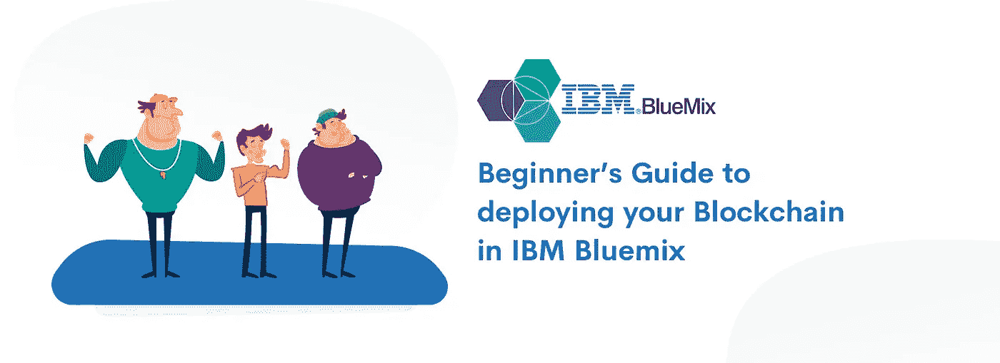
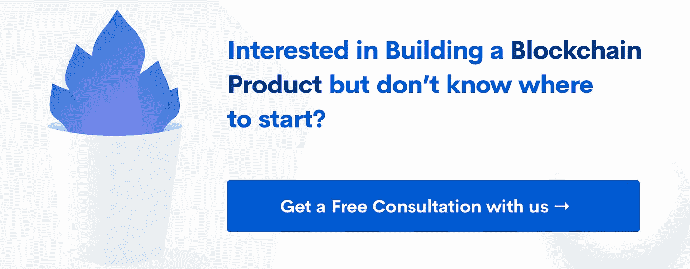

# 在 IBM Bluemix 中部署区块链的初学者指南

> 原文：<https://medium.com/hackernoon/beginners-guide-to-deploying-your-blockchain-in-ibm-bluemix-da11d09f3914>

# 什么是 IBM BLUEMIX，也就是 IBM CLOUD

IBM Bluemix 现在是 IBM cloud。更名后，IBM Cloud 不仅提供平台即服务，还提供基础设施即服务，以及软件即服务。作为一个灵活的 SaaS 平台，IBM cloud 毫不费力地提供了在云中运行区块链所需的所有服务。

> *该平台旨在加速多机构业务网络的开发、管理和运营。*

IBM 提供的区块链服务通过一个干净的界面来控制大部分操作，为开发人员提供了简单的可维护性和部署。激活网络、生成智能合同、检查日志和重启网络等操作只需提前点击一下。*太棒了。*

# 启动区块链服务

要开始使用 IBM 的区块链服务，只需注册并进入[目录](https://console.bluemix.net/catalog/?search=label:lite)查看他们提供的服务数量。

在区块链服务中，使用“Starter Pack”选项创建一个实例。30 天免费，提供和付费一样的无限量服务。您可以在大约一周内熟悉 UI 和应用程序。

# 创建网络

启动服务后，您可以看到带有**“创建网络”**按钮的欢迎屏幕。点击它。

现在您可以看到一个向导窗口，询问您的网络的基本细节。填写信息并继续下一步。下一步是邀请人们加入你的社交网络。您可能需要提供他们的组织名称和电子邮件地址才能发送邀请。

最后一步，确认您提供的信息并点击**完成。**

*附:这些是写作时的步骤。向导中询问的信息将来可能会更新。*

# 启动网络

**添加同行**

为了拥有活跃的区块链网络，我们需要将同行加入到组织中。IBM 的区块链服务通过要求你**添加同行**漂亮地开始了这个过程。这就是完美设计的工作流程。您需要输入对等方的详细信息，然后进入下一个屏幕。

现在，您可以看到带有状态信息的对等体，还可以选择*停止、重启或查看每个对等体的日志。*

**创建频道**

然后向导继续要求**创建一个频道**。这是一个 3 步流程，包括:

1.  输入频道信息
2.  邀请用户加入频道
3.  定义频道访问策略

作为邀请的一部分，用户会收到一个频道请求。为了进入启动网络的下一步，需要满足通道的策略。即，阈值数量的用户应该接受请求。

**将对等体加入通道**

与此同时，一旦创建了通道，向导就会要求用户选择对等体来加入通道。加入后，可以看到通道已经创建好了。

# 在网络中部署链码

安装和实例化 chaincode 从来都不是一件容易的事情。但是 IBM 只需点击几下鼠标就能让它变得简单。点击**链码**选项卡，选择一个**对等**并点击**安装链码**。这将引导您进入向导，询问有关链码的基本信息，并点击上传按钮上传链码。这也会自动识别链码是用 Golang 还是 NodeJS 写的。这是一个漂亮的自动化服务。

下一步，简单地通过传递通常在 init()函数中初始化的参数来完成实例化。

选择一个频道。点击提交。完成了！

部署一台区块链所需的时间不超过 5 到 10 分钟。这是一个巨大的减少。事实上，IBM 还使大约 80%的部署策略只需点击几下鼠标就可以实现。所有这一切听起来相当超前，但你需要用它来相信它！

