# 交互式重置基础初学者指南

> 原文：<https://medium.com/hackernoon/beginners-guide-to-interactive-rebasing-346a3f9c3a6d>

今年早些时候，我第一次做了一个交互式的 rebase，我对人们可以用它做什么印象深刻。一开始我也觉得有点复杂。希望这个指南将有助于消除一些不确定性。

此外，因为它非常强大，您可以从根本上改写历史，在我们开始之前，有一个小小的警告:关于 Git 以及重新设置基础是否是一个好主意，有许多思想流派。这篇文章不会**深入这些讨论，而纯粹是为了介绍使用交互式重定基础的基础知识。**

# TL；速度三角形定位法(dead reckoning)

*   交互式重定基础可用于以多种方式更改提交，如编辑、删除和压缩。
*   要告诉 Git 从哪里开始交互式 rebase，使用您想要修改的提交之前的提交的 SHA-1 或索引。
*   在交互式 rebase 过程中，当 Git 在您标记为 edit 的提交处暂停时，工作流与普通的提交过程没有什么不同——您暂存文件，然后提交它们。唯一的区别是您使用了命令`git commit --amend`而不是`git commit`。
*   交互式重定基础将创建新的 SHA-1，因此最好对尚未推送到远程分支的提交使用交互式重定基础。

# 问题是

在这个例子中，我们将经历这样一种情况:我们一直在一个特性分支中工作，并且我们有几个提交想要更改或删除。下面是我们的 git 日志的样子:

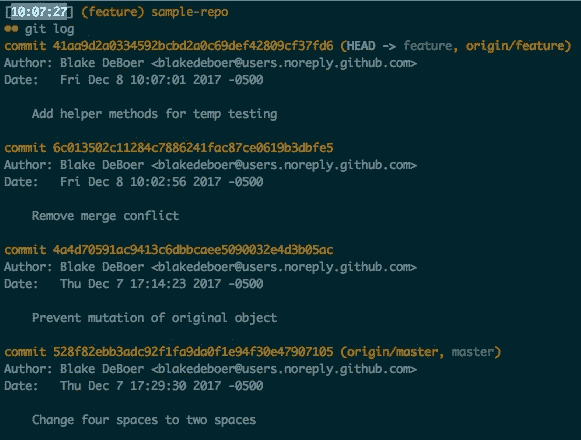

从上面的 git 日志中，这里是我们想要改变的两个提交:
`4a4d705` -在这个提交中我们意外地提交了一个合并冲突
`6c01350` -在这个提交中我们移除了合并冲突

我们想要做的是及时回到`4a4d705`，删除提交中的合并冲突，然后删除`6c01350`，因为合并冲突已经解决，我们不再需要这个提交。这将是对我们提交历史的改进，原因有二:

1.  我们不会有失败的提交(合并冲突)
2.  我们将只进行有意义的提交，而不进行仅与修复丢失的合并冲突相关的提交

# 解决方案

这种情况很适合交互式重定基础。斯科特·沙孔在他的书 [*Pro Git* 这正是交互式 rebase 的用途:通过重新安排和编辑提交，将多个提交压缩为一个，在大量[工作已经提交]后使用它。”](https://git-scm.com/docs/git-rebase)

# 我们想要修改哪些提交？

要启动交互式 rebase，我们需要告诉 Git 我们想要修改哪些提交。我们通过引用我们想要修改的最早提交之前的提交来做到这一点。或者，简单地说，根据斯科特·沙孔的说法，我们引用“我们希望保持原样的最后一次提交”。

让我们看看我们的例子，以便更好地理解。有两种方法可以引用这个提交:
*由 SHA-1*——我们想要保持原样的最后一个提交具有`528f82e`的阿沙-1，因此我们可以将它传递到我们的交互式 rebase 命令中。
*By Index*——我们想要保留的最后一个提交的索引位置为 3 (Git 使用基于零的索引)，因此我们可以将`HEAD~3`传递给我们的交互式 rebase 命令。

注意——如果您只有几个提交来进行交互式 rebase，使用索引对大多数人来说可能更容易。但是，如果您有很多提交，使用 SHA-1 可能会更容易，这样您就不必一直计算 git 日志了。

# 开始交互式重置基础

基于我们的示例，我们将运行:

`$ git rebase -i 528f82e`

或者

`$ git rebase -i HEAD~3`

这将在 Vim 中打开此窗口:

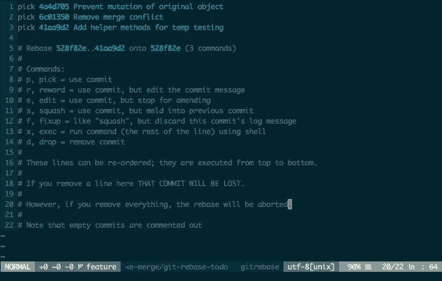

注意，提交的顺序与 git log 相反。在 git 日志中，最近的提交在最上面。在这个视图中，最近的提交在底部。还要注意，下面的注释给出了我们可以在每次提交时使用的有效命令的有用列表。

如果你不知道 Vim，只需点击你想要编辑的每个单词`pick`，然后按`<i>`键(插入模式)。一旦你完成输入，点击`<esc>`键退出插入模式。

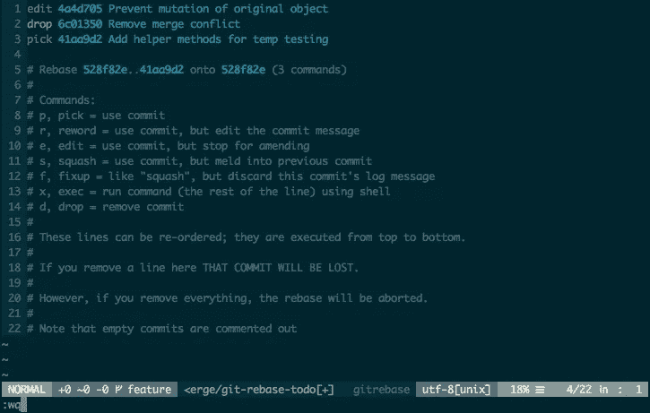

在我们的示例中，对于我们想要修改的提交，我们将命令更改为`edit`,对于我们想要删除的提交，我们将命令更改为`drop`。然后我们运行`:wq`保存并退出 Vim 窗口。

# 修改提交

回到终端，我们看到这条消息:

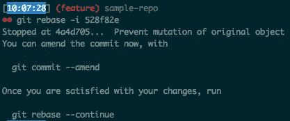

这使得我们在`4a4d705`停止是有意义的。这是我们想要修改的一系列提交中最旧的提交。我们将从这个提交开始，并通过每个提交进行工作，直到最近的提交。

提醒一下，`4a4d705`是我们意外提交的带有合并冲突的提交。当我们打开编辑器时，我们看到了合并冲突:

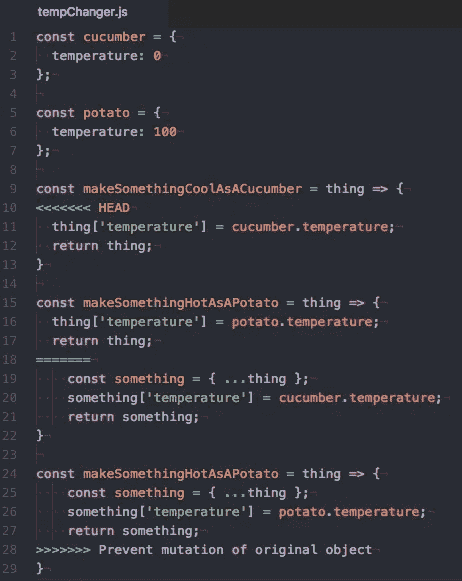

所以我们修复了文件中的合并冲突，但是我们现在做什么呢？当有疑问时，`git status`:

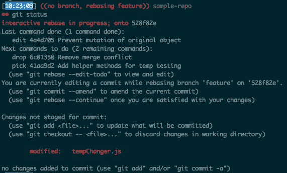

酷！这其实是有帮助的。我们看到我们当前正在编辑`4a4d705`，并且我们看到在这之后接下来的两个提交将被执行。

消息的其余部分是向我们解释一个熟悉的工作流程。Git 告诉我们是否想要修改提交，我们运行`git commit --amend`。这将基本上充当我们在正常工作流中使用的典型`git commit`。在此消息的底部，我们看到我们的文件已被修改，反映了我们刚刚为消除合并冲突所做的更改。我们需要在提交前暂存文件。这与正常的工作流程没有什么不同。

我们所做的就是`git add tempChanger.js`暂存编辑过的文件，然后`git commit --amend`提交暂存的文件！这将再次打开一个 Vim 窗口，并显示提交消息:

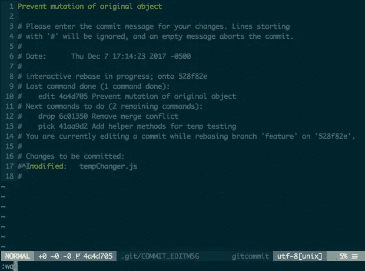

我们可以编辑提交消息，也可以保持原样。让我们选择保持提交消息不变，我们将键入`:wq`保存并退出窗口。

我们现在已经编辑了我们的旧提交。那现在怎么办？运行`git status`:

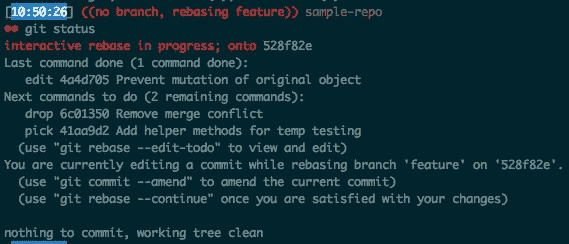

# 继续交互式重置基础

我们在提交中没有其他要更改的内容，所以让我们继续吧！

我们运行`git rebase --continue`并看到以下消息:

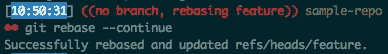

哇，我们完了？但是另外两次呢？下一个要执行的提交是`6c01350`。当我们开始交互式 rebase 时，我们将这个提交标记为删除(`drop`)。Git 自动删除它，并转移到下一次提交，`41aa9d2`。这个在最初的交互式 rebase 中从未被修改过。它的默认命令是`pick`，这意味着将使用提交。Git 应用了这个提交，因为这是最后一次提交，所以交互的 rebase 完成了。

请注意，如果我们有更多的提交要编辑，我们将简单地移动到下一个提交，并开始修改它的过程，就像我们上面做的那样。这个循环一直持续到没有提交为止。

# 弹出按钮

值得注意的是，如果在我们的交互式 rebase 的任何一点上我们把事情搞砸了，并且不知道如何修复它们，我们总是可以中止。在任何时候，我们都可以在终端中运行`git rebase --abort`,交互式重设基础将被中止，不保存任何更改。然后，我们需要再次开始交互式 rebase。

# 交互式重置基础后

我们的 git 日志现在看起来像这样:

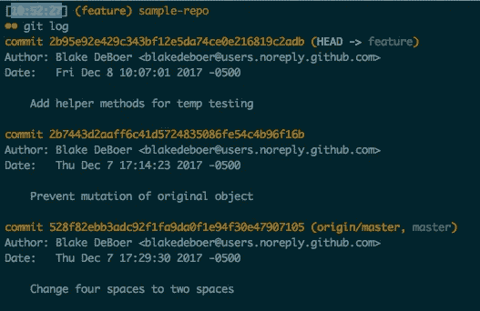

您会注意到，在我们开始交互式重新构建基础之前，有一些事情发生了变化:

*   我们不再有提交消息“移除合并冲突”的提交`6c01350`。这是我们在交互式 rebase 中删除的提交。
*   我们的提交我们编辑，`4a4d705`，有一个不同的 SHA-1，`2b7443d`。
*   我们原始 git 日志中最近的提交`41aa9d2`也有一个新的 SHA-1`2b95e92`。此提交并未更改，而仅应用于其之前的提交`2b7443d`。

# 交互重定基准的副作用

对于我们的 git 日志中最近的两个提交，由于它们具有新的 SHA-1，Git 将它们视为全新的提交。上一次提交`2b95e92`时甚至是这样，提交消息和文件都没有更改。这就为交互式重定基准带来了一个要点:**如果修改一个提交，该提交和所有后续提交将具有新的 SHA-1。**

如果已修改的提交尚未推送到远程分支，则这不会影响任何操作。但是，如果您确实对已经推送到远程分支的提交完成了交互式 rebase，然后再次推送到分支，您将看到:

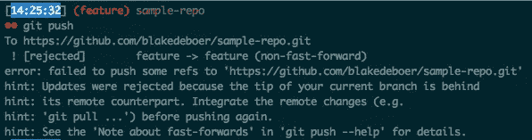

从技术上讲，你可以通过使用`git push --force`绕过这个，但这是非常危险的。如果远程分支具有来自其他人的提交，但您的本地分支还没有这些提交，则您将有效地删除他们的提交。

另一个解决方案是使用`git push --force-with-lease`，它将只修改您的提交，而不修改属于其他人的提交，尽管这也可能是有问题的。例如，如果另一个开发人员已经拥有在他们的本地分支上被给予新 SHA-1 的那些提交，当他们拉远程分支时，他们将与这些提交中的每一个具有合并冲突。

使用`--force-with-lease`的时间超出了本文的讨论范围，但在此之前最好咨询一下团队中的其他成员。你可以在这里阅读更多关于`git push --force-with-lease` [的内容。](https://git-scm.com/docs/git-push)

本节的主要收获是，在尚未推送到远程分支的提交上使用交互式重定基准更加容易和安全。

*布莱克·德博执笔。最初发布于* [*Dev.to*](https://dev.to/blakedeboer/beginners-guide-to-interactive-rebasing-1ob)

纽约市的资深、首席或主要开发人员？ [*大步流星正在招人*](https://www.stridenyc.com/careers) *！想要提升你的技术团队？* [*看我们怎么做*](https://www.stridenyc.com/our-work) *！*[*www.stridenyc.com*](http://www.stridenyc.com/)