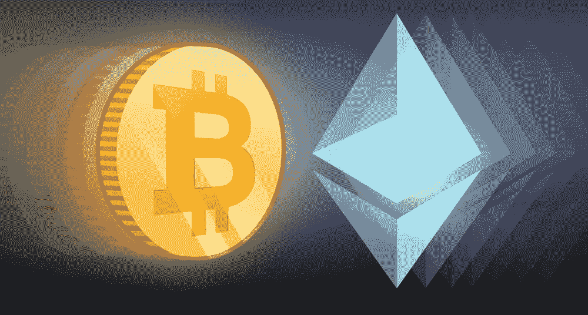

# 投资加密货币的初学者指南

> 原文：<https://medium.com/hackernoon/beginners-guide-to-investing-in-cryptocurrencies-c811d06bbad2>

对于第一次涉足密码世界的新手来说，这似乎有点令人困惑，因为在投资任何一种特定类型的硬币之前，都需要知道很多东西。然而，只要稍加指导，你就可以开始学习诀窍，并很快精通这种类型的投资。

像任何投资一样，一个人不应该在不知道自己在投资什么的情况下投资任何东西。对错失良机的恐惧有时会促使你做出仓促的决定，而在投资领域，这可能会导致亏损。了解空间是投资加密货币的关键，如果你不知道空间，那么你需要花一些时间学习区块链技术，以便在开始之前很好地了解这个平台及其工作方式。

花点时间进行这项研究，也有一些高质量的研究中心可以快速训练你如何在这个领域投资。不要认为这需要在几天内完成，或者更糟，几个小时。在决定把你的资产投资到哪里之前，花适当的时间，在这个领域变得熟练。然后是时候进入一个投资团体，在交易所开户，冒险进入加密货币的世界。

首先，你可能想在一个加密货币投资和研究中心开一个账户，然后是一个交易所，如北海巨妖或比特币基地，允许人们将法定货币兑换成加密货币。存款，现在你就可以开始投资了。没必要一开始就做大。我们建议你从小处着手，不要认为你会马上暴富。你能走运吗？当然，任何人都可能走运，但走运不是一种投资策略，你永远不要指望它会发生。

所有第一次投资的人都应该从小处着手，掌握诀窍，以尽可能保证自己的安全。你会马上注意到，加密货币的波动性非常大，而且有很多加密货币可供投资。那么是哪一个呢？或许最好从比特币或以太坊这两大货币开始，因为它们是各种加密货币中最值得信赖和最安全的。

你可能想把一半的钱投入比特币，另一半投入以太坊。与此同时，开始研究其他各种硬币，并充分了解它们，以便当你准备好并对你对这个市场的了解有一些信心时，你可以开始将你的投资分散到这些其他加密货币中。发现更小的替代硬币(替代硬币)是真正的利润所在，如果投资正确的话。

然而，只有当你了解了关于这些硬币、它们的交易和历史的一切之后，才应该这么做。找出这些特定加密货币存在的原因，找出它们背后的团队，找出它们解决的问题，阅读它们的白皮书，然后做出明智的决定，即是否将你的钱投入这些硬币对你来说是有意义的。

就像如果你要投资股票，你会想研究这些股票背后的公司，找出诸如谁在他们的团队中，谁在他们的董事会中，他们的商业计划是什么，他们去年的收入是多少等等。所有这些数字、名字和历史都是人们在投资股票之前想要知道的。任何投入加密货币的资产也应该如此。

你还应该加入任何声誉良好的社交媒体平台，这些平台可以让你与加密货币中的人接触，并找到你最感兴趣的交流的特定页面/聊天。注册他们的电子邮件，获取他们的 Twitter 信息，在脸书上找到他们，并在投资之前积极地与他们的人谈论这些硬币。

一旦你开始尝试，至少每月一次好好审视你的投资，并根据该季度明显的趋势做出调整。如果你认为这种趋势会持续下去，也许你需要从一个基金中撤出，分配到另一个基金中。

在任何投资中，你能做的最好的事情就是开始时一步一步来，这样如果你犯了一个错误，它不会让你损失惨重。用你的小额投资学习所有在艰难学校教的课程，这样当你把大量资产投资于加密货币时，你就会对它有足够的了解，以避免陷阱，并开始在加密游戏中赚一些真钱。