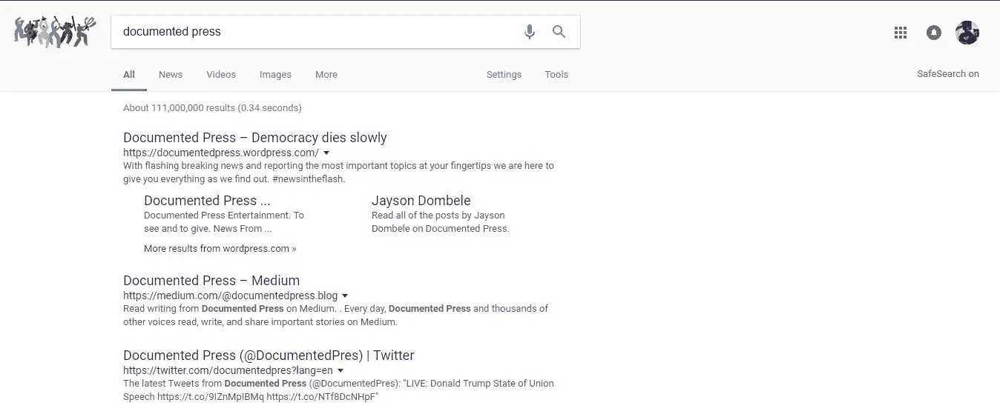
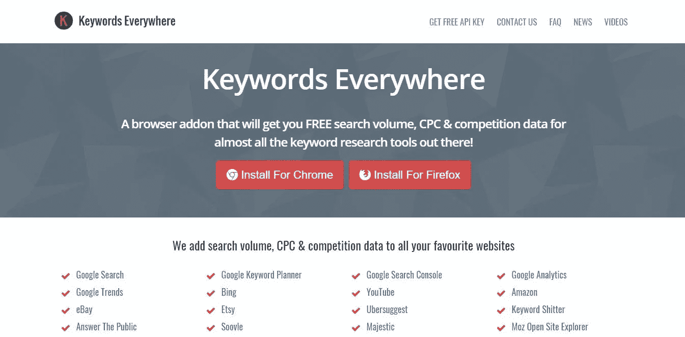
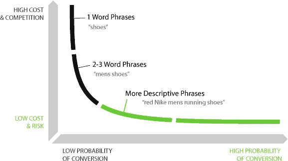
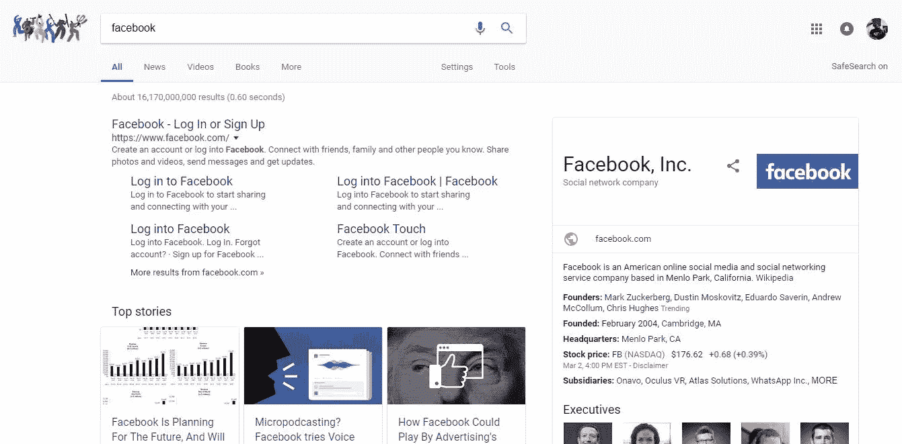

# SEO 101 入门指南

> 原文：<https://medium.com/hackernoon/beginners-guide-to-seo-101-143d792a36a0>

*逐步引导受众扩张和名气暴涨的结果*

Photo Credits: [yourdigitalresource.com](https://yourdigitalresource.com/seo-in-atlanta-basic-seo-tips/)

这不是一篇博客文章，而是一篇信息性文章，帮助那些正在学习使用 SEO 的人和那些打算扩展他们在搜索引擎优化方面的知识的人

# 搜索引擎优化的目标

搜索引擎优化是为了帮助有价值的内容出现在搜索引擎上。SEO 帮助企业吸引客户，甚至在登录页面结束之前就共享关键信息。

根据 Udemy 的数据:95%的用户点击都指向谷歌首页结果。

让我问你这个问题——你会看谷歌第二页的结果吗？我知道我不知道，我敢打赌你也不知道，如果你只知道第二页及以上的内容，往往不会提供有价值的信息。

*在这篇文章结束时，如果你理解了我的解释，相信你的搜索引擎优化结果会有显著的变化。*

**获得回应性 [SEO](https://hackernoon.com/tagged/seo) 的另一个特别好处是，如果你在 [Google](https://hackernoon.com/tagged/google) 上获得最高搜索结果，这一切都是免费的。

# 3 步登顶谷歌搜索

*   1) **关键词搜索→** 这些是描述你的企业的主要词汇。这对你的业务至关重要，因为不仅你幸运地得到了观众的关注，他们也能了解你的网站到底是什么！

Picture #1

根据图 1，文档化媒体的关键词搜索是:随着“突发新闻和报道最重要的话题触手可及，我们在这里给你我们发现的一切。#newsintheflash。"

*   2) **优化→** 这就是你分解内容的地方。你需要有你的信息在一个利基点，并从那里建立。当你瞄准一个非常特殊的人群时，优化效果会更好。

Picture #2

在这种情况下，图片#2 优化惊呼:“记录媒体娱乐。去观察和给予。来自……"的消息

嗯，这里的优化不好，因为我还没有更新它。(我的借口是我正忙于另一家初创公司，所以我没有修复它，那是在我对 SEOs 一无所知的时候)。

默认情况下，谷歌已经表明，有记录的新闻娱乐新闻是“看和给”。

所以一定要优化你的网站，让谷歌不只是假设你想要什么。

*   3) **建立权威→** 这是你创造引人注目的内容，让用户到处分享的地方。

# 推荐的关键字搜索工具

到处都是关键词！

“关键词无处不在扩展是你的免费关键词工具。它可以很容易地安装在 Chrome 或 Firefox 中。最棒的是，我们向您展示了使用**谷歌关键词搜索量、每次点击成本以及多个网站上关键词的竞争数据**。”

我希望你记笔记，因为如果你还没有，我建议你回去，因为这一切都很重要。我的意思是，如果你认真对待数字营销，这非常重要。

# 搜索引擎优化分析

对我来说，搜索引擎优化分析归结为三个部分。

1.  **音量→** 某一时间的观看人数(如日—月—年等)
2.  **每次点击成本(CPC) →** 当你获得更多的点击，这意味着你获得更多的价值。当使用 CPC 时，你也可以找到哪个关键词更有价值，只要你下载一个 SEO 应用程序，就像到处都有*关键词一样。*
3.  **竞争→** 到处使用像关键词这样的程序，你可以发现有多少人在点击某个关键词的链接，以及使用它的竞争对手的实力。

# 图形搜索引擎优化

Photo Credits: [Pitiya](https://www.pitiya.com/long-tail-keywords-in-search-engine-optimization.html)

对于排名来说，从图表的右下角开始，随着你获得更多的观众，排名会逐渐上升。

这是你关键词优化时最好的因素！

# 如何 SEO 优化你的主页？

嗯，搜索引擎优化网页结果标题很重要，所以当人们搜索时，他们可以得到一个更相关的主题。这就像当你寻找一本关于神学的书时，如果书名中有“耶稣”或“基督教”这样的关键词，你会觉得更容易。在网页结果上的网站也是如此。

在你得到标题后，确保你的品牌名称就在主页标题的前面。个人品牌是关键。无论你去哪里，个人品牌都是可靠的。这是让事情继续下去的一个因素。

*→想了解更多关于个人品牌的信息？看下面的视频←*

紧接着标题，不要忘记再次表达你的品牌/业务。

我左边的截图是脸书的谷歌搜索结果。

脸书用这些话对他们的产品做了一个简短的描述:“创建一个账户或者登录到脸书。与朋友、家人和其他你认识的人联系。分享照片和视频、发送消息和获取更新。”

保持描述简短和合理！

描述需要保持最多 55 个字符，否则将被切断。

# 如何用反向链接建立权威？

你可能听说过不同形式的反向链接，但为了澄清一切，反向链接是指向你的页面的链接。

反向链接是建立你的 SEO 价值的另一个极其重要的因素。当你收到很多反向链接时，谷歌会发现你在网站上发布的内容对你周围的社区很重要，所以你开始提升排名。

把它想象成分享某人给你带来价值的脸书帖子！完全是一回事！

# 如何保护自己不被黑帽 SEO？

~不要购买人工反向链接(如果你这样做你的网站可以被谷歌企鹅禁止)。只要以正确的方式构建你的内容。

你已经走了这么远！现在你已经掌握了搜索引擎优化的基本知识！尽快修复您的设置，并开始收到丰硕的成果。

希望从你们那里听到好的结果！

## 谢谢你看我的文章！欢迎在下面留下评论或了解更多关于我的信息！！

## 关于我自己的更多信息:

我 16 岁|程序员|出版公司首席执行官|内容营销人员

*   如果你有兴趣和我一起跟进，请查看我的网站:[https://jdombele.wixsite.com/jayson](https://jdombele.wixsite.com/jayson)
*   如果你对我的 PitchUs 创业感兴趣，请查看下面的链接:【https://jdombele.wixsite.com/pitchus 
*   想要了解政治、商业、科技等方面的新闻吗？【https://documentedpress.wordpress.com/ 

任何问题，业务查询或关注，请随时发送电子邮件给我@:jdapple4357@gmail.com