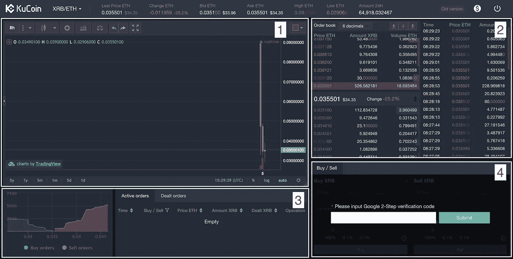
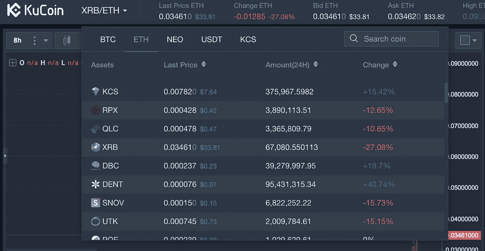
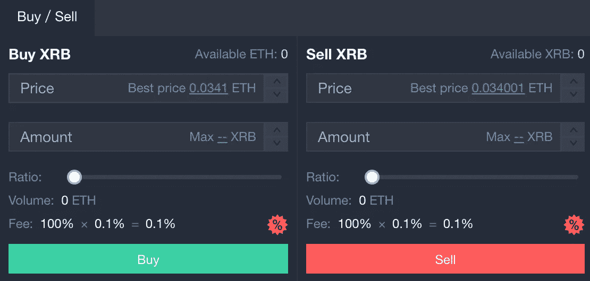

# KuCoin 交易新手指南

> 原文：<https://medium.com/hackernoon/beginners-guide-to-trading-on-kucoin-26ae456eb9aa>

## 1.交易图表

这个图表显示了给定时期内最近的价格历史。在左上角，您可以调整每个烛台代表的时期，也可以添加技术指标。对于那些不知道发生了什么的人来说，这里有一个关于如何阅读蜡烛图的很好的教程。

## 2.订单簿+最近订单

这将在左侧显示未完成的订单，在右侧显示最近的订单。中间你看的是现价！

## 3.你的命令

您可以使用此区域查看您的订单历史、未结订单和交易历史。您也可以在这里取消尚未成交的未结订单。

## 4.下订单

这部分是你交易的主要部分。如你所见，我的被封锁了，直到输入 2FA 键。KuCoin 只有限价单，所以我将在本指南中详细介绍如何使用它们

# 交易货币——例如:瑞士法郎或 XRB 与瑞士法郎

仔细检查你是否选择了正确的交易对。对于我们的教程，我们希望 XRB/ETH。

您的交易对显示在屏幕的左上方，您可以将鼠标悬停在它上面来查看各种选项。单击以太网部分以显示以太网对，并选择 XRB/以太网对。如果您尚未打开图表，这将更新您的图表。

更新后，转到订单框(框 4)，并输入您的 2FA 代码解锁交易区。KuCoin 让你设定想要的价格，以及你想购买的数量。您可以点击“最佳价格”旁边的链接，自动填充下一个可用的购买价格，或者您可以设置不同的价格，以获得更好的价格。如果你不知道自己在做什么，那么在设定自己的价格时要小心，因为你可能会意外地付出高于当前市场价格的价格！

决定价格后，你所要做的就是输入你想要多少 XRB！如果你数学很差，你可以使用滑块根据市场价格和你账户中的 ETH 数量来计算你当前的 ETH 与预充金额的比率；).一旦金额设置完毕，点击购买！就这样，你买了你的第一辆 XRB！

> 在你学习购买加密货币的同时，你也需要对加密货币交易承担**责任并缴纳**税款。这里有一篇文章试图**减少混乱，并澄清**关于加密交易收益税的问题。

 [## 如何使用 BearTax 对加密货币收益征税

### 比特币基地、GDAX、Gemini 等地的密码交易员迫切需要计算他们从比特币中获得的收益

hackernoon.com](https://hackernoon.com/how-to-pay-bitcoin-cryptocurrency-tax-reliable-tools-beartax-bfce8bbb81bc)