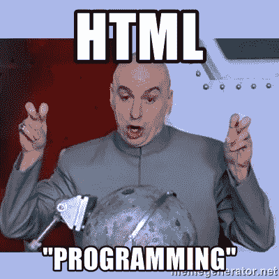
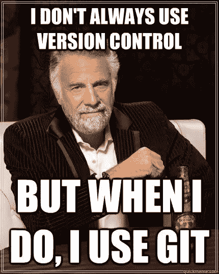
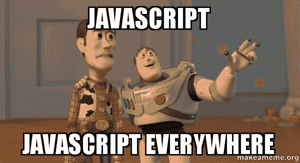

# 开始您的 Web 开发之旅？从这里开始。

> 原文：<https://medium.com/hackernoon/beginning-your-web-development-journey-start-here-7084346f5762>

四年前我开始学习如何编码。当我开始的时候，我知道我想建立网站和应用程序。我想我应该学习我需要的东西，做一些很酷的东西来获得一份初级开发人员的工作。我没有预料到的是有多少工具可供选择，也没有太多关于从哪里开始的方向。选择一个代码编辑器，使用命令行，版本控制，更不用说学习技术术语，这使得开始变得很困难。

我无法告诉你有多少个夜晚，我在错误的方向上转动轮子，学习我从未用过的东西。这是我希望有人能告诉我的，以及一堆伟大的资源让你开始。

## 从哪里开始

有很多语言和工具可以用来构建 web。它们都有它们的好处，并且由成吨的超级聪明的人来维护。虽然这对于推动网络向前发展很有帮助，但开始时却令人困惑和不知所措。

> 专门学 HTML，CSS，Javascript。

如果你对 HTML、CSS 和 Javascript 有很深的了解，你将能够在网络上创造任何东西。

## 核心十人组

争取每周十小时真正的编码。这意味着在编辑器，吊索 div，和写作方法。播客、教程和阅读博客都不在这十项之内。不要走过去，也绝对不要走过去。理解这些概念需要一定的时间，所以稳定的节奏会更快地提升你的技能。

## 要使用的工具

接下来，下载 [VsCode](https://code.visualstudio.com/) 作为你的代码编辑器。在那之后，你需要一个终端来运行命令和做其他各种事情，所以下载 [iTerm2](https://www.iterm2.com/) 。最后，你需要一个浏览器来测试你的网站，所以请使用最新版本的[谷歌浏览器](https://www.google.com/chrome/)。

## 融入社区

赶上的唯一方法就是直接跳进来。请执行以下操作:

*   每天阅读 [FreeCodeCamp](https://medium.freecodecamp.org/) 和 [Hackernoon](https://hackernoon.com/)
*   每周收听播客[语法](https://syntax.fm/)和[商店脱口秀](http://shoptalkshow.com/)
*   跳上 Twitter，关注一群开发者。这里有一个简短的名单让你开始:[我](https://twitter.com/Mwood230)(不要脸的插头)[丹·阿布拉莫夫](https://twitter.com/dan_abramov)[凯尔·马修斯](https://twitter.com/kylemathews)，[克里斯蒂安·恩万巴](https://twitter.com/codebeast)，[韦斯·博斯](https://twitter.com/wesbos)，[杰森·米勒🦊⚛](https://twitter.com/_developit) ，[斯科特·托林斯基](https://twitter.com/stolinski)，[瑞安·弗洛伦斯](https://twitter.com/ryanflorence)

你能理解这些东西吗？大概不会。重点是让你早点了解它，这样以后更容易投入进去。

## HTML 和 CSS

**时间:** 40 小时

HTML 让网页有了结构，CSS 让它们看起来更漂亮。**在这一部分不要使用 Bootstrap 之类的库进行造型。**重点是习惯仅使用 CSS 创建标记、定位元素和样式。为此，我可以参考以下资源:

*   代码学院
*   [树屋:前端 Web 开发](https://teamtreehouse.com/tracks/front-end-web-development)

当你构建东西的时候，专注于使用 Chrome 开发工具。熟悉所有这些东西很重要，这样你以后就可以深入了解它们。

## 源代码控制

**时间:在这一点之后你做的每一个项目**

不要跳过这一步！从现在开始直到永远，使用源代码控制来跟踪和管理您的变更。如果你真的把事情搞砸了，这可以让你回到过去，与其他开发者合作，在线分享你的代码。首先，您需要安装 Git，创建一个 Github 帐户，并初始化一个存储库。查看本课程以开始学习:

*   树屋:Git 基础知识

这可能是你第一次使用命令行来处理计算机事务。熟悉那里很重要，Git 有助于您最初熟悉它。在你对事情感觉良好之后，开始使用 [SourceTree](https://www.sourcetreeapp.com/) 。它有助于你形象化事物，使用起来更友好。

## java 描述语言

**时间:** 80 小时

现在是时候让事情变得生动起来，开始学习 Javascript 了。这是网络的脚本语言，现在你几乎可以做任何事情。你可以创建 iOS/Android 应用程序、后端服务器、web 应用程序、桌面应用程序，甚至可以用它进行机器学习。把你所有的时间都集中在学习这门语言上。如果你研究一下，你会看到 PHP、Ruby、Python、Node、Flask、React、Angular、Webpack、Jenkins、Wordpress、Rollup、Firebase、Docker、Yaml 等等。所有这些东西都很棒(可能除了 PHP)，但是在扩展之前，你需要专注于学好一件事。你很可能不会做太多网络上的事情，但是现在还可以。开始的地方:

*   [想学 JavaScript？这里有一个免费的 24 部分课程让你开始。](https://medium.freecodecamp.org/want-to-learn-javascript-heres-a-free-24-part-course-to-get-you-started-e7777baf86fb)
*   [现代 Javascript 从头开始](https://click.linksynergy.com/link?id=eWIzQPBiqsA&offerid=507388.1463348&type=2&murl=https%3A%2F%2Fwww.udemy.com%2Fcourse%2Fmodern-javascript-from-the-beginning%2F)

## 把所有的东西放在一起

**时间:** 60 小时

在这里，您可以将目前所学的一切整合起来，打造出一些非常酷的东西。我推荐你去看看韦斯·博斯的 [Javascript 30](https://javascript30.com/) 课程，尝试各种项目。

## 反应

时间: 100 小时

这是[学习](https://hackernoon.com/tagged/learning)现代 web [开发](https://hackernoon.com/tagged/development)的成败步骤——学习你的第一个库/框架。你在就业市场上看到的对 web 开发人员的大部分需求都涉及到一些 Javascript 库或框架的知识。流行的有 React、Angular、Vue、Preact 和 jQuery(虽然现在没那么多了)。你可能最终会学到不止一种，但我喜欢先学习 React，因为它会动摇你迄今为止所学的一切。要查看的课程:

*   [升级教程:为每个人做出反应](https://www.leveluptutorials.com/tutorials/react-for-everyone)
*   [现代用 Redux 反应](https://click.linksynergy.com/link?id=eWIzQPBiqsA&offerid=507388.705264&type=2&murl=https%3A%2F%2Fwww.udemy.com%2Fcourse%2Freact-redux%2F)

## CSS 时间

**时间:** 20 小时

到现在为止，你应该已经收集了一些好的项目，并且有希望在这个过程中学会了 CSS。这通常是你学的第一件事，但也是最难掌握的。你可能在上面列出的课程中看到过，也有很多不同的方式来设计风格。你有 CSS，SCSS，LESS，CSS-in-JS，inline-styles，PostCSS，Scoped CSS，在此之上还有一堆不同的设计方法来组织你的 CSS。不要让这些压倒你。为了赶上进度，请阅读[现代 CSS 为恐龙解释](/actualize-network/modern-css-explained-for-dinosaurs-5226febe3525)。

现在是时候深入了解 Flexbox 了。这将使您能够轻松创建布局。为了学习，阅读【Flexbox 如何工作——用大的、彩色的、动画的 gif 图解释

## 更多 Javascript

**时间:** 20 小时

如果你已经走了这么远，是时候放慢脚步，回顾一下你所学到的东西了。库、编码模式和最佳实践一直在变化，但是语言的基础不会变。深入学习 Javascript 是 web 开发长期成功的关键。购买本课程，通读其中的每一课，并确保在继续学习之前理解这些内容。*打碎玻璃*

*   [Javascript:理解奇怪的部分](https://click.linksynergy.com/link?id=eWIzQPBiqsA&offerid=507388.364426&type=2&murl=https%3A%2F%2Fwww.udemy.com%2Fcourse%2Funderstand-javascript%2F)

遵循这个指南将帮助你更快地学习，并专注于 web 开发最重要的方面。如果你对遵循本指南结构的免费视频系列感兴趣，请鼓掌并订阅！

*披露:这些链接中的一些是附属链接，如果你点击这些链接并购买，我将赚取一小笔佣金。我只推荐我使用的服务和产品。这有助于支持我的博客，并允许我保持我的内容免费。谢谢大家的支持！*

我叫马库斯·伍德。我是 Caldera 的创始人，Caldera 是一家专注于网络应用的全方位服务数字机构。