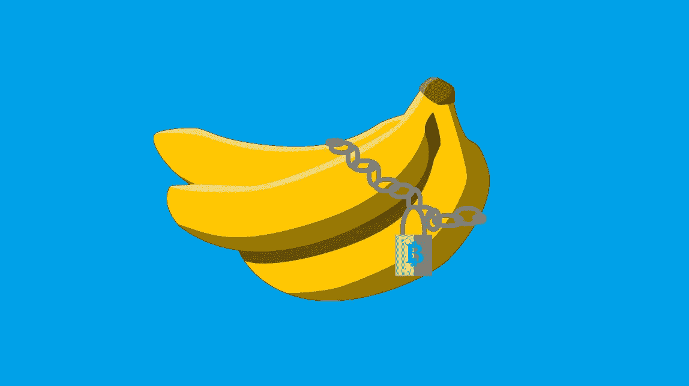

# 行为加密经济学:数字货币的秘密

> 原文：<https://medium.com/hackernoon/behavioral-cryptoeconomics-the-secret-of-digital-currencies-ac6e9b04fcb6>

## (还是添加剂专用的未来:释放香蕉人质！)

风投和[领域专家](https://www.coindesk.com/making-sense-cryptoeconomics/)通常会很快指出，密码经济学和经济学基本上是一回事。根据他们的说法，区别在于数字货币的行为和激励应用。

这就是为什么如此多的人对 Satoshi 的天才表示敬意——他们指出了经常被引用的[比特币白皮书](https://bitcoin.org/bitcoin.pdf)的“激励”部分。这篇 236 字的迷你文章本质上解释了比特币制造者加入和维护网络的动机，因为他们可能会赢得硬币，他们可能会在分配到区块时收取交易费，并且通过欺骗系统，他们只会破坏自己的硬币。

尽管不信任激励结构无疑在比特币的成功应用中发挥了作用，但加密货币更重要的作用仍处于社会经济的半影中。正是因为这个原因，我不能同意法定货币和数字货币在经济学上是一样的说法。Satoshi 的激励是好的，但还不够好。事实上，数字货币的秘密潜力将让资本主义和社会主义显得野蛮。

数字货币最大限度地减少了第三方腐败和私利，但迄今为止，它们尚未完全协调网络上各方的激励。而资本主义的目标是双赢(我给你一块钱，你给我一个好)，账本继续以零和的方式记录交易，从这个私钥中减去一个比特币(或美元)，改为加到另一个私钥中。但是，未来的数字货币不太可能保留这种经济范式。

随着莱杰(区块链)继续记录这些减少，人们失去了获得新商品的能力。如果我可以“免费”获得商品，而商家可以通过给我他们的免费商品来获得财富，这不是很好吗？听起来很荒谬，不是吗？但是，我认为这种荒谬其实是不可避免的。

分类账旨在追踪相对财富。到目前为止，财富是由债务票据和有价值的有限资源(即黄金支持的美元，或者，今天，只是实物票据本身)的组合来衡量的。这是因为商品是有限的。但是，这真的是真的吗？当然，有些商品可能会继续稀缺，即使我们变得高效利用它们。尽管如此，这些商品正缓慢但肯定地成为边缘案例。

在信息时代，信息就是财富。信息并不稀缺。如果我们在玩线索游戏，你说“Plumb 教授在厨房里拿着烛台，”我给你看烛台卡，突然之间你就凭空获得了新的信息，但我没有牺牲我对烛台卡的了解来给你这些信息。又不是有账本能确保在原持卡人身上制造烛台失忆。我们也不希望有。《线索》的整个游戏就是在人与人之间复制信息，直到信息网络达到临界质量，游戏结束。

我在说什么？我的意思是，如今商品的性质与追踪财富的手段之间出现了背离。当我们购买信息时，我们放弃了一种稀缺资源(一张实物钞票，或我们目前所知的比特币)，以获得一种非稀缺资源。你猜怎么着？我们人类知道它并且*讨厌*它。

这正是盗版猖獗的原因。当 YouTube 和亚马逊向你收取 4-5 美元观看一部电影，而你知道电影的创作是一种[沉没成本](https://en.wikipedia.org/wiki/Sunk_cost)，YouTube 的服务器可以以远低于 1 美元的价格为你提供观看电影的带宽，这是非常令人恼火的。个人对电影(信息)的观看是无限可复制的——所以人们经常发现放弃有限的资源来获取无限的资源是令人不快的。

数字商品的无限性和法定货币的有限性之间的背离也在谷歌([、110 亿美元](https://www.statista.com/statistics/266206/googles-annual-global-revenue/))和脸书([、410 亿美元](https://www.statista.com/statistics/277229/facebooks-annual-revenue-and-net-income/))等信息巨头的怪异收入流中显而易见。他们获得了一种可以无限复制的产品(与广告商相关的用户信息)，并以有限资源(美元)的形式收取费用。资本主义管用(管用？)因为同样的好东西不能卖两次。但是今天，谷歌可以一遍又一遍地重复出售同样的信息。

数字货币的秘密力量在于它可以变得无限。世界上没有需要凭空复制自己的实体钞票。当我通过 YouTube 在线观看一部电影时，一个数字货币账户可以给 YouTube 增加 5 分(他们毕竟让我获得了好莱坞的信息)，而*而不是*不会从 little ol' me 身上减去任何分。数字货币的秘密力量在于它可以是只可加的，就像 Clue 是只可加的一样。这就是事情变得疯狂的地方。这比我们一直坚持的以稀缺为中心的金融体系更准确地反映了当今的商品。

[杰里米·里夫金指出](http://www.thefiscaltimes.com/Articles/2014/07/30/Zero-Marginal-Cost-Society-and-End-GDP)国内生产总值衡量实际国民财富的效用已经减弱。生活水平的提高怎么会超过 GDP 的增长呢？再一次，这又回到了零和货币之间的分歧，以及[非零和](https://en.wikipedia.org/wiki/Zero-sum_game#Non-zero-sum)商品交换。里夫金声称，国内生产总值的停滞“事实上可能是一种以全新方式衡量经济价值的经济范式日益重要的衡量标准。”加密货币开发商——你在听吗？这很重要。先说为什么。

还记得我说过数字货币有可能让资本主义和社会主义看起来很野蛮吗？也许这听起来有些鲁莽。让我们打开它，你可以自己决定我们是否一直像野蛮人一样生活。

很久以前，我走出西夫韦，在人行道上看到一个无家可归的女人。她看起来死了。是吗？等等——她是吗？！我靠近她，她把头靠在一个小垃圾袋上，里面塞满了我认为是衣服的东西。她一无所有。我等了几分钟，拼命想察觉她胸腔的起伏。她的额头在冒汗(我觉得这是个好兆头，对吧？).她的脚踝有一个开放性的伤口(可能有四分之一英寸深，大约有我的拇指和中指指尖围成的圆圈那么大——很大)。她体重极轻。她闻起来——很难闻。她腐烂了吗？或者只是需要洗个澡？为什么没有人停下来？经过大约 20 秒钟的痛苦，我弯下腰，让我的脸靠近她的脸。她一直一动不动。然后，我听到一个非常努力呜咽嘘类型的呼吸。

我感到极度宽慰，但也极度恶心。有时你看到一个无家可归的人，但并没有受到影响。还有一些时候，街上的那个人深深地印在你的心里，你永远不会忘记他们。几年后，你随意回想他们，想知道他们是否还好。这是其中的一次。我冲进西夫韦给这位女士拿水和健康餐。希望她醒来后会有所帮助。我走进这家有空调和丰盛的超市。农产品通道堆满了大量美味的维生素和矿物质，随时可以食用。那么，为什么这个女人一直没能得到她如此迫切需要的营养呢？她离富足只有二十码远。

我来告诉你为什么。因为西夫韦拿他们的香蕉当人质！对于幽默来说，这是一个奇怪的地方，但让我们承认这一点。这就是正在发生的事情。而且有点荒唐。只有一半进入西夫韦货架的香蕉会被消费掉，但是西夫韦必须扣留这些香蕉作为人质，直到有人来支付赎金。为什么？因为(除了公益工作)我们都拿货物做人质，这样我们就可以支付自己每月的房子、汽车和食物赎金。

如果这个女人出生在一个后数字时代的纯加法货币世界会怎样？西夫韦不会拿香蕉当人质。(作为旁注——Safeway，请不要起诉我。我明白了，你也是经济模式环境的受害者！相反，女人会走进西夫韦，抓起一根香蕉，数字账本会给西夫韦加分(不会从女人身上扣分)，她会得到食物，西夫韦会有一个为世界提供财富的记录。

但是是什么阻止了这个女人清空整个商店呢？有些物品可能需要你证明你已经“给”了别人，所以奢侈品可能需要你至少 100 分，而香蕉可能需要至少 0 分。如果这个女人拿走了所有的香蕉，她吃不完的香蕉太多了，她会受到激励把香蕉给其他人以获得分数(不从其他人那里拿分)。一旦她获得了 100 分，她将获得非生存食品的最低分，如冰淇淋、上等奶酪等等。关键是囤积没有回报，但给予是。

我们已经进入了一个后稀缺世界，是时候让货币开始像它一样行动了。除了调整区块链矿工的激励措施，我们还可以做得更好。我们可以将边缘化和贫困人口的利益与企业巨头的激励结合起来。让我们激励商品的分配而不是囤积商品。

数字货币的秘密是这样的:如果我们愿意，我们可以不再把香蕉、电影和穷人作为我们经济议程的囚犯。此外，我们会因此变得更加富有。

*作者是* [*时代公司*](https://era.eco/) *的员工，该公司正在为未来打造纯添加剂基础设施。*