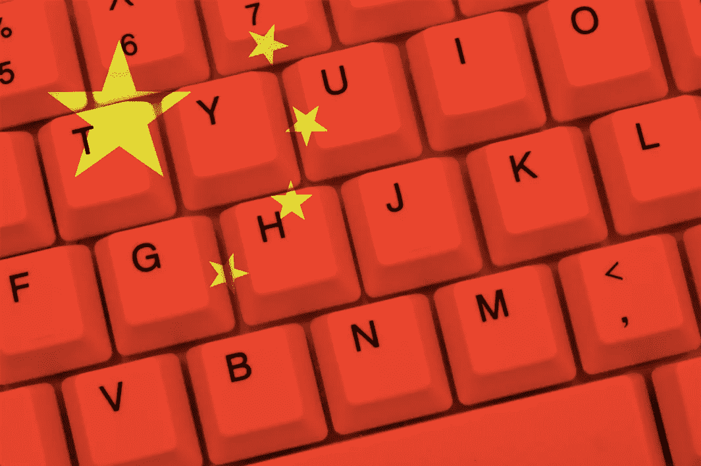

# Behind the Great Wall: Poring Light on the Chinese Internet

> 原文：<https://medium.com/hackernoon/behind-the-great-wall-poring-light-on-the-chinese-internet-c9afbc8e5b15>

The Internet is becoming the main symbol of globalization. It is a universal tool that connects different cultures, socio-economic views, and religions. However, the above statement is far from the truth. In China, the largest country by population, the Internet differs greatly from the rest of the world.

In terms of economy, the People’s Republic of China, represents a strange combination of capitalism and socialism, both with Chinese peculiarities. But when it comes to the Internet, we see the terrible grimace of the censor working for the harshest totalitarian regime.

The Chinese Internet audience consist of 750 million users. Almost 52% of the country population is connected to it. This number will soon equal the population of the EU and the United States combined. This huge market has a plenty of business opportunities. Unfortunately, the Chinese government considers it also a great danger. After all, the Internet remains the fastest source of news and historical information. Authorities think that the truth about what happened on the Tiananmen Square in 1989 (and many other events) should not reach people and that is why it is impossible to allow the Internet to be free.

Therefore, China is trying to block access to most external sources of information, be it CNN, BBC or social networks. This is carried out within the framework of the [Golden Shield project](https://en.wikipedia.org/wiki/Golden_Shield_Project), which introduced full control, censorship and monitoring of Internet traffic on the territory of the PRC in 1998\. The project is led by the Ministry of Public Safety. Officials say the project is aimed at increasing police effectiveness and overall public safety.

**How does this work in reality?**

Every ISP in China must hire special traffic monitoring staff. These censors are called “big moms.” Their main role is to watch all websites and remove any content of a political nature. This happens in different ways, in some cases, the comment gets deleted completely, in others — only the forbidden words are removed (leaving blank spaces) thus showing the presence of power and the watching eye. The list of forbidden words gets constantly updated.

At the search engine level, strict censorship is also present. Special government system compares all search queries with the list of banned words. Websites are analyzed and if they contain forbidden words — search engine hides them and does not show in search results.

It is not difficult to guess most of the forbidden words. Terms and phrases associated with democracy, anti-communism, freedom of speech are banned. You cannot also find anything about Tibet or Dalai Lama. The system filters content related to the government of Taiwan or pages related to the Falun Gong spiritual practice.

当然，残酷的审查制度并不意味着人们注定只能接受一种类型的真相。各种新服务可以绕过这些块。例如，年轻人[使用虚拟专用网](https://www.comparitech.com/blog/vpn-privacy/whats-the-best-vpn-for-china-5-that-still-work-in-2016/)作为自由之门。还有一个 [Tor](https://www.torproject.org/projects/torbrowser.html.en) ，允许自由和无限制地访问替代信息。

中国的黑色软件市场非常活跃，也有助于规避政府的封锁。猫捉老鼠的游戏还在继续——独立软件开发商创造新的方法来绕过审查，与此同时，政府官员创造新的屏蔽技术。

**允许的社交网络**

当然，我们日常使用的 YouTube、脸书、Instagram 和其他服务在中国是被禁止的。但是，与其他有审查制度的国家(如伊朗)不同，这一禁令为准确复制西方品牌的另类私人服务的蓬勃发展创造了条件。

大众对社交网络的迷恋与人们从农村向城市迁移的长期过程有关。新城市居民很快就接受了与现代生活方式相关的一切。二加一家庭模式在这里也很重要。对于许多中国人来说，它与小家庭和孤独的晚年联系在一起。社交网络倾向于弥补这一点。

土豆和优酷是 YouTube 的中国变种。新浪微博是 2009 年推出的非常受欢迎的 Twitter 的翻版。该服务拥有多达 1.8 亿活跃用户。新浪微博在更大程度上是为发布搞笑照片和视频服务的，充斥着广告。

其他西方社交网络只有一两个中国同行，而脸书可能有五个。人人网最受年轻人和学生的欢迎。该服务拥有约 2.6 亿活跃用户。从视觉上看，它与脸书非常相似。

另一个在视觉上类似于脸书的服务叫做 Qzone。它拥有超过 6 亿的用户，但他们并不活跃，主要由小城市和省份的居民代表。开心 001 是为经常在大公司工作的年轻人提供的服务。开心网 001 拥有 1.6 亿用户。

Pinterest 抄袭者叫蘑菇街。它并不流行，只有 4000 万用户。在中国，这项服务已经成为瞄准女性受众的创业公司的工具。公司利用蘑菇街创建网上商店，这使他们能够快速发展，销售更多的产品。

WhatsApp 的类似物在中国叫微信。它有完全相同的特征。它有大量的用户。超过 6 . 5 亿人使用它。也就是几乎每一个能上网的中国公民。

WeChat is also widely used in Middle East countries. In addition to communications, WeChat is also a huge advertising platform, with the limitation that only those users who conduct business in China (and have registered their company) can place ads.

The Chinese love to shop online. Chinese also like to complain about the quality of goods and services. They do it on every minor occasion. Government does not forbid complaining about products or services (unless it has to do with politics). This specific type of freedom of speech leads to the fact that it is impossible to get commercial success in China without attentively listening to the clients’ voices.

Finally, and you should have heard that Google is forbidden too. Qihoo and Baidu have taken its place.

Again, people start using VPNs and get Facebook, Twitter, and other accounts. But for now, it is all useless. You will not find a lot of friends there. Twitter official stats show about 50K Chinese users.

**Trying to fight censorship**

Blocking online communication in social media is a very difficult problem for the Chinese authorities. People have created their own Internet slang that helps to bypass the political censorship. They substitute words and meanings. For example, [River Crab](https://en.wikipedia.org/wiki/River_crab_(Internet_slang)) sounds similar to Harmony\Harmonious, and this word is forbidden in political narration.

The date of the [Tiananmen Square Massacre](https://edition.cnn.com/2013/09/15/world/asia/tiananmen-square-fast-facts/index.html) that happened on the 4th of June, 1989 is another example. It is perhaps the most tracked phrase of the Chinese Internet. Netizens replace it with May 30, that was the key moment of the protests on the square.

In addition, when Chinese cannot say or write something, they show it. They use images instead of words and speak indirectly.