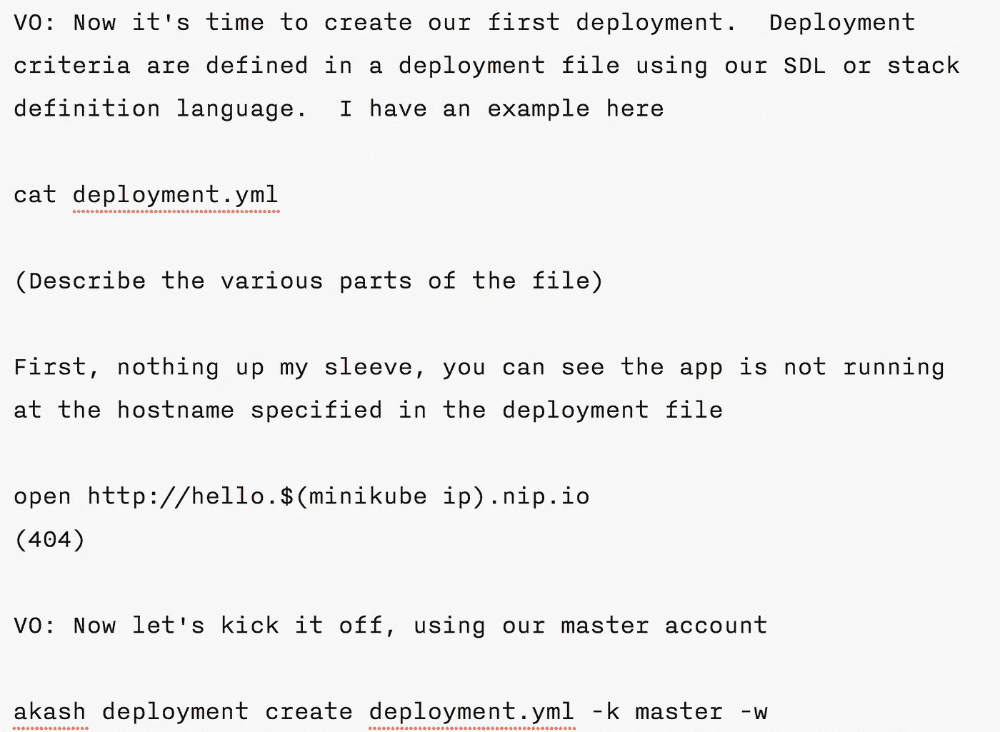
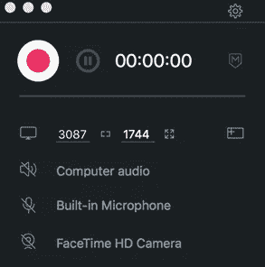
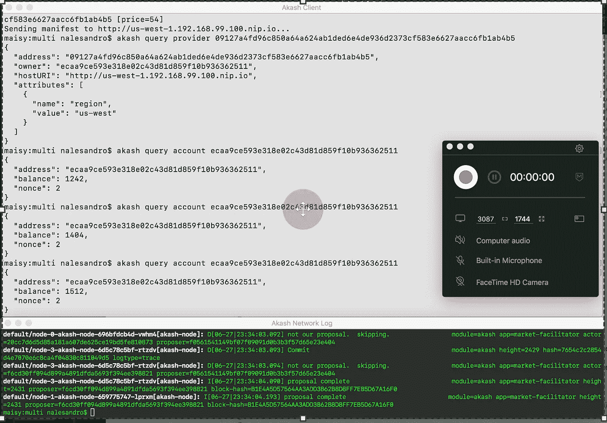

# 阿卡什工作室的幕后

> 原文：<https://medium.com/hackernoon/behind-the-scenes-at-akash-studios-18c718d59bff>

上周，超频实验室发布了 Akash [网络](https://hackernoon.com/tagged/network)的下一个版本，这是一个用于云计算的分散式市场和部署平台。这个 MVP 迭代对我们所有人来说都非常令人兴奋，因为它是该平台的第一个功能完整的版本。到目前为止，基于区块链的[市场已经与基于 Kubernetes 的部署平台完全集成了——或者用英语来说，现在这个东西可以端到端地工作了！](https://hackernoon.com/tagged/blockchain)

请随时前往[我们的网站](https://akash.network/)或[我们的 GitHub repo](https://github.com/ovrclk/akash/) 了解我们所做的一切(或[查看这篇文章](https://hackernoon.com/decentralized-infrastructure-is-a-moral-imperative-2ec13dc3138d)以了解**为什么**我们要这样做)。本文不会做任何这样的事情。相反，我们将重点放在制作这个，阿卡什的第一个演示视频:

我们是一家节俭的初创公司，只有 5 名全职员工，所以当最终展示我们的骄傲和快乐的时候，我们希望它尽可能显得专业，同时花费尽可能少。我将在这里描述工具和过程，以防处于类似位置的其他人会觉得有帮助。

# 工具

1.  **麦克风** : [带 iD22 接口的音频-技术卡 at 4050](https://www.sweetwater.com/store/detail/AT4050-ID22--audio-technica-at4050-with-id22-interface)
    **费用** : $0.00(向朋友借的。标价在 1200 美元左右，所以我强烈推荐借用)
    **入选理由**:专业的话筒在音质上有着巨大的差异。您电脑的内置麦克风输出的声音比 Skype 通话好不了多少。
2.  **截屏软件**:[Wondershare film ora Scrn](https://filmora.wondershare.com/shop/buy/buy-screen-recorder-mac.html)
    **费用**:19.99 美元一年的许可证
    **选择理由**:你可以免费使用 QuickTime，但它可以录制你的整个屏幕。Filmora Scrn 允许您定义和记录选择，并具有一些高级捕捉选项和基本的编辑工具(尽管我没有使用它们)。
3.  **视频剪辑软件**:[iMovie](https://itunes.apple.com/us/app/imovie/id408981434?mt=12&ls=1&v0=www-us-mac-imovie-app-imovie)
    费用 : $0.00
    **入选理由**:我以前用过，挺能干的，而且是免费的。
4.  **音频编辑软件** : [iMovie](https://itunes.apple.com/us/app/imovie/id408981434?mt=12&ls=1&v0=www-us-mac-imovie-app-imovie)
    **费用** : $0.00
    **入选理由**:同上。
5.  **电脑** : MacBook Pro 15 英寸，2.8GHz 处理器，16GB 内存
    **价格**:0.00 美元(这是我的日常电脑——如果你只是为了你的视频项目买一台的话要 2400 美元，但那就太傻了)
    **入选理由**:这是我的日常电脑。

# 该过程

Akash 视频是一个相当技术性的演示，所有的动作都发生在两个终端窗口中。一个基于 GUI 的演示将遵循相同的基本步骤，尽管有一些修改

**1。写下大致的脚本** 大致的脚本包含事件的基本顺序和伴随每个事件的命令。这是我们的一个例子:

Written using iA Writer

**2。将所有命令复制到剪贴板历史管理器**
我是一个糟糕透顶的打字员，所以我没有试图在后期制作中编辑掉我的错误，而是选择将每个命令复制到一个名为 [CopyClip](https://itunes.apple.com/us/app/copyclip-clipboard-history-manager/id595191960?mt=12) (我最喜欢的工具之一)的剪贴板缓冲应用程序中。一旦保存在那里，我就可以通过按键将它们粘贴到终端上。

3087 / 1744 = 1.77 (a 16:9 aspect ratio)

**3。设置要录制的窗口并绘制您的视频捕获选择**
您的窗口应该尽可能大，以最小化在大/高分辨率监视器上播放时的尺寸调整。长宽比应该是 16:9(宽/高= 1.77)，以适合标准播放器。

**4。录制视频轨道** 开始录制，按照草稿中指定的顺序将命令粘贴/输入到终端窗口中。不要担心时间，因为你会在后期制作中调整时间——只要把顺序(当然还有输出)弄对就行了。你现在也没有录制音轨，所以不要担心歌词。

Recording video: Don’t worry about timing, just type the right commands in the right order

**5。粗略地进行编辑，并添加标记。** 因为你没有注意时间安排，你不可避免地需要删掉没什么事情发生的大部分(比如因为你停下来和同事打招呼)，在你知道你以后需要说很多话的地方插入定格画面，或者删掉/掩盖错误。这第一次通过使得以后的微调更易于管理。如果你[在每一个你想添加注释的地方放下标记](http://imovie.skydocu.com/en/organize-video/rate-and-tag-video/add-comment-markers-and-chapter-markers/)(每个命令/解释对一个标记)，你的生活也会变得更容易。

Those purple markers are your friends

**6。用罐头中的视频轨道(某种程度上)写下最终草稿** ，现在你可以用你打算在音频轨道中说的确切单词写下最终草稿。这是上面草稿的最终版本。“M —”符号代表标记位置，这将有助于您稍后匹配音频和视频轨道。

All the words, in the correct order

**7。在阿卡什建立你的录音室，我们使用步入式公用壁橱，用布板盖住门孔。重点是尽量减少外部噪音和硬墙房间的声音反弹。此外，注意麦克风上的 pop 滤波器——非常有用。记录并回放一些测试曲目，以使您的设置正确无误。**

Where the magic happens — professionalism all the way.

**8。记录你的声音轨迹** 放松，呼吸，在短段落中记录你的声音轨迹。在 iMovie 中这样做很简单，只需将播放头设定在您想要的轨道位置，按下录制按钮，并在视频播放时朗读。将它分成小块录制更容易让人紧张，而且(对我来说)在最终编辑时也更容易。

**9。执行您的最终编辑** 现在您可以操作(剪切/冻结/减慢/加速)视频和音频轨道，以便一切都完美地排列起来，并消除任一轨道中任何剩余的瑕疵。确保通过耳机播放音轨，并根据需要调整音量以获得最佳声音。此时，您还需要添加标题幻灯片、过渡、文本和最终视频所需的任何其他效果。

**10。导出、上传和分享**
最后检查一遍整个视频，然后你就完成了！现在只要导出视频，(我们用 mp4)，上传到你选择的视频分享平台(我们用 Vimeo)，分享分享分享。

# 最后一句话

虽然在我漫长的职业生涯中，我做过无数的现场和网络直播演示，但这是我第一次尝试录制和编辑演示。我会让你自己判断结果，但至少，尽管我缺乏经验，我实际上能够*做*(完全披露——我已经摆弄过 iMovie，所以有些熟悉)。

整个过程花了我大约两个半日历日，或大约 8-10 个小时的总工作时间，所以如果你有一台 Mac，一个像样的麦克风和 8 个小时的空闲时间，让它旋转吧！