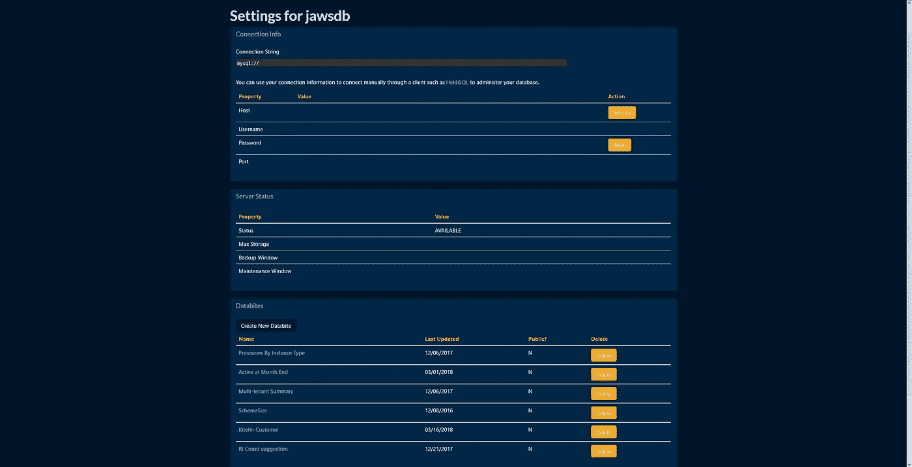

# 数据库作为服务提供商的幕后

> 原文：<https://medium.com/hackernoon/behind-the-scenes-of-a-database-as-a-service-provider-1f5ee1776717>

## 创始人访谈

> *披露:* [Manifold](https://goo.gl/Sm26zK) ，独立开发者服务市场*，之前赞助过黑客正午。* [使用 code HACKERNOON2018 获得任何服务 10 美元优惠。](https://goo.gl/Sm26zK)

让我们谈谈数字。JawsDB 的规模和进展如何？

老实说，这很令人羞愧。大约 3 年前，JawsDB 在第一个月末有 5 个客户。我欣喜若狂。欣喜若狂。我作为热爱的劳动和学习新技术的项目而组织起来的东西正在现实世界中使用？没有像这样的感觉。

> 自那以后发生了很多事情，但今天，JawsDB 已经拥有 20，000 多名客户，并有望在本月再增加 1，400 名。

**你是如何以及为什么选择大白鲨这个名字的？你的产品/服务/宣传中有向电影致敬的复活节彩蛋吗？**

嗯，这不是一个正式的缩写，但是当我试图想出一个名字时，我从关于产品和开发者的最琐碎的事实开始。简单来说就是:“好的，我的名字是约翰。我在利用亚马逊网络服务。约翰..AWS… J… AWS…亲爱的上帝…”

多亏了斯皮尔伯格，这个词很自然地在人们的脑海中唤起了鲨鱼的形象，从年轻的时候起，鲨鱼就让我既着迷又害怕。在这一点上，我绝不是一个人，所以我认为鲨鱼唤起的思想和情感将有助于销售智能、时尚和强大的服务:)

**你是如何/为什么/什么时候创办 JawsDB 的？**

我在 2014 年开始这个项目。当时，我是一家电信公司的微软和甲骨文数据库架构师。一直有大量的 SQL，这显然影响了我编写代码的方向。

> 工作很棒，人也很好，报酬也很高，但我变得焦躁不安。阅读更新的语言和技术让我产生了一种数字漫游癖，所以我开始利用空闲时间用 Ruby 和 Python 创建 web 应用程序，使用不同于我在工作中使用的框架和 SQL 数据库。

JawsDB 开始是为了更熟悉亚马逊网络服务和平台，比如 Manifold 和 Heroku。我越深入，我的眼睛就越大，因为我看到了我们指尖拥有的不可思议的力量。

从那时起，该项目开始由两个目标驱动:

*   1:为了让普通开发人员更容易访问云 SQL 数据库，
*   第二:向我自己证明，即使在我们这个复杂软件的时代，一个人仍然可以创造一个有价值的产品，并把它推向市场。

JawsDB 提供 MySQL、Postgres 和 MariaDB。您的哪些客户使用得更多？而让他们选择一个而不是另一个的关键因素是什么？你如何看待他们的市场份额变化？

> MySQL 数据库是 Jaws 最受欢迎的，遥遥领先。影响这一点的因素有很多，但我只是惊讶地看到 web 开发社区对 SQL 数据库的需求如此之大。我愚蠢地认为这些新平台上的大多数开发人员只会使用最新的技术。

从我自己在技术领域的经历来看，很容易假设某些语言或技术已经死亡，因为它们不再被频繁地提及，或者可能是因为有几篇严厉的博客帖子题为“为什么我离开了[某些技术]并且从未回头！”我感同身受。我开始我的副业，部分是因为我不想落后。

然而，这家公司教会我的是，有效的解决方案会比人们想象的持续更长时间，即使有更新、更好的选择。大量现有的应用程序运行在 MySQL 上，它们需要一个家！更重要的是，我们中的许多人在训练营、计算机科学课程或 web 教程中学习了关于 SQL 数据库的 web 开发。这些数据库引擎又快又健壮，有大量的支持文档、博客文章、栈溢出回答等。这使得它们至今仍是非常有吸引力的选择。

**你为什么决定与流形合作？**

当一位同事告诉我关于 [Manifold](https://goo.gl/Sm26zK) 的事情时，我非常感兴趣地听说附加市场已经与网络服务器分离。他们为开发人员提供了一个机会，可以将 JawsDB 等有用的插件集成到他们的项目中，无论他们将应用程序本身托管在哪里。这种潜在客户群的扩大是诱人的，但在与团队交谈后，他们的专业精神和远见真正说服了我，让我适应他们的平台服务。我相信，如果一个团队能够在这个领域取得成功，那就是他们。

> 通过 Manifold 看到所有不同应用[利用 JawsDB 的多样性，我很受鼓舞。该平台为开发人员提供了真正的自由，使他们摆脱了围墙花园，同时还提供了一个工具集，可以快速地为应用程序添加真正的功能。](https://goo.gl/g5sqHd)

**年纪轻轻，互联网有哪些让你兴奋的地方？**

老实说，我最兴奋的是能够通过即时消息和我学校的女孩聊天。这让我不相信我可以通过 Napster、Kazaa、Limewire 等网站下载我想要的所有歌曲。然后，我在维基百科上兴高采烈地收集了我写研究论文所需的所有资源……基本上，互联网提供了满足一个自私的青少年所需的一切。

> 抓住互联网提供的改变世界的潜力需要时间，我们中的任何人仍然真正抓住它吗？

当革命性的东西变得如此无处不在、习以为常时，我们很容易就把它视为理所当然。路易斯·CK 有一句很棒的话，当人们的手机执行一项任务的时间比“即时”时间多半秒时，他们会感到沮丧。“给它一秒钟！”他愤怒地大叫。“它在向太空发送信息！”

对我们所有人来说，花点时间感谢我们生活在互联网时代是有益健康的。多好的礼物啊！

我知道你获得了计算机科学的硕士学位。这对你的职业生涯有什么帮助？你会向其他希望转型开自己公司的初级开发人员推荐它吗？

这是一个棘手的问题。当我报名参加我的本科课程(也是 CS)时，我已经对 web 开发产生了兴趣。这个项目帮助我学会了高效学习和有效吸收新材料所需的纪律，但大学并不被宣传为学习纪律的地方。我开始相信这可以通过许多不同的途径来学习。

本科文凭本身帮助我在第一份编程工作中迈出了第一步，我不想淡化这一点。我刚从学校毕业，我需要自立。研究生学位同样帮助我在我工作的公司里得到提升，但老实说，我不能说我会把这两个学位中的任何一个归类为成功创业的先决条件，甚至是一般的网络开发。

我认识一些出色的程序员，他们从训练营、自学以及计算机科学项目中走出来。也有同样出身的平庸编码员。这种差异似乎是先天能力、责任心和驱动力的结合。

> 我对任何想创办自己公司的开发者的建议是，首先鼓起必要的勇气，将他们的项目进行到底。

当试图创业时，很容易因为缺乏正规教育或缺乏真正原创的想法而犹豫不决。一个有勇气和动力的人不需要文凭来学习构建应用程序所必需的技能。他们也不需要有下一个伟大的想法来使他们的冒险成功。从长远来看，即使是 10 亿美元市场的 1%,也仍然是 1000 万美元。

**你认为区块链在数据库市场份额方面会有多大的颠覆性？**

简而言之，我不够聪明，无法自信地回答这个问题。对我来说，区块链最令人兴奋的潜力是消除对中央政府和中间人的过度信任。有各种各样的数据库系统将从中受益。对我来说，数据库领域中断的方式、时间或程度是一个谜，但我很高兴能亲眼目睹。

**您对即将到来的哪些数据库创新感到兴奋？你如何看待数据库技术的发展(比如说 5-10 年)？**

> 在 SQL 数据库领域，我不得不说，我对机器学习在配置调优中的应用感到非常兴奋。一个 SQL 数据库可以用于一百万种不同的用途，这些特定的用例将以不同的方式消耗底层服务器硬件和数据库算法。

出于这个原因，这些数据库通常附带了一个默认的服务器配置，该配置被设计为能够相对较好地处理这些用例。然而，熟悉数据库引擎本身和其上托管的应用程序的管理员通常需要调整这些配置设置，以使其“恰到好处”地工作。

正在开发机器学习算法，以观察托管独特应用程序的独特数据库的正常日常操作，并决定如何调整这些配置选项以实现性能增益。他们还可以推荐更好的索引、表格设计等。

> *没有数据库管理方面的培训，很难判断数据库中的“缓慢*”是需要硬件升级，还是可以通过更好的查询、更好的索引、更好的配置调优等来解决。自动调优的这些进步可以消除这种不确定性，减少对数据库支持人员的需求，并使数据库在更便宜的硬件上更长时间地平稳运行。太棒了。

**鉴于我们对脸书&谷歌的依赖，以及这些公司如何从我们的信息中赚钱，你认为每个人都应该拥有自己网络的个人数据库吗？**

作为谷歌服务和脸书的早期用户，我不得不说他们最近的一些商业行为让我有点害怕。最近的剑桥分析丑闻仅仅触及了存储数据种类和目的的表面。

> 在我的硕士项目中，我听到了一些讲座，看到了一些演示，展示了让广告如此有效的行为心理学概念是如何被这些平台和社交网络的大型数据集强化的。其结果是一个行业能够创造高度有效和有针对性的信息。一位讲师称之为“武器化的说服”

从你“喜欢”的页面到你在云文档中键入的单词，所有这些信息都可以由专家和学习算法进行汇总和分析，以描绘出一幅关于你的形象化图片。此外，从早餐麦片到政治候选人和问题，人群中重叠的行为模式可以用来制作强大的广告和有说服力的信息。简而言之，它不仅仅是了解当前的你，还延伸到如何利用你的人口统计的偏见、偏好等知识来塑造未来的你。这些免费使用的服务价值数十亿美元是有充分理由的。

冒着听起来像偏执狂的风险，我要说，拥有一个个人存储解决方案，即使它像拇指驱动器一样简单，在存储您不想用于识别或供行为心理学家使用的敏感数据时，也是一个明智的想法。

我希望像区块链这样的技术最终能让我们对自己的数据有更大的控制权，比如谁能看到它，以及如何使用它。

**您最近允许用户查看他们服务器上存储的备份，并将其恢复到服务器或单独的 JawsDB 实例。你能描述一下这是如何建造的吗？**

传统的 SQL 备份解决方案包括定期保存一个文本文件，该文件包含一个脚本，用于从该时间点开始用其内容重新填充数据库。在不太复杂的环境中，当这个可能很大的文件是通过从数据库中读取而创建时，这可能会导致数据库的性能下降。获取和存储备份文件的一方也会产生存储开销。

我为 JawsDB 构建了这种备份解决方案的几个不同版本，但最终决定利用 AWS 自己的备份系统，该系统可以在某个时间点保存整个服务器的二进制快照。

> 这些文件类似于 VMWare 快照，因为它们不仅存储 MYSQL 数据库中的信息，还存储从数据库到底层操作系统的所有内容。由于这些文件的二进制性质，它们的创建速度要比传统使用的文本备份快得多。此外，当创建具有冗余热备份的服务器时，可以从这些服务器中获取快照，而不会降低主实例的服务质量。

这些文件的缺点是它们是专有格式，不能在本地下载。对于需要在紧急情况下访问备份的人来说，这显然是一个大问题。JawsDB 最终实现的是一个解决方案，用户可以在仪表板上看到他们存储的快照，以及关于快照的元数据。使用快照的唯一标识符和源服务器的凭据，客户可以将快照恢复到相同的 JawsDB 服务器实例或兼容类型的任何 JawsDB 实例(存储容量相等或更小)。

这不仅允许用户恢复损坏的数据库，还允许用户从另一个时间点临时创建一个副本来获取数据，甚至允许用户使用 JawsDB 数据库作为模板来创建多个副本。所有这些都不需要下载备份文件(传统上备份文件的大小可能有数千兆字节)，也不会给 JawsDB 或其客户带来存储这些文件的额外负担。

你能分享一下你的 JawsDB 内部账户的截图吗？

为什么不呢？我非常相信 Dogfooding 是一种从顾客的角度看待你自己和你的产品的方式。

[Some sensitive information has been removed :)]

**对于那些负责从头管理一个新数据库的人，你会给他们什么建议？他们应该如何确定/不确定目标的优先顺序？**

> 对于 SQL 数据库，“测量两次，切割一次”是一个很好的口号。

SQL 数据库背后的数学基础使它们从僵化的结构中获得了速度优势。这样做的问题是，这些僵化的结构以后可能很难改变，尤其是当其中包含的数据增长时。一个好的初始设计会让你在以后省去更多的麻烦。也就是说，不要让这个麻痹你！数据库模式更改虽然令人烦恼，但并不是世界末日。

第二，虽然有很多 ORM 库将 SQL 语言从开发中抽象出来，但是阅读一些数据库文档中的索引仍然非常有用，比如它们是如何定义的，以及它们是如何工作的。除了模式设计本身，索引可能是良好数据库设计中最重要的元素。它们可能是花费 23 分钟完成的查询与花费 23 毫秒提取相同数据的查询之间的差异。

**如果你能改变数据库为每个人工作的一件事，那会是什么？**

数据库服务器的调优目前仍然是一个非常专业和反复的过程。这使得小团队很难在早期的成长障碍中有效地扩展。正如我之前提到的机器学习，我非常希望隔离单个服务器配置值并优化它们最终将在软件中完成。这将为那些拥有伟大产品或想法，但还没有资金雇佣克服这些挑战所需的专业人员的小团队和个人带来增长潜力。

**跟随** [**@jawsDB**](https://twitter.com/@jawsDB) **并在流形** **中使用** [**JawsDB。**](https://goo.gl/g5sqHd)