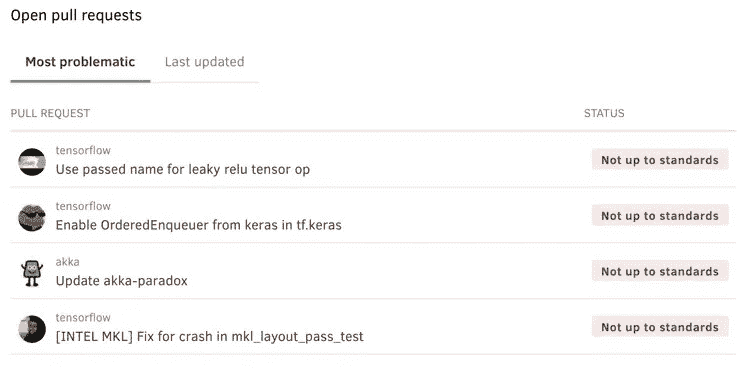
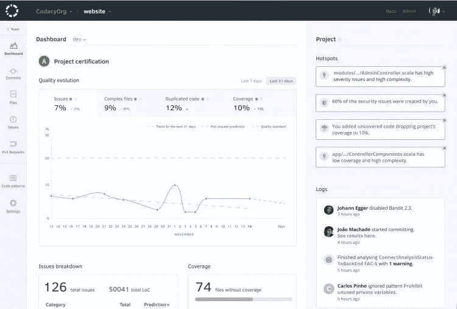

# 在 Codacy 巧妙的新工作流程背后

> 原文：<https://medium.com/hackernoon/behind-the-scenes-of-codacys-slick-new-workflow-c0b883a7f460>

## 由工程师[马修·塞特](https://medium.com/u/d8be98cdccce?source=post_page-----c0b883a7f460--------------------------------)

> 披露: [**Codacy**](http://bit.ly/codacyhackernoonblogpostjune) ，自动化代码评审平台，之前赞助过黑客正午。使用 code HACKERNOON 可享受八五折优惠。这篇文章最初出现在 [Codacy 博客](http://bit.ly/2l1okSX)上。

# 学习科特林的捷径

# 1.7 亿美元的以太坊漏洞是如何被阻止的

> 披露: [**Codacy**](http://bit.ly/codacyhackernoonblogpostjune) ，自动化代码评审平台，之前赞助过黑客 Noon。[使用 code HACKERNOON 享受八五折优惠。](http://bit.ly/codacyhackernoonblogpostjune)

如果您已经使用 Codacy 一段时间了，那么当您得知新版本正在开发中时，您会非常兴奋。商店中的变化包括对现有功能的一系列改进，以及一系列新功能。

在这篇文章中，我将带您了解一些关键的变化，并向您展示在使用 Codacy 管理代码质量时，它们将如何使您的生活变得更简单，更省时。

我们将从新添加的内容开始。因为毕竟谁不喜欢新的、闪亮的功能呢？然后，我们将通过查看现有功能的改进来结束本文。

不过，在我们开始之前还有一件事。如果你是一个长期的 Codacy 用户，请不要认为这个更新会要求你重新学习你已经知道的东西。并没有。

虽然新版本确实增加了新的功能，并且改进和更好地组织了现有的功能，但是您应该已经熟悉了您将看到的内容。事实上，在你意识到它的好处之前，你不应该花太多时间去适应它。

# 新增内容

好了，让我们从查看 Codacy UI 的新增功能开始。这些变化提供了以下优势:

*   提供更全面的信息
*   使仪表板使用起来更加直观
*   使重要信息更容易找到
*   显示个人级别的信息
*   显示团队级别的信息

# 组织仪表板

第一个新增功能是“**组织仪表板**”，顾名思义，它显示基于一个或多个团队协作的项目信息。这个控制面板由几个部分组成，我们将查看其中的三个部分。这些是:

*   总体质量图
*   热点
*   打开拉式请求
*   日志

# 总体质量图

通过实施总体质量图，我们希望为您提供一个您组织的代码状态的总体概念。您可以轻松地分析贵组织代码质量的主要指标，即:

*   级别
*   问题
*   复杂文件
*   复制
*   新闻报道

# 热点

接下来，我们来看热点。热点是关于重要关注领域的通知，其严重性从一般关注到需要紧急关注的项目，如安全。
您可能在热点地区收到的通知类型如下:

*   废弃 PRs 的数量
*   发现的安全问题数量
*   给定安全模式中发现的安全问题数量
*   “不符合标准”的 PRs 数量
*   过去 7 天的质量变化

# 打开拉式请求

可以说是项目分析最关键的领域之一，“开放拉取请求”已经得到了重大的更新。您可以看到现在有两个选项卡:

*   最有问题；和
*   上次更新时间。

挑出“**最后更新的**，可以快速看到一系列关于所列拉动请求的信息。这包括:

*   最近对 PR 做出贡献的用户，通过他们的头像。
*   与 PR 相关的项目。
*   提交注释标题；和
*   项目是否符合指定的质量标准。

以这种方式显示信息，在视觉上吸引人的同时，也便于随时了解一系列 PRs(目前最多 5 个)的健康状况。

# 日志

现在我们来看看日志。也许没有热点或开放拉取请求重要，但日志仍然很重要。这是因为它们有助于你对项目中的活动一目了然。

像大多数其他日志记录系统一样，日志面板让您可以看到由团队成员直接引起的一系列项目活动以及系统活动。下图展示了一个很好的例子。

这为项目中正在发生的事情提供了高层次的分析。

# 个人仪表板

接下来是个人仪表盘。该仪表板是组织中对您重要的所有项目的个人视图，列出了所有创建的拉动式请求。

与团队仪表板类似，这个新仪表板由三个部分组成:**星号项目**、**拉请求**和**热点**。其中，我们已经讨论了拉取请求和热点。因此，让我们深入了解新的 one Starred 项目。

顾名思义，这一部分包含了你因为一系列原因而开始的项目的快速概述。这些可能包括具有高优先级的项目、长期运行的项目或具有其他形式的特殊意义的项目。

这个小部件显示了三个项目，但是提供了一个指向所有标有星号的项目的完整列表的便捷链接。在三个显示的项目摘要的每一个中，您可以在项目仪表板中看到您已经拥有的基本信息，包括项目的等级、问题、复杂文件、重复和覆盖范围。

# 丰富

既然我们已经看了两个新的添加，现在让我们看看 Codacy UI 中的一些改进，从项目仪表板开始。

# 项目仪表板

项目仪表板得到了显著的改进！然而，基本的区别是引入了质量演进仪表板，它占据了中心位置，并将问题分解和覆盖分析移到了质量演进仪表板的下面。

# 问题细分和覆盖范围

最后，让我们看看问题分解和覆盖范围是如何变化的。信息以更透明和更简洁的方式呈现。

更重要的是，通过采用他们拥有的方法，Codacy 能够打包一系列进一步的细节，例如代码的总行数。

在现有的迭代中，通过仅仅关注数字，你只知道在给定的时刻发生了什么。通过使用质量演变图，你会看到一种趋势，这种趋势更有说服力。

# 综上

因此，总而言之，Codacy 刚刚发布的新工作流带来了大量新功能，以及对现有功能的一系列改进。

所有这些改变都是为了让你的生活比以前更轻松，让你比以前花费更少的时间，更有效地完成你的项目。

我希望你能看到这些变化带来的潜力。也就是说，不管你是支持他们还是有所保留，请在评论中分享你的想法。我知道团队会喜欢你的意见。