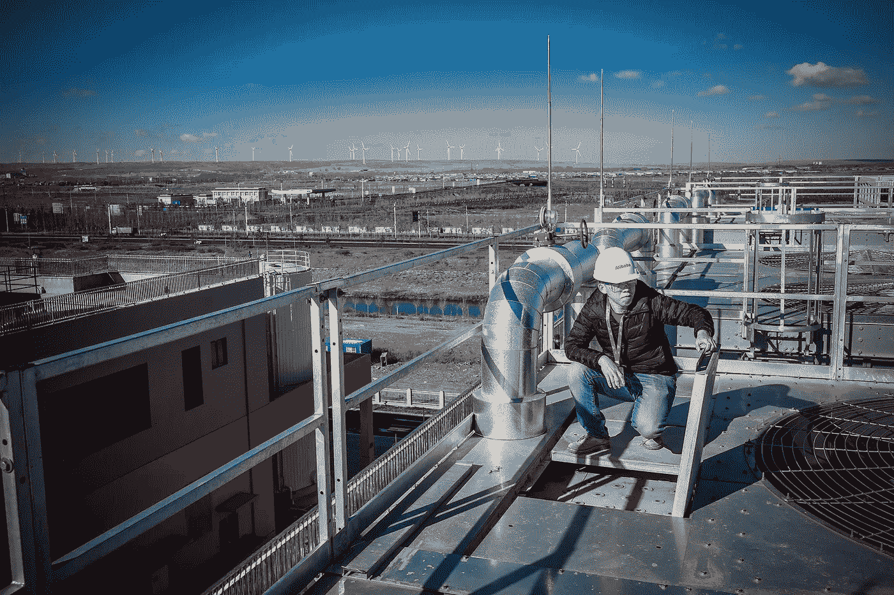
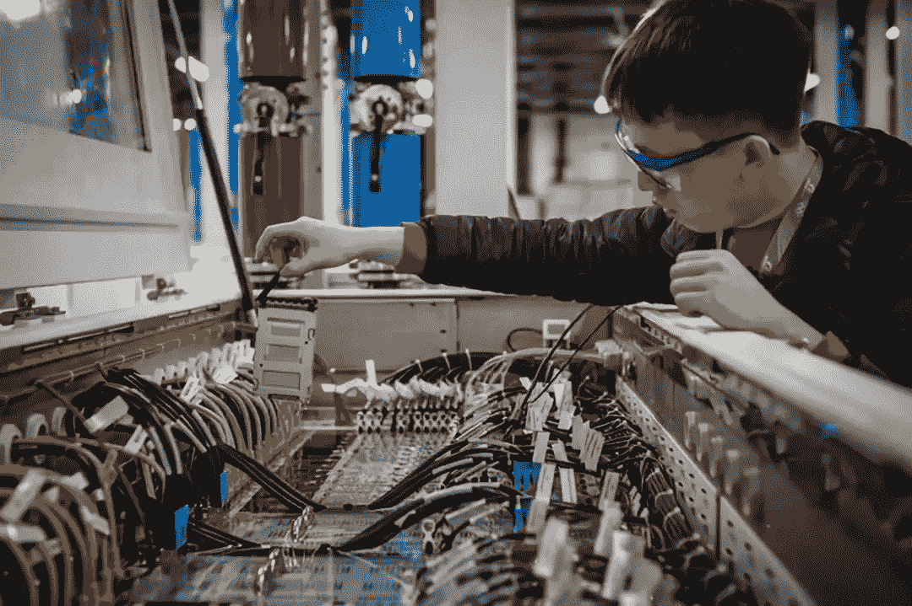
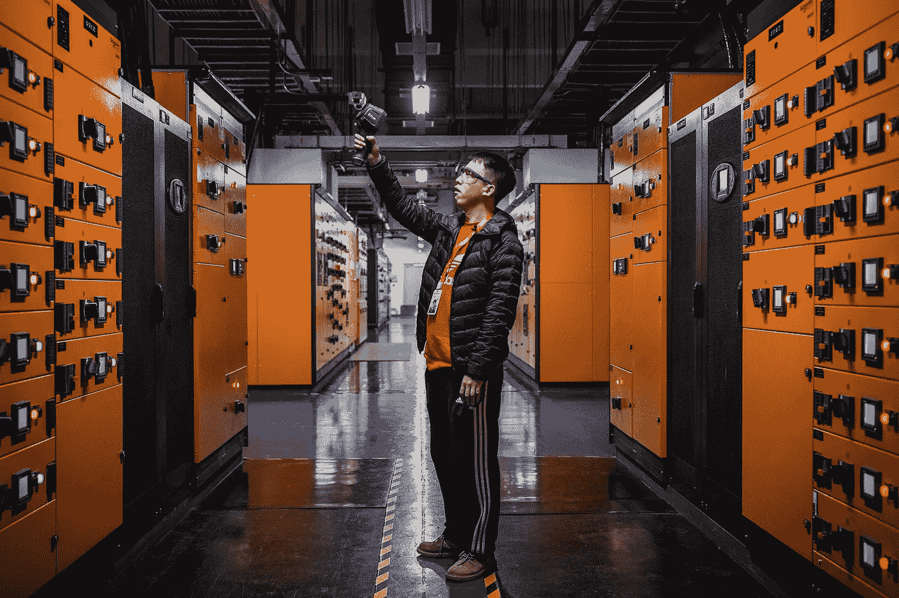
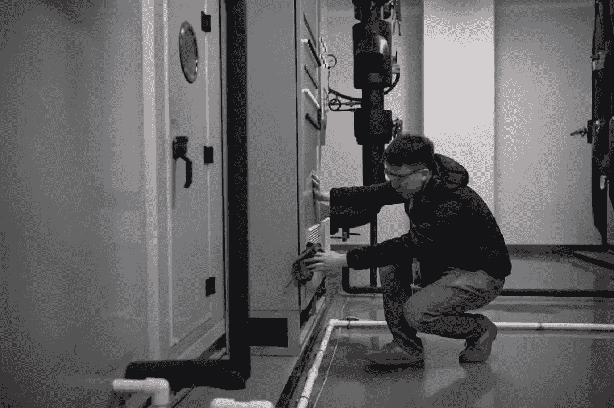

# 11.11 事件的幕后:阿里巴巴工程师生活中的一个夜晚

> 原文：<https://medium.com/hackernoon/behind-the-scenes-on-11-11-a-night-in-the-life-of-an-alibaba-engineer-3bd32cfc18e3>

## 勤奋的技术人员很少在石灰光下工作。在这篇文章中，我们来看看在 11.11 全球购物节期间，O & M 的工程师任如仙在阿里巴巴工作是什么感觉。

*Alibaba’s annual 11.11 Global Shopping Festival celebrates its 10th anniversary in 2018*

阿里巴巴的 11.11 全球购物节定在每年 11 月 11 日的中国光棍节，近年来受到了全球的广泛关注。在今年票房收入破纪录的 308 亿美元的电影节前夕，从纽约时代广场到巴黎埃菲尔铁塔的草坪，知名公共场所都可以看到宣布这一消息的公告，甚至伦敦泰晤士河上也有反映。

随着它获得认可，一些人可能会想在这样一个大型节日的幕后工作是什么样的。今天，我们通过任汝贤的视角来关注这一事件，他是一名值班的 O&M 工程师，通宵工作以确保在线庆祝活动的进行。

Wind turbines mark the landscape of windy and remote Zhangbei County in China’s rural Hebei Province

# 守卫寂静的通风口

远离熙熙攘攘的城市和网上购物场景，任汝贤尽职尽责地监控着位于北京城外 300 公里、被称为阿里巴巴张北数据中心的远程“无声排气口”。

张北县以其音乐节而闻名，也是阿里巴巴技术中心的所在地，在这里为 11.11 音乐节处理在线交易。该中心掌握着电影节成功的关键，其服务器上每一个闪烁的监视器灯都代表着数十亿个在线处理的数据点。

*Ren Ruxian monitors a facility at Zhangbei Data Center*

忘记了数十亿消费者参与每年一度的购物狂潮，任只关心他面前的一排排机器。

“这些机器就像我的妻子，”他说。

与网上狂热的购物者形成鲜明对比的是，任在去年 11.11 节日期间一件商品也没买到。相反，他与同样高度警惕地承受压力的团队成员一起连续工作了三天。在他们快节奏的日常工作条件下，他们依靠短文进行有效的交流。

该中心的服务器在节日期间比平时繁忙得多，需要专门的设备来保持服务器的稳定，因为全球数十亿笔交易同时处理。为了处理这一容量，该中心容纳了世界上最大的浸入式和空气服务器冷却系统，这些系统共同解决了如此大型的数据中心中服务器过热的风险。

*Ren lifts a submerged server component from the server immersion cooling system for inspection*

为了防止停电，数据中心还在柴油发电机系统上投入了大量资金。该中心维护人员的声音被几十台柴油发电机同时运转的巨大轰鸣声淹没，迫使他们主要用手语交流。据任说，由于中国的电网网络已经变得更加全面，储存在数据中心的柴油可能可以使用一生。

“然而，我们仍然需要这些发电机，”他说。"停电每秒会给我们造成数万元的损失."

*Ren monitoring equipment manually during a routine check*

相比与人的互动，任更习惯于与机器交流。尽管安装了智能设备来辅助设备监控，但任更喜欢用传统的五感观来观察、闻和听设备。通过他的感官，任可以区分数十种机器的声音和气味。

在轮班过程中，工程师可能会变得如此习惯于机器的陪伴，以至于他曾经发现在早上 6 点到晚上 11 点的轮班后，在超级市场与人互动很尴尬。

“我突然忘记了人类互动的逻辑，”他说。

# 负责夜间巡逻

*Ren wipes a machine clean with a piece of blue cloth during a shift*

在他频繁的夜间巡逻中，任感受着中心嗡嗡作响的机器的气味和声音。当他走过满是灰尘的房间时，他拿出一块布把它们擦干净。

工程师经常害怕在夜班时接到紧急电话。在这些时候，任的大脑必须保持高度警惕，并进入应急反应模式，但他必须同时保持冷静。工程师经常在团队中合作分析紧急情况。然而，有时工程师必须独立工作以快速解决紧急问题。有时，紧急现场只需要一个人。

*Ren walks alone on the cold and quiet streets of The Zhangbei Data Center campus*

张北数据中心夜晚安静寒冷。张北县是一个大而多风的平原，每年平均有六个月有强风，据报道平均气温为 2.6℃。第一场雪通常出现在 9 月，气温可达零下 38.6 摄氏度。一个人的胡子在短短的 200 米户外行走后，会变成短短的一截冰霜。正是在这些极端的天气条件下，任每天晚上离开值班室，在数据中心寒冷空旷的街道上完成巡逻任务。

*After a long night shift, Ren eats breakfast at Zhangbei Data Center’s new canteen*

在漫长的夜班工作结束后，当清晨的第一缕阳光照在他的脸上时，任感到最幸福。

任还记得当时数据中心还在建设中的一个寒冷的冬天。天太冷了，人们穿着羽绒服和厚重的军用夹克还在瑟瑟发抖。临时棚里的暖气甚至坏了，人们在棚里呼出结霜的白云。为了产生体热，工程师们在建设中的数据中心巡逻时，跑着，喊着，笑着。

尽管数据中心在 2018 年 10 月增加了一个新食堂，改善了设施，但任仍然怀念与其他同事一起在数据中心附近的小吃摊上吃麻辣火锅的日子。

Ren grabs a tool box as he runs towards a designated site during an emergency drill

# 工作中的强化训练

对工程师日常工作的误解包括他们整天粘在电脑屏幕前或在设备室里无所事事。这与事实相去甚远。维护数据中心的服务器需要耗费大量体力和时间，尽管拥有年度健身房会员资格，但任在过去一年中只去过健身房 10 次。他的日常锻炼主要是他的服务器维护。

2018 年 11.11 节的筹备工作早在去年就开始了。在活动当天，警车和消防车在数据中心外排队以防紧急情况，工程师每天都要接受应急协议的训练。在应急演习期间，任经常不得不背着他的工具箱跑到不同的服务器位置。

日常维护也需要大量的体力活动。当任汝贤第一次开始在校园里夜间巡逻时，他经常每天走 40，000 步。最终，这减少到 20，000 到 30，000 步。在自动化操作和维护系统的帮助下，他现在每天行走的步数在 5000 步左右。

Ren falls asleep during a train ride from Beijing to Zhangbei

# 追求工程师梦

2018 年 11 月初，任从中国繁华的北京搬到了荒凉的张北县。从北京到张北农村的火车行程 300 公里，需要 3 个小时。连续两年，任每隔 10 天就要从北京到张北一趟，每个月在北京的时间往往只有四五天。在 2018 年 11 月 11 日之前，任搬出了他在北京的公寓，搬到了张北的新房子，他的所有物品都装在两个行李箱中。

从北京到张北的火车旅行的终点站实际上是任的家乡内蒙古。

“当我跳下火车时，我觉得坐这趟火车回家真的很棒，”任说。家是火车旅行的目的地之一，另一端是他的渴望。总之，“保护”是这两个极端目的地的共同理念。

*Ren walks towards an office building at Alibaba Zhangbei Data Center*

出生于 1989 年的任非常适应张北县安静的荒野。他的爱好是唱歌和听音乐。他的歌曲反映了他的精神状态，有时他轻轻地唱，其他人大声而激动。每当任觉得张北寒冷的天气难以忍受时，他就会回忆起在北京的生活，脑海中浮现出繁忙的 SoHo 区、中央商务区(CBD)以及温暖拥挤的地铁。

张北县什么都不刺激。该县并不追求大型金融中心的高股票增长曲线或大额交易。同样，任也不追求令人兴奋的城市景观或声音，他更喜欢张北的宁静，这让他感到踏实。

像任这样的工程技术人员很少出现在聚光灯下，大多数人都没有意识到他们的存在。正如 11.11 节日的首席技术总监完美总结的那样，“当没有人能感觉到他们的存在时，技术人员是最成功的。”所以，下次你在网上买便宜货时，试着想象一下像任这样勤奋的工程师团队在幕后默默工作，以确保每笔交易顺利进行。

*(Original article by Fu Guannan 符冠男)*

# 阿里巴巴科技

关于阿里巴巴最新技术的第一手深度资料→脸书: [**“阿里巴巴科技”**](http://www.facebook.com/AlibabaTechnology) 。推特: [**【阿里巴巴技术】**](https://twitter.com/AliTech2017) 。