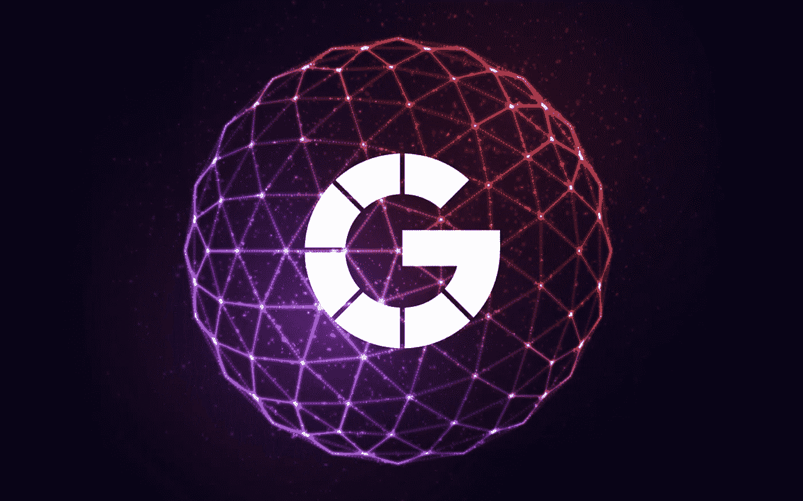
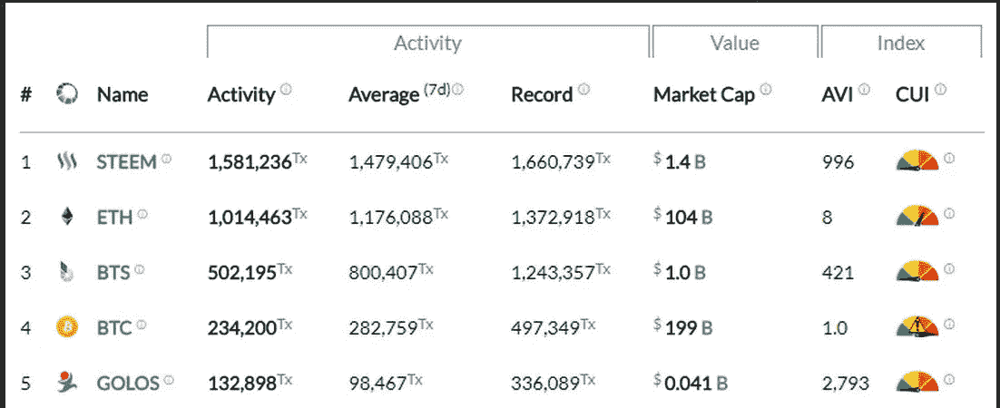
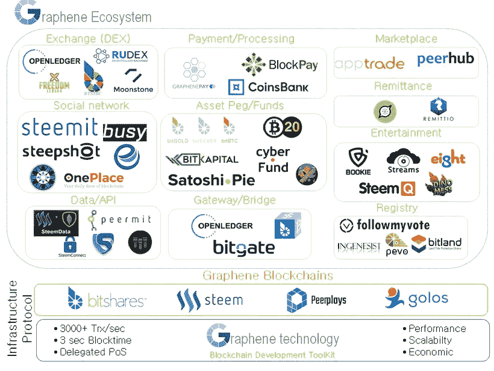

# 幕后:Scorum 运动社区的区块链基础

> 原文：<https://medium.com/hackernoon/behind-the-scenes-the-blockchain-foundation-of-the-scorum-sports-community-5f23e82f77f>

## **难以处理的基础，在此基础上可以建立有益的粉丝体验**。

第一次听说 Scorum，人们经常会问为什么我们需要区块链推出这个**创新体育媒体平台**。这是一个合理的问题，是所有通过 ICO/Crowdsale/ITO 筹集资金的项目都应该问的问题。Scorum 团队没有在这里重复整个白皮书，而是将**区块链基金会视为一个棘手的基础，在这个基础上可以建立一个有益的粉丝体验**。

通过使用开源石墨烯框架构建**区块链经济系统，Scorum 创建了一个**透明、可靠、高效的规则系统**，该系统将以公平的方式向 Scorum 上的所有活跃粉丝分配奖励。**

我们不就是无中生有的赚钱吗？不，这笔钱在体育媒体行业是巨大的，我们只是**设计了一个框架，让真正努力筹集这笔钱的粉丝能够分享这笔钱**！

目前交易最活跃的五大区块链中有三个建立在**石墨烯框架**之上:

## **为什么石墨烯框架非常适合熔渣**

Top blockchains by transaction volume. [Source](https://blocktivity.info/)

快速、精确、高效。在世界各地的许多运动中，这些都是赢得比赛的抢手特征。这同样适用于 Scorum 背后的区块链技术。随着 Scorum 受众的增长，并欢迎来自全球 10 亿多体育迷的越来越多的用户，**我们需要一个可扩展的区块链基金会。**它可以记录和传输数以千计的微交易，这些微交易将在 Scorum 的四个核心服务的用户之间分配奖励。

石墨烯(Graphene)框架是一个开源的区块链系统，由丹·拉里默(Dan la rimer)在三年前(成功地)寻求为加密货币交易者创建一个可靠和安全的分散交易所(Bitshares)时开发的。从那时起，石墨烯框架已经证明了自己能够在许多项目中执行免费和快速的交易，我们很高兴能够在这样一个成熟的基础上建立 Scorum 社区。

*An illustrated view of Graphene Implementation.* [*Source*](https://coincentral.com/what-is-bitshares/)

## 那么 Scorum 是如何工作的呢？

石墨烯框架基于**授权利益证明(DPoS)** 共识算法运行，该算法要求 Scorum 社区的代表每 3 秒钟验证/签署一个新区块。每个块最多可以容纳 10k 个事务，因此 tx 速度可以保持在每秒 3k 以上。这不仅比比特币和以太坊目前使用的工作共识算法明显更快，还有一个额外的好处是它的能耗呈指数级下降。

Scorum 的 DPoS 共识依赖于 **21 位阻止签名成员(代表)**，其中 20 位从 Scorum 社区中选出，1 位从拥有大量 Scorum 权力的用户列表中选出。通过允许 Scorum 社区中的每个人投票选出 20 名当选代表，Scorum 区块链共识算法确保 Scorum 社区内的交易得到快速准确的验证。

## **代表们在积木上签名能得到什么？**

作为对签署区块以保持 Scorum 奖励经济运转的代表的补偿，我们指定了**480k Scorum Power token**在签署区块的代表中分发。这将确保公平的补偿，直到来自广告收入的 SCR 令牌分配取代 SP 奖励。

**代表薪酬**将通过在固定天数内保留奖励储备来保持稳定。在实践中，这意味着如果来自广告收入的 SCR 奖励超过未来 100 天补偿代表所需的金额，奖励将增加 10%。相反，如果广告收入下降，并且代表的奖励池的报酬少于 30 天，则奖励金额将减少 10%。

## **残疾人组织的未来是光明的**

加密货币行业的魅力之一是，区块链技术允许在创建价值交易系统方面有一定的灵活性，以满足某些社区的需求。**比特币等验证系统**已经清楚地表明，它们能够作为一种安全、分散的资金转移手段发挥作用。

委托**股权证明**区块链为 Scorum 这样的项目提供了**快速和自由交易**的额外好处。这是走向大规模采用加密货币的一个关键解决方案。通过允许整个社区选举代表并使节点分布在世界各地，实现了分散化和安全性的目标，而没有过高的能源成本、“缓慢的”交易确认或交易费用的任何资金损失。

随着以太坊计划过渡到 DPoS，EOS 正在进行历史上最大的 ICO 以**将基于石墨烯的项目带到新的高度**，以及 Bitshares 在石墨烯上运行了 3 年多，绝大多数区块链项目将在不久的将来运行 DPoS consensus。Scorum 很高兴成为其中的一员，并将[**原子交换功能**](https://hackernoon.com/development-update-scorum-executes-atomic-swap-between-litecoin-and-scr-f91ddebb4269) **引入石墨烯**。

## [Scorum 的众筹](https://www.scorumcoins.com/en-us/)现已开放！

## 我们通过[电报](https://telegram.me/SCORUM)、[脸书](https://www.facebook.com/SCORUM.COMMUNITY/)和[推特](https://twitter.com/SCORUM_en)了解更多信息。