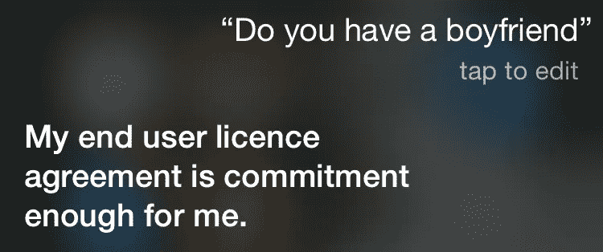

# 技术背后:Siri、Alexa 或 Google Home 如何回应你的问题？

> 原文：<https://medium.com/hackernoon/behind-the-tech-how-does-siri-alexa-or-google-home-respond-to-your-questions-3a1a5048e781>

> 想知道苹果 Siri、亚马逊 Alexa 或谷歌 Home 如何回应你的问题吗？

*计算机如何理解有时人类自己也不懂的人类语言？*

嗯，技术上它被称为**自然语言处理**。

# 自然语言处理

专注于人类语言和计算机之间交互的研究领域被称为自然语言处理，简称 NLP。它位于计算机科学、人工智能和计算语言学的交叉点([维基百科](https://en.wikipedia.org/wiki/Natural_language_processing))。

# 技术背后:NLP(基础)

**免责声明:**处理自然语言有多种技术，我将只介绍其中一些。

让我告诉你一个关于 Nidah 的例子。

> Nidah 才 2 岁&她一点语言都不懂。但是当她妈妈让她喝牛奶的时候，她就喝了！
> 
> 那么 Nidah 是如何从她不懂的语言中处理信息的呢？
> 
> Nidah 的妈妈一定给她看了一些手势，或者她一定训练 Nidha 当她说“Nidah 请喝牛奶”时，Nidah 必须喝牛奶。所以 Nidah 理解了它，处理了它&还储存了信息以备将来使用。Nidah 接受训练时，整个工作流程就完成了。如果她妈妈要求她做一些 Nidah 不知道(训练过)的事情，Nidah 就不会处理这些信息。

现在看看 Nidah 的例子，处理信息有两个阶段

1.  训练阶段(预处理阶段)
2.  流程+决策阶段

# 训练阶段

让我再看看 Nidah 妈妈的陈述。

> “尼达请喝牛奶”

问题 Nidah 如何理解要执行什么任务？
问题 Nidah 是怎么明白她要喝牛奶，而不是咖啡的？

很简单，在训练 Nidah 的时候，你告诉她“喝牛奶”有一个动词“喝”&有一个属性“牛奶”。现在 Nidah 知道该执行什么任务&喝什么。我会称她为“训练有素的尼达”。(技术上，训练数据被称为**“数据模型”**)

类似地，在 NLP 领域，动词“饮料”被称为“意图”&属性“牛奶”被称为“实体”&以这种方式处理数据的方法被称为:**命名实体&意图识别。**

> 一个**实体**是一个可以用来回答用户请求的属性——**实体**通常是请求中的一个关键字，比如名称、日期、位置等等。
> 
> 一个**意图**(意图)，是用户可以调用的特定动作，比如喝酒、下订单、订票等

有一堆 NLP 工具，比如谷歌 Dialogflow、Facebooks wit.ai、IBM Watson 或微软的 LUIS，你可以在那里托管你的“训练数据模型”。让我称之为“大脑”。这些大脑甚至提供数据处理和决策能力。

# 流程+决策阶段

处理从外面看起来很简单，但它经历了一系列的文本处理子阶段，如**词干化和词汇化、TF-IDF** 、**共指消解、词性(POS)标记、依存解析、命名实体/意图识别&等等。**

随着三方 NLP 工具的发展，开发人员不必担心知道许多处理子阶段，因为这些工具会处理它&使您的生活更容易。

现在回到 Nidah 的例子，如果你已经训练了“大脑”(第三方 NLP 工具)&一旦大脑接收到类似“Nidah 请喝牛奶”的消息，大脑将处理该消息&理解意图是“喝”&实体是“牛奶”。

*但是大脑怎么会知道需要采取什么行动呢？*

嗯，你甚至可以根据接收到的意图训练大脑，让它必须喝牛奶或发出一个“好”的确认。

# 总结:

在 NLP 的世界里，关键在于你有多少结构化数据(**语料库**)。数据越多，准确度越高。此外，随着我们人类不断更新我们的语言词典，训练计算机是一个无止境的过程。

我希望这篇文章对自然语言处理有一个很好的初步概述。问自己这样的问题是一个很好的练习:

*   计算机将如何理解甚至我们人类都无法理解的讽刺？
*   *处理同义词、歧义&共指？*
*   *我如何使用 Google Dialogflow 设计 NLP 工作流？*

# 接下来是什么:

非常感谢你读到这里。在我的下一篇博客中，我将讨论如何使用 Google Dialogflow 设计 NLP 工作流？”。敬请关注。