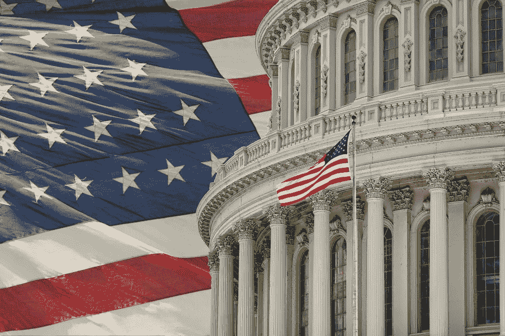

# 在幕后，一些国会议员一直忙于比特币

> 原文：<https://medium.com/hackernoon/behind-the-the-scenes-some-congressmen-have-been-busy-with-bitcoin-2f8ecf8da893>

尽管美国众议院议员几次谈到加密货币，但过去几个月的事件显示，一些国会议员正在秘密投资加密资产。

多亏了众议院道德委员会在六月发布的道德备忘录。该命令要求立法者、官员和员工在购买此类数字资产后 45 天内提交的财务披露报告中披露所有超过 1000 美元的[加密货币投资。](https://cryptopotato.com/will-the-conservative-crypto-investment-options-please-stand-up/)

在不到两个月的时间里，我们收到了来自国会议员的三份供词。

众议院司法委员会主席 Robert Goodlatte 在他的[财务报告](http://clerk.house.gov/public_disc/financial-pdfs/2017/9112977.pdf)中披露，他拥有价值约 17000 至 80000 美元的比特币。

最近，为夏威夷第二选区服务的女议员 Tulsi Gabbard 也提交了一份[财务报告](http://clerk.house.gov/public_disc/financial-pdfs/2017/10021311.pdf)，报告显示她在 2017 年 12 月的某个时候向 ETH 和 LTC 投资了高达 15，000 美元。尽管记录显示她没有从投资中获利，但她不可能在不信任加密货币的情况下投入这笔钱。

除了前面提到的国会议员，国会区块链核心小组的联合创始人 Jared Polis (D-CO)是其他可能拥有加密资产的人之一。此外，参议员马克·华纳(D-VA)在加密爱好者中很受欢迎，因为他过去支持各种加密货币，应该也拥有一些硬币。

# 加密投资并不像国会说的那样糟糕

虽然被发现拥有加密资产的国会议员没有加入 3 月份的加密争论可能是真的，但议会很少对加密货币表示赞同。

[比特币和替代币](https://cryptopotato.com/how-does-bitcoins-rise-affect-the-altcoins/)绝对不像加州民主党众议员布拉德·谢尔曼(Brad Sherman)在今年早些时候的会议上声称的那样是“骗子”。如果是这样的话，那么尊敬的国会议员们就不会对它进行大量投资了。

事实上，更多的国会议员可能很快就会申报他们的加密资产，这将在一定程度上消除议会在美国民众心目中对加密货币的错误印象。

如果众议院议员可以不再对数字资产有点虚伪，那么有可能会有更多人对投资加密货币感兴趣。

*原载于 2018 年 8 月 23 日*[*【cryptopotato.com】*](https://cryptopotato.com/are-us-congressmen-hypocritical-about-bitcoin/)*。*