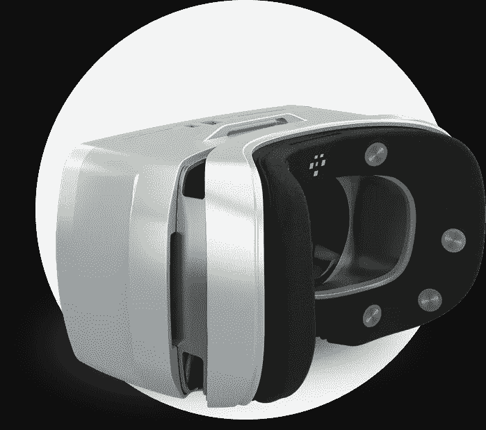

# 看下一代虚拟现实技术:第一部分-面部跟踪

> 原文：<https://medium.com/hackernoon/behold-the-next-generation-vr-technology-part-1-facial-tracking-cd839eaa6697>

## 怀疑论者表示，目前的虚拟现实耳机是笨重、沉重、不舒适的潜水面罩，不会进入人们的家庭。嗯，我同意，但是有一个重要的例外——这项技术发展得非常快。

即使你是一个肩膀上纹着 Oculus 或 Vive 标志的真正的虚拟现实传播者，你也不得不承认当代耳机永远不会被大规模采用。因为就目前而言，虚拟现实意味着被束缚在一个监护系统的监狱牢房里的一台昂贵的个人电脑上。

这不是我们梦想的虚拟自由。

然而，我们忘记了一件至关重要的事情。这叫“进步”它会粉碎沿途的一切。

在不到两年的虚拟现实消费版时代，耳机完全无线化，视野扩大了一倍，分辨率提高了两倍。

> 事实上，VR 技术的发展速度远远超过了耳机消费版本的发布速度。

在名为“**观察下一代虚拟现实技术**”的系列每周文章中，我将引导您了解最新和最有前途的技术，这些技术最终将使虚拟现实成为下一个计算平台。

大部分处于开发的早期阶段，所有这些技术都将在未来 10 年内在消费版耳机中实现。一些更早，一些更晚。

我把这个系列分成几个部分——每个部分代表虚拟现实[技术](https://hackernoon.com/tagged/technology)的一个重要方面。以下是其中的一些:

*   **面部追踪——这就是这篇文章的内容；**
*   头像；
*   全身沉浸；
*   与现实的联系；
*   精神控制；
*   触觉学；
*   AI；
*   无线；
*   逼真的图形；
*   输入控制；
*   展示；
*   运动。

# 面部跟踪

在现实生活中，你的脸每天会移动无数次(科学认可的数字):当你说话、微笑、盯着某样东西或在 Snapchat 上张嘴拍照时。但在虚拟现实中，它看起来最多是这样的:

又不是[恐怖谷](https://en.wikipedia.org/wiki/Uncanny_valley)；这是整个该死的神秘大峡谷。

## 面部表情

所以是的，正如你可能已经猜到的那样，面部跟踪是用于社交虚拟现实的。主要问题是:目前的 VR 头戴设备内部没有这样的技术。

An array of cameras tracks expressions — [Full video](https://www.youtube.com/watch?v=wrtzXtYKems&t=3s) / Source: Futurism

An outside camera tracks lip and chin movements — [Full video](https://www.youtube.com/watch?v=VCd1aRriIis) / Source: Oculus

有力地挥手或从菜单中选择一种情绪是一种选择，并在许多社交体验中使用。*但并没有 VR 应有的天衣无缝。*

许多公司理解这一点，并推动这项技术向前发展。

最受消费者欢迎的解决方案之一是一系列红外摄像机，可以捕捉眼球运动(我们稍后会谈到)以及嘴唇和下巴的运动。

红外摄像机通常以倒置的单角样式从头盔中伸出。它能识别你下巴的轮廓，并追踪其几何形状的变化；然后它将这些变化转移到虚拟角色的脸上。

正如你所看到的，Oculus 正在华盛顿州雷蒙德市的 Oculus 研究实验室试验这种技术。

MASK by MindMaze

另一种方法是在 HMD 的泡沫衬垫上放置传感器，可以通过皮肤测量面部肌肉的活动。这叫肌电图(EMG)。像 [Mindmaze](https://www.mindmaze.com/mask/) 和 [emteq](https://emteq.net) 这样的公司正在致力于此。

这种传感器使用电极每秒钟“倾听”面部肌肉活动 1000 次，并使用智能算法进行分析，以创建个人表情的神经签名，而无需训练或校准。

肌电图是一种更快、更准确的追踪面部活动的方法。然而，与相机不同，它们只跟踪面部与皮肤紧密贴合的部分。

眼睛呢？

这就是一系列老式红外相机派上用场的地方。

IR cameras track player’s eyes — [Full video](https://www.youtube.com/watch?v=LNtu5sbrzEA) / Source: Fove

你已经可以在虚拟现实 HMD 的[展厅里找到这项技术。他们将 6 个红外发射器和一个红外摄像机放入 HMD 中。它的光束(你看不到这种光)使你更容易找到你的瞳孔，并相应地跟踪他们的运动。](https://www.getfove.com/)

在用一种特殊的软件处理运动数据后，Fove 知道你在任何虚拟场景中的确切位置。Oculus 还收购了一家名为 [EyeTribe](http://aws-website-theeyetribe-lbmoo.s3-website-us-east-1.amazonaws.com/theeyetribe.com/about/index.html) 的公司，该公司正在研究类似的技术。

A beam of light scans player’s pupils — [Full video](https://www.youtube.com/watch?v=gYa1I2duQX8) / Source: AdHawk Microsystems

另一种跟踪眼睛的方法是使用 MEMS(微机电系统)设备。

这些显微设备投射和扫描低功率光束穿过眼睛，并输出眼睛的坐标。

这项技术比基于相机的追踪器需要更少的电力，需要更少的计算工作，而追踪速度可以比许多眼球追踪相机快 10 倍。

英特尔最近收购了一家名为 [AdHawk](http://www.adhawkmicrosystems.com) 的公司，专门利用 MEMS 设备进行眼球和手势追踪。

这项技术的另一个很酷的功能是有机会预测玩家将在哪里开始渲染场景的这一部分。这是被称为有凹渲染技术的一部分。我会在[未来](https://hackernoon.com/tagged/future)集里讲。

现在你知道面部表情*可以被跟踪*并且你不会在玩 VRChat 时吓跑你所有的虚拟朋友。此外，这会让他们觉得你的[乌干达指关节](http://knowyourmeme.com/memes/ugandan-knuckles)化身是活的。

更重要的是，展示你的真实情感最终会变得天衣无缝。

# 学到了什么？下次请跟随我了解更多信息。