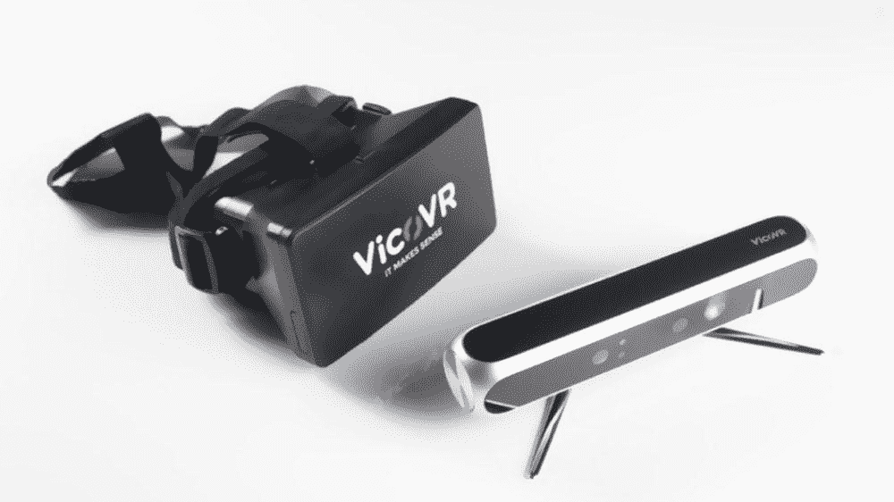
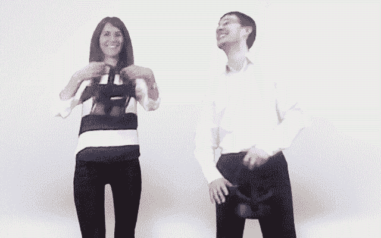

# 看下一代虚拟现实技术:第二部分——全身跟踪

> 原文：<https://medium.com/hackernoon/behold-the-next-generation-vr-technology-part-2-full-body-tracking-1210ab27ebe4>

## 怀疑论者表示，目前的虚拟现实耳机是笨重、沉重、不舒适的潜水面罩，不会进入人们的家庭。嗯，我同意，但是有一个重要的例外——这项技术发展得非常快。

即使你是一个肩膀上纹着 Oculus 或 Vive 标志的真正的虚拟现实布道者，你也不得不承认当代耳机永远不会被大规模采用。因为就目前而言，虚拟现实意味着被束缚在一个守护者[系统](https://hackernoon.com/tagged/system)的牢房里，与一台昂贵的个人电脑相连。

这不是我们梦想的虚拟自由。

然而，我们忘记了一件至关重要的事情。这叫“进步”它会粉碎沿途的一切。

在不到两年的虚拟现实消费版时代，耳机完全无线化，视野扩大了一倍，分辨率提高了两倍。

> 事实上，VR 技术的发展速度远远超过了耳机消费版本的发布速度。

在名为“**看下一代虚拟现实技术**的系列每周文章中，我将引导你了解最新和最有前途的技术，这些技术最终将使虚拟现实成为下一个计算平台。

大部分处于开发的早期阶段，所有这些技术都将在未来 10 年内在消费版耳机中实现。一些更早，一些更晚。

我将这个系列分成几个部分——每个部分代表虚拟现实技术的一个重要方面。这一个是关于:

# 全身跟踪

踢一个虚拟的敌人一定是一种多么美好的感觉。每次我玩超级热的时候，我的头号梦想就是——他们玻璃般的红色小屁股正乞求被踢。

不幸的是，全身跟踪对普通玩家来说是不可用的，因为当前一代 VR HMDs 没有配备这样的硬件。

Inverse Kinematics guesses player’s body movement in Mindshow game— [Full video](https://www.youtube.com/watch?v=GAx6QEuS3tg) / Source: [iwantmylauren](https://www.youtube.com/channel/UCUrJTuFfXKKjVYLKHYQpCOA)

然而，游戏开发者已经学会了如何解决这个限制。在大多数的 VR 体验中，他们只是切割你的虚拟角色的腿和躯干(当然不是字面意思)。没腿=没问题。

其他人更慷慨。他们使用 IK — [反向运动学](https://en.wikipedia.org/wiki/Inverse_kinematics)。这是一种动画技术，定义了虚拟身体的每个部分必须如何移动。例如，如果我向左移动我的两只手，那么我的虚拟躯干也应该向左移动。

当代虚拟现实系统基本上只有 3 个可跟踪点:耳机本身和一对控制器。这给了我们头部和手臂运动——而不是跟踪整个身体的运动。IK 所做的是，它试图模仿整个身体的姿态，只考虑这 3 点运动数据。

虽然 IK 的结果相当令人印象深刻，但它面临着另一个问题:你的大脑很聪明(哦，是的！).它非常精确地知道你身体的位置。

> 为了证实这一点，闭上眼睛，试着用食指触摸你的鼻子。成功了吗？所以，现在你知道我在说什么了。

无论开发人员使用什么方法，大脑的这种能力只会让我们得出一个结论:即使是最先进的变通技术也不会精确到足以欺骗它。

这是否意味着近期内不会有任何身临其境的踢屁股游戏？

绝对不会。一些很棒的解决方案已经被开发出来了。

6 point trackable system accurately transfer player’s moves in a game environment — [Full video](https://www.youtube.com/watch?v=Khoer5DpQkE&t=42s) / Source: iKinema

最直接的方法是在每条腿上放置一个传感器(基本上是任何传感器，从[活体追踪器](https://www.vive.com/eu/vive-tracker/)到[头发粗细的磁性皮肤](http://advances.sciencemag.org/content/4/1/eaao2623.full)传感器)，在臀部放置一个传感器，以创建更多的可追踪点。

再加上 HTC Vive 本身和两个 Vive 控制器，你就会得到一个平滑的多点可跟踪系统。它可以生成更多的运动数据，并最终跟踪腿部和躯干。

虽然它非常适合低成本的动作捕捉，而且你已经可以购买，但作为一个产品，它有一些缺陷。你看，每次你想玩虚拟现实踢屁股游戏时，花大量的时间在传感器上，会让你很快感到沮丧。或者不是。时间会证明一切。

无论如何，这个解决方案有一个替代方案。

我一直相信，最好的技术是看不见的技术。解决问题的方法，不需要任何行动。

Vico VR’s sensor and HMD / Source: [3DiVi Company](http://3divi.com/)

A player uses Vico VR sensor to play fighting game — [Full video](https://www.youtube.com/watch?v=0RzGg5RiVxQ) / Source: 3DiVi Company

Vico VR sensor creates players skeleton — [Full video](https://www.youtube.com/watch?v=-PSN1AWc5Ro) / Source: 3DiVi Company

[3DiVi 公司](http://3divi.com/)正致力于此。他们称之为[Vico Vr](https://vicovr.com/)——一种外置全身运动传感器。

像 Kinect(或 iPhone X Face ID 传感器)一样，它在红外光谱中投射成千上万个光点(人眼不可见)。这种点的地毯形成了 Vico VR 可见的图案。根据图案中某些区域的大小，传感器知道它有多远，它所触及的表面也是如此。Vico VR 就是这么确定场景深度的。

但是它是如何识别玩家的 pas 的呢？这就是机器学习的用武之地。我不确定 Vico VR 使用的是什么算法，但通常情况下，开发人员会训练神经网络，在他们从传感器接收到的深度数据中，将身体的部分与其他对象或彼此分开。

当该算法识别出玩家的身体部位时，它可以建立一个骨架——每个角色的 3D 模型的不变组件。是骨骼移动了化身的虚拟身体。

最后一部分是生成的骨骼的运动转移到化身的骨骼。当玩家举起手臂时，这个动作被发送到化身的骨骼，你的虚拟自我举起它的手臂。事情就是这样的。很简单，但无论如何你明白了。

很酷，对吧？你可以无缝地将你所有的踢屁股组合和流畅的舞蹈动作直接转移到你的角色身上。不需要绳子，不需要西装。只有一个传感器。

然而，尽管这听起来像是梦想成真，但运动技术的这一分支仍处于早期阶段。它受到噪音和延迟的困扰。第一家展示足够精确和快速的传感器，以可信的水平传输您的运动的公司将赢得市场。或者至少会被类似吸尘器的 Oculus 购买。

Soli sensor emits RF waves and receives a portion back — [Full video](https://www.youtube.com/watch?v=0QNiZfSsPc0) / Source: [Google ATAP](https://www.youtube.com/channel/UC70QckdMkEtr9QHDhRn8-kw)

Users control devices with Project Soli’s interface — [Full video](https://www.youtube.com/watch?v=0QNiZfSsPc0) / Source: [Google ATAP](https://www.youtube.com/channel/UC70QckdMkEtr9QHDhRn8-kw)

但这还不是全部。还有另一种无摩擦技术:雷达。是的，毫米波雷达芯片甚至可以探测到难以捉摸的运动。它是由谷歌和英飞凌联合开发的，名为 Soli 项目 T3。

一个指甲大小的芯片发出一束电磁波(雷达频率波)。周围的物体反射一部分回来。然后这些数据被算法处理，分析出形状、速度、旋转、距离甚至材料属性。

他们还声称这项技术可以以每秒 10，000 帧的帧速率识别手势。嗯，还不错。

用这种技术你不会发现敌人的潜艇，这是前两种解决方案的一个很好的选择，虽然还很粗糙。目前，由于 Soli 的项目目的，它只能与手指运动一起工作。但是在他的[论文](http://www.ivanpoupyrev.com/wp-content/uploads/2017/01/siggraph_final.pdf)中，Soli 的创造者 [Ivan Poupyrev](http://www.ivanpoupyrev.com/) 说用射频波进行全身跟踪“不是不可能的”在麻省理工学院肯定有一些关于这项技术的[实验表明，雷达甚至可以穿透墙壁探测到人类的姿态。你所要做的就是再次处理噪音。](https://www.youtube.com/watch?v=7LTr02cJkiA)

因此，我们有 3 种解决方案:可穿戴传感器、类似 Kinect 的独立传感器和雷达芯片。你最喜欢哪一个？什么技术最终会向市场呈现全身追踪？

我相信在虚拟世界中感受你身体的存在会永远改变这种体验。能够与环境(或彼此)互动？)与手、腿和其他虚拟身体部位将把沉浸式体验的焰火推向下一个水平。

毫无疑问，我们的化身会像我们一样说话，像我们一样行动，这只是时间问题。但是他们会像我们一样吗？将在下一集看到。

# 学到了什么？下次请跟随我了解更多信息。