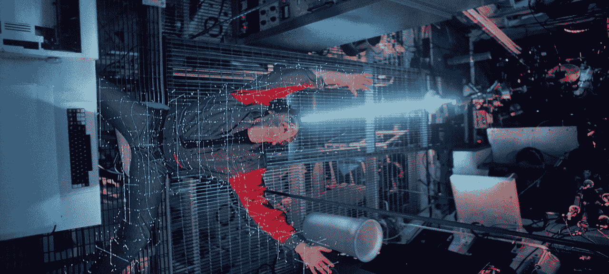
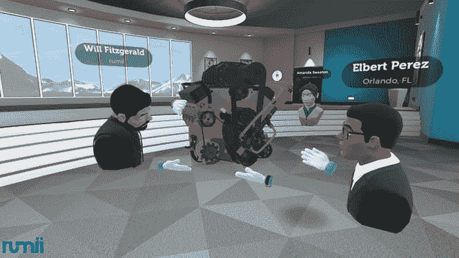
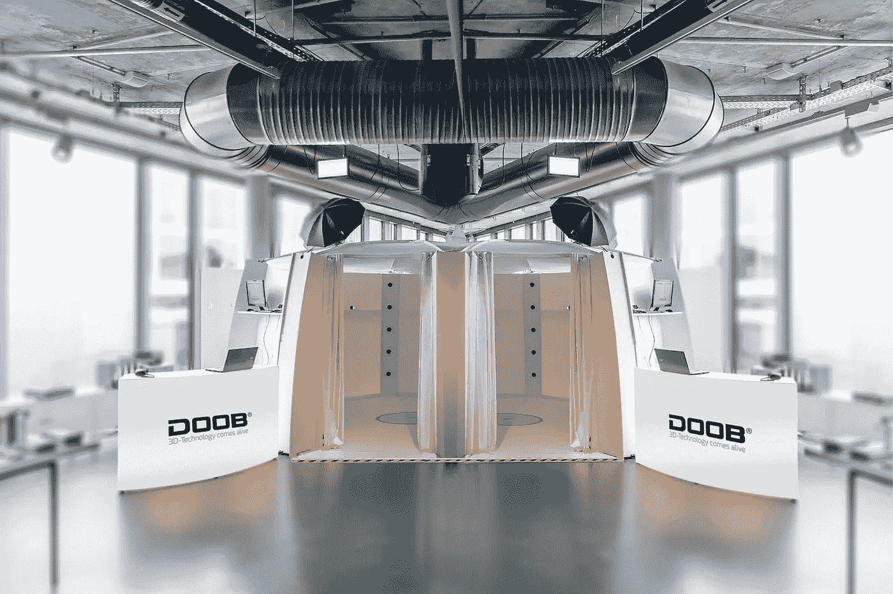

# 看下一代虚拟现实技术:第 3 部分——化身

> 原文：<https://medium.com/hackernoon/behold-the-next-generation-vr-technology-part-3-avatars-a761239f6b2d>

## 怀疑论者表示，目前的虚拟现实耳机是笨重、沉重、不舒适的潜水面罩，不会进入人们的家庭。嗯，我同意，但是有一个重要的例外——这项技术发展得非常快。

即使你是一个肩膀上纹着 Oculus 或 Vive 标志的真正的虚拟现实传播者，你也不得不承认当代耳机永远不会被大规模采用。因为就目前而言，虚拟现实意味着被束缚在一个监护系统的监狱牢房里的一台昂贵的个人电脑上。

这不是我们梦想的虚拟自由。

然而，我们忘记了一件至关重要的事情。这叫“进步”它会粉碎沿途的一切。

在不到两年的虚拟现实消费版时代，耳机完全无线化，视野扩大了一倍，分辨率提高了两倍。

> 事实上，VR 技术的发展速度远远超过了耳机消费版本的发布速度。

在名为“**看下一代虚拟现实技术**的系列每周文章中，我将引导你了解最新和最有前景的技术，这些技术最终将使[虚拟现实](https://hackernoon.com/tagged/vr)成为下一代计算平台。

大部分处于开发的早期阶段，所有这些技术都将在未来 10 年内在消费版耳机中实现。一些更早，一些更晚。

我把这个系列分成几个部分——每个部分代表虚拟现实[技术](https://hackernoon.com/tagged/technology)的一个重要方面。这一个是关于:

# 神使

虚拟现实不仅是为了去你想去的任何地方，也是为了成为你想成为的任何人(或任何事)。一张你自己的照片，一个来自太空的赏金猎人或者一罐卡通手的豆子——你可以自由选择。

Corporate meetings in VR app Rumii / Source: DOGHEAD SIMULATIONS

Avatar diversity in VRChat / Source: VRChat Inc.

从 LinkedIn 上的企业风格照片到 Steam 上的索利德·斯内克照片，你在网上的形象会随着背景、情绪、环境、目标和一系列其他情况而变化。你的 VR 头像也会。

对于公司风格的虚拟现实会议，一些风格化的看起来像你的版本是完美的。这将有助于其他人了解他们在和谁说话。

对于一些约会活动或会议，你更可能使用更真实的版本，如 3D 扫描。

而且在一些好玩的社交 VR apps 里，边界被完全抹去了。几分钟前你加入了令人讨厌的乌干达指关节的行列，现在你正和可爱的动漫猫猫一起游行。

因此，很明显，头像有很多不同的用途，但创建一个头像只有两种选择(了解更多？添加注释)。首先是使用应用内编辑器，其次是上传预先制作的 3D 模型。

创造是有趣的:你可以选择发型、太阳镜、化妆品和眼睛的颜色，让它变高或变低。但是，如果你想做一个有点真实的你(例如，为一个公司简介)，从一系列缩略图中选择正确的面部可能会变得有点困难。

而不是经历选择与你的外表相匹配的面部部分的过程，如果可以自动创建一个头像，岂不是很棒？

[Full video](https://www.youtube.com/watch?v=9ppQOB0Spls) / Source Loom.ai

这正是 Y-Combinator 的 [Loom.ai](https://www.loomai.com/) 正在研究的。他们的技术让你仅仅通过一张自拍就能创造出一张 3D 头像脸。

他们正在使用一种经过训练的人工智能，它可以利用 2D 照片中的视觉线索来识别你面部的几何形状。因此，它创建了一个 3D 模型，提供了一个面部肌肉组织装备，可以适应任何面部。

他们还声称，他们从照片中剔除了光线因素，因此你的 3D 化身可以沉浸在不同光线条件的新环境中。这意味着你得到了一个完全交互式的、随时可用的面部模型，可以在任何你想要的虚拟世界中使用。

起初，我很惊讶 Oculus 还没有购买它们，特别是因为脸书有超过 20 亿人的照片。但事实证明，他们已经在研究自己的解决方案。

虽然面部 3D 模型创建很酷，但可能需要全身扫描。为什么是“可能”？你看，还没那么清楚。

至于头像，我相信用户可能希望他们的*脸*比他们的*躯干*看起来更像原作。因为如果他们可以使用比如说星际宇航服或中世纪盔甲的模型，为什么他们首先需要扫描他们的身体？

我想到的唯一用例是虚拟约会。当事情变得严重时，你知道😉。

doob 3D scanning booth / Source: doob usa inc.

ShapeScale’s sensor scans the athlete — [Full video](https://www.youtube.com/watch?v=8KAW8_VB0z0) / Source: SHAPE LABS INC.

为了那个(当然是头像创作！)已经可以找到一个极其罕见的 [doob 3D](https://www.doob3d.com/) 扫描摊，脱下衣服就可以放了。或者使用类似的技术 [ShapeScale](https://shapescale.com/) 用于其健身应用。

类似 Kinect 的传感器以高分辨率从近距离捕捉您的身体，并使用红外(IR)光点来测量您和传感器之间的距离。

首先，它扫描这些红外点，形成超过 200 万个点的点云，这些点按照你的身体形状排列。连接它们生成一个网格，3D 模型就创建了。

该传感器还可以拍摄数百张照片，并将它们缝合在一起，以绘制出你身体和衣服的真实纹理。结果是对你自己的高度精确的扫描。

虽然这项技术并不新鲜，但它可能会在未来的智能手机中取代 2D 摄影，所以我们可以扫描一切，然后在 VR 中使用它。想象一下，如果 Snapchat 变成 Scanchat 会是什么样？我打赌你明白了😉。事实是，已经有一些原型了，所以消费者版本很接近。

哦，等等，有趣的用例呢？想变成一只戴着白色尖刺手套的红色小刺猬一样的生物怎么办？(天啊，我停不下来)

现在，要创建一个这样的游戏，你必须处理游戏引擎、3D 建模软件、装配软件。如果没有应用内编辑器，你必须花几个小时来创建一个新的头像。而且不应该在那里！

People of OASIS, the action adventure movie “Ready Player One” — [Full video](https://www.youtube.com/watch?v=cSp1dM2Vj48) / Source: Warner Bros. Pictures

创造一个虚拟形象是完全自由的。世界上没有一个编辑能如此夸口。感谢上帝，一些开发者理解这一点，让你上传头像模型到他们的应用程序。

可惜除了掌握一些 3D 建模软件，没有别的办法。我还没有见过这种技术，它可以根据你告诉它的内容或者你上传的图片来创建一个头像。但很明显，随着社交虚拟现实的兴起，对虚拟形象创作的需求将会增加。

未来 10 年，虚拟身份将会发生转变。就像在现实生活中一样，在虚拟现实中，每个人都想独一无二。谁知道这种需求会把我们引向什么样的解决方案。一个头像美工的平台(新工作？)，AI 3D 建模算法？

虚拟现实是一个无限的世界，在任何时候都有无限的可能性成为你想成为的人。这是它的魔力不可或缺的一部分。

而你自己的数字化只是虚拟世界和现实世界变得更加互联的第一步。但是不仅你的自我会变得虚拟，环境也会变得虚拟。怎么会？下一集你会看到。

# 学到了什么？下次请跟随我了解更多信息。