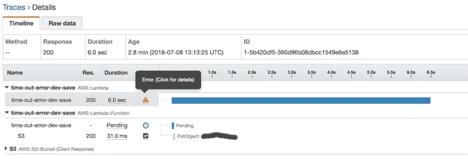
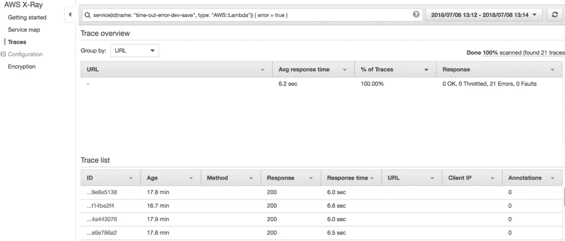
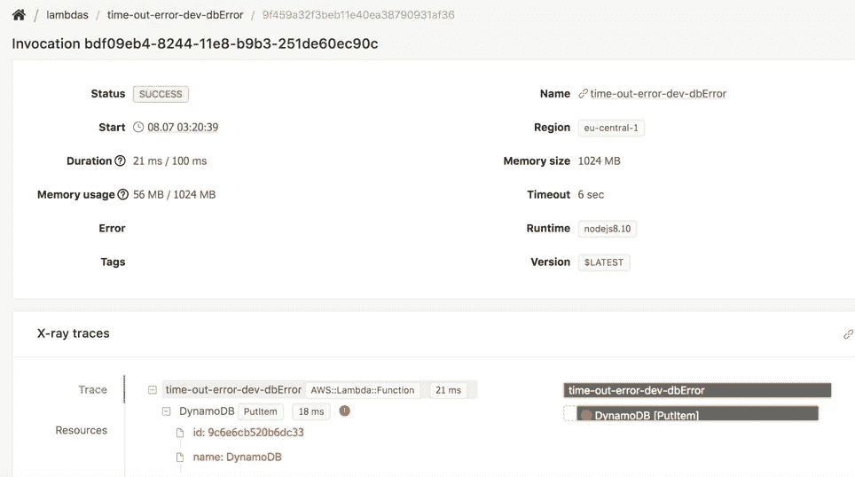
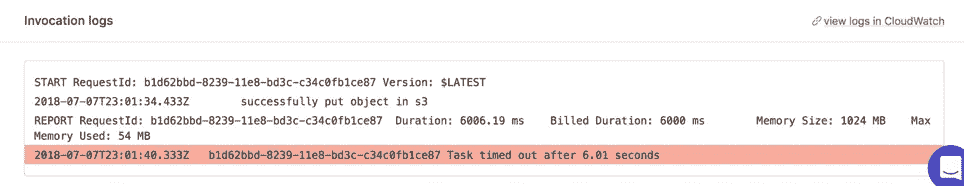

# 基准无服务器可观测性工具，非常失望

> 原文：<https://medium.com/hackernoon/benchmarked-serverless-observability-tools-got-very-disappointed-e54f5e3381bf>

可观察性是指排除应用程序中可能发生的未知问题的能力。如果你不熟悉，推荐你观看 QCon 2018 的[如何构建可观测分布式系统](https://www.infoq.com/presentations/observable-distributed-ststems)和[无服务器可观测性的现在和未来](https://www.infoq.com/presentations/serverless-observability)。

在这篇文章中，我将向您解释一些最著名的[无服务器](https://hackernoon.com/tagged/serverless)可观察性工具在我的测试场景中的表现，同时我将通过概述每个工具的优缺点来补充。我在基于 Node.js 的无服务器应用上测试了这些工具。它部署在 [AWS](https://hackernoon.com/tagged/aws) 上，使用代理集成。你可以在我的 Github 里找到代码[。](https://github.com/azarboon/blog-benchmark-observability)

页（page 的缩写）s:自从我发表这个帖子以来，一些供应商已经改善了他们的负面点/测试结果。我打算写一篇修改后的博文，测试他们的说法，反映他们的变化。在此之前，请阅读他们在本文末尾的评论，以了解他们声称的改进。

## 目录

*   [测试场景](/p/e54f5e3381bf#8abc)
*   [AWS X 射线](/p/e54f5e3381bf#5d95)
*   [仪表板鸟](/p/e54f5e3381bf#0618)
*   [桑德拉](/p/e54f5e3381bf#aa4d)
*   [IOPipe](/p/e54f5e3381bf#e406)
*   [解决方法](/p/e54f5e3381bf#861c)
*   [结论](/p/e54f5e3381bf#d5cf)

# 测试场景

我通过用 Gatling 执行负载测试，针对三种场景测试了所有这些工具:

*   测试场景 1:由于大量并发用户和重复，Lambda 函数超时。提醒一下:目前，Lambda 内置的度量“节流”不会显示超时错误。
*   测试场景 2: Lambda 函数[没有合适的格式](https://docs.aws.amazon.com/apigateway/latest/developerguide/set-up-lambda-proxy-integrations.html#api-gateway-simple-proxy-for-lambda-output-format)；“body”属性尚未字符串化。这个错误可能是由于疏忽造成的。
*   测试场景 3: Dynamodb 抛出 ConditionalCheckFailedException，因为应用程序试图为分区键记录一个具有重复值的项目。

在场景 1 和 2 中，用户收到 *502 错误网关*和含糊的响应“内部服务器错误”。这就是为什么需要一个合适的可观测性工具来解决这些问题，尤其是在大型分布式应用程序的情况下。

如果一个工具通过了测试，意味着它能够检测到问题，并显示给管理员。这可以使他/她更快地进行故障诊断。如果工具未能满足上述标准，结果将被标记为失败。然而，有些工具部分通过了测试，在这种情况下，我解释了它们的行为。

# 自动气象站 X 射线

**结果**

*   **测试 1:部分通过:**从几周前开始有了新的改进:现在在超时错误的情况下，X 射线显示有错误，但仍然没有澄清是什么问题。所以它希望用户猜出来或者用其他工具来解决问题。此外，UI 令人困惑:在一个地方，它表明有一个错误，但下面几行，它表明没有错误(图 1)。显然，他们的新改进仍在开发中。
*   **测试 2:失败。**根据 x 光检查，一切正常，即使最终用户出现错误。
*   **测试三:通过。**表示有错误，同时显示异常堆栈跟踪。

Pic1: X-Ray doesn’t clarify what is the error type. Also UI is contradictory, by hovering on the clock icon, it shows “no faults or error”.

**优点**

*   Lambda 内置了 X 射线代理。代理以批处理和异步方式发送数据，因此使用它不会给函数增加额外的延迟。
*   快速响应的支持团队。你可以在 [AWS 开发者论坛](https://forums.aws.amazon.com/forum.jspa?forumID=241&start=0)与他们交流
*   AWS 的托管服务。因此，它应该在功能上更加丰富，并且更加符合 AWS 的最佳实践。

**缺点**

*   令人困惑的 UI:除了图 1，您还可以看看图 2:尽管我选择了查看有错误的跟踪，但我看到每个跟踪都有令人困惑的“200”响应。200 响应表示 X 射线服务已返回响应，并不意味着跟踪成功。这不是大多数用户期望看到的，并且会导致错误的解释。崔琰在他的博客文章[中提到了这个问题。更糟糕的是，尽管一年过去了，这个问题还没有得到解决。](https://theburningmonk.com/2017/06/aws-x-ray-and-lambda-the-good-the-bad-and-the-ugly/)
*   集成速度缓慢:尽管如此，[很少有 AWS 服务](https://docs.aws.amazon.com/xray/latest/devguide/xray-services.html)与 X 射线集成。因此，如果您正在使用 DynamoDb 或 S3，X-Ray 会为您提供推断的细分市场(这意味着缺乏细节)，因为即使在撰写本文时，这些服务还没有与 X-Ray 积极集成。
*   不成熟:仍有提升空间。例如，他们需要添加更多的功能来更好地调试，特别是以更简单、更简洁的方式加入[自定义错误](/@azarboon/overcome-x-rays-issue-for-debugging-892498b14346)。[显然，他们正在努力使 Lambda 生成的片段可以访问](https://forums.aws.amazon.com/message.jspa?messageID=850436#850436)。

Pic2: Buggy traces are shown with a 200 response, which is confusing.

# 仪表板鸟

**结果**

*   **测试 1:通过**
*   **测试 2:失败**
*   **测试 3:部分通过**。Dashbird 的用户界面不清楚，可能会令人困惑:在较高层次上，它显示跟踪成功，但深入到跟踪中，它显示错误(图 3)。令人惊讶的是，这与 X 射线的结果不同，尽管 Dashbird 的痕迹是基于 X 射线的。它的行为是合理的，因此“一个异常不一定意味着函数失败。”这是真的，但是如果在跟踪中有异常，用户至少应该得到通知(例如，从高级图片)，并且在跟踪上只显示绿色和漂亮的“成功”是误导的。同时，在我看来，出现异常通常意味着有问题，值得调查，除非异常已经被主动捕获和处理。

Pic3: Dashbird shows a buggy trace as successful, and user should investigate all traces, dig them thoroughly to find if there is an exception.

**优点**

*   非常容易设置，Dashbird 的 CloudFormation 模板几乎可以做任何事情。一旦建立了 CloudFormation 堆栈，Dashbid 就开始观察所有区域中的所有函数(从安全角度来看，这可能是不好的。我已经在缺点部分解决了这个问题)
*   有很好的用户界面和一些很好的功能，如实时跟踪，实现对特定功能的实时监控，以及警报功能。
*   从 CloudWatch 日志和 AWS X 射线获取数据。所以它不会给你的函数增加额外的延迟。
*   有一个友好和支持的客户服务。
*   显示整个函数执行时间的日志，而不仅仅是错误。这使得调试更加容易(图 4)

Pic4: Example log of a buggy trace, Dashbird shows logs from the whole function execution time.

**缺点**

*   文档已经过时并且容易引起误解:在“入门”部分，它要求您设置特定的 IAM 策略。但是这个策略没有任何效果，它在那里只是因为文档没有被更新。
*   提供很少的、基本的和有些误导性的统计数据，例如平均持续时间和平均内存使用量。[平均值是 web 性能分析的误导因素，](https://www.dynatrace.com/news/blog/why-averages-suck-and-percentiles-are-great/)因此团队需要提供基于百分位数的统计数据。
*   显示冷启动，但单独启动。需要冷启动统计数据。
*   继承了 CloudWatch(例如粒度、延迟)和 X-Ray 的限制，因为它是基于它们的。
*   有一个主要的安全问题:它可以访问您的所有数据，并且您不能限制它。你可以在 Dashbird 应用中过滤数据，但这并不能阻止它接收你的数据。

致谢:

感谢 Dashbird 的联合创始人 Taavi rehemgi 延长了我的试用期，让我能够调查他们的 SaaS。

# 桑德拉

**结果**

*   **测试 1:失败**
*   **测试 2:失败**
*   **测试 3:失败**

**优点**

*   易于设置。
*   仪器的代码，这使桑德拉能够提供深入的技术概述。此外，这也可以替代 AWS X 射线。
*   利用[异步发布](https://serverless.com/blog/state-of-serverless-observability-why-we-built-thundra/)，因此不会给函数执行时间增加额外的延迟。
*   有信息丰富图表和仪表板。此外，它还提供了一个清晰的功能列表，以及它们的统计数据(包括每个功能经历的冷启动总数)
*   在安全性方面比 Dashbird 等公司更保守。它不需要访问你所有的数据。
*   是建立在一个好主意的基础上的，至少有一种方法可以替代 x 光，这很好。
*   拥有友好和支持的客户支持

我与它的产品经理讨论了对 Node.js 应用程序的支持。显然，桑德拉专注于 Java 应用程序，其 Node.js 相关功能远远落后。我还没有时间研究它的 Java 特性，但是如果有人正在使用基于 Java 的无服务器应用，我推荐他/她看看桑德拉。

**缺点**

*   对 Node.js 的支持不好，在写这篇文章的时候，我没有看到任何令人信服的理由用桑德拉来观察我的 Node.js 应用。
*   统计基于平均值，[这是误导](https://www.dynatrace.com/news/blog/why-averages-suck-and-percentiles-are-great/)。

# IOPipe

**结果**

*   **测试 1:通过**
*   **测试 2:失败**
*   **测试 3:失败**

**优点**

*   提供很少的基于百分点的统计数据
*   易于设置
*   具有警报功能
*   具有搜索功能:您可以通过不同的关键字搜索您的调用，例如来自 CW 的 requestId。然而，我粗略的初步猜测是，要对一个复杂的分布式应用程序进行故障排除，您可能需要使用一个复杂而全面的日志记录工具，而不是 IOPipe。但是这当然取决于您的用例。

**缺点**

*   在他们目前的方法中，IOPpipe 将数据同步发送到自己的系统；这给函数执行时间增加了额外的延迟，并且违背了在[带 AWS Lambda 的无服务器架构](https://d1.awsstatic.com/whitepapers/serverless-architectures-with-aws-lambda.pdf)中描述的最佳实践“在 Lambda 函数代码中捕获指标，并使用 Lambda 中提供的日志记录机制记录它。”IOPipe 方法在[日志记录和监控 AWS Lambda 函数的提示和技巧](https://theburningmonk.com/2017/09/tips-and-tricks-for-logging-and-monitoring-aws-lambda-functions/)以及[dash bird vs Datadog vs io pipe](https://dashbird.io/docs/learn/competitors-comparison/)中有进一步的研究。这是一个严重的问题，这就是为什么我不推荐使用 IOPpipe，除非他们解决了这个问题。似乎他们的团队正在研究这个问题，并试图提出一个[异步和优化的替代方案](https://hub.iopipe.com/iopipe-faq/what-is-the-overhead-of-iopipe)。还是等结果吧！
*   不显示冷启动的统计数据
*   不提供跟踪。
*   只显示错误堆栈跟踪的日志，这可能不太方便。如果像 Dashbird 那样显示整个函数的日志，会很有帮助。

# 工作区

要检测错误，您可以主动采取行动并使用监控，而不是与可观察性工具协作。建议使用 CloudWatch。Lambda 内置了代理来发送日志到 CloudWatch，使用它不会给你的函数增加额外的延迟，除非你发布定制的指标。

为了以优化的方式实现目标，您可以[创建度量过滤器](https://docs.aws.amazon.com/AmazonCloudWatch/latest/logs/MonitoringPolicyExamples.html)。例如，对于错误场景 1，您的指标过滤器可以有一个过滤器模式，如“任务超时时间”。然后，Metric filter 在您的日志事件中进行搜索，只要找到匹配项，它就会增加相应 CloudWatch 指标的值。随后，您可以为该指标设置 CloudWatch 警报，并通过 SNS 等方式发布。此外，为了充分发挥 CloudWatch 的潜力，您可以通过 JSON 使用[结构化日志](https://stackify.com/what-is-structured-logging-and-why-developers-need-it/)。

# 结论

我没有时间调查所有的无服务器可观察性工具，但是根据我对最突出的工具的调查，所有的工具都不成熟，或者在某种程度上不完整，需要改进。没有一个单一的解决方案可以让你完全完美地观察你的分布式应用。

令人惊讶的是，有些问题，比如错误 2，还没有被任何解决方案解决(甚至在 CloudWatch 日志中也没有)。但这个错误可能是由于疏忽而发生的，因为我遇到了这个问题，当时我的朋友想知道为什么最终用户会出现错误，并要求我调试他的应用程序。一切看起来都很好，没有错误或异常，但最终用户得到了错误。调试了大约一个小时后，我唯一想到的是输出格式。我是对的。他忘记了 JSON.strinigfy()函数输出的 body 属性，AWS 代理集成正在悄悄失败。这是一个简单的应用程序，但是想象一下如果这发生在一个大而复杂的分布式应用程序中会怎么样？你应该怎么找到它？

为了实现可观察性，您需要串联使用不同的解决方案，并通过结构化日志记录获得深度监控的帮助。Pierre Vincent 在他的 QCon 演讲[中提到了这个问题](https://www.infoq.com/presentations/observable-distributed-ststems)。

我的 3 个测试场景只是例子。你认为应该优先观察的其他问题和错误是什么？你知道其他比上述工具更好的工具吗？你对实践中无服务器可观测性的现状有什么看法？

**脚注**

1.  这只是我的看法。